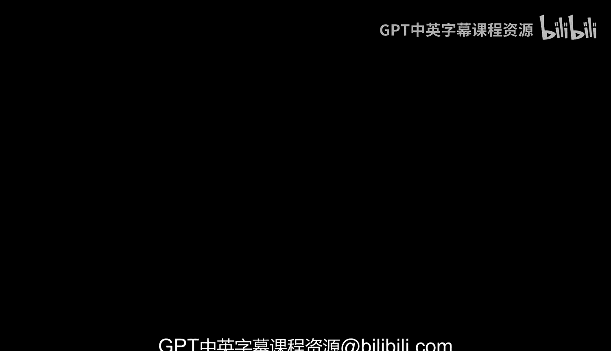
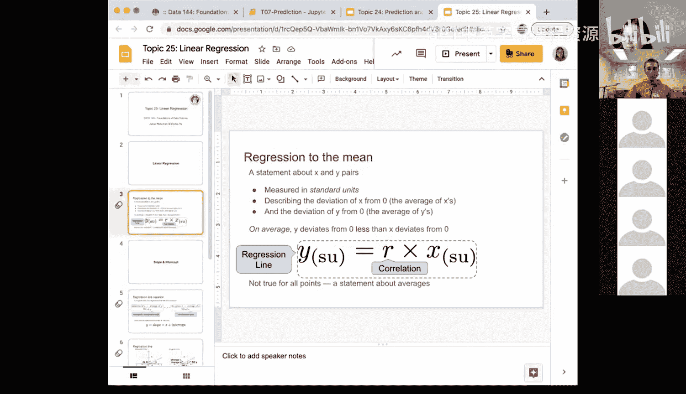

# 76：线性回归 📈




在本节课中，我们将要学习线性回归。这是一种用于预测连续数值变量的强大方法。我们将从回归的基本概念开始，逐步深入到线性回归的具体公式和应用。

---

上一节我们介绍了回归的基本思想，本节中我们来看看线性回归的具体定义和核心概念。

线性回归是一种正式的回归方法。它描述的是变量X和Y之间的线性关系。我们通常将X和Y都转换为**标准单位**，以便于解释。

**标准单位**的转换公式如下：
```
标准单位值 = (原始值 - 平均值) / 标准差
```
通过这种转换，我们可以消除原始数据的单位和量纲影响，将所有变量置于同一尺度上进行比较。

---

在标准单位下，X和Y的均值都变为0。线性回归的核心，就是试图用X的偏差来解释Y的偏差。

线性回归线在标准单位下的表达式是一个关键的公式：
```
y_su = r * x_su
```
其中：
*   `y_su` 代表Y的标准单位值。
*   `x_su` 代表X的标准单位值。
*   `r` 代表X和Y之间的**相关系数**。

这个公式表明，在平均意义上，Y的标准单位值等于X的标准单位值乘以相关系数。由于相关系数`r`的绝对值始终小于或等于1，这意味着Y的偏差（相对于其均值0）平均来说小于X的偏差。这就是“**回归均值**”现象。

---

上一节我们介绍了标准单位下的回归公式，本节中我们来看看如何将其转换回原始单位，以便在实际中应用。

要将标准单位下的回归线转换回原始单位，我们需要使用X和Y的原始均值与标准差。

原始单位下的线性回归方程如下：
```
y = slope * x + intercept
```
其中：
*   **斜率** `slope` 的计算公式为：`r * (sd_y / sd_x)`
*   **截距** `intercept` 的计算公式为：`mean_y - slope * mean_x`

以下是计算斜率和截距的关键步骤：
1.  计算X和Y的相关系数 `r`。
2.  计算X的标准差 `sd_x` 和Y的标准差 `sd_y`。
3.  计算X的均值 `mean_x` 和Y的均值 `mean_y`。
4.  代入上述公式，得到斜率和截距。

---

理解线性回归的要点对于正确应用它至关重要。以下是关于线性回归的几个核心要点：

*   **平均关系**：回归方程描述的是X和Y之间的**平均**关系。对于单个数据点，预测值通常不会完全等于真实值，两者之间存在误差。
*   **误差最小化**：拟合最佳回归线的目标，通常是**最小化所有数据点的预测误差平方和**（即最小二乘法）。
*   **预测能力**：预测的准确性高度依赖于预测变量X的质量。如果X和Y的线性关系很强（`r`接近1或-1），则预测会更准确。
*   **适用性**：线性回归假设变量间存在线性关系。如果真实关系是非线性的，线性回归可能效果不佳。



---


本节课中我们一起学习了线性回归。我们从回归的基本概念出发，探讨了在标准单位下如何用相关系数`r`简洁地表达线性关系（`y_su = r * x_su`），并理解了“回归均值”的含义。接着，我们学习了如何将回归方程转换回原始单位，得到了实用的斜率-截距形式（`y = slope * x + intercept`）。最后，我们总结了线性回归的核心要点，包括它描述的是平均关系、以最小化误差为目标，并且其预测效果依赖于变量间的线性相关程度。