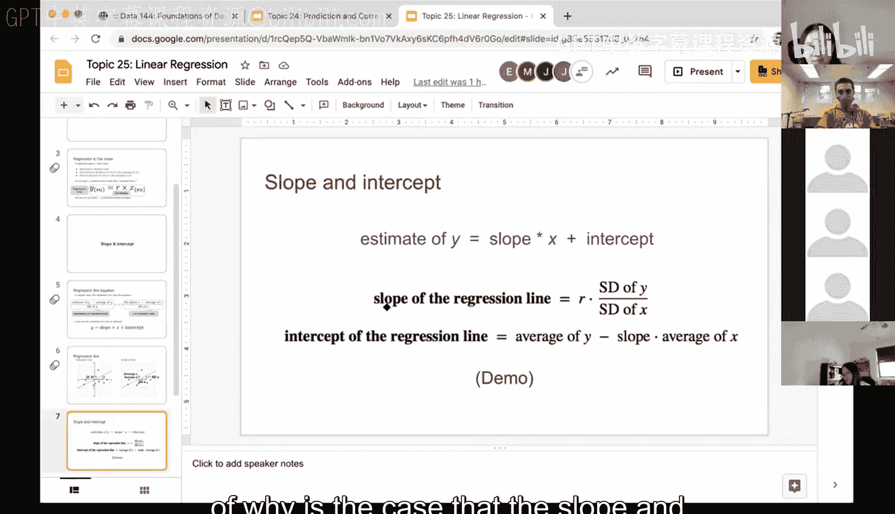
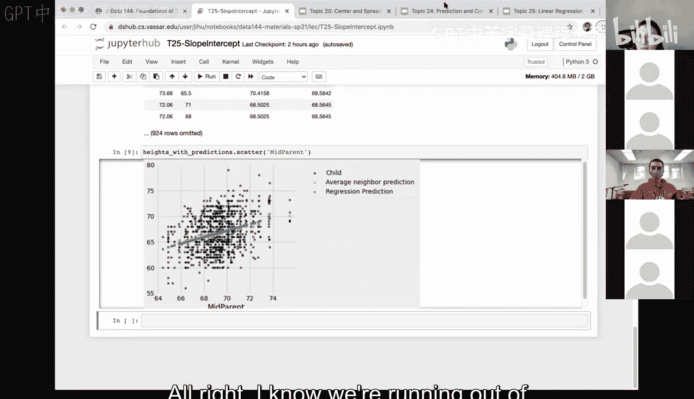

# 77：线性回归的斜率与截距 📈


在本节课中，我们将学习线性回归中的两个核心概念：**斜率**和**截距**。我们将了解如何从标准化单位下的回归方程推导出原始单位下的方程，并学习如何计算和解释斜率和截距。

---

## 回归方程：从标准化单位到原始单位

上一节我们介绍了在标准化单位下的线性回归方程。本节中，我们来看看如何将其转换回原始单位。

线性回归的目标是找到一条直线，使其最好地拟合数据点云。这条直线可以用一个方程来描述。在标准化单位下，回归方程非常简单：

**公式：** `y_standard = r * x_standard`

其中，`y_standard` 和 `x_standard` 分别是因变量 `y` 和自变量 `x` 的标准化值，`r` 是相关系数。

为了在实际应用中进行预测，我们需要在原始单位下表达这个关系。通过将标准化单位的定义代入上述方程并进行代数变换，我们可以得到原始单位下的回归方程：

**公式：** `y_estimate = slope * x + intercept`

这里，`y_estimate` 是 `y` 的预测值，`slope` 是直线的斜率，`intercept` 是直线在 y 轴上的截距。

---

## 理解斜率与截距

现在，让我们深入理解斜率和截距的含义及其计算方法。

### 斜率

斜率描述了当自变量 `x` 变化一个单位时，因变量 `y` 的预测值平均变化多少。它衡量了 `x` 对 `y` 的影响程度和方向。

斜率可以通过以下公式计算：




**公式：** `slope = r * (SD_y / SD_x)`

其中：
*   `r` 是 `x` 和 `y` 的相关系数。
*   `SD_y` 是 `y` 的标准差。
*   `SD_x` 是 `x` 的标准差。

**关于单位的讨论：**
*   相关系数 `r` 没有单位。
*   标准差 `SD_y` 和 `SD_x` 的单位与原始数据 `y` 和 `x` 的单位相同。
*   因此，斜率的单位是 `y的单位 / x的单位`。例如，如果 `y` 是价格（美元），`x` 是糖含量（克），那么斜率的单位就是 **美元/克**。

### 截距

截距是回归直线与 y 轴相交点的 y 值。它代表了当自变量 `x` 为 0 时，因变量 `y` 的预测值。

截距可以通过以下公式计算：


**公式：** `intercept = average(y) - slope * average(x)`

其中 `average(y)` 和 `average(x)` 分别是 `y` 和 `x` 的均值。截距的单位与 `y` 的单位相同。

---

## 在 Python 中实现计算

理解了理论公式后，我们来看看如何在 Python 中计算斜率和截距。以下是实现步骤：

首先，我们需要一些基础函数来计算标准化值和相关系数。

**代码：计算标准化值**
```python
def standard_units(arr):
    """将数组转换为标准化单位（均值为0，标准差为1）"""
    return (arr - np.mean(arr)) / np.std(arr)
```

**代码：计算相关系数**
```python
def correlation(t, label_x, label_y):
    """计算表中两列数据的相关系数"""
    x_su = standard_units(t.column(label_x))
    y_su = standard_units(t.column(label_y))
    return np.mean(x_su * y_su) # 相关系数公式
```

基于斜率和截距的公式，我们可以编写对应的函数。

**代码：计算斜率**
```python
def slope(t, label_x, label_y):
    """根据公式计算回归直线的斜率"""
    r = correlation(t, label_x, label_y)
    sd_y = np.std(t.column(label_y))
    sd_x = np.std(t.column(label_x))
    return r * (sd_y / sd_x)
```

**代码：计算截距**
```python
def intercept(t, label_x, label_y):
    """根据公式计算回归直线的截距"""
    avg_y = np.mean(t.column(label_y))
    avg_x = np.mean(t.column(label_x))
    slope_val = slope(t, label_x, label_y)
    return avg_y - slope_val * avg_x
```

---

## 应用示例：预测子女身高

让我们用一个经典数据集（高尔顿身高数据）来演示。我们使用父母平均身高 (`midparent`) 预测子女身高 (`child`)。

**代码：进行预测**
```python
# 计算该数据集的斜率和截距
data_slope = slope(heights, ‘midparent‘, ‘child‘)
data_intercept = intercept(heights, ‘midparent‘, ‘child‘)

# 使用回归方程进行预测：y_estimate = slope * x + intercept
heights = heights.with_column(
    ‘Regression Prediction‘,
    data_slope * heights.column(‘midparent‘) + data_intercept
)
```

---

## 线性回归预测与最近邻预测的比较

在数据分析中，线性回归预测常与其他方法（如我们之前学过的最近邻预测）进行比较。

以下是两种预测方法的主要异同：

**相似之处：**
*   两者都是基于数据“中心”趋势（均值）的预测方法。
*   在数据关系接近线性且相关系数较高时，两者的预测结果可能非常接近。
*   它们都体现了“向均值回归”的现象。

**不同之处：**
*   **预测线形态**：线性回归预测产生一条严格的**直线**。而最近邻预测（通过对`x`值分组并取`y`的均值）产生的是一条可能上下波动的**曲线或折线**。
*   **计算方法**：线性回归使用所有数据通过公式一次性拟合出全局直线。最近邻预测则更局部化，其预测值依赖于特定`x`邻域内的数据点。
*   **假设**：线性回归假设`x`和`y`之间存在全局的线性关系。最近邻预测没有明确的函数形式假设，灵活性更高，但也更容易受到数据局部波动的影响。

选择哪种方法取决于数据的特性、分析目标以及对模型可解释性的要求。线性回归模型更简洁，参数（斜率和截距）有明确含义；最近邻预测在关系非线性时可能更灵活。

---

## 总结

本节课中我们一起学习了线性回归的核心组成部分——**斜率**和**截距**。

1.  我们从标准化单位下的回归方程出发，推导出了原始单位下的方程形式：`y_estimate = slope * x + intercept`。
2.  我们明确了**斜率**的计算公式 `slope = r * (SD_y / SD_x)` 及其意义，它表示`x`对`y`影响的强度和方向。
3.  我们明确了**截距**的计算公式 `intercept = average(y) - slope * average(x)` 及其意义，它代表`x=0`时的预测值。
4.  我们通过Python代码实现了斜率和截距的计算，并演示了如何利用它们进行预测。
5.  最后，我们比较了线性回归预测与最近邻预测的异同，认识到线性回归会生成一条平滑的直线，而后者则可能产生波动的曲线，两者各有其适用场景。




掌握斜率和截距的计算与解释，是理解和应用线性回归模型的基础。