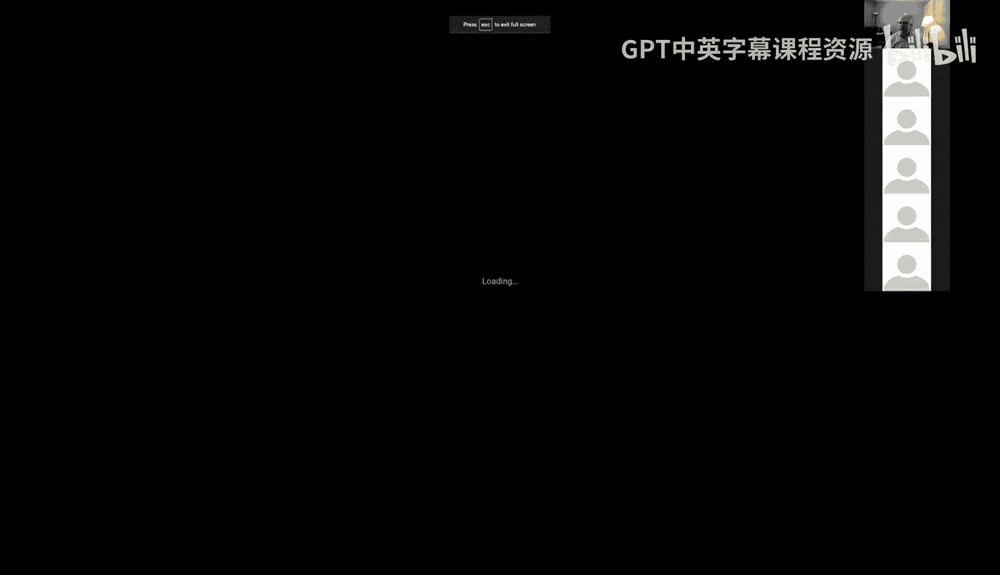
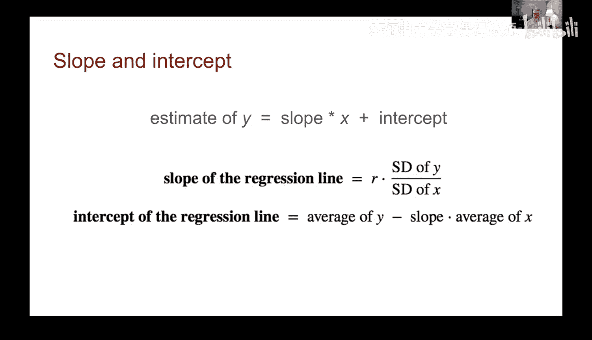
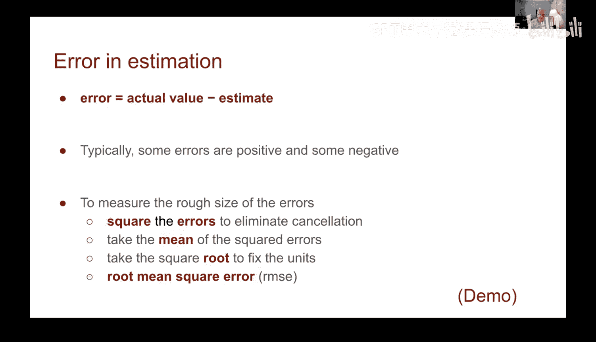
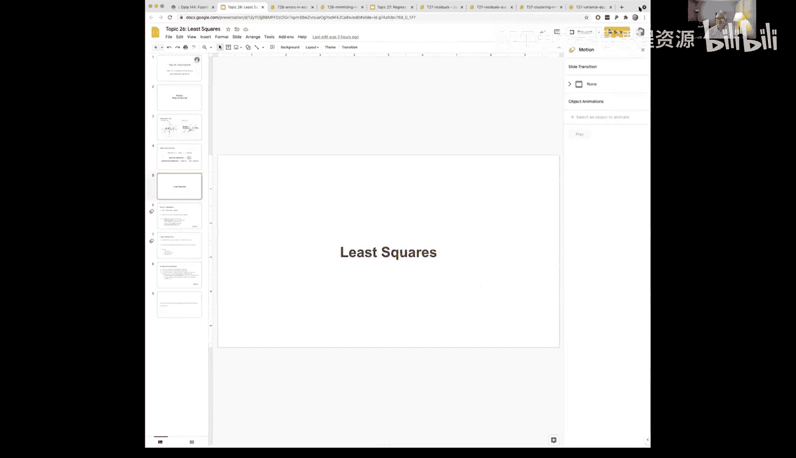
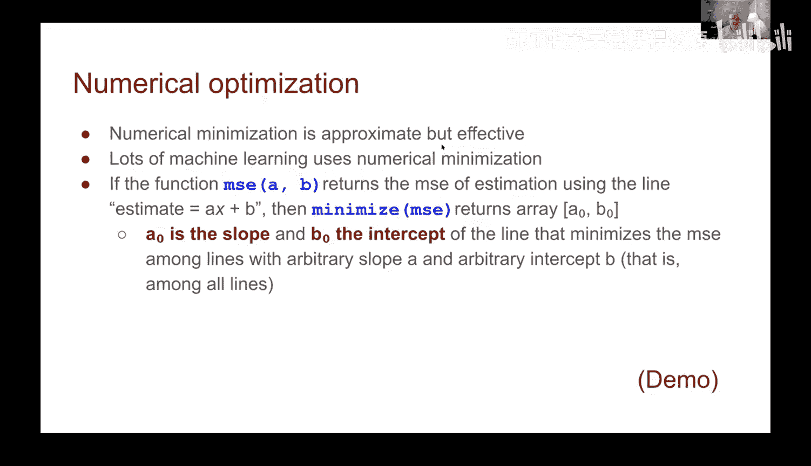
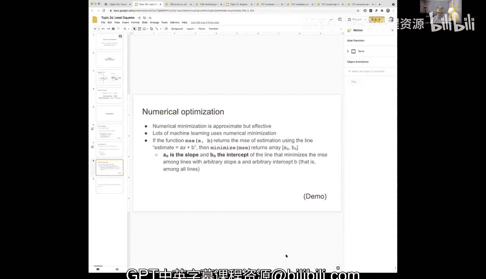

# 78：最小二乘法 📊

在本节课中，我们将学习回归分析的核心概念——最小二乘法。我们将回顾如何计算回归线的斜率和截距，并引入一个衡量预测准确性的重要指标：均方根误差。最后，我们将通过一个实际的数据集演示，并证明回归线就是能够最小化均方根误差的“最佳拟合线”。

## 回顾：回归线的斜率和截距 📈

上一节我们介绍了如何将数据转换为标准单位来计算回归线。本节中，我们来看看如何在原始单位中计算斜率和截距。

当数据处于标准单位时，回归线的斜率等于相关系数 **r**，且截距为0。然而，我们通常需要在原始单位中进行预测。

为了在原始单位中计算回归线，我们需要以下公式：
*   **斜率 (slope)** 的计算公式为：`slope = r * (SD_y / SD_x)`。其中，**r** 是相关系数，**SD_y** 是y的标准差，**SD_x** 是x的标准差。
*   **截距 (intercept)** 的计算公式为：`intercept = average_y - slope * average_x`。

得到斜率和截距后，对于任何一个预测变量 **x**，我们对 **y** 的估计值可以通过以下公式计算：
`estimate_y = slope * x + intercept`

## 评估预测效果：误差与均方根误差 📉

现在我们已经有了一个预测器，接下来需要评估它的预测效果是否准确。为此，我们可以计算预测的误差。

误差定义为实际值减去预测值：`error = actual_y - estimate_y`。这些误差有正有负，如果直接求平均值，正负误差会相互抵消，结果趋近于零，这无法有效衡量误差的大小。

因此，我们需要一个更好的方法来衡量误差的整体大小。以下是计算步骤：
1.  **计算误差**：对每个数据点计算 `actual_y - estimate_y`。
2.  **平方误差**：将每个误差值平方，使所有值变为正数。
3.  **求平均值**：计算这些平方误差的平均值。
4.  **开平方根**：对平均值开平方根，使单位变回原始单位。

这个过程被称为计算**均方根误差**。它的名称清晰地描述了计算步骤：从右向左依次是**误差** -> **平方** -> **求均值** -> **开根号**。

## 实战演示：收入与教育程度的关系 💼

让我们通过一个真实数据集来应用这些概念。我们使用2016年美国大选区数据，探究一个地区拥有大学学历的人口比例（预测变量x）与该地区收入中位数（目标变量y）之间的关系。

首先，我们通过可视化散点图观察，两者似乎存在正相关关系。计算出的相关系数 **r** 约为0.82，证实了较强的线性关联。

接着，我们计算回归线的斜率和截距：
*   斜率约为1271。这意味着，大学人口比例每增加1%，我们预测该地区收入中位数将增加约1271美元。
*   截距约为20800。

利用斜率和截距，我们可以为数据表中的每个x值计算对应的预测y值（称为拟合值），并计算出每个数据点的误差。

正如理论所述，所有误差的平均值非常接近于零。而计算出的**均方根误差**约为9400美元，这为我们提供了预测误差的一个总体度量。

我们可以尝试不同的斜率和截距组合（即不同的直线）来拟合数据，并计算各自的均方根误差。我们的目标是找到**均方根误差最小**的那条直线。

## 核心概念：最小二乘法与最佳拟合线 🏆

通过比较不同直线的均方根误差，我们引出了**最小二乘法**的核心思想。

*   **最小二乘线**：在所有可能的斜率和截距组合中，能够使**均方根误差**达到最小的那条直线。
*   这条线也被称为**最佳拟合线**或**回归线**。

换句话说，我们之前通过公式 `slope = r * (SD_y / SD_x)` 和 `intercept = average_y - slope * average_x` 计算出的回归线，正是那条“最佳拟合线”，它天然地实现了误差平方和的最小化。

## 数值验证：使用Python寻找最小误差 🔍

我们可以通过数值计算来验证这一结论。Python的 `minimize` 函数可以帮助我们找到使某个函数值最小化的参数。

我们定义一个函数 `demographics_rmse`，它接受斜率和截距作为参数，并返回当前直线在人口数据上的均方根误差。然后，我们使用 `minimize` 函数来寻找使该均方根误差最小的斜率和截距。

运行结果显示，通过数值优化找到的最佳斜率和截距，与我们直接用回归公式计算出的结果在微小误差范围内完全一致。这有力地证明了：**回归线的斜率和截距，就是最小化均方根误差的解**。

## 总结 ✨

本节课中我们一起学习了：
1.  回顾了在原始单位中计算回归线斜率和截距的公式。
2.  引入了**均方根误差**作为衡量回归预测准确性的核心指标。
3.  通过实际数据演示了计算回归线、拟合值、误差以及均方根误差的全过程。
4.  理解了**最小二乘法**的目标是找到使均方根误差最小的直线。
5.  通过数值计算验证了**回归线就是最小二乘线**，即最佳拟合线。

最小二乘法为线性回归提供了坚实的数学基础，确保我们得到的模型是在“最小化预测误差”这一明确标准下的最优解。