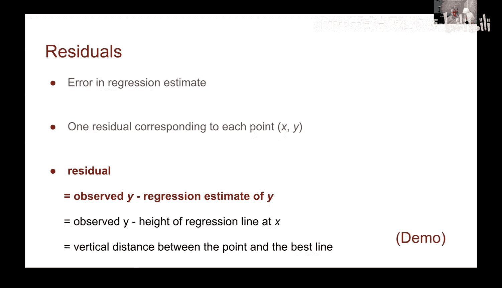
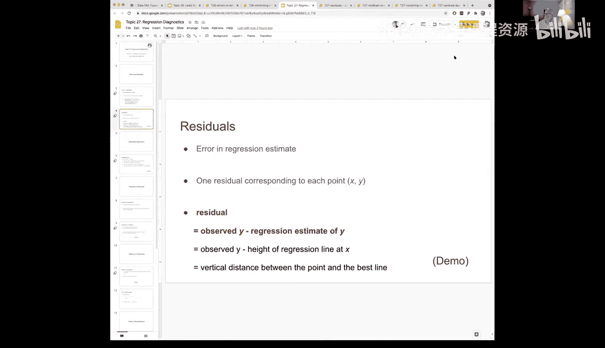
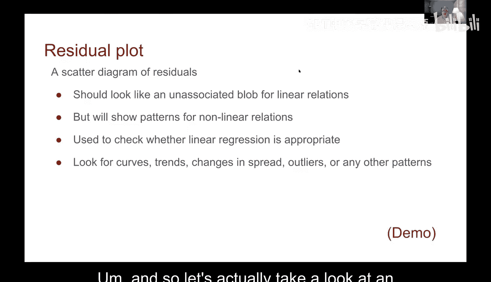
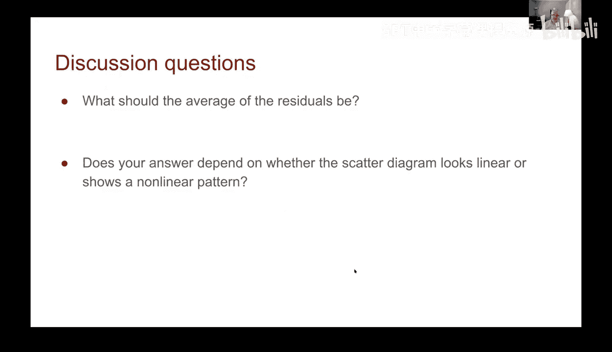
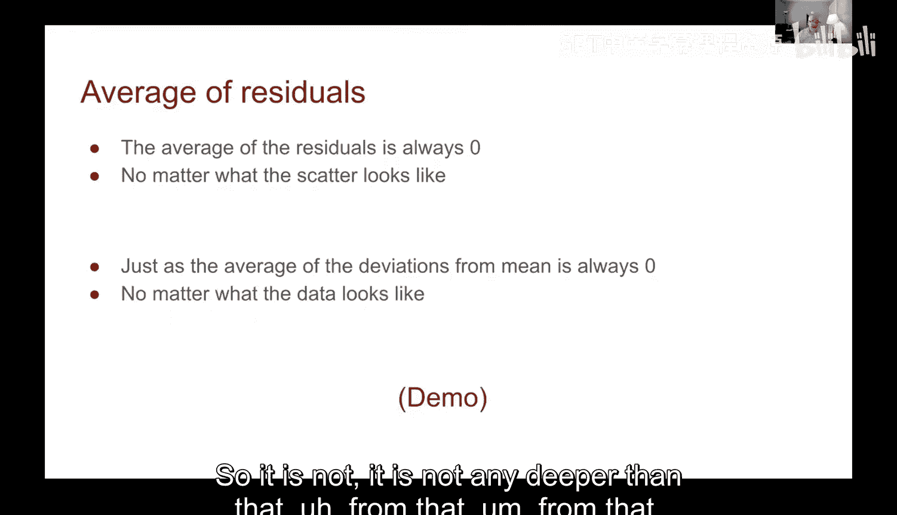
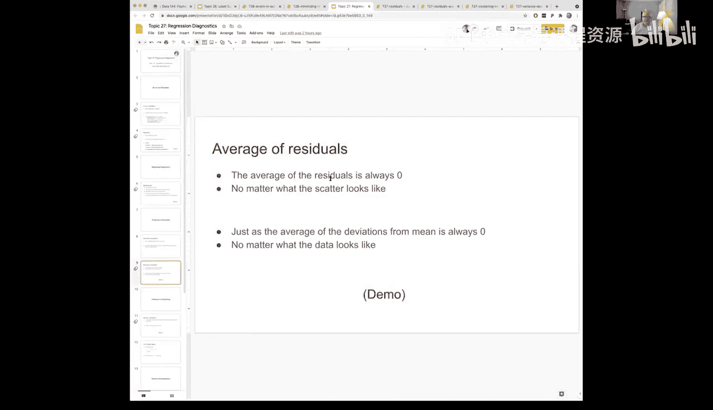

# 79：回归诊断与残差分析 📊


在本节课中，我们将学习回归诊断中的一个核心工具——残差分析。我们将了解什么是残差，如何计算和可视化它们，以及如何利用残差图来判断线性回归模型是否合适。

---

## 概述

上一节我们介绍了线性回归模型，它通过最小化均方根误差来找到最佳拟合线。然而，这并不意味着数据本身一定存在线性关系。本节中，我们将引入**残差**的概念，它为我们提供了一种评估模型拟合优度、检验数据线性假设是否成立的有效方法。



---

## 什么是残差？🔍

残差是观测值与回归模型预测值之间的差值。对于数据集中的每一个数据点，都有一个对应的残差。

其计算公式为：
**残差 = 观测值 y - 预测值 ŷ**

从几何角度看，残差是数据点到回归线在垂直方向上的距离。它直观地展示了模型预测的误差大小和方向。

---

## 计算与可视化残差

以下是计算残差的核心步骤。我们首先需要一个计算预测值的函数，然后利用它来计算残差。

```python
# 假设已有计算斜率和截距的函数 regression_slope, regression_intercept
# 计算拟合值（预测值）的函数
def fitted_values(table, x, y):
    a = regression_slope(table, x, y)
    b = regression_intercept(table, x, y)
    return a * table.column(x) + b

# 计算残差的函数
def residuals(table, x, y):
    predictions = fitted_values(table, x, y)
    return table.column(y) - predictions
```

以“父母平均身高与子女身高”数据集为例，我们可以计算出每个数据点的拟合值和残差，并将它们添加到数据表中。

当我们绘制散点图时，如果只指定一个变量（如`midparent`身高），绘图函数会自动将该变量作为x轴，并绘制数据表中所有其他列（包括`child`身高、`fitted`拟合值、`residual`残差）与它的关系。这时，残差图会紧密地围绕在零线附近。

---



## 解读残差图：线性关系的试金石

观察残差图是判断线性回归是否适用的关键。以下是解读残差图的要点：

对于一个良好的线性关系，其残差图应该看起来像一个**无关联的斑点**。具体特征包括：
*   残差随机分布在零线上下。
*   没有明显的趋势、曲线或规律性形状。
*   在不同X值范围内，残差的离散程度（即方差）大致相同。

我们之前看到的父母-子女身高数据的残差图就符合这个特征，这表明线性模型对该数据是合适的。



---

## 非线性模式与问题识别

然而，并非所有数据都满足完美的线性关系。通过观察残差图，我们可以识别出多种问题模式。

例如，在另一个“大学毕业生比例与收入中位数”的数据集中，虽然两者相关系数很高（约0.81），但其残差图却显示出问题：随着大学毕业生比例（X轴）的增加，残差的分布范围（即误差的波动）似乎在变大，形状像一个向右开口的漏斗。这提示我们，模型在不同区域的预测精度可能不一致，线性假设可能不完全成立。

在检查残差图时，需要警惕以下模式：
*   **曲线趋势**：表明可能存在非线性关系。
*   **离散度变化**：如漏斗形，表示误差方差不是常数（异方差性）。
*   **明显的聚类或规律**：表明有重要变量未被模型捕捉。
*   **异常值**：远离其他点的残差。

---

## 残差的重要数学性质

除了可视化检查，残差本身也具有重要的数学性质，这有助于我们理解模型。




无论原始数据的关系是线性还是非线性，只要是通过最小二乘法拟合的线性回归模型，其残差都满足以下两个性质：
1.  **残差的平均值始终为零**。这是因为在最小化误差的过程中，正误差和负误差相互抵消了。
    `np.mean(residuals) == 0`
2.  **预测值（ŷ）与残差之间的相关系数始终为零**。这意味着模型已经提取了X中所有能与Y线性相关的信息，剩下的残差是纯粹的“噪声”，与预测值无关。

这两个性质是线性回归模型的内在特征，与数据本身的形态无关。

---

## 总结


本节课中我们一起学习了回归诊断的核心工具——残差分析。
*   我们首先定义了**残差**，即观测值与模型预测值之差。
*   接着，我们学习了如何**计算和绘制残差图**。
*   然后，我们掌握了**解读残差图**的方法：一个良好的线性模型，其残差图应呈现无规律的随机分布。
*   我们还通过实例看到了**非线性模式**（如漏斗形）在残差图中的表现。
*   最后，我们探讨了残差的**重要数学性质**：其均值恒为零，且与预测值不相关。





残差分析是一个强大的工具，它能帮助我们在应用线性回归模型后，退后一步，冷静地评估模型假设是否成立，从而做出更可靠的数据分析和预测。