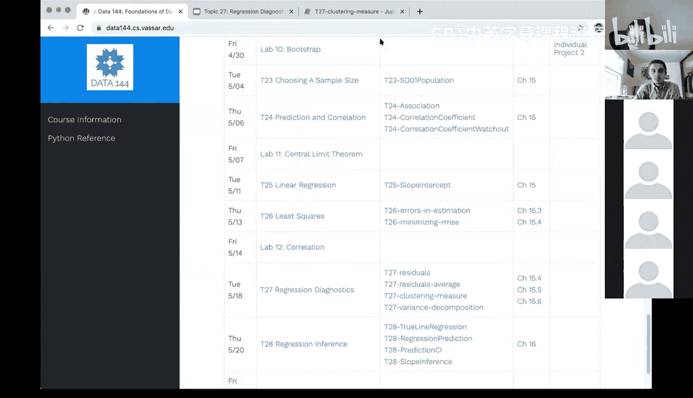

# 80：回归诊断 - 聚类程度的度量 📊

在本节课中，我们将学习如何量化数据点围绕回归直线的聚集程度。我们将回顾相关系数和回归的基础知识，然后引入一个重要的度量方法，该方法将回归模型的拟合值与观测值的变异性联系起来。

## 回顾：回归与诊断

上一节我们介绍了回归诊断，它用于检查线性回归模型背后的假设是否成立。本节中，我们来看看一个更具体的诊断概念：如何度量数据点围绕回归直线的“聚集”程度。

线性回归的核心假设之一是，预测变量 `X` 和结果变量 `Y` 之间存在线性关系。一个理想的预测变量应该能够解释结果变量 `Y` 的大部分变异。为了量化这一点，我们需要一个具体的度量。

## 相关系数回顾

首先，快速回顾相关系数 `r`。相关系数衡量的是两个变量之间线性关系的强度和方向。

*   **公式**：`r = (1/(n-1)) * Σ( (x_i - x̄)/SD_x * (y_i - ȳ)/SD_y )`，其中 `SD` 为标准差。
*   **含义**：`r` 的绝对值越接近 1，数据点越紧密地聚集在一条直线周围；`r` 越接近 0，线性关系越弱。
*   **与回归的关系**：我们使用相关系数 `r` 来计算回归直线的斜率 `b`：`b = r * (SD_y / SD_x)`。

## 量化“聚集程度”

我们的目标是量化数据点围绕**回归直线**的聚集程度。这条直线由拟合值（预测值）`ŷ` 表示。

以下是理解这一概念的关键步骤：

1.  **计算拟合值**：对于每个观测值 `x_i`，我们使用回归方程 `ŷ_i = b * x_i + a` 计算其对应的拟合值 `ŷ_i`。所有 `ŷ_i` 的集合构成了回归直线上的点。
2.  **比较变异性**：我们分别计算**观测值 `y`** 的标准差 `SD(y)` 和**拟合值 `ŷ`** 的标准差 `SD(ŷ)`。标准差衡量数据的离散程度。
3.  **关键发现**：通过演示和数学推导（此处不展开），我们可以得到一个重要的关系：**拟合值的标准差与观测值的标准差之比，等于相关系数的绝对值**。

**公式**：
`SD(ŷ) / SD(y) = |r|`

这个公式意味着，`|r|` 越大，`SD(ŷ)` 相对于 `SD(y)` 的比例就越高。直观上理解，如果数据点紧密地聚集在回归线周围（`|r|` 接近1），那么拟合值 `ŷ` 的分布范围（变异性）将几乎与原始观测值 `y` 的分布范围一样广。反之，如果数据点非常分散（`|r|` 接近0），那么回归线几乎是一条水平线，拟合值 `ŷ` 的变异性会很小。

## 从标准差到方差

由于我们的目标是解释结果变量 `Y` 的“变异”，而方差（标准差的平方）是衡量总变异的更常用指标，因此我们将上述关系平方。

**公式**：
`(SD(ŷ))² / (SD(y))² = |r|²`
即：
`Var(ŷ) / Var(y) = r²`

这里，`r²` 就是我们常说的**决定系数**。它有一个极其重要的解释：**`r²` 表示由预测变量 `X` 通过线性回归模型所解释的结果变量 `Y` 的总变异比例。**

例如，如果 `r = 0.8`，那么 `r² = 0.64`。这意味着，在这个线性模型中，预测变量 `X` 能够解释结果变量 `Y` 大约 64% 的变异。剩余的 36% 的变异未被模型解释，这部分就体现在残差中。

## 总结

本节课中我们一起学习了如何度量数据点围绕回归直线的聚集程度。

1.  我们首先回顾了相关系数 `r` 与回归斜率的关系。
2.  通过比较拟合值 `ŷ` 和观测值 `y` 的标准差，我们发现了关键关系：`SD(ŷ) / SD(y) = |r|`。
3.  我们将此关系平方，引入了**决定系数 `r²`**，它量化了回归模型所能解释的结果变量变异性的比例。

`r²` 是一个非常重要的回归诊断指标。一个较高的 `r²` 值（接近1）表明模型能够很好地解释数据的变异，而较低的 `r²` 值则提示线性模型可能不是最佳选择，或者存在其他重要因素未被纳入模型。在您的项目报告中，报告并解释 `r²` 值对于评估模型性能至关重要。