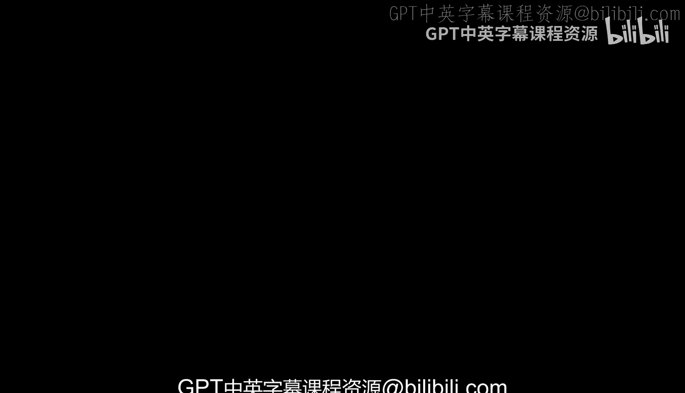
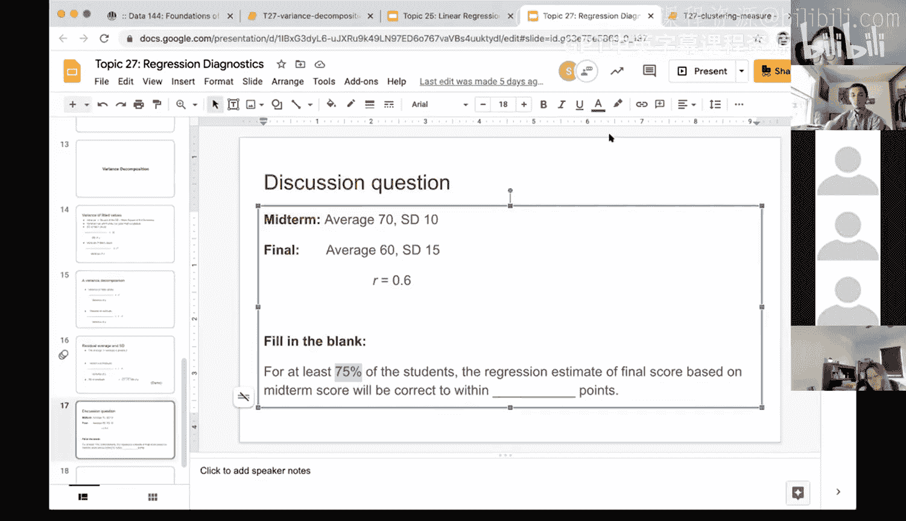
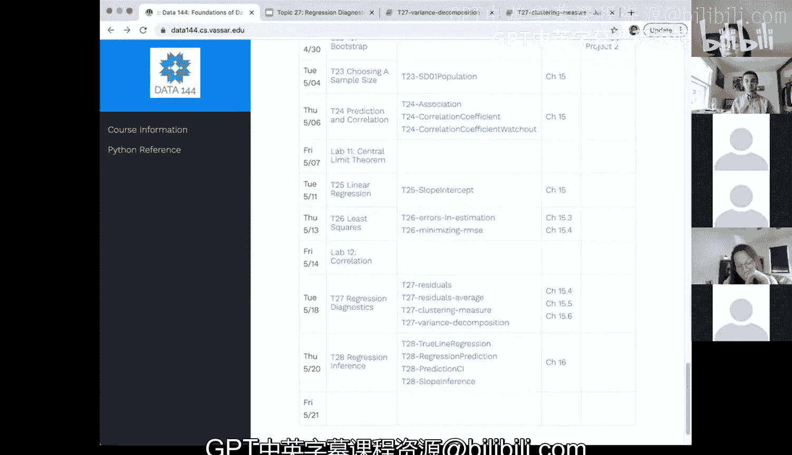

# 81：回归诊断之方差分解 📊



在本节课中，我们将学习回归诊断中的一个核心概念：方差分解。我们将探讨如何将总方差分解为模型解释的方差和残差方差，并理解决定系数 R² 在这一过程中的重要意义。

上一节我们介绍了回归诊断的基本概念，本节中我们来看看如何通过方差分解来量化模型的解释能力。

## 方差分解的数学原理

我们已知，拟合值的标准差与观测值 y 的标准差之比，等于相关系数 R 的绝对值。公式表示为：

\[
\frac{SD(\hat{y})}{SD(y)} = |R|
\]

对等式两边同时平方，我们得到方差之间的关系：

\[
\frac{Var(\hat{y})}{Var(y)} = R^2
\]

这个公式表明，拟合值的方差占 y 的总方差的比例，恰好等于决定系数 R²。R² 的值介于 0 和 1 之间。

*   如果 R² 接近 1，说明拟合值的方差几乎等于 y 的总方差。这意味着线性回归模型能够解释 y 的大部分变异性，是一个拟合良好的模型。
*   如果 R² 接近 0，说明拟合值的方差只能解释 y 的总方差中很小的一部分。这意味着模型解释能力很弱，可能需要寻找更好的预测变量。

基于上述关系，我们可以进行进一步的推导。y 的总方差可以分解为两部分：由模型解释的方差（拟合值方差）和未被解释的方差（残差方差）。它们满足以下关系：

\[
Var(y) = Var(\hat{y}) + Var(residuals)
\]

结合 R² 的定义，我们可以得到残差方差与总方差的关系：

\[
\frac{Var(residuals)}{Var(y)} = 1 - R^2
\]

进而，我们可以推导出残差的标准差公式：

\[
SD(residuals) = \sqrt{1 - R^2} \times SD(y)
\]

这些数学关系构成了方差分解的理论基础。接下来，我们将通过一个实际的数据集来验证这些结论。

## 使用 Python 进行验证

为了让大家更直观地理解，我们现在使用 Galton 身高数据集，通过 Python 代码来验证上述方差分解关系。

以下是验证所需的核心计算步骤：

```python
# 计算残差的方差
variance_residuals = np.var(residuals)

# 计算拟合值的方差
variance_fitted = np.var(fitted_values)

# 计算观测值 y 的方差
variance_y = np.var(y_observed)

# 验证：方差之和是否等于总方差
sum_of_variances = variance_residuals + variance_fitted
is_verified = np.isclose(sum_of_variances, variance_y)
```

运行代码后，我们可以验证 `variance_residuals` 与 `variance_fitted` 之和确实非常接近 `variance_y`，从而在数值上证实了 `Var(y) = Var(\hat{y}) + Var(residuals)` 这一分解关系。

此外，我们还可以验证残差标准差的公式：

```python
# 通过公式计算残差的标准差
r = correlation_coefficient # 例如 0.32
sd_y = np.std(y_observed)
calculated_sd_residuals = np.sqrt(1 - r**2) * sd_y

# 直接计算残差的标准差
actual_sd_residuals = np.std(residuals)




# 比较两者是否接近
is_sd_close = np.isclose(calculated_sd_residuals, actual_sd_residuals)
```

计算结果将显示，通过公式计算出的残差标准差与直接从残差数据计算出的值几乎完全相同，这验证了公式 `SD(residuals) = sqrt(1 - R²) * SD(y)` 的正确性。

## 综合应用示例

为了综合运用本节课的知识，我们来看一个应用题。

假设某班级期中考试（X）平均分为 70，标准差为 10；期末考试（Y）平均分为 60，标准差为 15。已知两次考试成绩的相关系数 R = 0.6。问题：对于至少 75% 的学生，基于期中成绩预测的期末成绩（回归估计值），其误差范围在多少分以内？

解题思路如下：
1.  核心是找到预测误差（即残差）的分布范围。根据切比雪夫不等式，至少有 75% 的数据落在均值 ±2 个标准差的范围内。
2.  因此，我们需要计算残差的标准差。根据公式：`SD(residuals) = sqrt(1 - R²) * SD(y)`。
3.  代入数值：`SD(residuals) = sqrt(1 - 0.6²) * 15 = sqrt(0.64) * 15 = 0.8 * 15 = 12`。
4.  75% 学生对应的误差范围是 ±2 个残差标准差，即 `2 * 12 = 24` 分。

所以，对于至少 75% 的学生，回归预测的期末成绩将在实际成绩的 ±24 分范围内。通过 Python 可以快速完成计算：

```python
r = 0.6
sd_y = 15
sd_residual = np.sqrt(1 - r**2) * sd_y # 计算结果为 12
error_bound = 2 * sd_residual # 计算结果为 24
```

## 总结



本节课中我们一起学习了回归诊断中的方差分解。
我们首先从数学上推导了总方差如何分解为模型解释方差和残差方差，并明确了决定系数 R² 的统计学含义。
随后，我们使用 Python 和实际数据验证了这些重要的数学关系。
最后，通过一个综合性的例题，我们展示了如何将这些知识应用于解决实际问题，包括结合切比雪夫不等式来估计预测的准确性范围。
理解方差分解有助于我们更深刻地评估线性回归模型的解释能力和预测精度。