# 83：回归推断

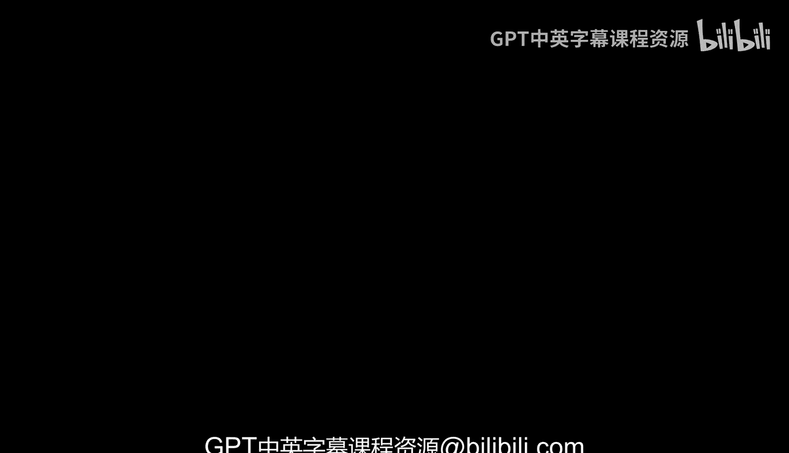

在本节课中，我们将学习如何利用回归模型进行统计推断。我们将探讨如何为回归预测和回归线的斜率构建置信区间，并使用自举法来检验关于斜率的假设。

---

## 回归模型回顾

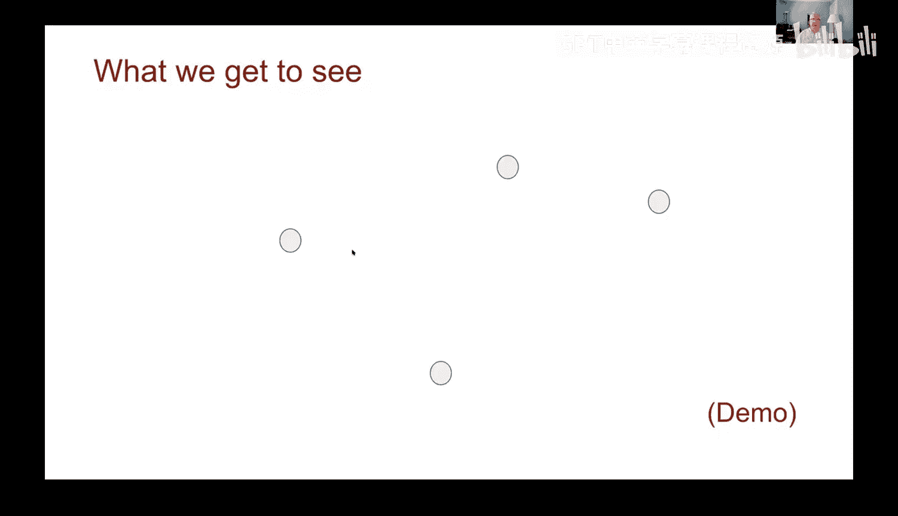

上一节我们介绍了回归线作为数据模型的概念。本节中，我们来看看这个模型的具体含义。

我们可以将回归线视为数据的“真相”或“信号”。我们观测到的数据点，是这个真相加上随机“噪声”的结果。这种噪声就是回归的残差，其平均值通常为零。

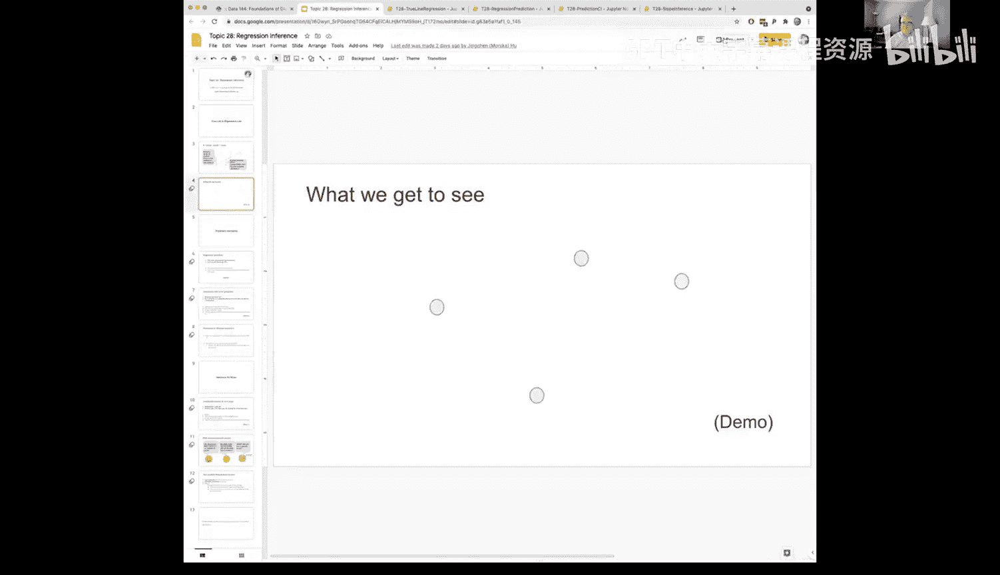

以下代码演示了如何根据一个给定的“真相”回归线生成数据：
```python
def draw_compare(slope, intercept, num_points):
    # 生成沿回归线的点，并添加均值为零的随机噪声
    true_x = np.random.uniform(low, high, num_points)
    true_y = slope * true_x + intercept
    noise = np.random.normal(0, scale, num_points)
    observed_y = true_y + noise
    return observed_data
```
通过这个模型，我们可以生成模拟数据，并计算其回归线来估计“真相”。随着样本量的增加，我们的估计会越来越接近真实的回归线。

---

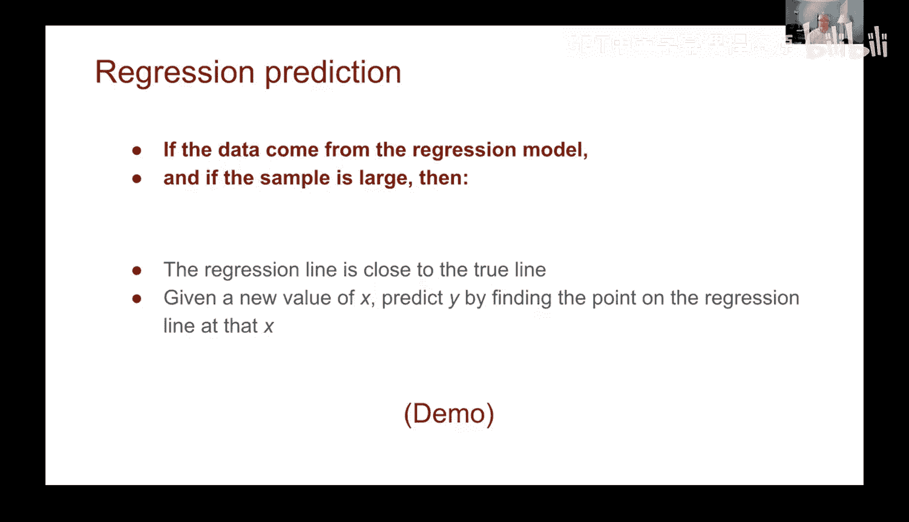

## 回归预测与自举法

我们已经知道如何使用回归线进行预测。现在，我们希望量化这个预测的不确定性，即构建预测的置信区间。

为此，我们将再次使用我们的老朋友——自举法。其核心思想是：我们拥有的散点图数据可以看作是总体的一个样本。通过对这个样本进行有放回的重复抽样，我们可以生成许多新的“自举样本”散点图。

以下是生成自举样本散点图的关键步骤：
```python
bootstrapped_table = original_table.sample(with_replacement=True)
```
对于每一个自举样本，我们都可以计算一条新的回归线，并基于此做出预测。通过重复这个过程数千次，我们就能得到一系列预测值。

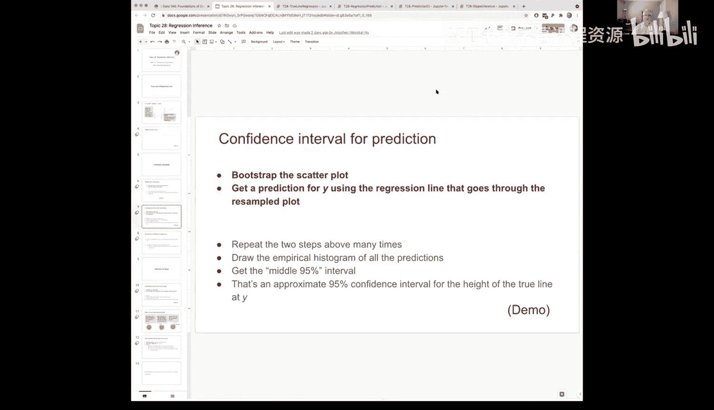

---

## 构建预测置信区间

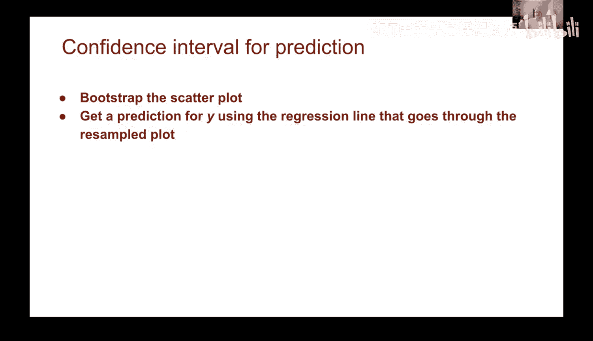

以下是构建预测置信区间的主要步骤：

1.  **自举重采样**：从原始数据表中，有放回地抽取与原始行数相同的样本，生成一个新的数据表。
2.  **计算预测**：在新的自举样本上计算回归线，并对给定的新X值进行预测。
3.  **重复过程**：将步骤1和2重复执行大量次数（例如1000次），收集所有预测结果。
4.  **分析结果**：绘制预测值的直方图，并计算中间95%的区间作为置信区间。

以下是一个整合了上述步骤的函数示例：
```python
def bootstrap_prediction(table, x_label, y_label, new_x, repetitions=1000):
    predictions = make_array()
    for i in np.arange(repetitions):
        bootstrap_sample = table.sample(with_replacement=True)
        predicted_y = predict(bootstrap_sample, x_label, y_label, new_x)
        predictions = np.append(predictions, predicted_y)
    left = percentile(2.5, predictions)
    right = percentile(97.5, predictions)
    # 返回置信区间和直方图
```
应用此方法，例如预测妊娠300天的婴儿出生体重，我们可以得到类似“我们有95%的信心认为，出生体重在127.1到131.3盎司之间”的结论。

一个需要注意的现象是，预测区间（置信区间的宽度）依赖于X值的位置。预测在X的均值附近通常最精确（区间最窄），而离均值越远，预测的不确定性越大（区间越宽）。

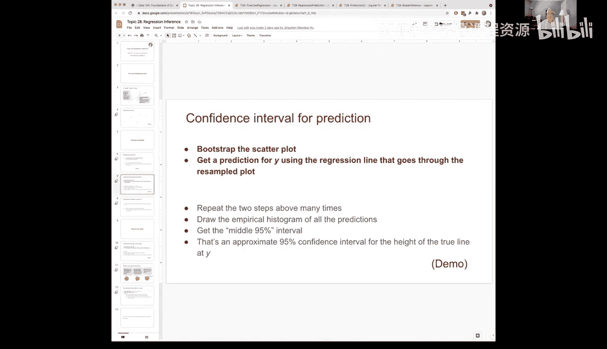

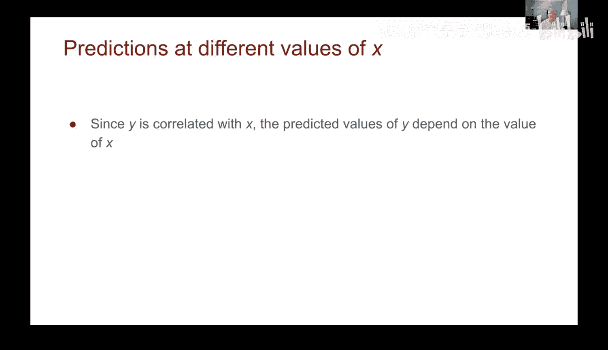

---

## 斜率的推断与假设检验

我们不仅能为预测值构建置信区间，还能为回归线的斜率本身进行推断。这可以帮助我们判断观察到的斜率是否具有统计显著性，还是仅仅由随机因素导致。

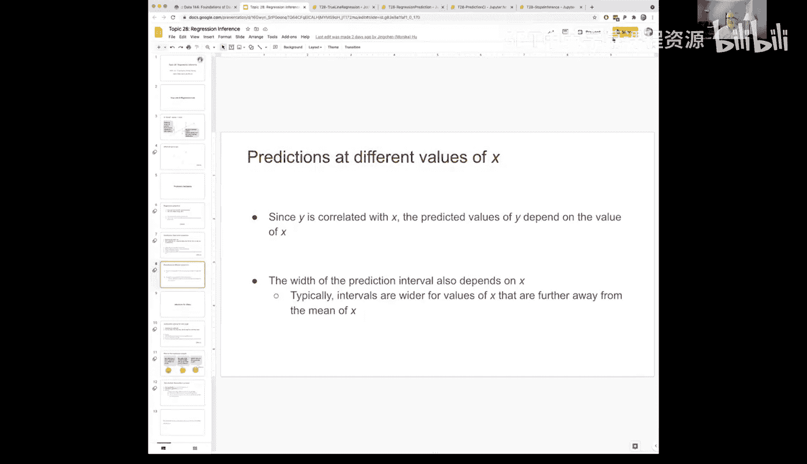

其方法与预测区间类似，但收集的是斜率值：

1.  **自举重采样**：与之前相同，生成自举样本散点图。
2.  **计算斜率**：为每个自举样本计算回归线的斜率。
3.  **重复过程**：重复多次，收集所有斜率值。
4.  **构建置信区间**：计算斜率值的中间95%区间。

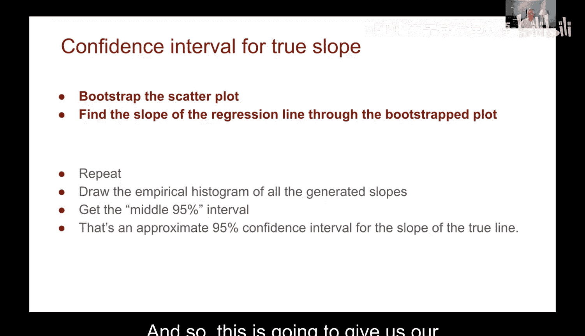

以下是计算斜率置信区间的函数核心部分：
```python
def bootstrap_slope(table, x_label, y_label, repetitions=1000):
    slopes = make_array()
    for i in np.arange(repetitions):
        bootstrap_sample = table.sample(with_replacement=True)
        bootstrap_slope = slope(bootstrap_sample, x_label, y_label)
        slopes = np.append(slopes, bootstrap_slope)
    left = percentile(2.5, slopes)
    right = percentile(97.5, slopes)
    # 返回斜率的置信区间
```

### 斜率假设检验

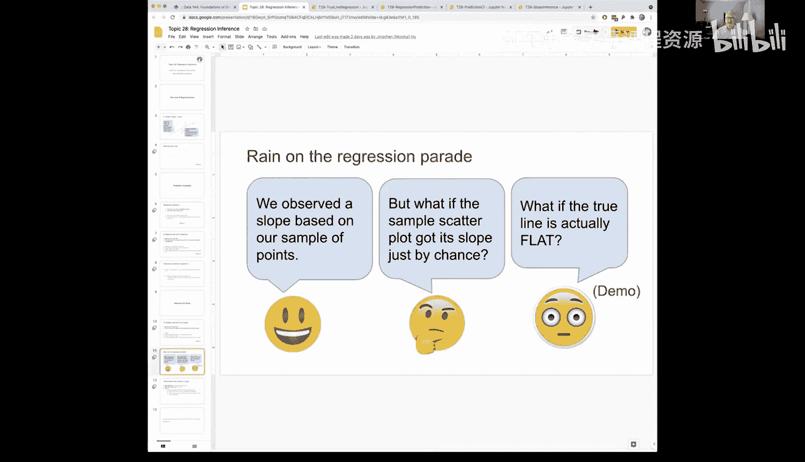

我们可以利用斜率的置信区间来进行正式的假设检验：
*   **零假设 (H₀)**：真实的斜率为零（即X与Y之间没有线性关系）。`slope = 0`
*   **备择假设 (H₁)**：真实的斜率不为零。

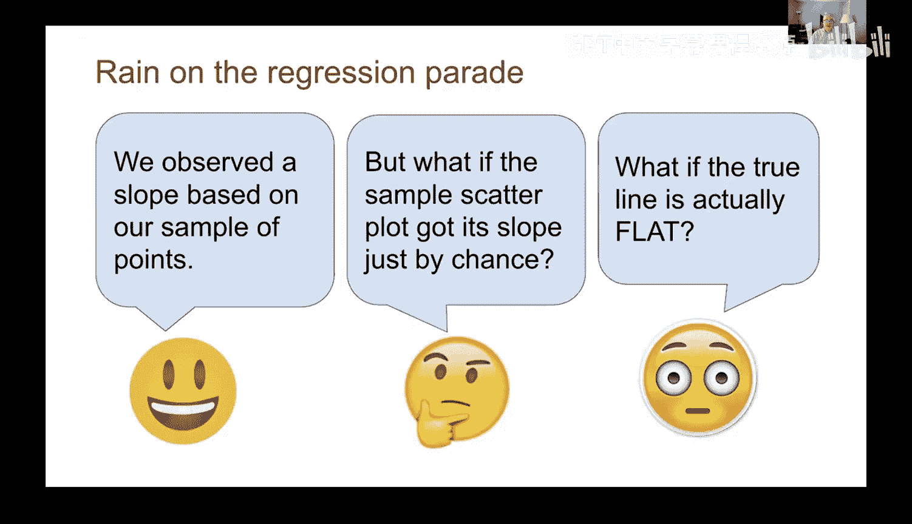

**检验方法**：计算斜率95%的置信区间。如果该区间**不包含0**，那么我们就有足够的证据拒绝零假设，认为斜率是显著的（非零）。如果区间**包含0**，则我们不能拒绝零假设，观察到的斜率可能完全是由于偶然。

**示例**：在探究母亲年龄与婴儿出生体重关系的例子中，我们计算出的斜率置信区间包含了0。因此，我们不能拒绝“真实斜率为零”的零假设，这意味着观察到的微弱斜率很可能只是随机波动造成的。

---

## 总结

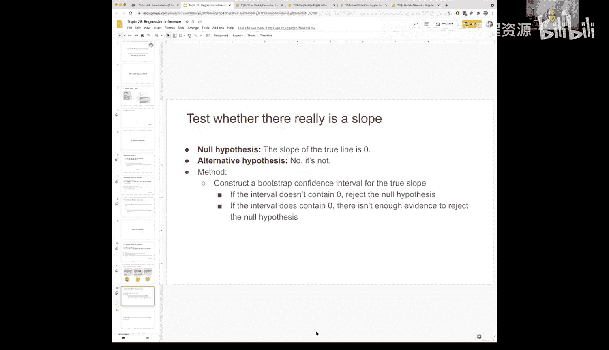

本节课中我们一起学习了回归推断的核心内容：
1.  我们将回归线视为带有噪声的数据生成模型。
2.  我们使用**自举法**为回归预测值构建了**置信区间**，从而量化了预测的不确定性。
3.  我们同样使用自举法为回归线的**斜率**构建了置信区间。
4.  我们学习了如何利用斜率的置信区间进行**假设检验**，以判断X和Y之间是否存在显著的线性关系（即斜率是否显著不为零）。

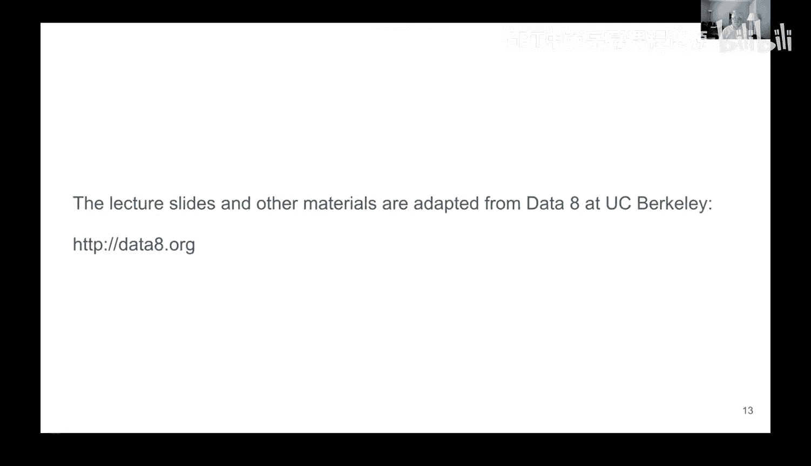

通过结合回归分析和自举统计技术，我们不仅能够做出预测，还能评估这些预测和模型参数的可靠性，这是数据分析和决策中至关重要的一步。