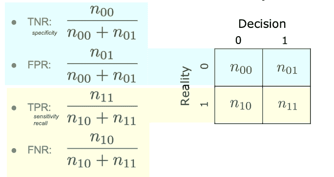
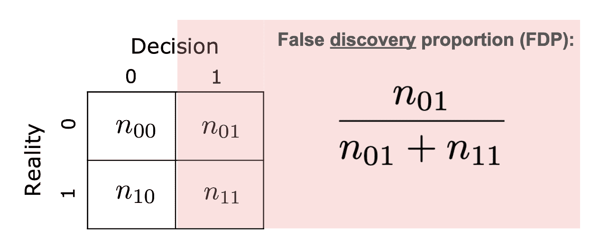

# 二进制决策与错误率

> 原文：[`data102.org/ds-102-book/content/chapters/01/decisions-and-errors`](https://data102.org/ds-102-book/content/chapters/01/decisions-and-errors)

[<svg viewBox="0 0 24 24" fill="currentColor" aria-hidden="true" width="1.25rem" height="1.25rem" class="myst-fm-license-cc-icon myst-fm-license-cc-icon-main inline-block mx-1"><title>内容许可：Creative Commons 知识共享署名相同 4.0 国际 (CC-BY-SA-4.0)</title></svg><svg viewBox="0 0 24 24" fill="currentColor" aria-hidden="true" width="1.25rem" height="1.25rem" class="myst-fm-license-cc-icon myst-fm-license-cc-icon-by inline-block mr-1"><title>必须提及创作者</title></svg><svg viewBox="0 0 24 24" fill="currentColor" aria-hidden="true" width="1.25rem" height="1.25rem" class="myst-fm-license-cc-icon myst-fm-license-cc-icon-sa inline-block mr-1"><title>改编必须以相同条款共享</title></svg>](https://creativecommons.org/licenses/by-sa/4.0/)[](https://github.com/ds-102/ds-102-book "GitHub 仓库：ds-102/ds-102-book")[](https://github.com/ds-102/ds-102-book/edit/main/ds-102-book/content/chapters/01/01_decisions_and_errors.ipynb "编辑此页")

许多现实世界的数据科学问题最终归结为做出二元决策。例如：

+   基于对某疾病在患者群体中的医学测试结果，哪些患者患有该疾病？

+   在测试我网站新版本的结果中，这个版本是否会增加客户在我网站上停留更长时间和/或购买东西的机会？

+   在我的数据集中，某些变量对之间是否存在“统计上显著的”关联？

尤其是在大多数现实世界的场景中，我们不仅仅想要分析一个单一的决策：我们想要评估在做出多个决策时会发生什么。为此，我们将关注我们可以使用的框架，这些框架帮助我们理解做出多个（通常是相关）决策的后果。

```py
# NO CODE

# VIDEO: B-H Algorithm Overview and Example
from IPython.display import YouTubeVideo
YouTubeVideo('tLPImMr5C-E')
```

在本章中，我们将关注做出二元（0/1）决策的情况。对于我们所做的每一个决策，我们假设存在某种*现实*或真相，它要么是 0 要么是 1。我们收集数据，并根据数据做出二元*决策*：决策是我们对现实的最佳猜测。我们将现实和决策分别缩写为$R$ 和$D$。由于两者都是二元的，我们可以使用 2 x 2 表格来可视化所有可能的结果：

|  | $D=0$ | $D=1$ |
| --- | --- | --- |
| $R=0$ |  |  |
| $R=1$ |  |  |

我们所做的每一个决策都必须落在表格的四个单元格之一。在大多数现实世界的场景中，我们实际上不知道我们的决策最终落在哪一行：我们知道是否决定 $D=0$ 或 $D=1$（即它位于哪一列），但我们不知道现实的状态。

这种表格通常被称为**混淆矩阵**。关于是否将现实放在行或列中，并没有一个标准的约定，所以你可能会在其他地方看到它们被翻转。在这本书中，我们始终将现实放在行中，将决策放在列中。

我们为这四种情况分别使用了以下名称：**真阳性**（TP）、**假阳性**（FP）、**真阴性**（TN）和**假阴性**（FN）。

|  | $D=0$ | $D=1$ |
| --- | --- | --- |
| $R=0$ | $TN$ | $FP$ |
| $R=1$ | $FN$ | $TP$ |

每个名称的第一个词告诉我们决策是否正确（“真”）或错误（“假”）。第二个词告诉我们决策是 1（“阳性”）还是 0（“阴性”）。例如，“假阳性”是指决策 $D=1$（因为它是一个“阳性”），但实际上是错误的，所以 $R=0$（因为它是一个“假”的）。

理想情况下，我们的决策始终与现实相符，并落在表格的右上角（真阴性）或左下角（假阳性）的单元格中。在现实世界中，这并不总是可能的：我们可能会犯错误。根据问题，我们可能更倾向于避免一种错误而不是另一种。在本节的其余部分，我们将定义几种不同的方法来量化我们犯的错误，并了解它们之间的关系。

我们可以对单个决策进行很多丰富的分析，我们将在下一节关于假设检验的章节中探讨。现在，我们将从做出多个决策的情况开始，这将是本章的重点。

```py
# NO CODE

# VIDEO: B-H Algorithm Overview and Example
from IPython.display import YouTubeVideo
YouTubeVideo('6HksEjoX2RI')
```

## 做出多个决策

假设我们现在做出多个决策，并希望从整体上审视它们。这种情况可能以几种方式出现：

*在单个数据集上测试多个假设*：我们可能对从单个数据集中提出多个问题感兴趣。例如，假设我们在阿尔茨海默病研究中检查一个基因组学数据集。对于成千上万的遗传标记，我们希望了解该位置的突变是否与阿尔茨海默病的更高风险相关。

*在多个数据集上测试一个假设*：假设我们感兴趣的是研究使用他汀类药物与心脏病发作率之间是否存在关联。我们可以对许多研究进行荟萃分析，这些研究探讨了这个问题：每个研究都测试了相同的一个假设（即，服用他汀类药物是否与心脏病发作风险降低有关？），但研究对象不同。通过将研究视为一个集合来观察，我们可以尝试得出关于这种联系存在（或不存在）的更强结论。

### 修改 2x2 表格 

当我们做出多个决策时，我们可能会有多个假阳性、真阴性等等。因此，我们将使用相同的 2x2 表格，但现在每个单元格将包含该条件发生的次数计数：

|  | $D=0$ | $D=1$ |
| --- | --- | --- |
| $R=0$ | $n_{00}$n00​ | $n_{01}$n01​ |
| $R=1$ | $n_{10}$n10​ | $n_{11}$n11​ |

例如，$n_{01}$n01​ 是现实为 0 而我们做出决策为 1 的次数。

有许多方法可以量化我们的决策与现实匹配得有多好（或有多坏）。在这本书中，我们将重点关注**行级率**，它量化我们在每一行中的表现（即，当现实为 0 和当现实为 1 时），以及**列级率**，它量化我们在每一列中的表现（即，当决策为 0 或决策为 1 时）。

### 行级率：量化当现实已知时我们的表现如何

假设我们想要评估在现实为 0 的情况下我们的决策过程有多好。在这种情况下，我们感兴趣的是上述 2x2 表格的上行。特别是，我们可以使用分数 $\frac{n_{00}}{n_{00} + n_{01}}$n00​+n01​n00​​ 来量化我们在这个情况下正确的频率。我们将这个行级率称为**真阴性率**（TNR）：它量化在现实为 0 的情况下我们做出真阴性决策的频率。

我们还可以评估在现实为 1 的情况下的决策过程。在这种情况下，我们可以使用 $\frac{n_{11}}{n_{10} + n_{11}}$n10​+n11​n11​​ 来量化我们正确的频率。这被称为**真阳性率**（TPR）：它衡量在现实为 1 的情况下我们做出真阳性决策的频率。

我们可以为上述两种情况定义相应的**错误率**，我们将称之为假阳性率（FPR）和假阴性率（FNR）：

$FPR = \frac{n_{01}}{n_{00} + n_{01}} \\ FNR = \frac{n_{10}}{n_{10} + n_{11}}$FPR=n00​+n01​n01​​FNR=n10​+n11​n10​​(1)

我们可以用它们在 2x2 表中的对应行来可视化这些率：



作为例子，假设我们正在预测客户是否会购买产品。在这种情况下，0 对应于客户没有购买，1 对应于客户购买。以下是解释上述四个率的方法：

+   TNR：当客户**没有**购买产品时，我们（正确地）预测他们不会购买的频率是多少？

+   FPR：当客户**没有**购买产品时，我们（错误地）预测他们会购买的频率是多少？

+   TPR：当客户**确实**购买产品时，我们（正确地）预测他们会购买的频率是多少？

+   FNR：当客户**确实**购买产品时，我们（错误地）预测他们不会购买的频率是多少？

```py
# NO CODE

# VIDEO: B-H Algorithm Overview and Example
from IPython.display import YouTubeVideo
YouTubeVideo('gmLZVBa9T3k')
```

### 列级率

行级率衡量我们在现实中的每个案例中的表现如何：换句话说，在表格的每一行中。我们还可以量化我们在做出特定决策时的表现。我们将重点关注**错误发现比例**（FDP），它量化了我们做出 1 的决策时出错频率：



我们还定义了**错误遗漏比例**（FOP），它量化了我们做出 0 的决策时出错频率：

$FOP = \frac{n_{10}}{n_{00} + n_{10}}$FOP=n00​+n10​n10​​(2)

对于这两个，我们可以定义它们的对立面（真正的遗漏比例和真正的发现比例），但很少用这些名称来称呼它们。

回到我们的产品购买预测示例，以下是解释列级率的方法：

+   FDP：当我们预测客户**会购买**产品时，他们最终没有购买产品的频率是多少？

+   FOP：当我们预测客户**不会购买**产品时，他们最终购买产品的频率是多少？

在整本书中，我们将主要关注 FDP 作为我们最感兴趣的列级率。

#### 精确度

一个与之密切相关且广泛使用的列比率是**精确度**：

$\text{精确度} = \frac{n_{11}}{n_{01} + n_{11}} = 1 - FDP$精确度=n01​+n11​n11​​=1−FDP(3)

精确度告诉我们，在我们做出决策为 1 的次数中，我们有多大的正确率。在产品购买预测的例子中，我们会这样解释：当我们预测客户**会购买**产品时，他们最终购买产品的频率是多少？

```py
# NO CODE

# VIDEO: B-H Algorithm Overview and Example
from IPython.display import YouTubeVideo
YouTubeVideo('4FnHLfdHmJE')
```

### 示例：解释行和列的比率

假设我们正在测试大量患者的疾病。我们将使用 1 表示患者有疾病，使用 0 表示他们没有。这对应于标准的医疗术语，其中“阳性”测试表示我们认为某人患有疾病，而“阴性”测试表示我们认为他们没有疾病。

让我们为这个特定例子解释一些我们学到的定义。回想一下，对于这个例子，**假阳性**发生在测试结果为阳性（即测试表明患者有疾病），但实际上患者是健康的情况。

+   假阳性率（FPR）是指测试结果为阳性的健康患者的百分比。它告诉我们：**当我们测试健康患者时，测试有多大的可能是错误的？**

+   假阴性率（FNR）是指测试结果为阴性的患病患者的百分比。它告诉我们：**当我们测试患病患者时，测试有多大的可能是错误的？**

+   假设发现比例（FDP）是指来自健康患者的阳性测试的百分比。它告诉我们：**当测试结果为阳性时，它们有多大的可能是错误的？**

+   假遗漏比例（FOP）是指来自患病患者的阴性测试的百分比。它告诉我们：**当测试结果为阴性时，它们有多大的可能是错误的？**

直观地说，行错误率（FPR 和 FNR）描述了测试本身的特性：它们告诉我们测试在健康患者和患病患者身上的表现如何。作为一个具体例子，COVID-19 快速（抗原）测试对 Omicron BA.1 变种的估计 FPR 为 0.2%，FNR 为 38% ([来源](https://doi.org/10.1101/2022.06.13.22276325))。FPR 和 FNR 是测试技术和疾病本身的特性，无论测试是在病例激增期间还是低发期（病例较少）进行，只要测试技术和变种相同，这些特性都是相同的。

另一方面，列向的比率必须依赖于总体。作为一个具体的例子，让我们来考察 COVID-19 快速（抗原）检测的 FDP。在病毒在人群中较少见的低谷期，我们应该预期有相对较少的 COVID-19 患者，以及相对较多的健康患者。这意味着一些适度的百分比的正测试结果将是错误的（假阳性），因此我们的 FDR 可能会适度较高。但在病例激增期间，更多的人生病，我们应该预期更多的阳性测试结果来自 COVID-19 患者而不是健康人。因此，即使测试本身保持完全相同，我们的 FDP 也会更低。

接下来，我们将量化行向比率与列向比率之间关系的这种直觉。

```py
# NO CODE

# VIDEO: B-H Algorithm Overview and Example
from IPython.display import YouTubeVideo
YouTubeVideo('4V7bZ4z4jWg')
```

### 条件概率

上述定义的每个比率都是基于限制自己只看表格一半的想法。在行向比率的案例中，我们定义了基于只看 $R=0$（FPR 和 TNR）或 $R=1$（TPR 和 FNR）的量。在列向比率的案例中，我们只基于 $D=1$ 定义 FDP。

这种基于有限结果集进行计算的想法应该很熟悉：这是一个你可能在考虑条件概率时已经见过的想法。考虑事件 $A$ 和 $B$。虽然 $P(A)$ 描述了事件 $A$ 发生的概率，$P(A|B)$P(A∣B) 描述了事件 $A$ 在事件 $B$ 发生条件下的条件概率：换句话说，如果我们限制自己只考虑事件 $B$ 已经发生的情况，事件 $A$ 发生的概率是多少？

从这个想法出发，我们可以将我们的行率解释为条件概率。由于每个都是在特定现实情况下定义的，我们知道它们是特定决策在现实条件下的概率：例如，真正阳性率（TPR）是 $P(D=1|R=1)$P(D=1∣R=1)。

类似地，假阳性率（FPR），它衡量我们的答案在现实为 0（$D=1$）时错误的频率，可以解释为条件概率 $P(D=1|R=0)$P(D=1∣R=0)。

另一方面，列向率是在特定决策条件下定义的。假发现比例，它关注我们的阳性决策（$D=1$）并衡量它们错误发生的频率（$R=0$），可以解释为条件概率 $P(R=0|D=1)$P(R=0∣D=1)。同样，假遗漏比例 (FOP) 是 $P(R=1|D=0)$P(R=1∣D=0).

总结如下：

| 错误率 | 条件概率 |
| --- | --- |
| **真阴性率 (TNR)** | $P(D=0\mid R=0)$P(D=0∣R=0) |
| **假阳性率 (FPR)** | $P(D=1\mid R=0)$P(D=1∣R=0) |
| **真阳性率 (TPR)** | $P(D=1\mid R=1)$P(D=1∣R=1) |
| **假阴性率 (FNR)** | $P(D=0\mid R=1)$P(D=0∣R=1) |
| **假发现比例 (FDP)** | $P(R=0\mid D=1)$P(R=0∣D=1) |
| **假遗漏比例 (FOP)** | $P(R=1\mid D=0)$P(R=1∣D=0) |

将这些行和列的比率解释为条件概率是有用的，因为它让我们能够将我们对条件概率的所有知识应用到更好地理解这些比率上。在之前的 COVID-19 检测示例中，我们探讨了行和列比率之间的直观联系，并引入了这种联系也取决于“$R=1$”有多普遍的想法。我们可以通过应用贝叶斯定理来形式化这种直觉。

```py
# NO CODE

# VIDEO: B-H Algorithm Overview and Example
from IPython.display import YouTubeVideo
YouTubeVideo('qqiPlQ1w_WE')
```

### 将行和列错误率相关联

考虑假发现比例（FDP），$P(R=0|D=1)$P(R=0∣D=1)和假阳性率（FPR），$P(D=1|R=0)$P(D=1∣R=0)。为了量化它们之间的联系，我们可以应用贝叶斯定理。正如我们将看到的，这种联系取决于现实世界中“1”有多普遍。我们将称这个量为**患病率**或**基础率**，并使用符号$\pi_1$π1​：$\pi_1 = P(R=1)$π1​=P(R=1)。我们还将定义$\pi_0 = P(R=0) = 1 - \pi_1$π0​=P(R=0)=1−π1​。

现在，我们可以量化我们之前开始探索的这两个比率之间的关系。我们将使用贝叶斯定理和全概率定律：

$\begin{align*} FDP &= P(R=0|D=1) \\ {\scriptsize{\text{(using Bayes’ rule)}}} &= \frac{P(D=1|R=0)P(R=0)}{P(D=1)} \\ {\scriptsize{\text{(Law of total probability)}}} &= \frac{P(D=1|R=0)P(R=0)}{P(D=1|R=0)P(R=0) + P(D=1|R=1)P(R=1)} \\ {\scriptsize{\text{(applying definitions)}}} &= \frac{FPR \cdot \pi_0}{FPR \cdot \pi_0 + TPR \cdot \pi_1} \\ {\scriptsize{\text{(dividing by the numerator)}}} &= \frac{1}{1 + \frac{TPR}{FPR} \frac{\pi_1}{\pi_0}} \end{align*}$FDP(使用贝叶斯定理)(全概率公式)(应用定义)(分子除法) = P(R=0|D=1) = P(D=1) / P(D=1|R=0)P(R=0) = P(D=1|R=0)P(R=0) + P(D=1|R=1)P(R=1) / P(D=1|R=0)P(R=0) = FPR⋅π0 / (FPR⋅π0 + TPR⋅π1) = 1 + FPR / TPRπ0 / π1 / 1 (4)

如果你想复习这类计算，可以参考[《数据 140 教科书》第 2.5 节](http://prob140.org/textbook/content/Chapter_02/05_Updating_Probabilities.html)。

```py
# NO CODE

# VIDEO: B-H Algorithm Overview and Example
from IPython.display import YouTubeVideo
YouTubeVideo('IFTY4ogb2_s')
```

### 示例：定量关联行率和列率

假设我们正在尝试构建一个预测是否下雨的模型。为了确保其性能良好，我们将在伯克利（那里夏天几乎不下雨）和佛罗里达州的迈阿密（那里夏天大约有一半的时间下雨）应用我们的算法。

你与一组数据科学家合作，其中一位提供了一个好的预测模型：在下雨的日子里，模型正确预测的次数是$97\%$97%，而在不下雨的日子里，模型正确预测的次数是$96\%$96%。你将这个模型展示给一位气象学家，他告诉你他们真正感兴趣的问题是：**当模型预测下雨时，它有多准确**？这对于人们信任模型很重要：如果模型对下雨天的预测大多不正确，那么人们就不会相信它。

我们首先将这些三个量解释到我们已建立起来的框架中。我们将用 1 表示下雨，用 0 表示没有下雨。

+   “在下雨的日子里，模型正确预测的次数是$97\%$97%”：这是一个行率，描述了当$R=1$ 时我们做得有多好。换句话说，这告诉我们$TPR=0.97$（并且$FNR = 1 - TPR = 0.03$FNR=1−TPR=0.03）。

+   “在不下雨的日子里，模型正确率高达$96\%$96%”：这是行率，描述了当$R=0$ 时我们的表现。换句话说，这告诉我们$TNR=0.96$（并且$FPR = 1 - TNR = 0.04$FPR=1−TNR=0.04）。

+   “当模型预测下雨时，它有多正确？”：这是一个列率，描述了当$D=1$ 时我们的表现。换句话说，气象学家感兴趣的是最小化 FDP。

因此，为了满足气象学家的要求，我们需要从数据科学家提供的数据中计算出 FDP。这正是上述使用贝叶斯定理的计算所告诉我们的。我们将首先定义一个函数，用于从 TPR、FPR 和患病率中计算 FDP：

```py
# Uses the formula derived above
def compute_fdp(tpr, fpr, prevalence):
    return 1 / (1 + (tpr/fpr) * (prevalence/(1-prevalence)))

miami_prevalence = 0.5
berkeley_prevalence = 0.01
```

当模型在迈阿密使用时，FDP 是多少？

```py
miami_fdp = compute_fdp(tpr=0.97, fpr=0.04, prevalence=miami_prevalence)
miami_fdp
```

`0.039603960396039604`

这相当小：在迈阿密，当我们预测下雨时，我们可以期望大约$96\%$的时间是正确的。那么在伯克利呢？

```py
berkeley_fdp = compute_fdp(tpr=0.97, fpr=0.04, prevalence=berkeley_prevalence)
berkeley_fdp
```

`0.8032454361054766`

这告诉我们，在伯克利夏天，当我们用这个模型预测下雨时，我们只能期望大约$20\%$的时间是正确的。尽管我们的模型在每个案例中都有超过$95\%$的准确性，但伯克利雨的患病率很低意味着我们很少下雨。这意味着我们有大量机会出现假阳性（在干燥的日子里），而真正阳性（在下雨的日子里）的机会却很少。因此，我们的假发现比例相当高。

我们也可以通过分析上述方程的渐近行为来看到这一点：

$FDP = \frac{1}{1 + \frac{TPR}{FPR} \frac{\pi_1}{\pi_0}}$FDP=1+FPRTPR​π0​π1​​1​(5)

+   随着患病率$\pi_1$​变得非常小（接近 0），分数$\pi_1/\pi_0$​趋近于 0，FDP 趋近于$1/(1+0) = 1$1/(1+0)=1.

+   随着患病率$\pi_1$​变得非常大（接近 1），分数$\pi_1/\pi_0$​趋近于$\infty$，FDP 趋近于 0。

同样，我们可以看到，真正阳性率（TPR）的较大值和假阳性率（FPR）的较小值会导致较低的假发现比例（FDP）。

```py
# NO CODE

# VIDEO: B-H Algorithm Overview and Example
from IPython.display import YouTubeVideo
YouTubeVideo('aVwtgw0tQHI')
```

### 不同的错误类型：哪一个更糟糕？

假阳性和假阴性都是错误。通常，我们希望犯的错误尽可能少，但正如我们稍后将会看到的，我们经常陷入必须在这两种错误之间权衡的情况，即更多的假阳性和更少的假阴性，或者反之。在这种情况下，了解哪一个更可取（或“更不好”）是很重要的。

例如：假设 Spotify 正在尝试预测哪些客户将续订他们的订阅（1 表示续订，0 表示不续订）。对于预测不会续订的客户，他们计划发送一张 1 美元的优惠券，用于下个月的订阅。在这种情况下：

+   假阳性对应于预测客户将续订（因此不发送优惠券），但随后客户没有续订（Spotify 失去了一个每月支付 12 美元的客户）。

+   假阴性意味着预测客户不会续订（因此向他们发送优惠券），但客户实际上还是会续订（因此优惠券变得不必要，导致 Spotify 损失 1 美元）。

在这个例子中，我们可能会认为假阳性比假阴性更糟糕：假阴性意味着 Spotify 会浪费 1 美元，但假阳性意味着他们将会失去一个付费客户，而这个客户他们本可以用优惠券留住。

参考文献

1.  Murakami, M., Sato, H., Irie, T., Kamo, M., Naito, W., Yasutaka, T., & Imoto, S. (2022). *COVID-19 快速抗原检测在奥密克戎变异株爆发期间的反应灵敏度*。[10.1101/2022.06.13.22276325](https://doi.org/10.1101/2022.06.13.22276325)
