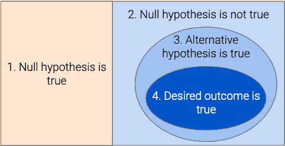
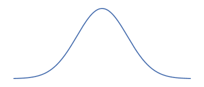
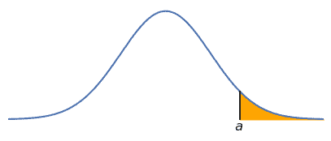
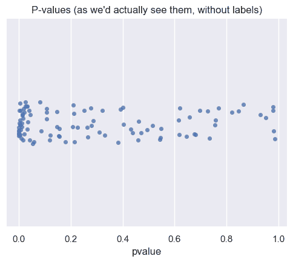
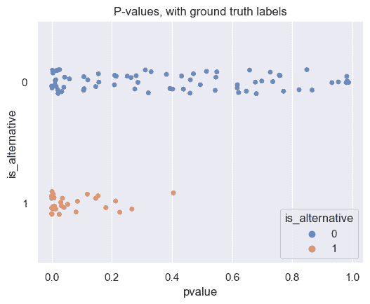
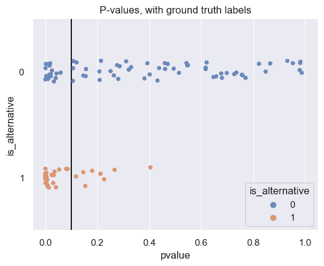
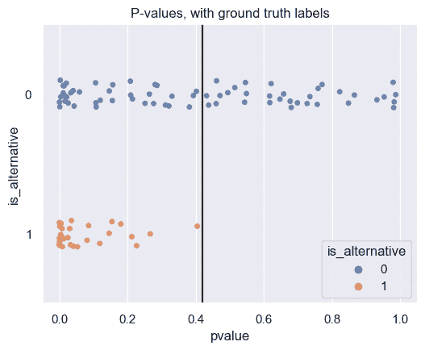
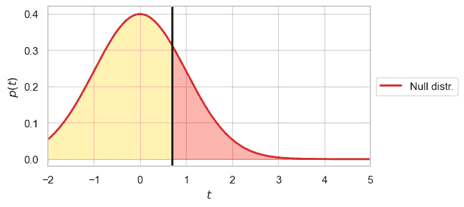
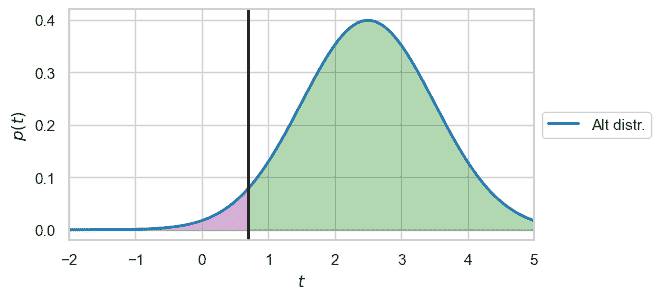
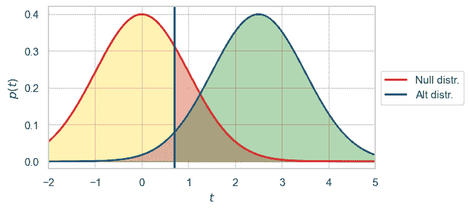

# 假设检验

> 原文：[`data102.org/ds-102-book/content/chapters/01/hypothesis-testing`](https://data102.org/ds-102-book/content/chapters/01/hypothesis-testing)

[<svg viewBox="0 0 24 24" fill="currentColor" aria-hidden="true" width="1.25rem" height="1.25rem" class="myst-fm-license-cc-icon myst-fm-license-cc-icon-main inline-block mx-1"><title>内容许可：Creative Commons Attribution Share Alike 4.0 国际 (CC-BY-SA-4.0)</title></svg><svg viewBox="0 0 24 24" fill="currentColor" aria-hidden="true" width="1.25rem" height="1.25rem" class="myst-fm-license-cc-icon myst-fm-license-cc-icon-by inline-block mr-1"><title>必须注明创作者</title></svg><svg viewBox="0 0 24 24" fill="currentColor" aria-hidden="true" width="1.25rem" height="1.25rem" class="myst-fm-license-cc-icon myst-fm-license-cc-icon-sa inline-block mr-1"><title>改编必须以相同条款共享</title></svg>](https://creativecommons.org/licenses/by-sa/4.0/)[](https://github.com/ds-102/ds-102-book "GitHub 仓库：ds-102/ds-102-book")[](https://github.com/ds-102/ds-102-book/edit/main/ds-102-book/content/chapters/01/02_hypothesis_testing.ipynb "编辑此页")笔记本单元

```py
import numpy as np
import pandas as pd
import matplotlib.pyplot as plt
import seaborn as sns
from scipy import stats

%matplotlib inline

sns.set()  # This helps make our plots look nicer

# These make our figures bigger
plt.rcParams['figure.figsize'] = (6, 4.5)
plt.rcParams['figure.dpi'] = 100
```

*你可能发现回顾数据 8 教科书的第十一章[测试假设](https://inferentialthinking.com/chapters/11/Testing_Hypotheses.html)和第十二章[比较两个样本](https://inferentialthinking.com/chapters/12/Comparing_Two_Samples.html)会有所帮助，这两章涵盖了假设检验的基础知识。*

假设检验是一种特定的二元决策问题。尽管近年来**零假设统计检验（NHST）**框架受到了批评，但它仍然为从数据中做出决策提供了一个有用的框架。我们将在稍后探讨这些批评，但首先，这里有一个关于这个过程如何工作的快速复习：

1.  确定你想要测试的观点，并决定：

    +   零假设：一个可以模拟数据或通过分析计算数据分布的随机模型

    +   备择假设：问题的观点

    +   检验统计量：从你的数据中计算出的量，帮助你在这两个假设之间做出决定（在这本书中，我们将始终使用惯例，即检验统计量的较大值应有利于备择假设，不失一般性）。

1.  计算你数据上的检验统计量值。

1.  通过模拟或分析计算零假设下的检验统计量分布。

1.  计算 p 值：这是在零假设为真的情况下，获得一个等于或大于观察值的测试统计量的概率。

1.  将该 p 值与某个阈值进行比较：如果 p 值小于阈值，则我们的测试统计量在零假设下非常不可能，因此我们的数据支持备择假设。如果 p 值较大，则数据支持零假设。

```py
# NO CODE

# VIDEO: B-H Algorithm Overview and Example
from IPython.display import YouTubeVideo
YouTubeVideo('g8NepbdUOBU')
```

## 假设检验与二元决策

我们将假设检验框架化为一个二元决策问题，其中我们在零假设和备择假设之间做出选择，并假设其中一个是真实的（注意，这种框架是有缺陷的；下面将进行更多说明）。在这种情况下，**现实**对应于哪个假设实际上是真实的，我们根据 p 值做出**决策**。

为了将 p 值转换为二元决策，我们必须决定一些阈值：我们将在本章的剩余部分分析选择此阈值（或阈值）的不同方法，以及每个方法中编码的假设。

以下是关于惯例和词汇的一些重要说明：

+   按照惯例，我们将始终将零假设定义为 0，将备择假设定义为 1。

+   我们将以下术语互换使用（换句话说，它们都意味着同一件事）：

    +   “拒绝零假设”

    +   “做出发现”

    +   “做出 1 的决策” ($D = 1$)

### 假设检验二元视角的局限性

在许多情况下，零假设和备择假设不一定是不相容的！当我们做出发现，或者等价地，拒绝零假设时，这只意味着**如果我们假设零假设为真，我们观察到的数据是不太可能的**。在许多情况下，这并不一定意味着备择假设是真实的！拒绝零假设通常只是向我们感兴趣的其他备择假设迈出的第一步。

例如，考虑一个血压药物试验，研究人员想要证明该药物可以降低血压。他们进行随机实验来测量药物的效果。他们精确地陈述他们的零假设，即药物对血压没有影响，为“在服用药物的群体和未服用药物的群体之间，血压变化分布没有差异”。由于他们感兴趣的是显示降低（而不仅仅是变化），他们将备择假设，即药物降低血压，陈述为“服用药物的群体血压变化分布低于未服用药物的群体”。

通常情况下，在这种情况下，考虑以下四个陈述：

1.  零假设：*治疗/对照组的结果遵循相同的分布*

1.  零假设的逻辑补：*治疗/对照组的结果**不**遵循相同的分布*（零假设的直接逻辑逆）

1.  备择假设：*如果接受治疗，结果将遵循比未接受治疗时更低均值的分布*

1.  研究人员实际上想要展示的是：*药物以临床上有意义和有益的方式降低血压*

让我们可视化可能的结果空间，以帮助我们理解这四个陈述之间的关系：



考虑我们拒绝零假设的情况。在不知道任何其他信息的情况下，如果我们想要做出二元决策，我们只能决定陈述 2 是正确的（即，真相位于右侧整个蓝色区域的某个地方）。但在实践中，我们希望在陈述 1（左侧橙色区域）和陈述 4（最小的深蓝色椭圆）之间做出二元决策：换句话说，我们想要表明要么没有效果，要么在我们感兴趣的方向上有有意义的效果。为了做到这一点，我们必须排除所有其他可能性。

我们可以通过明智的统计选择排除一些可能性。例如，研究人员决定进行单尾检验（即，使用备择假设“结果较低”）而不是双尾检验（即，使用备择假设“结果不同”），并选择反映这一点的检验统计量（例如，治疗/对照组均值之间的差异，而不是绝对差异）。这确保了我们的二元决策是在陈述 1，零假设（左侧的橙色区域）和陈述 3，他们选择的备择假设（右侧较大的蓝色椭圆）之间。

为了使我们的二元决策有意义，我们需要排除陈述 4（小蓝色椭圆）之外的可能性。为了做到这一点，我们必须确保**良好的实验设计**和**良好的统计实践**。这包括避免混杂变量，确保我们的效应量在现实世界中是有意义的，避免诸如 p-hacking 和多重检验等做法（下一节将详细介绍这些），等等。

*练习*：对于以下每种可能的结果，确定它们在上述图中的位置。

1.  药物持续降低血压，但降低的量在医学上不具意义（即，降低对体内任何其他生物过程或任何其他临床结果都没有有意义的影响）。

1.  药物升高血压。

1.  药物降低血压的量对某些人来说可能危险。

1.  该药物最初是为了降低胆固醇而设计的，但在对胆固醇进行的昂贵且不成功的试验之后，制药公司的研究人员决定考虑其他十个因素，并发现治疗组的血压恰好较低。然而，这个发现是偶然的。

从这些例子中，我们可以看到进行假设检验并不是一个决定性的陈述：相反，它应该被视为更大过程中的一个步骤。

### 将 $p$ 值与假阳性率连接

*你可能觉得回顾数据 140 教科书中的第十五章（http://prob140.org/textbook/content/Chapter_15/01_Density_and_CDF.html）会有所帮助，该章涵盖了连续随机变量。*

我们将通过几个练习来帮助我们理解 $p$ 值与上一节中描述的错误率之间的关系。在这个过程中，我们将练习推理概率，并了解关于零假设下 $p$ 值分布的一些重要事实。

**练习 1**：假设零假设是正确的。在这种情况下，获得一个小于 0.05 的 $p$ 值的概率是多少？

**解答**：为了回答这个问题，我们将查看零假设下的测试统计量的分布，并使用我们所知道的关于概率的知识。如果零假设是正确的，那么测试统计量来自某个我们可以模拟或解析计算的分布。我们将如下直观地表示它。请注意，即使分布的形状非常不同，我们即将得出的所有结论都是真实的：我们只是在便于可视化。

```py
f, ax = plt.subplots(1, 1, figsize=(5, 2))
x = np.linspace(-3.5, 3.5, 1000)
y = stats.norm.pdf(x)
ax.axis([-3.5, 3.5, -0.05, 0.41])
ax.axis('off')
ax.plot(x, y);
```



获得一个小于 0.05 的 $p$ 值意味着什么？这发生在我们的测试统计量足够大，根据零分布不太可能的情况下。具体来说，让我们选择一个特定的测试统计量 $a$ 的值，选择这样一个值，使得曲线右侧的面积是 0.05：

```py
f, ax = plt.subplots(1, 1, figsize=(5, 2))
x = np.linspace(-3.5, 3.5, 1000)
y = stats.norm.pdf(x)

a = stats.norm.isf(0.05)

ax.plot(x, y);
ax.plot([a, a], [0, stats.norm.pdf(a)], 'k')
x_gt_a = x[x > a]
ax.fill_between(x_gt_a, 0, stats.norm.pdf(x_gt_a), color='orange');
ax.annotate('$a$', [a - 0.12, -0.04])
ax.axis([-3.5, 3.5, -0.05, 0.41])
ax.axis('off');
```



如果我们的测试统计量是 $a$，那么 $p$ 值就是得到大于或等于 $a$ 的值的概率。这个概率是曲线右侧 $a$ 下的面积。根据构造，这个面积是 0.05（换句话说，我们设置了事情，并选择了 $a$ 以使其面积为 0.05）。

因此，一个等于 $a$ 的测试统计量会导致一个 $p$ 值为 0.05。我们还知道，任何大于 $a$ 的测试统计量都会导致一个小于 0.05 的 $p$ 值（因为面积会更小）。将所有这些放在一起，我们可以得出结论，任何大于或等于 $a$ 的测试统计量都会导致一个小于或等于 0.05 的 $p$ 值。

现在，如果零假设为真，那么获得一个大于或等于 $a$ 的测试统计量的概率是多少？答案是零分布右侧 $a$ 下的面积。根据构造，这个面积是 0.05。因此，获得一个小于或等于 $p$ 值 0.05 的概率仅仅是 0.05！

总结我们所做的工作：

1.  选择一个测试统计量值 $a$，使得零分布右侧 $a$ 下的面积是 0.05

1.  确定获得“小于或等于 0.05 的 p 值”与“获得大于或等于$a$ 的测试统计量”是等价的。

1.  计算得出，如果零假设为真，获得大于或等于$a$ 的测试统计量的概率是 0.05。

1.  通过结合 2 和 3，发现如果零假设为真，获得小于或等于 0.05 的 p 值的概率是 0.05。

**练习 3**：假设零假设为真。在这种情况下，获得小于$\gamma$的 p 值的概率是多少（假设$0 < \gamma \leq 1$）？*注意这是对上一个问题的推广，使用$\gamma$代替特定的值 0.05*。

**解答**：在我们对上一个练习的解答过程中，我们使用的 0.05 这个值并没有什么特殊之处。即使我们选择 0 到 1 之间的任何其他阈值，我们的所有结论仍然有效。因此，我们可以安全地得出结论，这个概率是$\gamma$。

**练习 4**：假设我们的$p$ 值阈值为$\gamma$。这个测试的假阳性率是多少？

**解答**：我们知道以下事情：

+   假阳性率是$P(D=1 | R=0)$。

+   在假设检验中，这是在零假设为真的情况下拒绝零假设的概率。

+   当我们的$p$ 值低于阈值时，我们拒绝零假设。

+   从上一个练习开始：如果零假设为真，那么获得小于或等于 $\gamma$ 的 p 值的概率是 $\gamma$.

将这些事实结合起来，假阳性率是 $\gamma$：换句话说，**我们用于测试的 p 值阈值是该测试的假阳性率**。

**练习 5**：如果零假设为真，p 值的分布是什么？*提示：答案是众所周知的分布。*

**解答**：设 $p$ 为 p 值（这是一个随机变量）。

在练习 3 中，我们证明了如果零假设为真，$P(p \leq \gamma) = \gamma$。这正是随机变量 $p$ 的累积分布函数！换句话说，$F_p(p) = p$，只要 $0 \leq p \leq 1$。这正是均匀分布的累积分布函数！因此，我们可以得出结论，如果零假设为真，p 值具有均匀分布。

```py
# NO CODE

# VIDEO: B-H Algorithm Overview and Example
from IPython.display import YouTubeVideo
YouTubeVideo('H0fXEIwFBNE')
```

加载中...

### 零假设分布下 p 值均匀性的证明（可选）

*仅对本小节，我们将使用更精确的符号：随机变量将用大写字母表示，它们可以取的值将用小写字母表示，密度函数和累积分布函数将用相应的随机变量下标表示。关于这种符号的复习，请参阅数据 140 教科书。*

此外，请注意随机变量符号 $P$ 和概率符号 $\mathbb{P}$ 之间的区别。

设 $T$ 为表示我们的检验统计量的连续随机变量，并设 $F_T$FT​ 为在零假设下的 $T$ 的累积分布函数（CDF）：换句话说，$F_T(t) = \mathbb{P}(T \leq t)$。设 $G_T$​ 为 *尾部累积分布函数*：$G_T(t) = 1 - F_T(t) = \mathbb{P}(T \geq t)$。在这里，我们使用 $\geq$ 而不是 $>$ 是不精确的，但由于 $T$ 是一个连续随机变量，因此等式仍然成立，因为 $\mathbb{P}(T = t) = 0$。

$G_T$ 是一个尾部累积分布函数，但我们也可以将其视为一个函数：我们可以输入任何数字并得到一个介于 0 和 1 之间的数字。一般来说，我们可以将任何函数应用于一个随机变量，并因此得到另一个随机变量。例如，如果我们将函数 $h(x) = 7x$ 应用于 $T$，我们将得到一个新的随机变量 $h(T)$，其值是 $T$ 的七倍。因此，如果我们将函数 $G_T$ 应用于随机变量 $T$，我们得到另一个随机变量。注意 $G_T(t)$，这是应用于特定数字 $t$ 的函数，以及 $G_T(T)$，这是应用于随机变量 $T$ 的函数。

与特定检验统计量$t$ 相关的$p$ 值是$\mathbb{P}(T \geq t)$：这仅仅是$G_T(t)$。p 值是一个随机变量$P$，它依赖于随机变量$T$：$ = G_T(T)$.

这个随机变量$P$ 的累积分布函数（CDF）是什么？

$\begin{align*} F_P(p) &= \mathbb{P}(P \leq p) \\ &= \mathbb{P}(G_T(T) \leq p) \end{align*}$ ​(1)

考虑函数 $G_T^{-1}$，它是 $G_T$ 的逆函数。GT 和它的逆函数都是单调非增的：换句话说，如果 $a > b$，那么 $G_T(a) \leq G_T(b)$，以及 $G_T^{-1}(a) \leq G_T^{-1}(b)$。因此，我们可以将函数 $G_T^{-1}$ 应用于上述不等式的两边，这将反转不等式的方向：

$\begin{align*} F_P(p) &= \mathbb{P}(G_T(T) \leq p) \\ &= \mathbb{P}(G_T^{-1}(G_T(T)) \geq G_T^{-1}(p)) \\ &= \mathbb{P}(T \geq G_T^{-1}(p)) \end{align*}$ ​(2)

这是指 T 大于某个值的概率：这就是尾部累积分布函数$G_T$GT​的定义。

$\begin{align*} F_P(p) &= \mathbb{P}(T \geq G_T^{-1}(p)) \\ &= G_T(G_T^{-1}(p)) \\ &= p, \text{ for }0 \leq p \leq 1 \end{align*}$ ​(3)

我们可以通过微分来找到随机变量$P$ 的概率密度函数，这给出的是$f_P(p) = 1$, for $0 \leq p \leq 1$:换句话说，在零假设下，$P$ 是一个均匀随机变量。

注意，我们没有对检验统计量的分布做出任何假设：无论我们选择哪个检验统计量，这都是正确的。

#### 简短版本

$\begin{align*} G_T(t) &= \mathbb{P}(T \geq t) & \text{(定义尾部累积分布函数)}\\ P &= G_T(T) & \text{(定义 p 值)} \\ F_P(p) &= \mathbb{P}(P \leq p) & \text{(定义累积分布函数)}\\ &= \mathbb{P}(G_T(T) \leq p) & \\ &= \mathbb{P}(G_T^{-1}(G_T(T)) \geq G_T^{-1}(p)) & \text{(应用 }G_T^{-1}\text{ 到两边)} \\ &= \mathbb{P}(T \geq G_T^{-1}(p)) & \\ &= G_T(G_T^{-1}(p))) & \text{(使用 }G_T\text{ 的定义)} \\ &= p, \quad 0 \leq p \leq 1 \\ f_P(p) &= \frac{d}{dp}F_P(p) \\ &= 1, \quad 0 \leq p \leq 1 \\ P &\sim \mathrm{Uniform}(0, 1) \end{align*}$ ​(定义尾部累积分布函数)(定义 p 值)(定义累积分布函数)(应用 GT−1​到两边)(使用 GT​的定义)

### 示例：电子商务网站优化的 p 值阈值

这个例子将探讨我们选择$p$ 值阈值如何导致我们在上一节中讨论的不同错误率之间的权衡。

假设我们正在探索使我们的电子商务网站对客户更具吸引力的方法。我们对网站进行了 100 种不同的变更（不同的颜色、字体、页面布局等），并且对于每一种变更，我们使用 A/B 测试来查看客户是否更有可能进行购买。我们定义以下零假设和备择假设：

+   零假设：网站变更对客户是否购买没有影响。

+   备择假设：变更增加了客户购买的机会。

对于每一次变更，我们将我们网站一半的用户随机分配到旧版本，另一半分配到新版本：因为这是一个随机实验，我们可以确定我们的变更是否*导致*客户购买产品更多。我们的测试统计量是处理组（网站新版本）中做出购买的人的百分比与控制组（网站旧版本）中相同百分比的差异。我们在零假设下模拟测试统计量，并为每个测试获得一个 p 值。这些 p 值在以下数据框中：

```py
p_values = pd.read_csv('p_values.csv')
p_values[['pvalue']].head(3)
```

加载中...

我们可以使用条形图来可视化它们的分布，这给我们一个类似散点图的观点。每个点代表一个测试，x 轴代表 p 值，y 轴没有意义（它只是帮助分散点，以便更容易看到）：

```py
sns.stripplot(
    data=p_values, x='pvalue',
    alpha = 0.8, orient = "h",
)
plt.title("P-values (as we'd actually see them, without labels)");
```



通常，我们无法确定每个变更是否实际上影响了客户行为。相反，我们必须根据 p 值来决定。特别是，我们的任务是，根据 p 值，决定哪些测试的数据支持零假设，哪些测试的数据支持备择假设。从 p 值的定义中，我们知道较小的 p 值应该支持备择假设，而较大的 p 值应该支持零假设。

如果我们神奇地知道每个变更的真实效果怎么办？在这种情况下，我们可以使用这个已知的真相来分析我们的决策过程，并评估我们做得如何。

这是我们将在整本书中多次使用的方法：在创建、设计和评估我们的算法时，我们将假设我们知道现实的“真实”值，这样我们就可以提供定量分析。然后，当我们将这些算法应用于现实世界（我们不知道现实）时，我们可以对我们的表现有信心。

列`is_alternative`包含这 100 个 A/B 测试中每个测试的已知真实效果：

```py
p_values.head(3)
```

加载中...

我们可以再次可视化 p 值，这次是根据网站更改是否实际上影响了客户的购买行为（即现实情况）进行分组。最上面一行包含原假设为真的点，最下面一行包含备择假设为真的点。

```py
sns.stripplot(
    data=p_values, x='pvalue', y='is_alternative', hue='is_alternative', 
    alpha = 0.8, order = [0, 1], orient = "h",
)
plt.title('P-values, with ground truth labels');
print(plt.axis())
```

```py
(-0.049319194537530316, 1.035869189459966, 1.5, -0.5) 
```



我们现在可以看到，我们选择的任何特定阈值都会导致我们做出一些正确的决策和一些错误的决策。例如，假设我们使用 0.1 的 p 值阈值：

```py
sns.stripplot(
    data=p_values, x='pvalue', y='is_alternative', hue='is_alternative',
    alpha = 0.8, order = [0, 1], orient = "h",
)
plt.vlines(0.1, -0.5, 1.5, color='black')
plt.axis([-0.05, 1.05, 1.5, -0.5])
plt.title('P-values, with ground truth labels');
```



对于小于我们阈值的 p 值（位于线左侧），我们的决策是 1。所以：

+   对于所有位于线左侧的橙色（底部）点，我们做出了正确的决策：在这种情况下，现实和我们的决策都是 1（备择假设），因此这些是*真阳性*。

+   对于所有位于线右侧的橙色（底部）点，我们做出了错误的决策：在这种情况下，现实是 1（备择假设），但我们的决策是 0（原假设）。因此，这些是*假阴性*。

+   对于所有位于线左侧的蓝色（顶部）点，我们做出了错误的决策：在这种情况下，现实是 0（原假设），但我们的决策是 1（备择假设）。因此，这些是*假阳性*。

+   对于所有位于线右侧的蓝色（顶部）点，我们做出了正确的决策：在这种情况下，现实和我们的决策都是 0（原假设），因此这些是*真阴性*。

我们的目标应该是尽可能多地做出真阴性和真阳性，同时尽可能少地做出假阳性和假阴性。但从图中我们可以看到，这是一个权衡：当我们减少假阳性时，我们必然会增加假阴性。例如，假设我们希望完全没有假阴性。这意味着我们希望所有备择假设为真的测试的 p 值都低于我们的阈值（线左侧的所有橙色点）。让我们看看如果我们选择这样的阈值 0.42 会发生什么：

```py
sns.stripplot(
    data=p_values, x='pvalue', y='is_alternative', hue='is_alternative', 
    alpha = 0.8, order = [0, 1], orient = "h",
)
plt.vlines(0.42, -0.5, 1.5, color='black')
plt.axis([-0.05, 1.05, 1.5, -0.5])
plt.title('P-values, with ground truth labels');
```



尽管我们大幅降低了假阴性率，但不幸的是，我们的假阳性率增加了：现在有更多测试的原假设为真，但 p 值低于我们的阈值（线左侧的蓝色点）。

## 简单和复合假设

在进行假设检验时，我们的原假设和备择假设分为两类：

+   **简单**假设是精确的，它表明测试统计量取某个特定值。例如，像“两组的平均值之间没有差异（$\mu_1 - \mu_2 = 0$）”或“真实比例是 0.5（$q = 0.5$）”这样的假设为测试统计量提供了一个单一值。

+   相比之下，**复合**假设不那么具体，通常描述测试统计量大于、小于或等于某个参考值。例如，像“第一组的平均值大于第二组的平均值（$\mu_1 - \mu_2 > 0$）”或“真实比例不等于 0.5（$q \neq 0.5$）”这样的假设就是复合的。

在你迄今为止看到的大多数假设检验中，你可能已经使用了一个简单的零假设（即我们可以模拟或计算的特定假设），以及一个复合备择假设。稍后，我们将探讨当我们使用简单的备择假设时会发生什么。

## 从 p 值到决策

我们在上面已经看到，为了从单个 p 值中做出二元决策，我们必须使用某个阈值。我们将看到几种不同的方法来选择这样的阈值：

+   经典的零假设显著性检验（NHST）：在这里，我们根据我们期望的假阳性率选择一个阈值。例如，传统的（任意的）0.05 阈值对应于每次假设测试中产生假阳性的 5%的机会。在这种情况下，我们的零假设通常是一个明确指定的简单假设，但我们通常使用“模糊”的组合备择假设，例如“两组之间没有差异”。这意味着我们可以精确地分析当零假设为真时会发生什么（$R=0$），并推理假阳性率和真阴性率。然而，因为我们的备择假设是组合的，我们无法精确地定义备择情况会发生什么，所以我们通常不推理真阳性率和假阴性率（即对应于$R=1$)的比率）。

+   在奈曼-皮尔逊框架中，我们选择一个简单的备择假设，并推理真阳性率。

+   在进行多次测试时，我们需要选择考虑所有进行测试的错误率的阈值。我们将在下一节中检查这些错误率以及它们为什么重要。

```py
from IPython.display import YouTubeVideo
YouTubeVideo('WIrueFDjw64')
```

加载中...

```py
sns.set_theme(style='whitegrid')

def make_null_alternative_plots(
    show_null=True, show_alternative=True, threshold=0.7, fill_alpha=0.3
):
    null_color = 'tab:red'
    alternative_color = 'tab:blue'
    null_mean = 0
    alt_mean = 2.5
    sigma = 1
    bounds = [-2, 5, -0.02, 0.42]
    null_right = 'red'
    null_left = 'gold'
    alternative_right = 'green'
    alternative_left = 'purple'

    f, ax = plt.subplots(1, 1, figsize=(6, 3), dpi=100)
    t = np.linspace(bounds[0], bounds[1], 1000)
    zero = np.zeros_like(t)
    null = stats.norm(null_mean, sigma).pdf(t)
    alternative = stats.norm(alt_mean, sigma).pdf(t)

    if show_null:
        ax.plot(t, null, lw=2, color=null_color, label='Null distr.')
        ax.fill_between(t, zero, null, t > threshold, color=null_right, alpha=fill_alpha)
        ax.fill_between(t, zero, null, t < threshold, color=null_left, alpha=fill_alpha)

    if show_alternative:
        ax.plot(t, alternative, lw=2, color=alternative_color, label='Alt distr.')
        ax.fill_between(t, zero, alternative, t > threshold, color=alternative_right, alpha=fill_alpha)
        ax.fill_between(t, zero, alternative, t < threshold, color=alternative_left, alpha=fill_alpha)

    ax.axvline(threshold, color='black', lw=2)
    ax.axis(bounds)
    ax.set_xlabel('$t$')
    ax.set_ylabel('$p(t)$')

    ax.legend(loc='center left', bbox_to_anchor=(1, 0.5))
```

## 在不同的行内率之间进行权衡

对$p$ 值的分析帮助我们理解如果零假设为真会发生什么：我们之前看到，我们选择的$p$ 值阈值是测试的假阳性率。但如果备择假设为真呢？例如，我们可能对构建一个测试感兴趣，我们希望假阴性率小于 0.1，或者我们可能想数值量化如果我们减少假阳性率 0.01，假阴性率会增加多少。

组合备择假设不支持我们上面所做的那种分析：只有当我们选择一个简单的备择假设时，我们才能对备择情况进行推理。因此，在本节的剩余部分，我们只考虑**零假设和备择假设都简单**的情况。

分析权衡的方法有很多，所以我们将关注其中的两种：

1.  **我们如何量化假阳性率和假阴性率之间的权衡？**换句话说，我们如何衡量$R=0$ 和$R=1$ 时的行率之间的权衡？我们将使用接收者操作特征曲线，通常称为**ROC 曲线**，来回答这个问题。更多内容，请参阅二分类部分。

1.  **对于给定的假阳性率（即显著性阈值或$p$值阈值），我们应该选择哪个检验统计量来最大化功效，或者说最大化真正的阳性率？**换句话说，如果我们为$R=0$ 的情况固定一个期望的错误水平，那么当$R=1$ 时，我们如何获得最佳性能？这是我们接下来要关注的问题。

### 理解假设检验中的功效-显著性权衡

当使用奈曼-皮尔逊引理时，我们的目标将是找到任何给定显著性水平的最强检验。换句话说，对于任何我们指定的期望的假阳性率（即，我们想要控制当原假设为真时的错误概率），我们想要找到具有最高可能功效的检验（即，我们想要最大化当备择假设为真时的成功概率）。

我们将通过选择一个最大化功效的检验统计量（即我们观察到的数据的函数）来实现这一点。而不是像以前那样计算一个$p$值，我们将通过将阈值应用于我们的检验统计量来做出决定：如果它高于我们的阈值，那么我们将拒绝原假设，如果它低于我们的阈值，我们将无法拒绝原假设。

在我们看到这个检验统计量之前，让我们看看几个有助于说明效力与显著性之间权衡的图表。假设我们观察到一个正态分布的单个数据点$x$，我们的检验统计量是$t=x$。我们将假设$t \sim \mathcal{N}(\mu, 1)$，对于某个均值$\mu$。如果我们的零假设表明$\mu = 0$，那么我们可以写出$t | H_0 \sim \mathcal{N}(0, 1)$。因此，在零假设下，我们的 t 分布为：

```py
make_null_alternative_plots(show_null=True, show_alternative=False)
```



黑色垂直线表示一个任意选择的决策阈值：如果我们使用这个阈值，阴影区域显示了我们的测试的 FPR（右侧，红色）和 TNR（左侧，黄色）。我们可以看到，如果我们提高阈值，我们会得到更低的假阳性率（红色）。

但是，关于检验的效力呢？如果我们想遵循类似的过程来计算检验的效力（或 TPR），我们必须使用一个简单的备择假设。例如，一个复合备择假设如$\mu > 0$，它不会给我们足够的信息来计算备择假设下的错误率。因此，我们将选择一个特定的备择假设：$T | H_1 \sim \mathcal{N}(2.5, 1)$:

```py
make_null_alternative_plots(show_null=False, show_alternative=True)
```



对于这种备择假设的选择，我们现在可以看到 TPR（真阳性率）和 FNR（假阴性率）分别对应绿色（右侧）和紫色（左侧）的区域。如果我们提高阈值，我们将获得更低的 TPR（绿色）。

现在，我们将在同一张图上可视化这两个假设：

```py
make_null_alternative_plots(show_null=True, show_alternative=True)
```



现在，我们可以看到我们的阈值在这两种情况下的影响：如果零假设为真，我们的错误概率是阈值右侧红色曲线下的面积（确保你让自己相信这是正确的）。如果备择假设为真，我们的错误概率是阈值左侧蓝色曲线下的面积。理想情况下，我们希望这两个区域都尽可能小，但在实践中，我们通常必须在这两者之间进行权衡。

Neyman-Pearson 引理通过选择一个好的检验统计量来帮助我们量化这种权衡。回想一下我们的测试框架：我们首先指定在零假设和备择假设下数据的分布（例如，在上面，我们选择了$X | H_0 \sim \mathcal{N}(0, 1)$和$X | H_1 \sim \mathcal{N}(2.5, 1)$）。然后，我们选择一个检验统计量来帮助我们区分零假设和备择假设。在上述非常简单的例子中，我们只观察到一个数据点，我们只是选择了我们观察到的数据点作为检验统计量。但在一般情况下，当我们观察到许多数据点并需要在更复杂的假设之间进行选择时，我们有多种可能的检验统计量可以选择。

注意，在上面，我们为每个假设定义了数据的分布：这些被称为**似然函数**。它们指定了在某个未知世界状态下我们观察到的数据的分布。在传统的假设检验设置中，我们只需要定义零假设下的似然（或者能够模拟它）。当我们想要推理关于功率时，我们需要指定备择假设下的似然。这通常需要我们对我们寻找的差异或效果的大小做出一个具体的假设：任何功率的计算都是基于这个假设的。

### Neyman-Pearson

奈曼-皮尔逊引理表明，对于任何我们希望达到的显著性水平（即假阳性率），我们可以通过将**似然比**作为检验统计量来计算，然后将其与由我们所需的显著性水平确定的阈值进行比较，从而实现可能的最大功效。

给定观察到的数据 x（这通常可以代表多个观察值），以及原假设和备择假设的似然函数，我们计算检验统计量：

$LR = \frac{p(x|H_1)}{p(x|H_0)}$ ​(5)

并将其与某个阈值η比较。如果似然比大于阈值，我们拒绝原假设，如果它低于阈值，我们则不拒绝。直观地说，这个测试询问：“与原假设相比，数据在备择假设下的可能性高多少倍？”我们的阈值然后决定了我们在决定拒绝原假设之前需要数据在备择假设下的可能性高出多少。例如，阈值为 2 意味着我们需要看到在备择假设下（相对于原假设）可能性是两倍的数据，我们才决定拒绝原假设。

在实践中使用奈曼-皮尔逊引理通常涉及以下步骤：

1.  根据原假设和备择假设定义观察数据的似然函数。

1.  确定所需的显著性水平（即你愿意容忍的假阳性率）。

1.  使用显著性水平通过以下步骤计算一个阈值：(a) 将假阳性率表示为基于上述决策规则的条件概率，(b) 将其设置为所需的显著性水平，并(c) 解出阈值作为显著性水平的函数。

1.  通过以下步骤计算检验的功效：(a) 将功效表示为基于上述决策规则的条件概率，并(b) 插入在上一步骤中计算出的阈值。

通过将步骤(3)中的阈值用任何所需的显著性水平来解出，我们可以使用步骤(4)来明确地关联功效和显著性水平之间的权衡。
