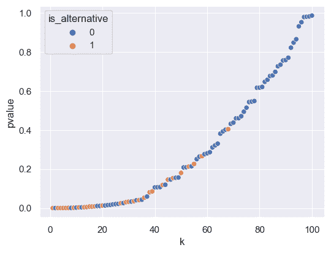
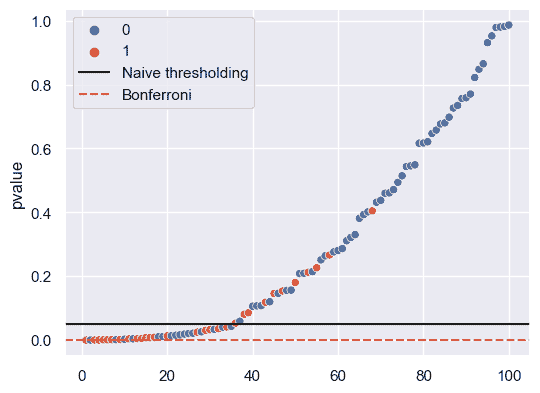
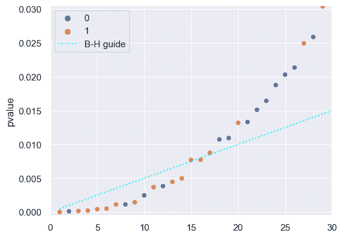
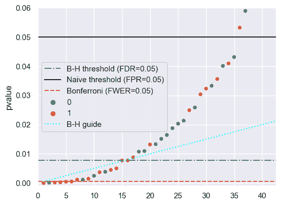

# 多重假设检验

> 原文：[`data102.org/ds-102-book/content/chapters/01/multiple-tests`](https://data102.org/ds-102-book/content/chapters/01/multiple-tests)

[<svg viewBox="0 0 24 24" fill="currentColor" aria-hidden="true" width="1.25rem" height="1.25rem" class="myst-fm-license-cc-icon myst-fm-license-cc-icon-main inline-block mx-1"><title>内容许可：Creative Commons Attribution Share Alike 4.0 国际 (CC-BY-SA-4.0)</title></svg><svg viewBox="0 0 24 24" fill="currentColor" aria-hidden="true" width="1.25rem" height="1.25rem" class="myst-fm-license-cc-icon myst-fm-license-cc-icon-by inline-block mr-1"><title>必须注明创作者</title></svg><svg viewBox="0 0 24 24" fill="currentColor" aria-hidden="true" width="1.25rem" height="1.25rem" class="myst-fm-license-cc-icon myst-fm-license-cc-icon-sa inline-block mr-1"><title>改编必须以相同条款共享</title></svg>](https://creativecommons.org/licenses/by-sa/4.0/)[](https://github.com/ds-102/ds-102-book "GitHub 仓库：ds-102/ds-102-book")[](https://github.com/ds-102/ds-102-book/edit/main/ds-102-book/content/chapters/01/03_multiple_tests.ipynb "编辑此页")笔记本单元

```py
import numpy as np
import pandas as pd
import matplotlib.pyplot as plt
import seaborn as sns

%matplotlib inline

sns.set()  # This helps make our plots look nicer

# These make our figures bigger
plt.rcParams['figure.figsize'] = (6, 4.5)
plt.rcParams['figure.dpi'] = 100 
```

## 多重检验与复制危机

到目前为止，我们已经讨论了在评估单个假设检验时，如何考虑假阳性率（FPR）和真阳性率（TPR，或功效）。我们了解到，在使用传统的零假设显著性检验（NHST）框架时，我们选择一个 p 值阈值，这是我们每个测试的 FPR。如果我们选择一个简单的备择假设，我们可以通过查看在该简单备择假设下做出发现的概率来计算 TPR（即，在我们的测试统计量超过决策阈值的情况下，该简单备择假设的概率）。

但在很多情况下，仅仅控制假阳性率可能不足以达到我们期望的错误水平。为了帮助说明这一点，我们将考虑三位研究人员进行假设性研究，研究人们每年吃多少黄油和每年读多少本书之间的关联：

+   研究员纳特进行了一次测试，观察了美国所有个人的随机样本。

+   研究员斯坦进行了五十次测试，观察了来自美国每个州的五十个随机样本。

+   研究员科林进行了 3,244 次测试，观察了来自美国每个县的 3,244 个随机样本。

假设他们三人都使用 0.05 的 p 值阈值：这意味着他们发现假阳性的概率只有 $5\%$。此外，由于研究的前提有些荒谬，我们可以安全地假设*在每次测试中，零假设都是正确的*：换句话说，黄油消费与阅读书籍之间没有相关性。如果是这样，每个人预期的假阳性数量是多少？

每位研究人员发现的假阳性数量是一个参数为 $p=0.05$ 且 $n \in \{1, 50, 3244\}$ 的伯努利随机变量，具体取决于研究人员。因此，预期的假阳性数量是 $np$：

+   内特预期的假阳性数量是 $0.05 \times 1 = 0.05$：这非常接近 0。

+   斯坦预期的假阳性数量是 $0.05 \times 50 = 2.5$.5：换句话说，即使零假设为真，斯坦也应该预期有 2-3 个州被误判为假阳性。

+   科林预期的假阳性数量是 $0.05 \times 3244 = 162.2$：科林应该预期平均有 162 个县被误判为假阳性。

这些假阳性可能会产生严重影响！如果斯坦的研究在新闻报道中被处理不当，可能会导致戏剧性的标题，例如“加利福尼亚和爱达荷州显示黄油消费与阅读之间存在强烈联系：小学应该提供更多黄油以提高阅读率吗？”虽然这个例子看起来有些荒谬，因为很明显这些关联是虚假的，但研究人员使用不良的统计实践时这种情况经常发生。

一个 0.05 的 p 值阈值意味着，当零假设为真时，我们应预期在$5\%$ 的时间里，我们会错误地做出一个发现。当进行大量测试时，这种情况会累积起来。

当研究人员决定要测试哪些关联时，这个问题经常会发生。例如，一个研究人员可能对维生素 D 补充剂对整体健康的影响感兴趣。如果对数据的初步分析没有返回结果，研究人员可能会尝试看看这些效果是否对不同性别的人不同。如果这也找不到结果，研究人员可能会认为维生素 D 从阳光中的吸收取决于皮肤中的黑色素，所以他们可能会查看所有六种不同的[Fitzpatrick 皮肤类型](https://en.wikipedia.org/wiki/Fitzpatrick_scale)的效果。在这个时候，在可能是一个相当无害的测试序列中，研究人员已经进行了 9 个不同的测试，至少出现一个假阳性的概率是$~1 - \left(1-0.05\right)⁹ \approx 0.37$。

### 多重测试的不同方法

我们已经看到，当我们在一个固定的$p$ 值阈值下进行多次假设检验时，我们可以控制每个测试的 FPR，但我们不一定能控制多次测试中犯错误的速率。为了解决这个问题，我们将定义涉及我们进行的所有测试的错误率，并找到控制这些错误率的算法。我们将让$m$ 表示假设检验的次数，并定义两个错误率：

+   **家族错误率（FWER）**是任何一次$m$ 次测试导致假阳性的概率。

+   **假发现率（FDR）**是对于$m$ 次测试的假发现比例（FDP）的期望值。

我们将探讨两种算法，这些算法可以应用于从所有$m$ 次测试中获得的$p$ 值：Bonferroni 校正，它控制 FWER，以及 Benjamini-Hochberg 过程，它控制 FDR。在这里，“控制”意味着我们保证错误率将低于我们选择的某个值。一旦我们描述了这些算法，我们将讨论两种算法之间的权衡，以及这些权衡如何与两种错误率的固有属性相关。

```py
# NO CODE

# VIDEO: B-H Algorithm Overview and Example
from IPython.display import YouTubeVideo
YouTubeVideo('6BrafO72h_w')
```

加载中...

```py
# NO CODE

# VIDEO: B-H Algorithm Overview and Example
from IPython.display import YouTubeVideo
YouTubeVideo('ILLMDQkQl9A')
```

加载中...

## 随机性、FWER、FDR 和 FDP

到目前为止，我们主要关注的是**假发现比例**（FDP）。从现在开始，我们将更多地关注**假发现率**（FDR），因此理解这两者之间的区别很重要。在本节中，我们将采用频率主义方法，并假设我们的数据是随机的（而且因为我们的决策是基于我们的数据，所以它们也是随机的），现实是固定且未知的。

+   FDP 是我们为任何特定数据集获得的价值：我们获得数据，做出一系列决策，然后假发现比例是基于那些特定决策的。

+   FDR 是 FDP 的期望值，这里的期望值是对数据中的随机性进行取值。换句话说，FDR 是平均 FDP，平均所有可能的数据集（并按每个数据集的可能性进行加权）。

+   类似地，对于任何特定的数据集，我们可以定义事件“至少发生了一个假阳性”。对于任何一系列决策，这个事件要么发生，要么不发生。家族错误率（FWER）是对于任何数据集该事件发生的概率。

换句话说，**假发现比例**是基于任何特定的数据集，而**假发现率**是所有可能数据集的平均 FDP。

### 已知与未知

在本节中，我们将讨论 FDP、FDR 和 FWER 作为评估决策过程的指标。但请记住，在现实中，我们只能观察到数据和基于数据的决策：现实对我们来说是未知的。这意味着在许多现实世界的场景中，我们实际上无法计算任何特定一系列决策的 FDP，因为这需要我们知道何时$R=0$ 和何时$R=1$。

因此，如果我们实际上无法计算 FDP，我们为什么要分析它？

关键在于 FDR（平均 FDP）提供了一种评估算法的方法。我们将讨论几个程序，并表明平均而言，它们的性能良好：换句话说，如果我们观察这些程序在数据随机性上的平均性能，我们可以从数学上证明 FDR 或 FWER 将低于某个特定水平。例如，我们将研究一个称为 Bonferroni correction 的程序，并表明如果我们使用它，我们的 FWER，即做出错误阳性的概率，将低于我们特定指定的某个阈值。

这个过程，首先定义在观测数据上操作以做出决策的算法，然后使用依赖于未知变量的指标来理论上评估这些算法，是我们将在整个课程中反复看到的东西。

```py
# NO CODE

# VIDEO: B-H Algorithm Overview and Example
from IPython.display import YouTubeVideo
YouTubeVideo('G9EYjVfLLBU')
```

加载中...

## Bonferroni correction

Bonferroni correction 是一种控制 FWER 的技术。在这个上下文中，当我们使用“**控制**”FWER 在水平α时，这仅仅意味着我们希望 FWER 低于或等于我们选择的某个值α。

该程序本身非常简单：它指出，如果我们想保证我们的 m 个测试的 FWER（家庭错误率）小于或等于α，那么我们只需要使用一个 p 值阈值为α/m 来对每个测试做出决策。例如，如果我们想保证 500 个测试的 FWER 为 0.01，那么我们应该为每个测试使用 p 值阈值为 0.01/5000=2×10−6。

让我们展示为什么这个公式是有效的。我们首先将建立一些我们需要的事实和定义。

首先，我们需要使用[并集不等式](https://en.wikipedia.org/wiki/Boole%27s_inequality)，它指出对于事件$A_1, \ldots, A_m$A1​,…,Am​，有

$P\left(\bigcup_{i=1}^m A_i\right) \leq \sum_{i=1}^m P(A_i).\right.$ (1)

非正式地说，这意味着如果我们把事件发生的独立概率相加，结果总是大于或等于这些事件并集的概率。直观上，这是正确的，因为在计算并集的概率时，我们必须有效地减去概率之间的重叠部分。

要使用并集界，我们将定义指示变量 $T_1, \ldots, T_m$​，其中 $T_i$Ti​ 是测试 $i$ 结果为假阳性的事件。家族错误率是任何一项测试为假阳性的概率：换句话说，$FWER = P(T_1 \cup T_2 \cup T_3 \cdots \cup T_m)$. 我们从上一节知道，如果我们为每个测试使用相同的 $p$-值阈值 $\gamma$，那么 $P(T_i) = \gamma$.

将所有内容综合起来，我们有：

$\begin{align*} FWER &= P\left(\bigcup_{i=1}^m T_i\right) \\ &\leq \sum_{i=1}^m P\left(T_i\right) \\ &= m \gamma \end{align*}$ (2)

如果我们选择每个测试的 $p$ 值阈值 $\gamma$ 等于 $\alpha/m$m（记住 $\alpha$ 是我们想要的 FWER），那么右侧就变成了 $\alpha$，我们就能保证我们的 FWER 小于或等于 $\alpha$。

```py
# NO CODE

# VIDEO: B-H Algorithm Overview and Example
from IPython.display import YouTubeVideo
YouTubeVideo('zwydh-K6Sc4')
```

加载中...

## 控制 FDR

### 为什么控制 FDR 而不是 FWER？

假设我们进行 1,000,000 次测试，并希望将 FWER 控制在 0.01 的水平。如果我们使用 Bonferroni 方法，我们的 $p$ 值阈值将是 10^(-8)：只有当 $p$ 值极其小的时候，我们才会做出发现！这是因为 FWER 是一个非常严格的标准。控制 FWER 意味着我们要确保在 $m$ 次测试中产生任何假阳性的概率小于或等于 $\alpha$：随着 $m$ 的增大，这个要求变得越来越难以满足。这就是为什么随着 $m$ 的增加，Bonferroni 校正的 p 值阈值会变得越来越小。

另一方面，控制 FDR 对少量错误更为宽容。在我们上面的例子中，在 0.01 水平上控制 FDR 意味着在我们做出的发现中，我们希望 1% 或更少的它们是错误的。这仍然比我们通过简单阈值化看到的只控制 FPR 更为严格，但随着 m 的增长，它更容易满足，而不需要施加如此极端低的 $p$-value 阈值。接下来，我们将看到一个达到这个中间点的算法。

### Benjamini-Hochberg 程序

Benjamini-Hochberg (通常简称为 B-H) 程序比 Bonferroni 校正稍微复杂一些，但它也使用相同的 $p$-value 阈值对所有测试。关键是，我们使用 $p$-values 本身来确定阈值。以下是它的工作原理，对于一个期望的 FDR $\alpha$:

+   首先，对 $p$-values 进行排序，并按 $k$ (即，第一个对应于 $k=1$，第二个对应于 $k=2$，以此类推，直到最后一个对应于 $k=m$)

+   对于每个排序的$p$ 值，将其与值$\frac{k\alpha}{m}$mkα比较（即，最小的 p 值与$\alpha/m$ 比较，第二小的与$2\alpha/m$ 比较，以此类推，直到最大的与$\alpha$比较）

+   找到仍然低于其比较值的最大的排序$p$ 值

+   使用该$p$ 值作为阈值

```py
# NO CODE

# VIDEO: B-H Algorithm Overview and Example
from IPython.display import YouTubeVideo
YouTubeVideo('w1yZTe7X1JM')
```

加载中...

## Naive 阈值、Bonferroni 和 Benjamini-Hochberg 的视觉比较

考虑我们在上一节中查看的$p$ 值。我们将添加一列`k`，它提供排序后的索引：

```py
p_sorted = pd.read_csv('p_values.csv').sort_values('pvalue')

m = len(p_sorted)  # number of tests
k = np.arange(1, m+1)  # index of each test in sorted order

p_sorted['k'] = k 
p_sorted
```

加载中...

我们可以按顺序可视化$p$ 值：

```py
sns.scatterplot(p_sorted, x='k', y='pvalue', hue='is_alternative');
```



在这里，$x$ 轴是$k$，即索引，而$y$ 轴表示$p$ 值。我们可以可视化两种技术的结果：

+   如果我们为所有测试使用 0.05 的朴素$p$ 值阈值，我们将获得 0.05 的 FPR。这个阈值是下面的黑线。

+   如果我们使用 Bonferroni 校正并希望得到 0.05 的 FWER（即，做出任何假阳性的概率为 0.05），那么我们应该使用一个$p$ 值阈值为$\frac{0.05}{100} = 0.0005$。这个阈值是下面的红色虚线。

我们可以看到，通过使用更保守的 Bonferroni 阈值（红色），我们留下了

```py
desired_fwer = 0.05
sns.scatterplot(x=k, y=p_sorted['pvalue'], hue=p_sorted['is_alternative'])
plt.axhline(0.05, label='Naive thresholding', color='black')
plt.axhline(desired_fwer / m, label='Bonferroni', color='tab:red', ls='--')

plt.legend();
```



在这个可视化中，Benjamini-Hochberg 过程是如何工作的？我们比较每个$p$ 值与比较值$\frac{k\alpha}{m}$​，在这个可视化中是一个对角线。为了更好地看到正在发生的事情，我们还将放大一个更窄范围的$p$ 值：

```py
desired_fdr = 0.05
sns.scatterplot(x=k, y=p_sorted['pvalue'], hue=p_sorted['is_alternative'])
plt.plot(k, k/m * desired_fdr, label='B-H guide', color='cyan', ls=':')
plt.axis([-0.05, 30, -0.0005, 0.0305])
plt.legend();
```



Benjamini-Hochberg 过程建议取小于比较值$\frac{k\alpha}{m}$​的最大$p$ 值：在这种情况下，那就是索引 16 的点。这成为我们的$p$ 值阈值，因此我们选择拒绝前 16 个$p$ 值（排序后）。下面的图表显示了所有三个阈值：

```py
desired_fdr = 0.05
desired_fwer = 0.05

# From visually inspecting the graph above, we saw that the 16th
#  p-value was the last one below the reference value (cyan line)
bh_threshold = p_sorted.loc[p_sorted['k'] == 16, 'pvalue'].iloc[0]

plt.axhline(
    bh_threshold, label=f'B-H threshold (FDR={desired_fdr})', color='tab:green', ls='-.'
)
plt.axhline(
    0.05, label='Naive threshold (FPR=0.05)', color='black', ls='-'
)
plt.axhline(
    desired_fwer / m, label=f'Bonferroni (FWER={desired_fwer})', color='tab:red', ls='--'
)

sns.scatterplot(x=k, y=p_sorted['pvalue'], hue=p_sorted['is_alternative'])
plt.plot(k, k/m * desired_fdr, label='B-H guide', color='cyan', ls=':')
plt.axis([-0.05, 42.5, -0.001, 0.06])
plt.legend();
```



### （可选）为什么 Benjamini-Hochberg 可以控制 FDR？

*文本即将到来：请看视频*

```py
# NO CODE

# VIDEO: B-H Proof Sketch
from IPython.display import YouTubeVideo
YouTubeVideo('e10W3lJsBhc')
```

加载中...

## 比较和对比 FWER 和 FDR

现在我们已经看到了如何控制 FWER 和 FDR，我们将更好地理解在特定问题中何时每个可能更适合。回顾定义：

+   家族错误率（FWER）是任何测试中出现假阳性的概率。

+   假发现率（FDR）是预期的 FDP，或者说，是预期的不正确发现的比率。

假设我们进行了 100 万个测试（$m=1000000$）。

如果我们希望 FWER 为 0.05，这意味着我们希望 100 万个测试中任何一个测试为假阳性的概率不超过 0.05。为了控制这个概率，我们需要非常保守：毕竟，即使是单个假阳性也意味着我们已经失败了。换句话说，控制 FWER 要求我们非常保守，并使用非常小的$p$值阈值。这通常会导致非常低的功效，或者说真正的阳性率（TPR），因为我们的$p$值阈值如此之低，以至于我们错过了许多真正的阳性。

另一方面，如果我们希望假发现率（FDR）为 0.05，这仅仅意味着在 100 万个测试中，我们平均希望 95%或更多的发现是正确的。我们可以通过一个不那么保守的阈值来实现这一点。换句话说，当我们控制 FDR 时，我们接受一些假阳性，作为回报，我们可以实现更高的真正阳性率（即，在$R=1$)的情况下做得更好）。

这些解释如何转化为在现实世界应用中选择控制率？我们将通过两个例子来帮助说明差异。

+   考虑一种罕见疾病的医学检测，这种疾病的唯一治疗方法是危险的手术。在这种情况下，假阳性可能导致患者不必要地接受手术，使患者的生命无谓地处于危险之中，并可能引发医疗创伤。另一方面，假阴性虽然由于缺乏治疗可能仍然具有潜在危害，但可能没有这么严重。在这种情况下，或者任何假阳性远比假阴性更严重的情况，控制家族错误发现率（FWER）可能是一个更好的选择，因为控制 FWER 倾向于假阴性而非假阳性。

+   考虑一个对进行大量 A/B 测试以衡量各种网站更改是否提高购物者购买产品机会感兴趣的在线零售商。在这种情况下，假阳性的危害并不特别严重，我们可能能够容忍我们的发现中有 5%是错误的，尤其是如果这意味着有更好的机会找到能增加产品购买的机会。

注意，这两个例子都有点模糊！在第一个例子中，假阴性的成本强烈取决于治疗如何改善该条件患者的预后，是否存在后续测试等因素。同样，在第二个例子中，如果网站更改有辅助成本（开发者为进行更改所花费的时间和金钱，以及基于更改的用户对网站的看法变化等），那么这可能会影响我们是否可能更喜欢其中一个。

```py
# NO CODE

# VIDEO: B-H Proof Sketch
from IPython.display import YouTubeVideo
YouTubeVideo('hD6zX8zZU_A')
```

加载中...
