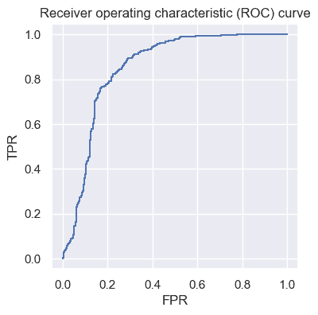
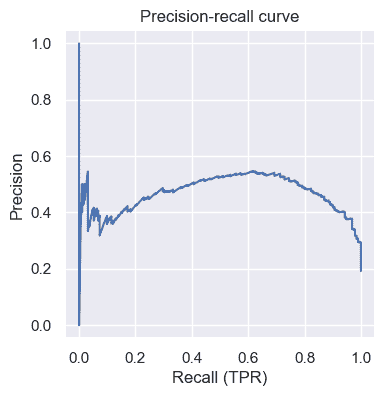

# 二元分类

> 原文：[`data102.org/ds-102-book/content/chapters/01/binary-classification`](https://data102.org/ds-102-book/content/chapters/01/binary-classification)

[<svg viewBox="0 0 24 24" fill="currentColor" aria-hidden="true" width="1.25rem" height="1.25rem" class="myst-fm-license-cc-icon myst-fm-license-cc-icon-main inline-block mx-1"><title>内容许可：Creative Commons Attribution Share Alike 4.0 国际 (CC-BY-SA-4.0)</title></svg><svg viewBox="0 0 24 24" fill="currentColor" aria-hidden="true" width="1.25rem" height="1.25rem" class="myst-fm-license-cc-icon myst-fm-license-cc-icon-by inline-block mr-1"><title>必须提及创作者</title></svg><svg viewBox="0 0 24 24" fill="currentColor" aria-hidden="true" width="1.25rem" height="1.25rem" class="myst-fm-license-cc-icon myst-fm-license-cc-icon-sa inline-block mr-1"><title>改编必须以相同条款共享</title></svg>](https://creativecommons.org/licenses/by-sa/4.0/)[](https://github.com/ds-102/ds-102-book "GitHub 仓库：ds-102/ds-102-book")[](https://github.com/ds-102/ds-102-book/edit/main/ds-102-book/content/chapters/01/04_binary_classification.ipynb "编辑此页")

```py
import numpy as np
import pandas as pd
from sklearn.metrics import confusion_matrix, roc_curve, precision_recall_curve

%matplotlib inline

import matplotlib.pyplot as plt
import seaborn as sns
sns.set()
```

# 二元分类

在二元分类中，就像上一节一样，我们也在尝试做出二元决策。一个关键的区别是，我们不是使用假设检验的语言，而是使用机器学习和分类的语言：我们有数据点，我们试图将它们分类为属于两个组中的一个，我们可以（不失一般性）称它们为类别 0 和类别 1。

在假设检验中，我们使用$p$ 值来做决策，这些 p 值捕捉了在给定数据的情况下，我们的数据在某个零假设下被观察到的概率。在二元分类中，我们感兴趣的是在给定数据的情况下，我们的数据在类别 0 或类别 1 下被观察到的概率。大多数分类算法都会给出一些任意数。这些数字通常，但不总是，介于 0 和 1 之间，在这种情况下，我们可以将它们解释为属于类别 1 的概率。我们通常将一个阈值应用到这个数字上，以获得二元决策。

例如，逻辑回归产生概率：对于一个特定的数据点，逻辑回归分类器可能会预测它有 0.7 的概率属于类别 1。我们应用一些阈值（通常是，但不总是 0.5）：如果我们的值高于阈值（就像这个例子一样），我们做出决策 1；否则，我们做出决策 0。

虽然在二元分类中获取决策的机制不同，但我们之前几节学到的重大思想仍然同样相关：特别是，我们可以通过理解行内和列内错误率来考虑涉及的权衡。在二元分类中，我们主要通过两种可视化来可视化和分析这些错误率：接收者操作特征（ROC）曲线和精确率-召回率曲线。

## ROC 曲线：权衡行内率

ROC 曲线帮助我们可视化不同**行内率**之间的权衡。让我们用一个例子来具体说明。假设一家制造公司训练了一个分类器，该分类器使用计算机视觉（例如，一个视觉转换器）来预测其装配线上的每个产品是否为缺陷（1）或非缺陷（0）。他们在保留的测试集上获得了以下结果：

```py
defects = pd.read_csv('manufacturing.csv')
defects.head()
```

加载中...

```py
def formatted_confusion_matrix(y_true, y_pred):
    return pd.DataFrame(
        data=confusion_matrix(y_true, y_pred),
        index=['R=0', 'R=1'],
        columns=['D=0', 'D=1']
    )
```

```py
formatted_confusion_matrix(defects['is_defective'], defects['predicted_prob'] > 0.5)
```

加载中...

```py
formatted_confusion_matrix(defects['is_defective'], defects['predicted_prob'] > 0.2)
```

加载中...

就像之前一样，我们可以看到行内率之间的相同权衡：随着我们的 TPR 增加（即我们更好地捕捉到有缺陷的产品），我们的 FPR 也会增加（即我们对非缺陷产品的处理变得更差）。上面的例子显示了权衡中的两个点，但对于每个不同的可能阈值值都存在这样一个点。我们不必为每个阈值计算和手动审查混淆矩阵，而是可以通过使用`scikit-learn`中的`roc_curve`函数来可视化与每个可能阈值相关的 TPR 和 FPR：

```py
fprs, tprs, thresholds_roc = roc_curve(defects['is_defective'], defects['predicted_prob'])

f, ax = plt.subplots(1, 1, figsize=(4, 4))
ax.plot(fprs, tprs)
ax.set_xlabel('FPR')
ax.set_ylabel('TPR')
ax.axis('equal')
ax.set_title('Receiver operating characteristic (ROC) curve');
```



图上的每个点代表一个阈值。例如，大约在(0.2, 0.8)处的点告诉我们，如果我们选择那个特定的阈值值，我们将实现 0.2 的假阳性率和 0.8 的真正阳性率。

如果那个 FPR 过高，我们可以选择一个大约在(0.1, 0.4)处的阈值。这告诉我们，如果我们想要更小的 FPR 为 0.1，我们必须接受一个远低于 0.1 的 TPR。

这为我们提供了一种清晰可视化涉及权衡的方法，至少就行内率而言。

**练习**：编写代码以找到给我们一个尽可能接近 0.2 的 FPR 的阈值值。*提示：使用`thresholds_roc`数组*。

### 精确率-召回率曲线和列内率

我们在前面几节中看到，仅靠行率并不能告诉我们整个故事！我们看到，在患病率低的情况下，即使我们有相对较高的行率，我们的列率也可能相当低。在这个例子中，阈值为 0.5 导致 TPR 和 TNR 接近 0.8（即，我们的算法对缺陷产品的准确率约为$80\%$，对非缺陷产品的准确率也约为$80\%$），但预测“有缺陷”的错误率将超过一半！

```py
display(formatted_confusion_matrix(defects['is_defective'], defects['predicted_prob'] > 0.5))
print(156/(36+156), 641/(167+641))
```

加载中...

```py
0.8125 0.7933168316831684 
```

正如 ROC 曲线绘制了真正例率与假正例率的关系一样，精确度-召回率曲线绘制了精确度与召回率的关系。

记住之前提到的**精确度**是 FDP 的补数：换句话说，它描述了当我们做出$D=1$ 的决定时，或者在这种情况下，当分类器将产品标记为缺陷时，我们做得有多好。**召回率**只是真正例率的另一个术语（我们也将它称为功率和灵敏度）。绘制这两个指标有助于我们理解行率和列率之间的权衡。让我们看看上面的例子是什么样的：

```py
precisions, recalls, thresholds_pr = precision_recall_curve(defects['is_defective'], defects['predicted_prob'])

f, ax = plt.subplots(1, 1, figsize=(4, 4))
ax.plot(recalls, precisions)
ax.set_xlabel('Recall (TPR)')
ax.set_ylabel('Precision')
ax.axis('equal')
ax.set_title('Precision-recall curve');
```



我们可以看到，这告诉我们一个互补的故事。我们可以看到，曲线的左侧非常嘈杂，在中间，随着召回率的提高，精确度提高到约 0.55，然后开始迅速下降，对于召回率更高的值。这意味着什么？

**练习**：解释为什么曲线的左侧看起来如此嘈杂。*提示：考虑哪种阈值会导致非常低的召回率，然后解释这种阈值是如何影响我们精确度计算中的分母的。*

**练习**：解释为什么精确度在召回率高于约 0.6 之前会随着召回率的增加而增加，然后又下降。
