# 参数估计和贝叶斯推理基础

> 原文：[`data102.org/ds-102-book/content/chapters/02/parameter-estimation`](https://data102.org/ds-102-book/content/chapters/02/parameter-estimation)

[<svg viewBox="0 0 24 24" fill="currentColor" aria-hidden="true" width="1.25rem" height="1.25rem" class="myst-fm-license-cc-icon myst-fm-license-cc-icon-main inline-block mx-1"><title>内容许可：Creative Commons Attribution Share Alike 4.0 国际 (CC-BY-SA-4.0)</title></svg><svg viewBox="0 0 24 24" fill="currentColor" aria-hidden="true" width="1.25rem" height="1.25rem" class="myst-fm-license-cc-icon myst-fm-license-cc-icon-by inline-block mr-1"><title>必须提及创作者</title></svg><svg viewBox="0 0 24 24" fill="currentColor" aria-hidden="true" width="1.25rem" height="1.25rem" class="myst-fm-license-cc-icon myst-fm-license-cc-icon-sa inline-block mr-1"><title>改编必须以相同条款共享</title></svg>](https://creativecommons.org/licenses/by-sa/4.0/)[](https://github.com/ds-102/ds-102-book "GitHub 仓库：ds-102/ds-102-book")[](https://github.com/ds-102/ds-102-book/edit/main/ds-102-book/content/chapters/02/01_parameter_estimation.ipynb "编辑此页")笔记本单元

```py
import numpy as np
import matplotlib.pyplot as plt
import seaborn as sns
from IPython.display import YouTubeVideo
sns.set()
%matplotlib inline
from scipy import stats
```

*您可能发现阅读数据 140 教科书的第二十章（[链接](http://prob140.org/textbook/content/Chapter_20/00_Approaches_to_Estimation.html)）和第二十一章（[链接](http://prob140.org/textbook/content/Chapter_21/00_The_Beta_and_the_Binomial.html)）会有所帮助，这两章提供了类似材料的另一种阐述，但它们**不是**本章的先决条件。*

我们将从一个简单的例子开始，这个例子突出了贝叶斯和频率主义方法之间的关键差异。回忆我们的设置：我们观察了一些数据 $x_1, \ldots, x_n$​，我们将使用它们来估计一些感兴趣的参数 $\theta$。在本节和接下来的几节中，我们将关注两个简单的例子，以帮助我们建立直觉：

+   **估计产品质量**： $x_1, \ldots, x_n$​ 是在线销售产品的评价（👍/1 或 👎/0），而 $\theta$ 是介于 0 和 1 之间的一个数字，代表某人留下好评的概率。直观上，$\theta$ 代表我们对产品质量的估计。

+   **估计平均身高**： $x_1, \ldots, x_n$​ 是随机样本中 $n$ 个个体的身高，而 $\theta$ 是该群体中个体的平均身高。

我们从第一个例子开始。

## 直觉和计算

假设你在寻找一款新的微波炉。你找到了两个选择，它们的价格大致相同：

+   微波 A 有三个正面评价，没有负面评价

+   微波 B 有 19 个正面评价和 1 个负面评价

你应该买哪一个？

直观上，并不一定有正确或错误的答案。但在这种情况下，大多数购物者可能会更倾向于购买微波 B。看到更多的数据点，即使有一个是负面的，也能让我们确信我们在评价中看到的结果是一致的。

我们将从频率派和贝叶斯派的角度计算性地处理这个问题，并看看每个方法如何很好地结合上述直觉。

当制定一个统计模型（无论选择贝叶斯派还是频率派方法）时，选择一个模型非常重要，以确保我们估计的参数满足以下标准：

+   参数应该反映我们感兴趣估计的潜在数量。在这种情况下，我们将使用 $\theta$ 来量化每款微波炉的“好”程度，然后我们可以简单地选择“更好”的微波炉（即具有更高 $\theta$ 值的微波炉）。我们上面的选择，留下正面评价的概率，满足这个条件，因为更好的产品应该比更差的产品更有可能获得正面评价。

+   参数应该清楚地符合我们的概率模型：换句话说，我们的概率模型应该将观测数据与参数联系起来。我们很快就会看到这是如何工作的。

我们的目标将是根据观测数据 $x_1, \ldots, x_n$ ​来估计和得出关于参数 $\theta$的结论。

```py
# NO CODE

# VIDEO
YouTubeVideo('P501SLnYtIE')
```

## 频率派参数估计：最大似然

在我们实际上进行任何参数估计之前，我们首先需要指定相关的概率分布。回想一下，在频率派设定中，我们假设数据（我们的二元评论，$x_1, \ldots, x_n$​）是随机的，但参数（生成正面评论的概率 $\theta$）是固定且未知的。

在频率派设定中建立概率模型，我们需要的只是一个**似然函数** $p(x_i|\theta)$。这告诉我们，在给定的$\theta$值下，数据点出现的可能性。由于我们的数据是二元的，而参数是介于 0 和 1 之间的一个数字，一个自然的选择是**伯努利分布**（有关伯努利分布的更多信息，请参阅[数据 140 教科书](http://prob140.org/textbook/content/Chapter_03/02_Distributions.html#named-distributions)或[维基百科](https://en.wikipedia.org/wiki/Bernoulli_distribution))：

$x_i | \theta \sim \mathrm{Bernoulli}(\theta)$xi​∣θ∼Bernoulli(θ)(1)

这种符号表示“在$\theta$的条件下，$x_i$​遵循参数为$\theta$的伯努利分布”。换句话说：

$p(x_i|\theta) = \begin{cases} \theta & \text{ if }x_i = 1 \\ 1-\theta & \text{ if }x_i = 0 \end{cases}$ ​(2)

```py
from IPython.display import YouTubeVideo
YouTubeVideo('ur6V1UyKChY')
```

加载中...

虽然基础概率对你来说应该很熟悉，但我们已经进行了一些重要的概念跳跃：

+   这种符号表示一个**参数族**分布：不同的$\theta$值会导致$x_i$​的不同分布，但它们都属于伯努利分布族。

+   由于我们在这个过程中旨在通过观察到的数据$x_i$​找到“良好”的$\theta$值，我们可以将其视为一个关于$\theta$的函数：对于任何我们考虑的$\theta$值，我们可以将我们的数据代入并得到如果该值是真实的，观察它的概率。

在频率主义设定中，估计$\theta$的最简单方法是使用**最大似然估计（MLE**）并选择使$\theta$最大化的值：换句话说，我们将选择使我们的数据看起来尽可能可能性的$\theta$的值。

我们将这样进行：

1.  我们将写出所有数据点的似然，$x_1, \ldots, x_n$（我们已经在上面为单个点做了这件事）

1.  我们将使用对数似然而不是似然。这会使计算稍微容易一些。为什么这是可以接受的？因为$\log$对数是一个单调递增函数，所以最大化$\log(p(x|\theta))$的相同$\theta$值也最大化了$p(x|\theta)$。

1.  为了找到$\theta$的最佳值，我们将对对数似然相对于$\theta$的导数进行求导，将其设置为 0，并求解。

1.  我们将通过计算二阶导数并确认其为负值，以及检查边界来确认第 3 步给出了最大值（而不是最小值）。

### 1. 编写似然 

我们所有数据点的似然是：

$p(x_1, \ldots, x_n | \theta)$ (3)

我们假设我们的样本在参数$\theta$的条件下是条件独立同分布的（i.i.d.）。在我们的例子中，这意味着如果我们知道产品的质量如何，那么知道一条评论并不会告诉我们关于其他评论的任何信息。这意味着我们可以简化我们的似然函数：

$\begin{align} p(x_1, \ldots, x_n|\theta) &= \prod_{i=1}^n p(x_i|\theta) \end{align}$ (4)

接下来，我们需要找出一种更便于数学表达的方式来书写单个点的似然函数，即$p(x_i|\theta)$，比我们在上一节中写的那一种版本更方便。这里有一个表达相同意思的替代方法：

$p(x_i|\theta) = \theta^{x_i}(1-\theta)^{1-x_i}$ ​(5)

通过将$x_i=1$ 和$x_i=0$ 代入，来让自己相信这是相同的。

现在我们有了这种便于书写的表达方式，当我们把它们全部相乘时，指数会相加：

$\begin{align} p(x_1, \ldots, x_n|\theta) &= \prod_{i=1}^n p(x_i|\theta) \\ &= \prod_{i=1}^n \theta^{x_i}(1-\theta)^{1-x_i} \\ &= \theta^{\left[\sum_i x_i\right]}(1-\theta)^{\left[\sum_i (1-x_i)\right]} \\ \end{align}$ (6)

第一个指数简单表示正面评价的数量，第二个指数简单表示负面评价的数量。为了简化我们的表达式，我们将 **将 $k$ 定义为正面评价的数量** $\left(k = \sum_i x_i\right)$，因此表达式变为：

$\begin{align} p(x_1, \ldots, x_n|\theta) &= \theta^{k}(1-\theta)^{n-k} \\ \end{align}$ ​(7)

### 2. 取对数

$\begin{align} \log p(x_1, \ldots, x_n|\theta) &= k\log\theta + (n-k)\log(1-\theta) \end{align}$ ​​(8)

### 3. 最大化

$\begin{align} \frac{d}{d\theta} \log p(x_1, \ldots, x_n|\theta) &= 0 \\ \frac{d}{d\theta} \left[k\log\theta + (n-k)\log(1-\theta)\right] &= 0 \\ \frac{k}{\theta} - \frac{n-k}{1-\theta} &= 0 \\ \theta &= \frac{k}{n} \end{align}$ (9)

最后，我们得到了伯努利似然的最大似然估计：它仅仅是总评论中正面评论的比例。这是一个非常直观的结果！

在这一点上，我们可以看到为什么我们选择使用对数似然：相对于从步骤 1 的表达式求导，从步骤 2 的表达式求导更容易（如果你需要，可以通过计算导数来让自己相信这是真的）。

### 4. 验证最大值

$\begin{align} \frac{d²}{d\theta²} \log p(x_1, \ldots, x_n|\theta) &= \frac{d}{d\theta} \left[\frac{k}{\theta} - \frac{n-k}{1-\theta}\right]\\ &= -\frac{k}{\theta²} - \frac{n-k}{(1-\theta)²}\\ &< 0, \end{align}$ (10)

其中最后一个陈述是正确的，因为$n$，$k$，和$\theta$都是正数，并且$n \geq k$。

在许多情况下，检查边界值也可能是必要的，特别是如果似然函数在可能的θ值范围内单调递增或递减时。

### 应用最大似然估计

让我们回到我们比较微波 A 和 B 的例子。如果我们对每个都应用最大似然估计，我们得到$\hat{\theta}_{A, \text{MLE}} = 3/3 = 1$ 和$\hat{\theta}_{B,\text{MLE}} = 19/20 = 0.95$：换句话说，最大似然估计告诉我们微波 A 是更好的选择。

换句话说，使“只有 3 条正面评价”尽可能可能发生的$\theta$的值是$\theta=1$。同样，使“19 条正面评价和 1 条负面评价”尽可能可能发生的$\theta$的值是$\theta=0.95$。

```py
# NO CODE

# VIDEO
from IPython.display import YouTubeVideo
YouTubeVideo('W5Dq3VReuuQ') 
```

## 另一种方法：贝叶斯推理

在贝叶斯框架下，我们将假设未知参数$\theta$是一个随机变量。现在，我们不再寻找单个估计值，而是考虑在观察数据$x$ 之后$\theta$的概率分布。这是条件分布$p(\theta|x)$，我们称之为**后验分布**。在本章的其余部分，我们将学习如何计算和解释这个分布。它代表了我们看到数据$x$ 后对$\theta$中的随机性的理解。我们将使用贝叶斯定理来计算它：

$\begin{align} \underbrace{p(\theta|x)}_{\text{后验}} &= \frac{\overbrace{p(x|\theta)}^{\text{似然}}\,\, \overbrace{p(\theta)}^{\text{先验}}}{p(x)} \end{align}$ ​​(11)

在上一节中，当我们建立概率模型时，我们选择了一个描述我们的参数 $\theta$ 和我们的数据 $x$ 之间关系的似然函数。在贝叶斯公式中，我们还需要选择另一件事：一个 **先验** $p(\theta)$，它代表在我们看到任何数据之前对 $\theta$ 的信念。通常，我们会根据领域知识或计算便利性来选择先验：我们将在下一节中看到一些这方面的例子。

注意，我们可以将这里的分母视为常数，因为 $p(\theta|x)$p(θ∣x) 是关于 $\theta$ 的一个分布，而分母 $p(x)$ 不依赖于 $\theta$。因此，我们通常将后验分布写成以下形式（回想一下，符号 $\propto$ 表示“成比例于”）：

$\begin{align} p(\theta|x) &\propto p(x|\theta)p(\theta) \end{align}$ (12)

1.  一旦我们得到了后验分布 $p(\theta|x)$，我们如何使用它来选择一个单一的值 $\theta$ 作为我们的估计值？

我们将在下一节回答这两个问题。

```py
YouTubeVideo('p1lLJg98j-8')
```

### 选择先验分布：Beta 分布</mo></mrow>$p(\theta)$p(θ)，它代表我们在看到任何数据之前对未知产品质量的信念$\theta$，我们将选择[贝塔分布](https://en.wikipedia.org/wiki/Beta_distribution)。这并不是我们唯一可以选择的分布，但它恰好是一个特别方便的选择：我们稍后会看到原因。贝塔分布有两个参数，$\alpha$和$\beta$。它定义为：

$p(\theta) \propto \theta^{\alpha-1} (1-\theta)^{\beta-1}$ (13)

归一化常数相当复杂，但使用贝塔分布我们不需要知道它是什么。由于这是一个研究得很好的分布，我们可以通过查阅找到我们需要的任何关于它的信息。试着自己做一下：不进行任何计算，贝塔分布随机变量的期望值是多少？众数是什么？

#### 归一化贝塔分布（可选）

我们如何计算这个分布的归一化常数呢？我们知道上面的公式缺少一个比例常数，我们将称之为$Z$：

$p(\theta) = \frac{1}{Z} \theta^{\alpha-1} (1-\theta)^{\beta-1}$ (14)

我们需要求解$Z$。作为一个概率密度函数（PDF），我们知道分布$p(\theta)$应该积分到 1。因此，

$\begin{align*} \int_0¹ \frac{1}{Z} \theta^{\alpha-1} (1-\theta)^{\beta-1} \, d\theta &= 1 \\ \int_0¹ \theta^{\alpha-1} (1-\theta)^{\beta-1} \, d\theta &= Z \end{align*}$ ​(15)

这个积分难以计算，但我们查阅得知结果是称为[贝塔函数](https://en.wikipedia.org/wiki/Beta_function)的东西。关于这个函数的细节超出了本课程的范围，但它与伽马函数（将阶乘函数扩展到非整数值）有关。

换句话说，无论$\alpha$和$\beta$的值是什么，分母总是具有相同的形式：一个贝塔函数。这就是为什么我们通常忽略它，只写出比例关系。

还要注意的是，$Z$ 不依赖于 $\theta$，但它依赖于参数 $\alpha$ 和 $\beta$。

#### 贝塔分布的直观理解

在我们计算后验分布之前，让我们先对贝塔分布的工作原理有一些直观的理解。维基百科页面（[Wikipedia page](https://en.wikipedia.org/wiki/Beta_distribution)）上有一些关于不同 $\alpha$ 和 $\beta$ 值的贝塔分布样式的有用示例。让我们看看其中的一些示例。回想一下，我们可以使用 `scipy.stats` 中的分布来计算和可视化概率密度函数（PDF）：

```py
thetas = np.linspace(0, 1, 500)
beta_11 = stats.beta.pdf(thetas, 1, 1)
beta_72 = stats.beta.pdf(thetas, 7, 2)
beta_34 = stats.beta.pdf(thetas, 3, 4)

f, ax = plt.subplots(1, 1, figsize=(5, 3))
ax.plot(thetas, beta_11, label=r'$\alpha = 1, \beta = 1$')
ax.plot(thetas, beta_34, label=r'$\alpha = 3, \beta = 4$')
ax.plot(thetas, beta_72, label=r'$\alpha = 7, \beta = 2$')
ax.legend();
```

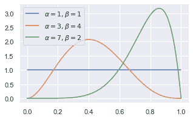

我们可以看到，参数的不同值会导致贝塔分布形状的不同。特别是，当 $\alpha$ 大于 $\beta$ 时，较大的 $\theta$ 值更有可能，反之亦然。我们还可以看到，Beta$(1, 1)$ 与在 $[0, 1]$ 上的均匀分布相同。尝试用不同的值进行实验：当 $\alpha$ 和 $\beta$ 变大时，会发生什么变化？

```py
YouTubeVideo('TAxSkVmFfg0')
```

#### 计算后验分布

现在我们已经设置了先验分布，我们可以计算后验分布：

$\begin{align} p(\theta|x) &\propto p(x|\theta)p(\theta) \\ &\propto \Bigg[\theta^{\left[\sum_i x_i\right]}(1-\theta)^{\left[\sum_i (1-x_i)\right]}\Bigg]\Big[\theta^{\alpha-1} (1-\theta)^{\beta-1}\Big] \\ &\propto \theta^{\alpha + \left[\sum_i x_i\right] - 1}(1-\theta)^{\beta + \left[\sum_i (1-x_i)\right] - 1} \end{align}$ ​​(16)

我们可以看出这也是一个贝塔分布，因为它看起来像 $\theta^{\text{stuff}-1}(1-\theta)^{\text{other stuff}-1}$. 它有参数 $\alpha + \sum_i x_i$​ 和 $\beta + \sum_i (1-x_i)$，因此我们可以将后验写成

$\theta|x \sim \mathrm{Beta}\Bigg(\alpha + \sum_i x_i\,,\,\, \beta + \sum_i (1-x_i)\Bigg)$ (17)

通过这个观察，我们避免了需要计算分母 $p(x)$!

这是因为贝塔分布是伯努利分布的**共轭先验**。这意味着每当我们有伯努利似然时，如果我们从贝塔家族中选择一个先验，那么后验分布也将属于贝塔家族。

```py
YouTubeVideo('ogpPyznMcus')
```

#### 示例：先验和后验贝塔分布

笔记本单元

```py
FIGURE_SIZE = (4.5, 3.5)
#def plot_beta_prior_and_posterior(r, s, m, y, show_map=False, show_lmse=False):
def plot_beta_prior_and_posterior(alpha, beta, pos_obs, neg_obs, show_map=False, show_lmse=False, ax=None):   
    x = np.linspace(0, 1, 100)
    prior = stats.beta.pdf(x, alpha, beta)

    alpha_new = alpha + pos_obs
    beta_new = beta + neg_obs
    posterior = stats.beta.pdf(x, alpha_new, beta_new)

    # You never have to memorize these: when making this notebook,
    # I found them on the wikipedia page for the Beta distribution:
    # https://en.wikipedia.org/wiki/Beta_distribution

    if show_lmse:
        x_lmse = (alpha_new)/(alpha_new + beta_new)
    else:
        x_lmse = None

    if show_map:
        x_map = (alpha_new - 1) / (alpha_new + beta_new - 2)
    else:
        x_map = None
    plot_prior_posterior(x, prior, posterior, (-0.02, 1.02),
                         prior_label=f'Prior: Beta({alpha}, {beta})',
                         posterior_label=f'Posterior: Beta({alpha_new}, {beta_new})',
                         x_map=x_map, x_lmse=x_lmse, ax=ax)

def plot_prior_posterior(x, prior, posterior, xlim, 
                         prior_label, posterior_label,
                         x_map=None, x_lmse=None, ax=None):

    if ax is None:
        f, ax = plt.subplots(1, 1, figsize=FIGURE_SIZE, dpi=80)
    ax.plot(x, prior, ls=':', lw=2.5, label = prior_label)
    ax.plot(x, posterior, lw=2.5, label = posterior_label)
    if x_map is not None:
        map_index = np.argmin(np.abs(x - x_map))
        posterior_map = posterior[map_index]
        label = f'MAP estimate: {x_map:0.2f}'
        ax.plot([x_map, x_map], [0, posterior_map], '--', lw=2.5, color='black', label=label)
    if x_lmse is not None:
        lmse_index = np.argmin(np.abs(x - x_lmse))
        posterior_lmse = posterior[lmse_index]
        label = f'LMSE estimate: {x_lmse:0.2f}'
        ax.plot([x_lmse, x_lmse], [0, posterior_lmse], '--', lw=1.5, color='red', label=label)
    ax.legend()
    ymax = max(max(prior[np.isfinite(prior)]), max(posterior[np.isfinite(posterior)]))
    ax.set_ylim(-0.3, ymax+0.3)
    ax.set_xlim(*xlim)
    ax.set_xlabel(r'$\theta/details>)
    ax.set_title(r'Prior $p(\theta)$ and posterior given observed data $x$: $p(\theta|x)/details>);
```

让我们可视化一些先验和后验 Beta 分布的例子。我们将使用`plot_beta_prior_and_posterior`函数，该函数接受先验参数（$a$ 和 $b$）以及正负观察的数量（$k$ 和 $n-k$），并在同一张图上显示θ的后验分布。

我们从微波 A 开始，它有 3 条正面评论和 0 条负面评论。现在，我们将探索几种不同的选择并查看结果。稍后，我们将讨论哪种先验选择可能更适合这个问题。

首先，如果我们使用 Beta(1,1)先验，会发生什么？我们之前看到这等同于均匀先验。直观上，这个先验表示在观察任何评论之前，所有θ（在 0 和 1 之间）的值应该具有相同的可能性。

```py
# Plots a beta posterior resulting from a Beta(1, 1) prior (the first two arguments) 
# and 3 positive observations and 0 negative observations (the second two arguments)
plot_beta_prior_and_posterior(1, 1, 3, 0)
```

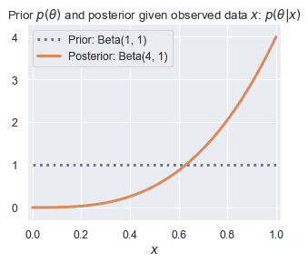

观察橙色密度，它将更高的概率分配给θ更大的值。如果我们使用不同的先验会怎样？我们将尝试 Beta(1,5)先验，这表示在观察任何评论之前，θ的较小值比较大值更有可能（即，我们在看到任何评论之前对产品质量持怀疑态度）。

```py
plot_beta_prior_and_posterior(1, 5, 3, 0)
```

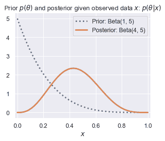

改变先验分布极大地改变了后验分布。如果我们使用一个更加“怀疑”的先验会怎样？

```py
plot_beta_prior_and_posterior(1, 10, 3, 0)
```

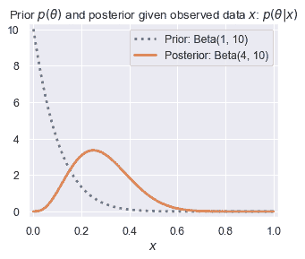

我们可以看到，对于微波 A，我们选择的先验对后验分布有显著的影响。那么对于微波 B 呢？

```py
plot_beta_prior_and_posterior(1, 1, 19, 1)
plot_beta_prior_and_posterior(1, 5, 19, 1)
plot_beta_prior_and_posterior(1, 10, 19, 1)
```

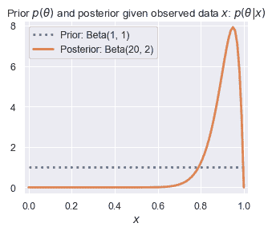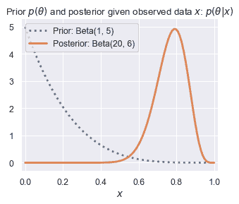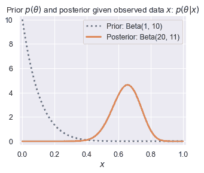

在这里，先验分布仍然对后验分布有影响：先验越“怀疑”，后验分布就越向左偏移。但是，先验分布的影响远小于微波 A 的情况。这说明了贝叶斯推理中的一个普遍趋势：**数据越少，先验分布通常对后验分布的影响越强**。

```py
YouTubeVideo('2ky2q4NldHM')
```

#### 点估计

一旦我们有了后验分布，我们通常会想要回答一个问题：我们如何使用这个分布来得到一个关于 $\theta$ 的单一估计？这个单一数字通常被称为**点估计**。

我们将针对问题 1 开始提供两个答案：**最大后验（MAP）估计**和**最小/最小均方误差（MMSE/LMSE）估计**。

**MAP 估计**是最大化后验分布的估计。记住，后验分布代表了我们对于未知参数 $\theta$ 的信念。直观地说，MAP 估计是根据这种信念最有可能的 $\theta$ 值。对于一个 Beta$(\alpha, \beta)$ 分布，我们可以查找分布的最大值（众数），发现它是 $\frac{\alpha-1}{\alpha+\beta-2}$​。

**可选练习**：推导 Beta 分布的众数。*提示：不要像之前那样对 $\theta$ 求 Beta 密度的最大值，而是先取对数。*

**LMSE 估计**是后验分布的均值。它之所以有这个名字，是因为我们可以证明后验分布的均值最小化了均方误差：

$\begin{align} \text{argmin}_a E_{p(\theta|x)}\left[(a-\theta)²\right] = E_{p(\theta|x)}\left[\theta\right] \end{align}$argmina​Ep(θ∣x)​[(a−θ)2]=Ep(θ∣x)​[θ]（18</mo></mrow>$(\alpha, \beta)$(α,β) 分布的随机变量的均值是 $\frac{\alpha}{\alpha+\beta}$α+βα​.

```py
YouTubeVideo('mx-zCxomd-8')
```

```py
YouTubeVideo('rmziJOMmlu4')
```

#### 选择先验参数$(5, 1)$，这有利于（分配更高的概率给）更大的 $\theta$ 值。在这种情况下：

+   微波 A 的质量后验是 Beta$(8, 1)$，并且最大似然估计值为 1。

+   微波 B 的质量后验是 Beta$(24, 2)$，并且最大似然估计值为 0.96。在这个先验下，微波 A 看起来更好。

但是，如果我们相信大多数产品在经过审查数据证明之前都是不好的，我们可能会选择 Beta$(1, 5)$ 先验，这有利于较小的 $\theta$ 值。在这种情况下：

+   微波 A 的质量后验分布为 Beta$(4, 5)$：如果我们计算最大似然估计，我们得到 0.43。

+   微波 B 的质量后验分布为 Beta$(20, 6)$，最大似然估计值为 0.79。因此，在这个先验下，微波 B 看起来更好。

从这里，我们可以得出结论，**我们选择先验概率往往会对我们的结果产生重大影响**。因此，选择能够反映你对世界假设和信念的先验概率非常重要，并且在分享你的结果时，要明确地与他人沟通这些假设。

### 另一种尝试：非共轭先验

为了了解为什么共轭先验如此有用，让我们看看如果我们选择不同的先验会发生什么。

假设我们选择以下先验 $p(\theta) = \frac{\pi}{2} \cos\left(\frac{\pi}{2} \theta\right), \, \theta \in [0, 1]$:

```py
thetas = np.linspace(0, 1, 500)

f, ax = plt.subplots(1, 1, figsize=(5, 3), dpi=80)
ax.plot(thetas, np.pi/2 * np.cos(thetas * np.pi/2), label=r'$\pi/2\cos(\pi \theta/2)$')
ax.set_xlabel(r'$\theta$')
ax.set_ylabel(r'$p(\theta)$')
ax.legend();
```

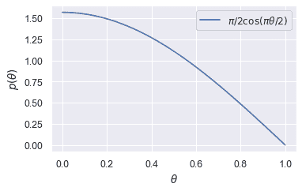

```py
np.trapz(np.pi/2 * np.cos(thetas * np.pi/2), thetas)
```

`0.9999991742330661`

我们可以尝试像之前一样计算后验概率：

$\begin{align} p(\theta|x) &\propto p(x|\theta)p(\theta) \\ &\propto \Bigg[\theta^{\left[\sum_i x_i\right]}(1-\theta)^{\left[\sum_i (1-x_i)\right]}\Bigg]\cos\left(\frac{\pi}{2}\theta\right) \end{align}$ ​​(19)

这个分布看起来要复杂得多：我们根本无法将其简化为已知的分布。此外，无法以封闭形式计算归一化常数：我们需要使用数值积分。

这使得对分布进行推理变得困难，也意味着如果我们想计算关于它的感兴趣量（例如，对于 LMSE/MAP 估计的后验的均值/众数），我们必须应用数值积分。

## 一个连续的例子：估计身高

假设现在我们感兴趣的参数 $\theta$ 是人群的平均身高，我们的数据 $x_1, \ldots, x_n$​ 是样本中个体的身高。对于这些连续数据，二项分布不再适用。我们可以选择很多种方法，但为了简单起见，我们将使用正态分布（也称为高斯分布）：

$x_i|\theta \sim \mathcal{N}(\theta, \sigma²)$ (20)

### 经验主义估计：高斯似然函数的最大似然估计

我们可以像之前一样通过类似的过程来找到高斯似然函数的最大似然估计。因为归一化常数 $\frac{1}{\sigma\sqrt{2\pi}}$​ 不依赖于 $\theta$（我们的目标是优化 $\theta$，所以我们现在先不考虑它）。

$\begin{align} p(x_i|\theta) & \frac{1}{\sigma\sqrt{2\pi}} \exp\left\{\frac{1}{2\sigma²}(x_i-\theta)²\right\} \\ p(x_1, \ldots, x_n|\theta) &= \left(\frac{1}{\sigma\sqrt{2\pi}}\right)^n \exp\left\{\sum_{i=1}^n \frac{1}{2\sigma²}(x_i-\theta)²\right\} \end{align}$ (21)

The log-likelihood is:对数似然为：

$\begin{align} \log p(x_1, \ldots, x_n|\theta) &= n\log\left(\frac{1}{\sigma\sqrt{2\pi}}\right) + \sum_{i=1}^n \frac{1}{2\sigma²}(x_i-\theta)² \end{align}$ ​​(22)

对 $\theta$ 求导并求解是直接的：

$\begin{align} \sum_{i=1}^n -\frac{1}{\sigma²}(x_i-\theta) &= 0 \\ \theta &= \frac{1}{n} \sum_i x_i \end{align}$ ​​​(23)

再次，最大似然估计（MLE）给了我们一个非常直观的答案：使数据最有可能的参数（总体高度平均值）就是样本高度的均值。注意，我们的答案并不依赖于 $\sigma$！

**练习**：假设我们感兴趣的不是总体平均数，而是总体标准差。总体标准差的 MLE 是多少？

### 高度贝叶斯推断

现在假设我们采用贝叶斯方法，并将$\theta$视为随机变量。就像之前一样，我们感兴趣的是后验分布：

$p(\theta|x_1, \ldots, x_n) = \frac{p(x_1, \ldots, x_n|\theta)p(\theta)}{p(x_1, \ldots, x_n)}$ ​(24)

由于我们感兴趣的参数也是一个连续变量，我们可以尝试使用正态分布作为先验分布：

$\theta \sim \mathcal{N}(\mu_0, \sigma_0²)$ (25)

注意，这个先验分布的参数，$\mu_0$​ 和 $\sigma_0²$​，与似然函数中的参数不同！这意味着我们的参数 $\theta$，即总体均值，遵循具有某些均值 $\mu_0$​ 和某些方差 $\sigma_0²$​ 的正态分布。

虽然代数运算稍微复杂一些，但我们可以证明正态分布是正态分布均值的共轭先验。换句话说，θ的后验分布也是正态分布。

$\theta | x_1, \ldots x_n \sim \mathcal{N}\left( \frac{1}{\frac{1}{\sigma_0²} + \frac{n}{\sigma²}}\left(\frac{\mu_0}{\sigma_0²} + \frac{\sum_{i=1}^n x_i}{\sigma²}\right), \left(\frac{1}{\sigma_0²} + \frac{n}{\sigma²}\right)^{-1} \right)$ (26)

从这个公式中快速解读出含义并不像从贝塔后验更新中那样容易。让我们尝试可视化一些先验和后验，看看我们是否能建立一些直观的理解：

```py
YouTubeVideo('R_iqK9iFC1s')
```

笔记本单元

```py
# You don't need to understand how this function is implemented.

def plot_gaussian_prior_and_posterior(μ_0, σ_0, xs, σ, range_in_σs=3.5, show_map=False, show_lmse=False):
    """
    Plots prior and posterior Normal distribution

    Args:
        μ_0, σ_0: parameters (mean, SD) of the prior distribution
        xs: list or array of observations
        σ: SD of the likelihood
        range_in_σs: how many SDs away from the mean to show on the plot
        show_map: whether or not to show the MAP estimate as a vertical line
        show_lmse: whether or not to show the LMSE/MMSE estimate as a vertical line
    """
    n = len(xs)
    posterior_σ = 1/np.sqrt(1/(σ_0**2) + n/(σ**2))
    posterior_mean = (posterior_σ**2) * (μ_0/(σ_0**2) + np.sum(xs)/(σ**2))

    # Compute range for plot
    posterior_min = posterior_mean - (range_in_σs * posterior_σ)
    posterior_max = posterior_mean + (range_in_σs * posterior_σ)
    prior_min = μ_0 - (range_in_σs * σ)
    prior_max = μ_0 + (range_in_σs * σ)

    xmin = min(posterior_min, prior_min)
    xmax = max(posterior_max, prior_max)
    x = np.linspace(xmin, xmax, 100)
    if show_lmse:
        x_lmse = posterior_mean
    else:
        x_lmse = None

    if show_map:
        x_map = posterior_mean
    else:
        x_map = None

    prior = stats.norm.pdf(x, μ_0, σ_0)
    posterior = stats.norm.pdf(x, posterior_mean, posterior_σ)

    plot_prior_posterior(x, prior, posterior, (xmin, xmax), 'Prior', 'Posterior',
                         x_map=x_map, x_lmse=x_lmse) 
```

```py
small_sample = [6*12, 6*12+1, 5*12+9]
larger_sample = [6*12, 6*12+1, 5*12+9] * 10
```

```py
plot_gaussian_prior_and_posterior(5*12+6, 1, small_sample, 1)
```

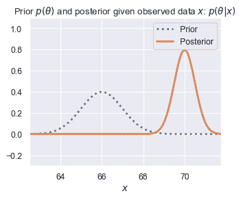

```py
plot_gaussian_prior_and_posterior(5*12+6, 1, larger_sample, 1)
```

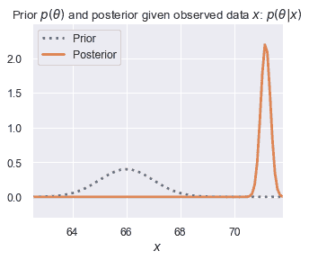

```py
plot_gaussian_prior_and_posterior(6*12, 1, small_sample, 1)
```

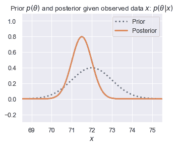

```py
plot_gaussian_prior_and_posterior(6*12, 1, larger_sample, 1)
```

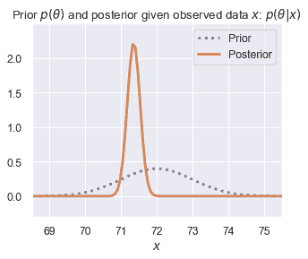

就像之前一样，我们可以观察到，当我们拥有较少数据时，先验参数的影响更强烈。我们还可以看到，随着数据量的增加，后验分布变得更加狭窄。这是另一个普遍的事实：**观察到的数据越多，我们的后验分布就越狭窄。**

**可选练习**：既然你已经看到了在正常先验 + 正态似然模型中先验参数的影响，现在请对上述后验分布中参数如何相互作用给出一个直观的解释，对于 $p(\theta | x_1, \ldots x_n)$.
