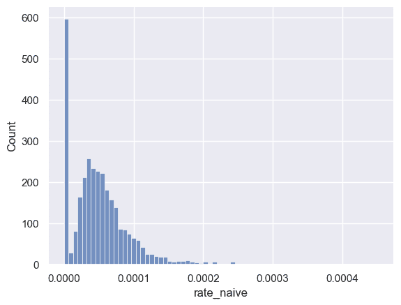
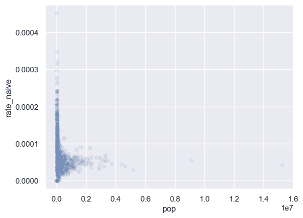
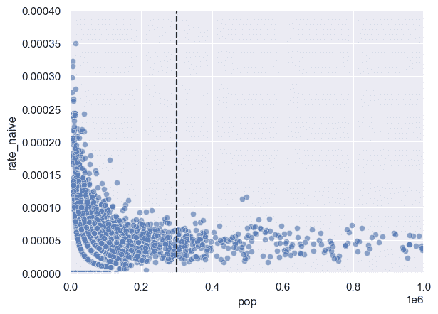
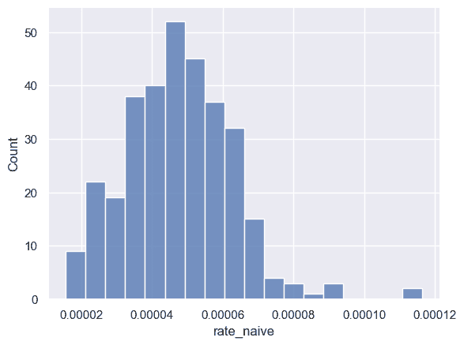
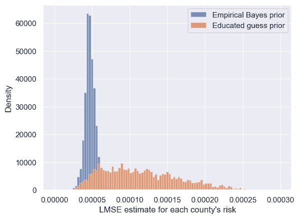
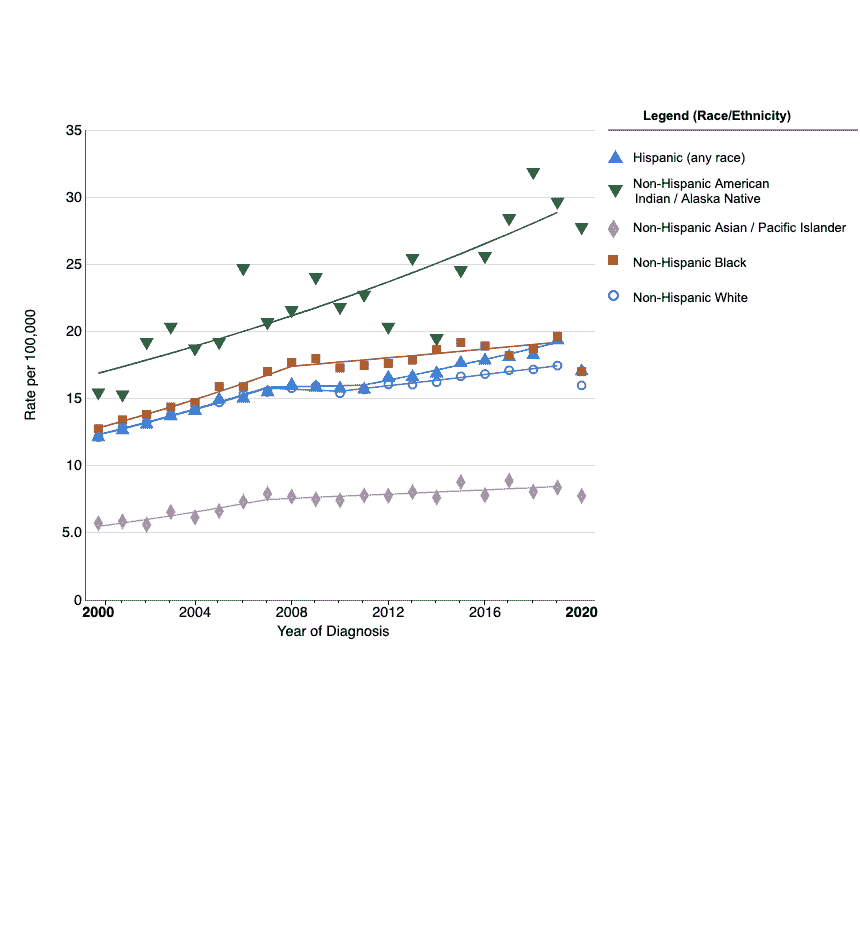
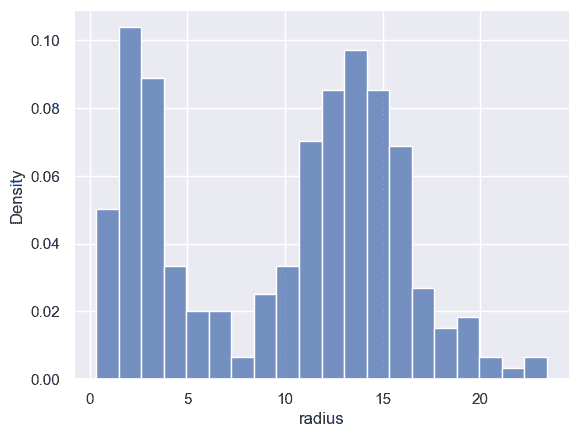
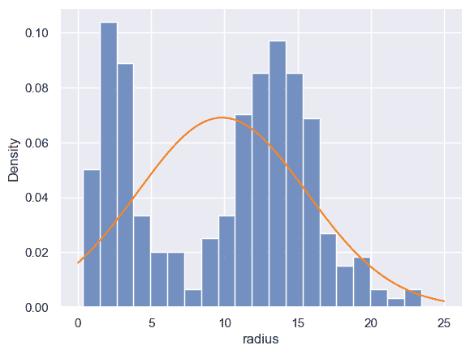

# 贝叶斯层次模型

> 原文：[`data102.org/ds-102-book/content/chapters/02/hierarchical-models`](https://data102.org/ds-102-book/content/chapters/02/hierarchical-models)

[<svg viewBox="0 0 24 24" fill="currentColor" aria-hidden="true" width="1.25rem" height="1.25rem" class="myst-fm-license-cc-icon myst-fm-license-cc-icon-main inline-block mx-1"><title>内容许可：知识共享 署名-相同方式共享 4.0 国际 (CC-BY-SA-4.0)</title></svg><svg viewBox="0 0 24 24" fill="currentColor" aria-hidden="true" width="1.25rem" height="1.25rem" class="myst-fm-license-cc-icon myst-fm-license-cc-icon-by inline-block mr-1"><title>必须注明原作者</title></svg><svg viewBox="0 0 24 24" fill="currentColor" aria-hidden="true" width="1.25rem" height="1.25rem" class="myst-fm-license-cc-icon myst-fm-license-cc-icon-sa inline-block mr-1"><title>演绎作品必须以相同条款共享</title></svg>](https://creativecommons.org/licenses/by-sa/4.0/)[](https://github.com/ds-102/ds-102-book "GitHub 仓库：ds-102/ds-102-book")[](https://github.com/ds-102/ds-102-book/edit/main/ds-102-book/content/chapters/02/02_hierarchical_models.ipynb "编辑此页面")

```py
import numpy as np
import pandas as pd
from scipy import stats
from IPython.display import YouTubeVideo
%matplotlib inline
import matplotlib.pyplot as plt
import seaborn as sns
sns.set()
```

到目前为止，我们已经看到，当我们拥有想要融入模型的先验领域知识时，贝叶斯方法会很有用。我们还看到，选择先验的影响在很大程度上取决于我们拥有多少数据：数据越少，我们的结论就越倾向于先验。

在许多情况下，我们可能没有那么多外部先验知识，我们希望依靠数据集中较大的部分来帮助弥补数据集中较小的部分。我们将通过一个研究 1980 年至 1989 年间美国肾癌死亡率的例子，将这个（非常）抽象的概念具体化。本节使用的数据以及建模和分析的灵感来源于[*贝叶斯数据分析*](http://www.stat.columbia.edu/~gelman/book/)第 47-51 页。数据的清理版本来自[Robin Ryder](https://github.com/robinryder/BDA-kidney)。请注意，该数据集存在严重偏差：它只包含白人男性的信息。我们将在本节后面讨论这个问题。

我们将逐步介绍为这个更复杂的数据集建立模型的过程，并在此过程中看到贝叶斯模型的几个优势和视角。

## 示例：理解肾癌死亡风险

在开始建模之前，我们必须首先理解数据。我们将重点关注以下列：

+   `state`：美国州名

+   `Location`：以字符串形式表示的县和州

+   `fips`，它为每个县提供[联邦信息处理标准代码](https://en.wikipedia.org/wiki/Federal_Information_Processing_Standard_state_code)：这是一个标准标识符，通常可用于连接包含县级信息的数据集。

+   `dc` 和 `dc.2`：分别代表 1980-1984 年和 1985-1989 年间的肾癌死亡人数

+   `pop` 和 `pop.2`：分别代表 1980-1984 年和 1985-1989 年的人口

```py
kc_full = pd.read_csv('kidney_cancer_1980.csv', skiprows=4)
# There are many other interesting columns, but we'll focus on these:
kc = kc_full.loc[:, ['state', 'Location', 'dc', 'dc.2', 'pop', 'pop.2']]
kc.head()
```

加载中...

为简化起见，我们将分析重点放在 1980-1984 年。我们的目标是了解**哪些县的人群面临最高的肾癌死亡风险**。这有助于指导公共卫生行动，或揭示应调查和补救的潜在致癌物信息（例如，靠近化工厂等）。

```py
kc['rate_nopool'] = kc['dc'] / kc['pop']
sns.histplot(kc, x='rate_nopool')
```

`<Axes: xlabel='rate_naive', ylabel='Count'>`

由此可见，大多数县的发病率在十万分之一（0.00001）到万分之一（0.0001）之间，但有相当数量的县发病率为 0。

如果我们的目标仅仅是描述 1980-1984 年间每个县确切发生的情况，那么这个可视化可能就足够了。然而，我们的目标是以一种有助于指导公共卫生的方式，了解每个县的肾癌死亡风险。这促使我们定义感兴趣参数：**对于县 $i$，每个人死于肾癌的平均风险是多少？**

直观上，我们可以看到，在人口非常少的县，这个数据集将无法很好地估计这个参数。例如，假设一个县只有 10 个人。由于我们关注的发病率接近万分之一，我们很可能观察到 0 例死亡，但这并不意味着这 10 个人的风险是 0！我们可以从经验上看到这一点：

```py
sns.scatterplot(kc, x='pop', y='rate_nopool', alpha=0.1);
```

`<Axes: xlabel='pop', ylabel='rate_naive'>`

对于较大的县，我们的估计值始终在 0.00002 到 0.00008 之间，但对于小县，估计值的变异性要大得多。

这里，我们面临的情况是拥有大量数据（实际上，我们的数据集包含了目标人群的完整普查数据），但我们试图量化的是一个相对罕见的现象。接下来，我们将看到贝叶斯推断如何帮助我们利用来自大县的更确定信息，来为小县做出良好的推断。

## 贝叶斯分层建模作为一种折中方案

我们可以将之前采用的方法视为一个极端：我们分别估计了每个县的死亡率，并且完全没有跨县汇集或共享任何信息。

在另一个极端，我们可以将所有县的数据全部合并在一起：

```py
total_pop = kc['pop'].sum()
total_dc = kc['dc'].sum()
overall_rate = total_dc / total_pop
overall_rate
```

`4.856485743364176e-05`

虽然这提供了对总体发病率的一个良好估计，但它掩盖了各县之间的变异性，并阻碍了我们进行县级推断或找出最需要针对性干预的地区。

为了在这两个极端之间取得折中，我们将使用一个**贝叶斯层次模型**：

+   对于每个县，令$\theta_i \in [0, 1]$为一个随机变量，表示该县个体死于肾癌的风险。

+   我们将为每个县使用相同的先验分布：一个 Beta$(a, b)$分布（参数$a$ 和$b$ 的值尚未确定），但每个县都是一个独立的随机变量，并将拥有各自独立的后验分布。

+   令$y_i$​为每个县的**二项式**随机变量，表示该县的肾癌死亡人数，其参数为$n_i$​（县人口数）和$\theta_i$​（县级风险）。

在符号表示上，我们可以将上述要点写作：

$\begin{align*} \theta_i &\sim \mathrm{Beta}(a, b), & i \in \{1, 2, \ldots\} \\ y_i &\sim \mathrm{Binomial}(\theta_i, n_i), & i \in \{1, 2, \ldots, C\} \end{align*}$ ​(1)

我们在上一节中看到，如果随机变量序列 $x_i$​ 的似然函数服从伯努利分布 $(\theta)$，且 $\theta$ 的先验分布服从 Beta 分布 $(a, b)$，那么 $\theta$ 的后验分布就是 Beta 分布 $\left(a + \sum x_i, b + n - \sum x_i\right)$。我们还可以证明，**如果随机变量 $y$ 的似然函数服从二项分布 $(n, \theta)$，且 $\theta$ 的先验分布服从 Beta 分布 $(a, b)$，那么 $\theta$ 的后验分布就是 Beta 分布 $(a + y, b + n - y)$。** 换句话说，正如 Beta 分布是伯努利似然函数的共轭先验一样，它也是二项似然函数的共轭先验。（它恰好也是几何似然函数的共轭先验！）

综合以上所有内容，我们现在可以计算后验分布。不同于单个参数 $\theta$，我们现在有 $C$ 个参数，$\theta_1, \ldots, \theta_C$​。后验分布是所有这些随机变量的联合分布，并以所有观测数据为条件：

$\begin{align*} p(\theta_1, \ldots, \theta_C | y_1, \ldots, y_C) &\propto \overbrace{p(y_1, \ldots, y_c | \theta_1, \ldots, \theta_C)}^{\text{likelihood}}\, \overbrace{p(\theta_1, \ldots, \theta_C)}^{\text{prior}} \\ &= \prod_{i=1}^C \theta_i^{a+y_i-1}(1-\theta_i)^{b + n_i - y_i - 1} \end{align*}$ ​(2)

由此我们可以得出结论：我们可以为每个县独立计算后验概率：

$\theta_i | y_i \sim \mathrm{Beta}(a + y_i, b + n_i - y_i)$ (3)

请注意，根据后验分布 $p(\theta_1, \ldots, \theta_C | y_1, \ldots, y_C)$，每个县的参数分布都独立于其他所有县，因为联合分布可以写成边缘分布的乘积。但是，它们都共享相同的参数 $a$ 和 $b$。

### 选择先验

正如前面的例子一样，我们现在面临一个至关重要的问题：**如何选择 $a$ 和 $b$**？我们将按照复杂度和精细度递增的顺序，考察四种方法：

1.  无信息先验

1.  有根据的猜测

1.  经验贝叶斯

1.  层次模型

#### 无信息先验

如果我们对数据一无所知，可以选择一个**无信息先验**：换句话说，一个尽可能提供最少信息的先验。在这个例子中，我们可能会选择在 $[0, 1]$ 区间上的均匀分布（即 $a = b = 1$）。虽然这避免了指定先验的问题，但它也并不是特别有用。如果我们使用这样一个弱先验，就等于说接近 0.8 的风险值与接近 0.0001 的风险值可能性相同：这显然与我们对该问题已有的认知不符。如果我们采用这种方法然后计算后验分布，会看到与之前无池化估计类似的结果。

#### 有根据的猜测

一个好的先验分布应该编码我们对感兴趣量的认知。在本例中，我们所知的一切都来自我们在此所做的工作：上面我们估计的总比率约为万分之 4.9。如果我们选择 $a = 5$ 和 $b = 9995$，那么先验的均值是 $5 \times 10^{-5}$。因此，一个可能的选择是 Beta$(5, 9995)$。

请注意，这在一定程度上是任意的：我们同样可以轻松地选择 $a = 10$ 和 $b = 19990$，或者 $a = 50$ 和 $b = 99950$，并得到相同的均值。

#### 经验贝叶斯

经验贝叶斯是一种混合了贝叶斯学派和频率学派的方法，它使用频率学派的方法来寻找感兴趣量的猜测值或先验分布。在本例中，我们将使用频率学派的方法来更好地猜测 $a$ 和 $b$。

具体来说，我们之前看到较小的县产生的朴素估计值变化太大。如果我们只看较大的县呢？我们将首先确定一个（有些任意的）大小县阈值。从上方的散点图可以看出，在达到一定规模后，非合并估计值似乎变化小得多。我们可以放大来确定一个阈值：

```py
sns.scatterplot(kc, x='pop', y='rate_nopool', alpha=0.6);
plt.vlines(3e5, 0, 0.0004, color='black', ls='--')
plt.axis([0, 1e6, 0, 0.0004]);
```



基于此，我们将使用 300,000 作为分界点（虚线），在估计先验分布参数时忽略小于此规模的县：

```py
kc_large_counties = kc[kc['pop'] > 300000]
sns.histplot(kc_large_counties, x='rate_nopool')
```

`<Axes: xlabel='rate_naive', ylabel='Count'>`

我们将使用这个经验分布（或者更准确地说，它的一个略微修改的版本）作为我们的先验分布：这就是经验贝叶斯中“经验”一词的由来。由于我们想使用贝塔先验，我们需要为这些数据拟合一个贝塔分布。换句话说，我们需要找到参数 $a$ 和 $b$，它们能很好地拟合这一系列观测值（即上方的直方图）。

这正是我们在上一节中使用最大似然法解决的问题！我们将使用最大似然法为这些数据拟合一个贝塔分布。这次，我们不推导贝塔分布的最大似然估计量，而是使用 scipy 来为我们完成：

```py
from scipy import stats
# The last two arguments tell scipy that it shouldn't try to shift or scale our beta distribution
a_hat, b_hat, loc_, scale_ = stats.beta.fit(kc_large_counties['rate_nopool'], floc=0, fscale=1)
print(a_hat, b_hat)
```

```py
9.270228244533358 195581.04114706165 
```

使用这种方法，我们的先验分布将是 Beta$(9.27, 195581)$。总结一下我们所做的：

+   我们希望找到先验分布的参数 $a$ 和 $b$，由于我们没有任何领域知识，我们将使用数据来帮助我们。

+   我们确定信任来自大县的数据，但不信任来自小县的数据（因为它们的变化太大）。请注意，这是一个隐含的**假设**，可能会将我们引入歧途：例如，如果较大的县倾向于较低或较高的比率，那么使用它们来估计先验分布的参数就是个坏主意。

+   我们仅查看了大县的朴素估计率，将贝塔分布拟合到这些数据上，然后将该贝塔分布用作我们的先验。

让我们比较一下这两种方法的结果。为了便于可视化，我们将查看每个县 LMSE 估计值的直方图：

```py
a_guess, b_guess = 5, 19995  # educated guess
a_eb, b_eb = a_hat, b_hat  # empirical bayes

def compute_posterior(kc, prior_a, prior_b):
    posterior_a = prior_a + kc['dc']
    posterior_b = prior_b + (kc['pop'] - kc['dc'])
    return posterior_a, posterior_b
kc['posterior_a_guess'], kc['posterior_b_guess'] = compute_posterior(kc, a_guess, b_guess)
kc['posterior_a_eb'], kc['posterior_b_eb'] = compute_posterior(kc, a_eb, b_eb)

# For a Beta(a, b) distribution, the mean is a / (a + b)
kc['lmse_guess'] = kc['posterior_a_guess'] / (kc['posterior_a_guess'] + kc['posterior_b_guess'])
kc['lmse_eb'] = kc['posterior_a_eb'] / (kc['posterior_a_eb'] + kc['posterior_b_eb']) 
```

```py
bins = np.linspace(0, 0.0003, 100)
sns.histplot(kc, x='lmse_eb', stat='density', label='Empirical Bayes prior', bins=bins)
sns.histplot(kc, x='lmse_guess',  stat='density', label='Educated guess prior', bins=np.linspace(0, 0.0003, 100))
plt.xlabel("LMSE estimate for each county's risk")
plt.legend()
```



在两种情况下，我们都不再看到 0 的估计值。请注意，由于经验贝叶斯先验更强（即，由于$a$ 和$b$ 的值较大，变异性较小），后验估计值落在更窄的范围内。

#### 完整层次模型

从哲学上讲，采用贝叶斯方法意味着我们决定将未知量视为随机变量，而不是固定参数。根据我们目前所见，在这个模型中，$a$ 和$b$ 是重要的未知量，对我们的推断结果有相当显著的影响。因此，我们现在尝试将它们视为随机变量。请注意，我们现在有两层未知的随机变量：$\theta_i$​，我们已经确定，是县级风险概率。$a$ 和$b$ 现在是美国层面的平均参数，反映了所有县的风险。这是层次模型的共同特征：一组变量与每个组（在本例中是县）的数据紧密相关，另一组变量代表更全局的信息（在本例中，是整个美国）。

但这引出了另一个建模问题：**我们为$a$ 和$b$ 选择什么先验分布**？

遗憾的是，没有方便的分布可以作为贝塔分布参数的共轭先验。尽管我们可以使用多种可能的分布，但为了简单和方便起见，我们将使用均匀分布。然而，我们仍然面临如何选择该均匀分布参数的问题！既然我们知道 $b >> a$，我们将做出一个有些随意的选择：设 $a \sim \mathrm{Uniform}(0, 50)$ 且 $b \sim \mathrm{Uniform}(0, 300000)$。然后我们可以写出完整的模型：

$\begin{align*} a &\sim \mathrm{Uniform}(0, 50) \\ b &\sim \mathrm{Uniform}(0, 300000) \\ \theta_i &\sim \mathrm{Beta}(a, b), & i \in \{1, 2, \ldots\} \\ y_i &\sim \mathrm{Binomial}(\theta_i, n_i), & i \in \{1, 2, \ldots\} \end{align*}$ (4)

不幸的是，这里没有方便的方法来计算后验分布：我们必须借助近似技术。在下一节中，在我们开发了近似推断工具后，我们将回到这个模型。

### 肾癌数据集中的偏差

本节内容正在积极开发中，可能会发生变化。

如前所述，提供的数据集仅包含关于白人男性的数据。然而，肾癌风险并非均匀分布，正如美国国立卫生研究院国家癌症研究所的这份数据所示：



由此，我们可以清楚地看到肾癌发病率存在种族差异。此外，我们观察到的任何县级效应也可能存在种族差异。我们该如何解决这个问题？不幸的是，在这种情况下，由于我们对数据收集方式了解不多，并且数据是很久以前收集的，我们无法改进我们的分析。

## （可选）示例：用于系外行星宜居性的高斯混合模型

本节中的模型大致基于 Kulkarni 和 Desai 的论文[使用高斯混合模型对系外行星进行分类](https://arxiv.org/abs/1708.00605)中的工作。

在本节中，我们将探讨另一种层次模型，其中的分组不那么明确。这种模型通常被称为*混合模型*。

### 系外行星数据

我们将使用一个[系外行星](https://science.nasa.gov/exoplanets/)数据集：即我们太阳系之外的行星。`planets` 数据框中的每一行都包含来自 NASA 的 517 颗系外行星的信息。我们将用它来探索哪些行星可能支持我们所知的生命。

该数据集包含以下列。

+   `name`: 系外行星的名称

+   `orbital_period`: 行星绕其恒星运行一周所需的天数

+   `mass`: 行星的质量，以地球质量的倍数表示（例如，第二颗行星，55 Cnc e，其质量是地球的 73.6%）

+   `radius`: 行星的半径，以地球半径的倍数表示（例如，第二颗行星，55 Cnc e，其半径几乎是地球的两倍）

+   `star_temperature`: 行星所绕恒星的温度，单位为开尔文

+   `density`: 行星的密度，单位为 g/cm³

请注意，在天文学中，更常见的是以木星而非地球为单位来测量质量和半径（木星的半径约为地球的 11 倍，质量约为地球的 317 倍），但我们使用基于地球的测量值，因为我们将以地球作为宜居性的标准。

```py
planets = pd.read_csv('exoplanets.csv')
planets.head()
```

加载中...

我们将把分析重点放在半径上：

```py
sns.histplot(data=planets, x='radius', stat='density', bins=20)
```

`<Axes: xlabel='radius', ylabel='Density'>`

我们可以看到有两类行星：一类半径相对较小（更接近地球大小），另一类半径较大（更接近木星大小）。可以看出，如果我们尝试用一个单一的高斯分布来拟合这些数据，得到的拟合效果相当差：

```py
radii = planets['radius']
radius_mean, radius_std = np.mean(radii), np.std(radii)

x = np.linspace(0, 25, 1000)

sns.histplot(data=planets, x='radius', stat='density', bins=20)
plt.plot(x, stats.norm.pdf(x, radius_mean, radius_std), color='tab:orange')
```



从视觉上看，结果有些显而易见：数据明显分为两组，因此试图用一个高斯分布来拟合效果很差。相反，我们需要一个更复杂的模型，能够直接对这两组数据进行建模，并帮助我们分别推断每组数据的特性。

```py
YouTubeVideo('lCbn8UrJ8-U')
```

### （可选）高斯混合模型：为系外行星数据指定概率模型

*文本即将发布：请观看视频*

```py
YouTubeVideo('KaD7uJeK_JI')
```

## 层次模型：一个更通用的定义

*即将发布*
