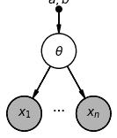
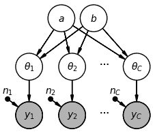
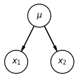
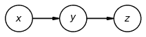
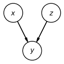

# 图模型、概率分布与独立性

> 原文：[`data102.org/ds-102-book/content/chapters/02/graphical-models`](https://data102.org/ds-102-book/content/chapters/02/graphical-models)

[<svg viewBox="0 0 24 24" fill="currentColor" aria-hidden="true" width="1.25rem" height="1.25rem" class="myst-fm-license-cc-icon myst-fm-license-cc-icon-main inline-block mx-1"><title>内容许可：知识共享 署名-相同方式共享 4.0 国际 (CC-BY-SA-4.0)</title></svg><svg viewBox="0 0 24 24" fill="currentColor" aria-hidden="true" width="1.25rem" height="1.25rem" class="myst-fm-license-cc-icon myst-fm-license-cc-icon-by inline-block mr-1"><title>必须向创作者署名</title></svg><svg viewBox="0 0 24 24" fill="currentColor" aria-hidden="true" width="1.25rem" height="1.25rem" class="myst-fm-license-cc-icon myst-fm-license-cc-icon-sa inline-block mr-1"><title>改编作品必须在相同条款下共享</title></svg>](https://creativecommons.org/licenses/by-sa/4.0/)[](https://github.com/ds-102/ds-102-book "GitHub 仓库：ds-102/ds-102-book")[](https://github.com/ds-102/ds-102-book/edit/main/ds-102-book/content/chapters/02/03_graphical_models.ipynb "编辑此页面")

```py
import numpy as np
import pandas as pd
from scipy import stats
from IPython.display import YouTubeVideo

%matplotlib inline

import matplotlib.pyplot as plt
import seaborn as sns
sns.set()
```

# 图模型、概率分布与独立性

## 图模型

**图模型** 提供了一种使用视觉化方式表示贝叶斯层次模型的方法。这些模型有时也被称为贝叶斯网络，或 **贝叶斯网**。

我们用节点（圆圈）表示每个随机变量，两个随机变量之间的有向边（箭头）表示子变量的分布以父变量为条件。绘制图模型时，我们通常从那些不依赖于任何其他变量的变量开始。这些变量通常是（但不总是）未观测到的感兴趣参数，例如本例中的 $\theta$。然后，我们继续为依赖于这些变量的每个变量绘制节点，依此类推。观测到的变量会以阴影表示。

我们将为之前章节中见过的三个示例绘制图模型：产品评价模型、肾癌模型和系外行星模型。

### 产品评价的图模型

在我们的产品评价模型中，有以下随机变量：

$\begin{align} x_i | \theta &\sim \mathrm{Bernoulli}(\theta) \\ \theta &\sim \mathrm{Beta}(a, b) \end{align}$ ​​(1)

在这种情况下，这意味着我们首先为产品质量 $\theta$ 建立一个节点，然后为每条评论 $x_i$​ 各建立一个节点，所有这些节点都依赖于 $\theta$。已观测到的评论节点 $x_i$​ 被涂上阴影，而隐藏（未观测到）的产品质量节点 $\theta$ 则没有：



这种可视化表示通过清晰地展示每条评论 $x_i$​ 都依赖于质量 $\theta$，向我们展示了模型的结构。但和之前一样，这个模型足够简单，我们早已知道这一点。接下来，我们将看一个更有趣的例子的图模型。

### 肾癌死亡风险的图模型

回顾肾癌死亡风险示例的完整层次模型：

$\begin{align*} a &\sim \mathrm{Uniform}(0, 50) \\ b &\sim \mathrm{Uniform}(0, 300000) \\ \theta_i &\sim \mathrm{Beta}(a, b), & i \in \{1, 2, \ldots, C\} \\ y_i &\sim \mathrm{Binomial}(\theta_i, n_i), & i \in \{1, 2, \ldots, C\} \end{align*}$ (2)

+   $y_i$​ 表示第 $i$ 个县的肾癌死亡人数（总人口为 $n_i$ni​）。

+   $\theta_i$​ 表示第 $i$ 个县的肾癌死亡率。

+   $a$ 和 $b$ 表示县级死亡率共享先验分布的参数。

为了绘制图模型，我们需要为每个随机变量绘制一个节点，并用箭头表示依赖关系。我们知道：

+   我们需要为 $a$ 设置一个节点，并为 $b$ 设置一个节点。

+   我们需要为每个 $\theta_i$​ 设置一个节点，并为每个 $y_i$yi​ 设置一个节点。

+   每个 $\theta_i$​ 都依赖于 $a$ 和 $b$。

+   每个 $y_i$​ 都依赖于 $\theta_i$​ 和 $n_i$​。

+   因为 $n_i$​ 是一个固定数字，我们将把它画成一个点。

因此，我们完整的图模型如下所示：



### （可选）示例：系外行星模型的图模型

*文本即将推出：请参阅视频*

```py
YouTubeVideo('e6CoEsLiMXc')
```

## 将图模型与概率分布关联起来

在我们之前绘制图模型时，我们为每个变量绘制一个节点，并从“顶部”开始，处理那些不依赖于任何其他变量的变量。然后我们逐步处理整个模型，最终到达观测变量。当查看图模型以推导模型中所有变量的联合分布时，我们遵循类似的过程。例如，在肾癌死亡率模型中，我们可以通过从根节点（即没有父节点的节点）开始，然后遍历它们的子节点，将联合分布写成一个乘积的形式。

因此，我们从 $p(a)$ 和 $p(b)$ 开始，然后是 $p(\theta_i | a, b)$（对于 $i \in \{1, \ldots, C\}$），接着是 $p(y_i | \theta_i)$：

$p(a, b, \theta_1, \ldots, \theta_C, y_1, \ldots, y_C) = p(a)p(b) \prod_{i=1}^C p(\theta_i\mid a, b) p(y_i\mid\theta_i)$ (3)

以这种方式分解分布有助于我们理解和数学地证明图模型中的独立性与条件依赖关系，稍后我们将看到这一点。

```py
YouTubeVideo('TzY3-EYwipk')
```

## 独立性与条件独立性

### 回顾：独立性与条件独立性

我们说两个随机变量 $w$ 和 $v$ 是**独立的**，如果知道其中一个的值并不能告诉我们另一个的分布信息。在符号上，我们写作 $w \perp\!\!\!\perp v$。对于独立的随机变量 $w$ 和 $v$，以下陈述均成立：

+   如果 $w$ 和 $v$ 相互独立（$w \perp\!\!\!\perp v$），那么联合分布 $p(w, v)$可以写成边缘分布的乘积：$p(w, v) = p(w)p(v)$。

+   如果 $w$ 和 $v$ 相互独立（$w \perp\!\!\!\perp v$），那么条件分布等于边缘分布：$p(w|v) = p(w)$ 且 $p(v|w) = p(v)$。

***练习**：利用条件分布的定义，证明上述两个条件在数学上是等价的。*

我们说，给定第三个随机变量 $u$，两个随机变量 $w$ 和 $v$ 是**条件独立的**，如果当我们以 $u$ 为条件时，知道 $v$ 或 $w$ 其中一个的值，并不能告诉我们另一个的分布信息。在符号上，我们写作 $w \perp\!\!\!\perp v \mid u$，其数学含义是 $p(w, v \mid u) = p(w\mid u) p(v \mid u)$。

例如，假设 $x_1$​ 和 $x_2$​ 是从一个具有特定平均身高 $\mu$ 的非常具体的人群中随机抽取的两个人的身高：这个人群可以是大学生、二年级学生、奥运游泳运动员，或者完全是其他某个群体。

如果我们知道 $\mu$ 的值，那么 $x_1$​ 和 $x_2$​ 就是条件独立的，因为它们是来自已知均值 $\mu$ 的同一分布的随机样本。例如，如果已知 $\mu = 4'1''$，那么知道 $x_1$​ 并不会告诉我们任何关于 $x_2$​ 的信息。

假设我们不知道 $\mu$ 的值。然后，我们发现 $x_1 = 7' 1''$。在这种情况下，我们可能会猜测这个“特定群体”很可能是一个身高非常高的群体，比如 NBA 球员。这将影响我们对 $x_2$​ 分布的信念（即，我们也应该预期第二个人很高）。因此，在这种情况下：

+   $x_1$​ 和 $x_2$​ 在给定 $\mu$ 的条件下是条件独立的：$x_1 \perp\!\!\!\perp x_2 \mid \mu$。

+   $x_1$​ 和 $x_2$​ 并非无条件独立：$x_1 \perp\!\!\!\perp x_2$​ 并不成立。

```py
YouTubeVideo('WhqyUmqkSE8')
```

### 图模型中的独立性与条件独立性

图模型的结构可以告诉我们很多关于模型中变量间独立性关系的信息。具体来说，仅通过观察模型的结构，我们就能判断两个随机变量是无条件独立，还是在给定第三个变量的条件下条件独立。让我们通过几个例子来说明这一点。我们将从刚才看到的身高例子开始：



根据我们之前的推理，我们知道 $x_1 \perp\!\!\!\perp x_2 \mid \mu$，但 $x_1$​ 和 $x_2$​ 并非无条件独立。对于图模型中这种配置下的任意三个变量，这一结论普遍成立。

***练习**：用数学方法证明上述结论。*

**解决方案**：要证明 $x_1$​ 和 $x_2$​ 并非无条件独立，我们必须证明 $p(x_1, x_2) \neq p(x_1)p(x_2)$。我们可以通过考察所有三个变量的联合分布，然后对 $\mu$ 进行边缘化来计算 $p(x_1, x_2)$：

$\begin{align*} p(x_1, x_2) &= \int p(x_1, x_2, \mu) d\mu \\ &= \int p(\mu) p(x_1 \mid \mu) p(x_2 \mid \mu) d\mu \end{align*}$ ​(4)

遗憾的是，无法对积分进行因式分解，以分离包含$x_1$​的项和包含$x_2$​的项，因此它无法分解。换句话说，通常上述积分不会等于$p(x_1)p(x_2)$，因此这些变量并非无条件独立。

给定$\mu$的条件独立性如何？我们需要证明$p(x_1, x_2\mid\mu) = p(x_1\mid\mu) p(x_2\mid\mu)$：

$\begin{align*} p(x_1, x_2 \mid \mu) &= \frac{p(x_1, x_2, \mu)}{p(\mu)} \\ &= \frac{p(\mu) p(x_1 \mid \mu) p(x_2 \mid \mu)}{p(\mu)} \\ &= p(x_1 \mid \mu) p(x_2 \mid \mu) \end{align*}$ ​(5)

这个数学结果与我们上一节建立的直觉相符。

让我们来看另一个例子：



在这个例子中，$x$ 和 $z$ 不是无条件独立的。直观上，我们可以看到 $y$ 依赖于 $x$，而 $z$ 依赖于 $y$，因此 $x$ 和 $z$ 是相互依赖的。

但是，在给定 $y$ 的条件下，$x$ 和 $z$ 是条件独立的：从 $x$ 到 $z$ 没有直接的箭头告诉我们，$z$ 仅通过 $y$ 依赖于 $x$。

***练习**：用数学方法证明上述结果。*

让我们来看第三个例子：



在这个例子中，$x$ 和 $z$ 是无条件独立的，但在给定 $y$ 的条件下，它们是条件依赖的。为什么？让我们看一个有助于我们理解这个结果的例子。假设：

+   $y$ 表示我是否鼻塞。

+   $x$ 表示我是否生病（感冒、流感、新冠等）。

+   $z$ 表示我是否患有季节性过敏。

首先，我们可以看到描述与图模型相符：我是否鼻塞取决于我是否生病以及是否过敏。但是，生病和过敏彼此并不直接影响。换句话说，如果我对是否鼻塞一无所知，那么我的生病状态和过敏状态就是相互独立的。

现在，假设某天早晨我醒来时鼻子不通气（即 $y=1$），而我正试图判断自己是生病了还是过敏。我查看了天气预报，发现花粉浓度非常高。一听到这个消息，我就更加确信 $z=1$。但是，尽管天气预报并没有直接告诉我是否生病，但我对自己生病的信念却大幅下降：我的症状已经被“很可能过敏”这个解释**解释掉了**。

换句话说，在给定 $y$（鼻塞）的某个值时，了解关于 $z$（过敏）的信息，就能让我获得关于 $x$（生病）分布的信息。这正是条件依赖的定义。

***练习**：用数学方法证明上述结果。*

这些结果可以在**d-分离**或**贝叶斯球**算法中得到形式化和推广。虽然该算法超出了本教科书的范围，但我们将在后续章节讨论因果关系时，探讨它的一个变体。

```py
YouTubeVideo('lpujKeK90RM')
```
