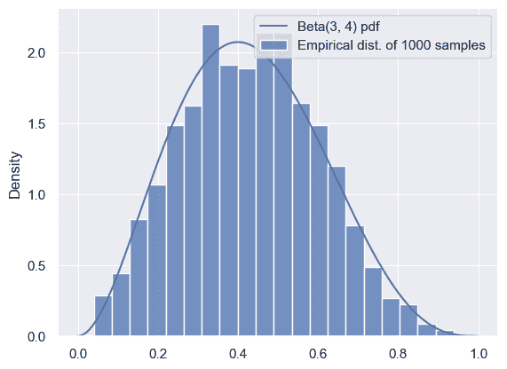
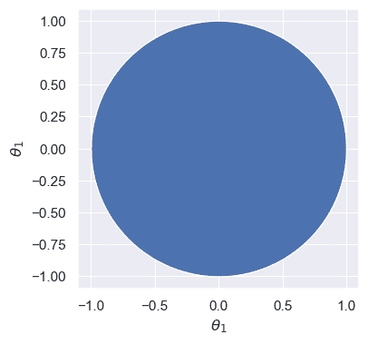
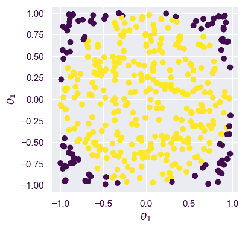
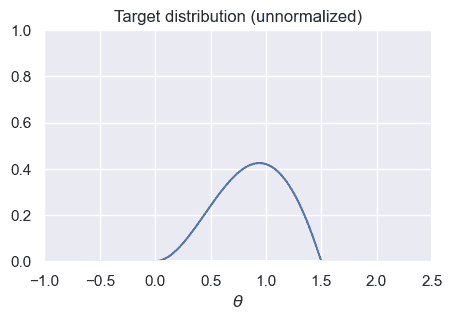
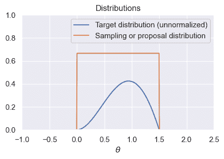
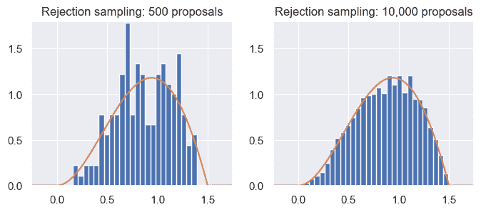
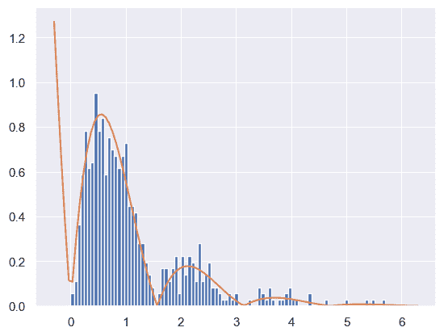
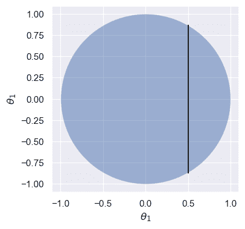
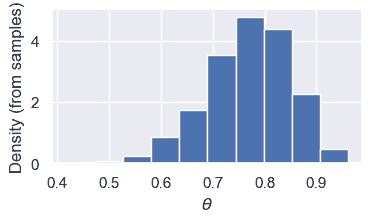

# 基于采样的贝叶斯推断

> 原文：[`data102.org/ds-102-book/content/chapters/02/inference-with-sampling`](https://data102.org/ds-102-book/content/chapters/02/inference-with-sampling)

[<svg viewBox="0 0 24 24" fill="currentColor" aria-hidden="true" width="1.25rem" height="1.25rem" class="myst-fm-license-cc-icon myst-fm-license-cc-icon-main inline-block mx-1"><title>内容许可：知识共享 署名-相同方式共享 4.0 国际许可协议 (CC-BY-SA-4.0)</title></svg><svg viewBox="0 0 24 24" fill="currentColor" aria-hidden="true" width="1.25rem" height="1.25rem" class="myst-fm-license-cc-icon myst-fm-license-cc-icon-by inline-block mr-1"><title>必须注明原作者</title></svg><svg viewBox="0 0 24 24" fill="currentColor" aria-hidden="true" width="1.25rem" height="1.25rem" class="myst-fm-license-cc-icon myst-fm-license-cc-icon-sa inline-block mr-1"><title>衍生作品必须在相同条款下共享</title></svg>](https://creativecommons.org/licenses/by-sa/4.0/)[](https://github.com/ds-102/ds-102-book "GitHub 仓库：ds-102/ds-102-book")[](https://github.com/ds-102/ds-102-book/edit/main/ds-102-book/content/chapters/02/05_inference_with_sampling.ipynb "编辑此页面")

```py
import numpy as np
import pandas as pd
from scipy import stats
from IPython.display import YouTubeVideo

%matplotlib inline

import matplotlib.pyplot as plt
import seaborn as sns
sns.set()
```

# 基于采样的贝叶斯推断

## 用样本近似已知分布

我们之前已经看到，可以从数据点样本中计算出经验分布。在本节中，我们将使用样本来近似分布。

让我们从一个已知且易于计算的分布开始，用采样来近似它：Beta$(3, 4)$。虽然这个例子有些“傻”，因为该分布很容易推理，但它将帮助我们理解采样如何为分布提供有用的近似。

```py
 from scipy import stats

distribution = stats.beta(3, 4)
num_samples = 1000

# Compute the exact PDF:
t = np.linspace(0, 1, 500)
pdf = distribution.pdf(t)

# Draw 1000 samples, and look at the empirical distribution of those samples:
samples = distribution.rvs(num_samples)
f, ax = plt.subplots(1, 1)

sns.histplot(
    x=samples, stat='density', bins=20, 
    label=f'Empirical dist. of {num_samples} samples'
)
ax.plot(t, pdf, label='Beta(3, 4) pdf')
ax.legend();
```

```py
/Users/ramesh/anaconda3/lib/python3.11/site-packages/seaborn/_oldcore.py:1119: FutureWarning: use_inf_as_na option is deprecated and will be removed in a future version. Convert inf values to NaN before operating instead.
  with pd.option_context('mode.use_inf_as_na', True): 
```



我们可以看到，只要样本数量足够，它们就能很好地代表分布。我们可以使用样本的均值来近似分布的均值：

```py
# The mean of a Beta(a, b) distribution is a/(a+b):
true_mean = 3 / (3 + 4)

approx_mean = np.mean(samples)
print(true_mean, approx_mean)
```

```py
0.42857142857142855 0.42990793568940666 
```

同样地，我们可以使用样本的方差来估计分布的方差，依此类推。

虽然这种方法实现起来极其简单，但也有些“傻”：对于这个分布，任何我们可以用样本完成的操作也都可以通过解析方法完成。通常，我们想要近似的是那些难以处理、涉及无法计算归一化常数的复杂分布。所以，接下来我们将处理这类情况。

## 拒绝采样

拒绝采样的工作原理是生成大量提议样本，然后拒绝那些可能性低或不可能出现的样本。

作为热身，考虑一个二维分布，涉及$\theta_1$​和$\theta_2$​，它在单位圆上是均匀的：

$\begin{align*} p(\theta|x) &\propto \begin{cases} 1 & \text{if } \theta_1² + \theta_2² \leq 1 \\ 0 & \text{otherwise} \end{cases} \end{align*}$ ​​(1)

假设我们想从这个分布中采样：换句话说，我们想从单位圆中均匀抽取一对随机变量（$\theta_1$​, $\theta_2$​），如下方的蓝色区域所示。

我们该如何着手做这件事呢？

```py
θ_ = np.linspace(-1, 1, 1000)
semicircle = np.sqrt(1-θ_**2)
f, ax = plt.subplots(1, 1, figsize=(4, 4))
ax.fill_between(θ_, -semicircle, semicircle)
ax.set_xlabel(r'$\theta_1$')
ax.set_ylabel(r'$\theta_1$')
ax.axis('equal');
```



在前一个例子中，我们可以轻松地使用`stats.beta.rvs`从贝塔分布中采样。不幸的是，对于上面所示的分布，没有等效的方法。

但是，我们可以通过抽取两个独立的均匀分布$(0, 1)$样本来从单位正方形中采样。我们可以轻松检查样本是否落在单位圆内，如果落在外面就丢弃（或**拒绝**）它。以下是对多个样本进行此操作的效果图：

```py
 # Number of samples
N = 400

# Samples in the unit square
samples = np.random.uniform(-1, 1, [N, 2])

# Which ones are inside the unit circle?
is_in_circle = (samples[:,0]**2 + samples[:, 1]**2) < 1
good_samples = samples[is_in_circle]
θ1 = good_samples[:, 0]
θ2 = good_samples[:, 1]
print('Variance of θ1 (estimated from samples): %.3f' % np.var(θ1))
```

```py
Variance of θ1 (estimated from samples): 0.241 
```

源代码

```py
f, ax = plt.subplots(1, 1, figsize=(4, 4))

ax.scatter(samples[:, 0], samples[:, 1], c=is_in_circle, cmap='viridis')
ax.set_xlabel(r'$\theta_1/details>)
ax.set_ylabel(r'$\theta_1/details>)
ax.axis('equal');
``` 



这里，紫色（较深）的样本被拒绝，因此我们得到黄色（较浅）的样本，它们代表了上述分布。

```py
YouTubeVideo('Nbszb5tGmFo')
```

加载中...

接下来，让我们思考如何从一个具有复杂概率密度的分布中进行采样。假设我们想从密度函数为 $p(\theta|x) \propto \theta \cdot (1.5-\theta) \cdot \sin(\theta)$ 的分布中采样，其中 $\theta \in [0,1.5]$：

```py
t = np.linspace(-1, 2.5, 500)
def target(t):
    """The unnormalized distribution we want to sample from"""
    return t * (1.5-t) * np.sin(t) * ((t > 0) & (t < 1.5))
```

源代码

```py
f, ax = plt.subplots(1, 1, figsize=(5, 3))
ax.plot(t, target(t))
ax.set_title('Target distribution (unnormalized)')
ax.set_xlabel(r'$\theta/details>)
ax.axis([-1,2.5,0,1]);
``` 



我们如何能让这看起来像之前基于几何的例子呢？解决方案是一种名为**拒绝采样**的算法。有两种方式来理解它的工作原理：

1.  第一种方法是从均匀分布开始生成样本，然后随机丢弃部分样本（而非像前例那样确定性丢弃）。直观来看，通过比较下图中的目标分布与 Uniform$(0, 1.5)$ 分布可知：对于极小的 $\theta$ 值，我们应尝试丢弃更多样本；而在 0.5 到 1 之间，则应保留更多样本。换言之，每个样本的拒绝概率应取决于其在目标分布下的似然程度。

1.  第二种方法是将我们的一维采样问题（即生成 $\theta$ 的样本）转化为二维采样问题：首先从下图中橙色矩形区域采样，然后丢弃未落在蓝色曲线下方的样本。为此，我们必须先在 0 到 1.5 之间采样 $\theta$ 值，再为每个 θ 值采样一个高度。如果高度过大（即高于该 θ 值对应的目标分布高度），则拒绝该样本。

```py
x = np.linspace(-1, 2.5, 500)
def uniform_sampling_dist(t):
    """PDF of distribution we're sampling from: Uniform[0, 1.5]"""
    return stats.uniform.pdf(t, 0, 1.5)
```

来源

```py
f, ax = plt.subplots(1, 1, figsize=(5, 3))
ax.plot(t, target(t), label='Target distribution (unnormalized)')
ax.plot(t, uniform_sampling_dist(t), label='Sampling or proposal distribution')
ax.axis([-1,2.5,0,1])
ax.legend()
ax.set_title('Distributions')
ax.set_xlabel(r'$\theta/details>);
``` 



更准确地说，拒绝采样工作原理如下：给定未归一化的目标分布和提议分布，我们通过以下步骤从归一化后的目标分布生成样本：

1.  从提议分布中生成样本。

1.  对于上一步生成的每个样本，计算目标分布与提议分布的比值。该比值代表我们接受该样本的概率：目标分布值越大，接受概率越高；目标分布值越小，接受概率越低。为使该比值能被视作概率，我们要求目标分布值始终小于（或等于）提议分布值：通过选择合适的提议分布并对目标分布进行适当缩放，总能满足此条件。

1.  随机接受或拒绝步骤 1 中的每个样本，其概率由步骤 2 中的比率决定。这可以通过为每个样本生成一个 Uniform$(0, 1)$ 随机变量，并接受该随机变量小于接受概率的样本来实现。**在继续之前，请停下来并确信这是正确的！** 丢弃所有被拒绝的样本。

1.  被接受的样本将是来自与未归一化目标相对应的归一化密度的真实样本。

以下代码实现了拒绝采样。请注意，此函数中只有四行（实质性）代码，对应于上述四个步骤：

```py
def rejection_sample_uniform(num_proposals=100):
    # Generate proposals for samples: these are θ-values.
    # We'll keep some and reject the rest.
    proposals = np.random.uniform(low=0, high=1.5, size=num_proposals)

    # Acceptance probability is the ratio of the two curves
    # These had better all be between 0 and 1!
    accept_probs = target(proposals) / uniform_sampling_dist(proposals)

    print('Max accept prob: %.3f' % np.max(accept_probs))

    # For each sample, we make a decision whether or not to accept.
    # Convince yourself that this line makes that decision for each
    # sample with prob equal to the value in "accept_probs"!
    accept = np.random.uniform(size=num_proposals) < accept_probs

    num_accept = np.sum(accept)
    print('Accepted %d out of %d proposals' % (num_accept, num_proposals))
    return proposals[accept]
```

让我们将其应用于上述目标分布，使用 `rejection_sample_uniform(num_proposals=500)` 和 `rejection_sample_uniform(num_proposals=10000)`：

源代码

```py
f, axs = plt.subplots(1, 2, figsize=(8, 3), dpi=100)

# Run rejection sampling twice, once with many proposals and once with few proposals
samples_sparse = rejection_sample_uniform(num_proposals=500)
samples_dense = rejection_sample_uniform(num_proposals=10000)

# Plot a true histogram (comparable with density functions) using density=True
axs[0].hist(samples_sparse, bins=np.linspace(-0.25, 1.75, 40), density=True)
axs[1].hist(samples_dense, bins=np.linspace(-0.25, 1.75, 40), density=True)

# Where did this magic number 0.36 come from? What happens if you change it?
axs[0].plot(t, target(t) / 0.36)
axs[1].plot(t, target(t) / 0.36)

axs[0].set_title('Rejection sampling: 500 proposals')
axs[1].set_title('Rejection sampling: 10,000 proposals')
axs[0].axis([-0.25, 1.75, 0, 1.8])
axs[1].axis([-0.25, 1.75, 0, 1.8]); 
```

```py
Max accept prob: 0.638
Accepted 175 out of 500 proposals
Max accept prob: 0.638
Accepted 3661 out of 10000 proposals 
```



从结果中我们可以看到，当有足够多的提议样本时，拒绝采样能够正确且准确地为我们提供来自目标分布的样本。但是，它可能**效率低下**：我们每次接受的样本不到一半！确实，即使有 10,000 个提议样本（右侧），这些样本也不能完美地代表目标分布。

这种效率低下的问题是由拒绝样本引起的。请注意，最大接受概率仅为 0.64 左右。如果我们将提议分布按比例缩放 $1/0.64 \approx 1.56$ 倍，那么总体上我们拒绝的样本会更少，同时仍能确保概率永远不会超过 1。

不幸的是，当处理高维问题时，效率低下的问题会变得严重得多！在处理高维分布时，空间中通常有更多区域的密度相对较低，这意味着会有更多的样本被拒绝。

作为第二个例子，如果我们想从取值在 $[0, \infty)$ 的目标分布中抽样，会发生什么？例如，假设我们的密度函数为 $p(\theta|x) \propto \exp(-\theta) |\sin(2\theta)|$，其中 $\theta \in [0, \infty)$。我们不能使用均匀分布 $(a, b)$ 作为提议分布。为什么不行？因为对于任何 $b$ 值，我们永远无法生成大于 $b$ 的样本，因此我们的样本将无法匹配真实分布。

相反，我们可以使用正态分布或指数分布：

```py
def decaying_target_distribution(t):
    """Unnormalized target distribution as described above"""
    return np.exp(-t) * np.abs(np.sin(2*t))

def sampling_distribution_exponential(t):
    """Sampling distribution: exponential distribution"""
    # stats.expon has a loc parameter which says how far to shift
    # the distribution from its usual starting point of θ=0
    return stats.expon.pdf(t, loc=0, scale=1.0)

def rejection_sample_exponential(num_proposals=500):
    """Rejection sampling with an exponential distribution with λ=1"""
    proposals = np.random.exponential(scale=1.0, size=num_proposals)
    accept_probs = decaying_target_distribution(proposals) / sampling_distribution_exponential(proposals)
    accept = np.random.uniform(0, 1, num_proposals) < accept_probs
    num_accept = np.sum(accept)
    print('Accepted %d out of %d proposals' % (num_accept, num_proposals))
    return proposals[accept]

samples = rejection_sample_exponential(num_proposals=1000)
plt.hist(samples, bins=np.linspace(0, 6, 100), density=True)
# Find how far the axis goes and draw the unnormalized distribution over it

tmin, tmax, _, _ = plt.axis()
t_inf = np.linspace(tmin, tmax, 100)

# Where did this magic number 0.6 come from? What happens if you change it?
plt.plot(t_inf, decaying_target_distribution(t_inf) / 0.6)
plt.show()
```

```py
Accepted 591 out of 1000 proposals 
```



总而言之，我们了解到拒绝采样可用于仅根据未归一化的目标分布进行抽样。尽管它可以用于从任何未归一化的目标分布中抽取样本，但我们最常将其（以及其他抽样方法）用于未归一化的目标分布，即后验分布的分子 $p(\theta|x)p(\theta)$。

拒绝采样通过使用一个易于采样的提议分布来工作：虽然正态分布和均匀分布最为常见，但我们可以使用任何分布，只要 (a) 我们可以从中抽取样本，并且 (b) 我们可以保证它总是大于（或等于）目标分布的缩放版本。其工作原理是：(1) 从提议分布生成提议样本，(2) 计算目标分布与提议分布的比值作为接受概率，(3) 根据其接受概率接受每个样本。它通常效率低下，尤其是在高维情况下。

```py
YouTubeVideo('S9korbhU4Wg')
```

加载中...

## Markov Chain Monte Carlo

我们注意到，拒绝采样的低效性源于我们拒绝并丢弃了大量提议样本。确实，拒绝采样独立地生成每个样本，没有利用先前生成的样本中关于哪些区域概率较低、哪些区域概率较高的任何信息。

**马尔可夫链蒙特卡洛 (MCMC)** 方法采用了一种不同的策略，它通过生成一系列样本来工作。每个样本都依赖于前一个样本，这使我们能够生成更好的样本。我们将以这样一种方式构建样本序列，使其形成一个马尔可夫链，其稳态分布就是目标分布的真实归一化版本。

### Markov Chains

关于马尔可夫链的讨论，请参阅 [Data 140 教材第十章](https://data140.org/textbook/content/Chapter_10/00_Markov_Chains.html)。

### Metropolis-Hastings (Optional)

*进行中*

### Gibbs sampling

Gibbs 采样是一种专为处理高维后验分布而设计的算法。它通过迭代地对每个单独变量进行重采样来工作，条件是给定数据和其他所有随机变量。例如，让我们重新审视上面提到的单位圆上的均匀分布：

$\begin{align*} p(\theta|x) &\propto \begin{cases} 1 & \text{if } \theta_1² + \theta_2² \leq 1 \\ 0 & \text{otherwise} \end{cases} \end{align*}$ ​(2)

假设我们已知 $\theta_1$​ 的一个特定值，例如 $\theta_1 = 0.5$。基于这个值，我们可以轻松推断 $\theta_2|\theta_1=0.5$ 的分布：它在如下所示的垂直线上是均匀的：

源代码

```py
θ_ = np.linspace(-1, 1, 1000)
semicircle = np.sqrt(1-θ_**2)
f, ax = plt.subplots(1, 1, figsize=(4, 4))
ax.fill_between(θ_, -semicircle, semicircle, alpha=0.5)
ax.plot([0.5, 0.5], [-np.sqrt(1-0.5**2), np.sqrt(1-0.5**2)], color='black', lw=1.5)
ax.set_xlabel(r'$\theta_1/details>)
ax.set_ylabel(r'$\theta_1/details>)
ax.axis('equal');
``` 



因此，给定 $\theta_1$​ 的任意特定值，我们可以通过从均匀分布中采样，轻松地基于该值为 $\theta_2$​ 抽取一个条件样本。经过一些代数运算，我们可以将其写为：

$\theta_2 \mid \theta_1 \sim \mathrm{Uniform}\left(-\sqrt{1-\theta_1²}, \sqrt{1-\theta_1²}\right)$ (3)

根据对称性

请注意，尽管我们在本节中多次提及后验分布和基于数据的条件化，吉布斯采样是一种通用方法，可用于从任何高维目标分布中采样，只要其条件分布 $p(\theta_i | \theta_1, \ldots, \theta_{i-1}, \theta_{i+1}, \ldots, \theta_n)$ 易于采样。

## 在 PyMC 中实现模型

我们花了大量时间进行代数推导，以得出评价模型的后验分布和估计值。此时，你可能会问：我们能否通过计算来完成大部分工作？事实证明答案是肯定的！PyMC 是一个用于贝叶斯推断的 Python 库。要使用它，你必须指定一个概率模型（就像我们刚刚看到的三个模型）和观测数据，然后它将计算所有未知变量的后验分布。

### PyMC 中的产品评价模型

让我们在产品评价模型上尝试一下：

$\begin{align} x_i | \theta &\sim \mathrm{Bernoulli}(\theta) \\ \theta &\sim \mathrm{Beta}(\alpha, \beta) \end{align}$ ​(4)

我们将从指定数据开始：微波炉 A 有 3 条正面评价和 0 条负面评价，微波炉 B 有 19 条正面评价和 1 条负面评价。

```py
reviews_a = np.array([1, 1, 1])
reviews_b = np.append(np.ones(19), np.zeros(1))
```

然后，我们将定义模型：请仔细审阅下面的代码，确保你理解每一行背后的逻辑（除了最后一行）：

```py
import pymc as pm
import arviz as az

# Parameters of the prior
alpha = 1
beta = 5

with pm.Model() as model:
    # Define a Beta-distributed random variable called theta
    theta = pm.Beta('theta', alpha=alpha, beta=beta)

    # Defines a Bernoulli RV called x. Since x is observed, we
    # pass in the observed= argument to provide our data
    x = pm.Bernoulli('x', p=theta, observed=reviews_b)

    # This line asks PyMC to approximate the posterior.
    # Don't worry too much about how it works for now.
    trace = pm.sample(2000, chains=2, tune=1000, return_inferencedata=True)

trace
```

```py
Auto-assigning NUTS sampler...
Initializing NUTS using jitter+adapt_diag...
Multiprocess sampling (2 chains in 2 jobs)
NUTS: [theta] 
```

正在加载...正在加载...

```py
Sampling 2 chains for 1_000 tune and 2_000 draw iterations (2_000 + 4_000 draws total) took 1 seconds.
We recommend running at least 4 chains for robust computation of convergence diagnostics 
```

正在加载...

```py
trace.posterior
```

正在加载...

花点时间查看输出，注意不同的属性。目前，我们最感兴趣的是来自后验分布的样本，它们位于 `trace.posterior['theta'].values` 中：

```py
samples = trace.posterior['theta'].values.flatten()

f, ax = plt.subplots(1, 1, figsize=(4, 2))
ax.hist(samples, density=True);
ax.set_xlabel(r'$\theta$')
ax.set_ylabel('Density (from samples)');
```



### （可选）PyMC 中的系外行星模型

```py
planets = pd.read_csv('exoplanets.csv')
planets.shape
```

`(517, 6)`

让我们尝试一个更有趣的模型：我们用于系外行星的混合模型：

$\begin{align} z_i &\sim \mathrm{Bernoulli}(\pi) & i = 1, \ldots, n \\ \mu_k &\sim \mathcal{N}(\mu_p, \sigma_p) & k =0, 1 \\ x_i | z_i, \mu_0, \mu_1 &\sim \mathcal{N}(\mu_{z_i}, \sigma) & i = 1, \ldots, n\\ \end{align}$ ​(5)

首先，我们需要一个名为“花式索引”的技巧。其工作原理如下：

```py
example_zs = np.array([1, 0, 0, 1, 1, 0])
example_mus = np.array([1.3, 10.2])

means = example_mus[example_zs]
means
```

`array([10.2, 1.3, 1.3, 10.2, 10.2, 1.3])`

```py
pi = 0.6      # Prior probability of a planet being in the large/uninhabitable group
sigma = 1.5   # SD of likelihood
mu_p = 5      # Mean of prior
sigma_p = 10  # Variance of prior: important to choose a large value here

with pm.Model() as model_exoplanet:

    # This defines a Bernoulli random variable called 'z' in our model.
    z = pm.Bernoulli('z', p=pi)

    # This creates an array of two random variables called 'mu'
    # (one for each group), because we used the shape=2 argument
    mu = pm.Normal('mu', mu=mu_p, sigma=sigma_p, shape=2)

    planet_means = mu[z]
    # this is the tricky bit with the indexing: we'll use the "fancy indexing" idea
    # from above
    x = pm.Normal('x', mu=planet_means, sigma=sigma, observed=planets['radius'])

    trace_exoplanet = pm.sample(2000, chains=2, tune=1000, return_inferencedata=True)

trace_exoplanet.posterior['mu'].values
```

```py
Multiprocess sampling (2 chains in 2 jobs)
CompoundStep
>BinaryGibbsMetropolis: [z]
>NUTS: [mu] 
```

加载中...加载中...

```py
Sampling 2 chains for 1_000 tune and 2_000 draw iterations (2_000 + 4_000 draws total) took 1 seconds.
There were 94 divergences after tuning. Increase `target_accept` or reparameterize.
We recommend running at least 4 chains for robust computation of convergence diagnostics
The rhat statistic is larger than 1.01 for some parameters. This indicates problems during sampling. See https://arxiv.org/abs/1903.08008 for details
The effective sample size per chain is smaller than 100 for some parameters.  A higher number is needed for reliable rhat and ess computation. See https://arxiv.org/abs/1903.08008 for details 
```
