# 广义线性模型

> 原文：[`data102.org/ds-102-book/content/chapters/03/glms`](https://data102.org/ds-102-book/content/chapters/03/glms)

[<svg viewBox="0 0 24 24" fill="currentColor" aria-hidden="true" width="1.25rem" height="1.25rem" class="myst-fm-license-cc-icon myst-fm-license-cc-icon-main inline-block mx-1"><title>内容许可：知识共享 署名-相同方式共享 4.0 国际 (CC-BY-SA-4.0)</title></svg><svg viewBox="0 0 24 24" fill="currentColor" aria-hidden="true" width="1.25rem" height="1.25rem" class="myst-fm-license-cc-icon myst-fm-license-cc-icon-by inline-block mr-1"><title>必须署名原作者</title></svg><svg viewBox="0 0 24 24" fill="currentColor" aria-hidden="true" width="1.25rem" height="1.25rem" class="myst-fm-license-cc-icon myst-fm-license-cc-icon-sa inline-block mr-1"><title>演绎作品必须以相同许可协议共享</title></svg>](https://creativecommons.org/licenses/by-sa/4.0/)[](https://github.com/ds-102/ds-102-book "GitHub 仓库：ds-102/ds-102-book")[](https://github.com/ds-102/ds-102-book/edit/main/ds-102-book/content/chapters/03/03_glms.ipynb "编辑此页面")

```py
%matplotlib inline
import numpy as np
import pandas as pd
import matplotlib.pyplot as plt
import seaborn as sns
sns.set()

import pymc as pm
import bambi as bmb
import arviz as az
import statsmodels.api as sm
```

# 广义线性模型

在本节中，我们将学习一种称为**广义线性模型**（GLMs）的线性回归扩展。特别是，GLMs 与线性回归相似，但有两个重要扩展：

1.  我们不再直接使用 $X\beta$ 的结果作为平均预测，而是先应用一个称为逆连接函数或 $g^{-1}$ 的非线性函数，使我们的平均预测变为 $g^{-1}(X\beta)$。虽然我们可以在此处使用任意函数，但我们将看到几个特别有用的例子。

1.  我们不再假设数据似然模型是围绕平均预测的正态分布，而是允许任意的似然分布（但仍以平均预测 $g^{-1}(X\beta)$ 为中心）。

我们将通过一个示例来演示这类模型为何有用，以及选择不同的逆连接函数和似然模型如何改变我们得到的预测结果。

## 从贝叶斯和频率学派视角看线性回归

在本节的其余部分，我们将使用一个包含自 2000 年以来各州建造的风力涡轮机数量的数据集，重点关注俄克拉荷马州。它包含以下列：

+   `t_built`：每年建造的涡轮机数量

+   `t_cap`：当年新增的发电容量

+   `year`：年份，存储为自 2000 年以来的年数

+   `totals`：自 2000 年以来该州建造的涡轮机总数

+   `log_totals`：总数的对数。

源代码

```py
turbines = pd.read_csv('turbines.csv')
# The "year" column contains how many years since the year 2000
turbines['year'] = turbines['p_year'] - 2000
turbines = turbines.drop('p_year', axis=1)
turbines.head()

ok_filter = (turbines.t_state == 'OK') & (turbines.year >= 0)

# Turbines in Oklahoma from 2000 on
ok_filter = (turbines.t_state == 'OK') & (turbines.year >= 0)
ok_turbines = turbines[ok_filter].sort_values('year')
ok_turbines["totals"] = np.cumsum(ok_turbines["t_built"])
# Log-transform the counts, too
ok_turbines["log_totals"] = np.log(ok_turbines["totals"])
ok_turbines.head(n=5)
``` 

加载中...

```py
ok_turbines.plot('year', 'totals');
```

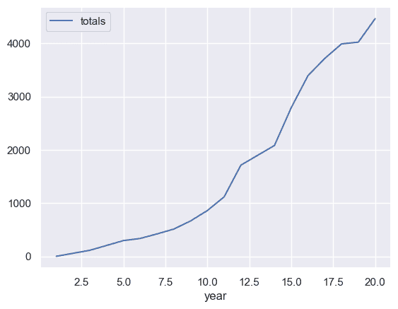

观察这些数据，我们可以立即看出线性回归可能不是一个好的选择：两个变量之间的关系似乎是指数关系而非线性关系。我们可以通过以下两种方式之一来解决这个问题：

1.  对输出数据进行对数转换，这样我们预测的就是$\log($涡轮机数量$)$，然后使用线性模型。

1.  将指数关系纳入我们的模型。

我们将从第一种方法开始，看到它的效果相当不错，然后看看广义线性模型如何通过采用第二种方法帮助我们做得更好。

```py
ok_turbines.plot('year', 'log_totals');
```

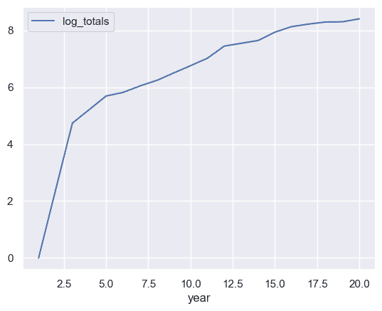

除了第一年（$t=0$，即 2000 年）的异常值外，线性模型在这里似乎是一个很好的拟合。

由于线性回归是一种统计模型，我们通过随机数据来估计未知量（模型系数），因此我们可以从频率学派或贝叶斯学派的范式来处理它。让我们看看在这两种设置下，对数计数的线性模型将如何工作。

### 涡轮机数据线性回归：频率学派方法

在频率主义范式中，我们将未知系数视为固定值，并使用最大似然（或类似技术）进行估计。虽然如前一节所见，使用`scikit-learn`是在频率主义范式中实现线性回归的完全有效的方法，但它不支持我们将在本章中使用的许多广义线性模型。因此，本章我们将改用`statsmodels`包（通过`import statsmodels as sm`导入）。

我们将主要使用`sm.GLM`类，它接收一个数组或序列作为`y`，一个数组或数据框作为`X`，以及一个模型族：我们稍后会探索更多模型族，但目前我们将坚持使用 OLS，可以通过`sm.families.Gaussian()`实现。为了在模型中包含截距项，我们需要通过应用`sm.add_constant()`函数来扩充数据。

上述模型如下所示：

```py
gaussian_model_intercept = sm.GLM(
    np.log(ok_turbines.totals), sm.add_constant(ok_turbines.year),
    family=sm.families.Gaussian()
)
gaussian_results = gaussian_model_intercept.fit()
print(gaussian_results.summary())
```

```py
 Generalized Linear Model Regression Results                  
==============================================================================
Dep. Variable:                 totals   No. Observations:                   17
Model:                            GLM   Df Residuals:                       15
Model Family:                Gaussian   Df Model:                            1
Link Function:               Identity   Scale:                          1.1810
Method:                          IRLS   Log-Likelihood:                -24.472
Date:                Sat, 11 Oct 2025   Deviance:                       17.716
Time:                        13:37:17   Pearson chi2:                     17.7
No. Iterations:                     3   Pseudo R-squ. (CS):             0.9131
Covariance Type:            nonrobust                                         
==============================================================================
                 coef    std err          z      P>|z|      [0.025      0.975]
------------------------------------------------------------------------------
const          3.2602      0.590      5.526      0.000       2.104       4.417
year           0.3023      0.047      6.435      0.000       0.210       0.394
============================================================================== 
```

模型输出在顶部显示了一些关于模型的有用信息，然后在底部显示了关于估计系数的信息：

+   `coef`，系数本身，

+   `std err`，即[标准误](https://en.wikipedia.org/wiki/Standard_error)（估计量的标准差）

+   `z`，系数在零假设为 0 的假设检验中的$z$ 分数，

+   `P>|z|`，上述假设检验的$p$ 值，以及

+   `[0.025` 和 `0.975]`，估计系数$95\%$置信区间的上下界。

该模型告诉我们，可以按如下方式预测任意年份$t$ 中风机数量$N$ 的对数：

$\log(N) = 3.26 + 0.30 \times t$ (1)

在大多数情况下，我们更感兴趣的是实际的风机数量，而非其对数：因此，我们可以对等式两边取指数得到：

$N = e^{3.26} e^{0.3t}$ (2)

这也告诉我们，根据这个模型，每年涡轮机的数量会乘以 $e^{0.3}$，即大约 1.35 倍。

我们也可以将这一预测可视化：

```py
ok_turbines['pred_freq'] = np.exp(3.2602 + 0.3023 * ok_turbines['year'])

plt.plot(ok_turbines['year'], ok_turbines['totals'], label='Actual count')
plt.plot(ok_turbines['year'], ok_turbines['pred_freq'], label='Predicted count')
plt.legend();
```

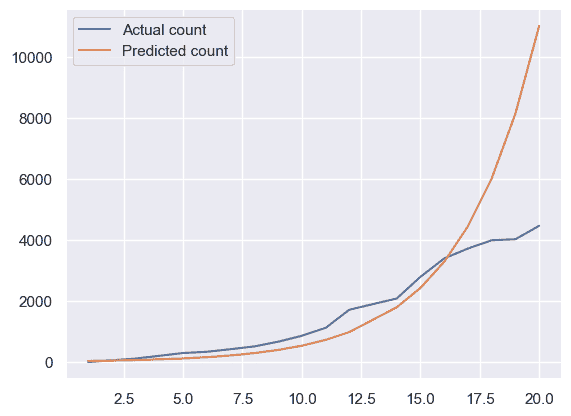

我们可以看到，该模型的预测在 2000 年至 2016 年间是合理的，但之后开始与现实产生偏差。

### 涡轮机数据线性回归：贝叶斯方法

```py
ok_turbines
```

加载中...

在贝叶斯范式中，我们将未知系数视为随机变量，并根据观测到的数据计算它们的后验分布。虽然我们可以在 PyMC 中实现整个模型，但 Bambi 包在 PyMC 之上提供了一个便捷的层，让我们可以用更少的代码指定模型。我们将使用 `bmb.Model` 类，它接收一个公式、一个数据框和一个模型族（目前，我们将坚持使用 `gaussian` 族进行普通最小二乘法）。公式的形式为 `y ~ predictor1 + predictor2 + ...`，其中每个变量都是所提供数据框中的列名。以下是我们如何实现上述模型：

```py
# The y-values are in the column `log_totals`, and the x-values are in the column `year`. So:
gaussian_model = bmb.Model(formula='log_totals ~ year', data=ok_turbines, family="gaussian")
gaussian_trace = gaussian_model.fit(random_seed=0)
```

```py
Auto-assigning NUTS sampler...
Initializing NUTS using jitter+adapt_diag...
Multiprocess sampling (4 chains in 4 jobs)
NUTS: [sigma, Intercept, year] 
```

加载中...加载中...

```py
Sampling 4 chains for 1_000 tune and 1_000 draw iterations (4_000 + 4_000 draws total) took 1 seconds. 
```

我们可以使用 `arviz` 库的 `plot_posterior` 函数查看结果：

```py
az.plot_posterior(gaussian_trace)
plt.tight_layout()
```

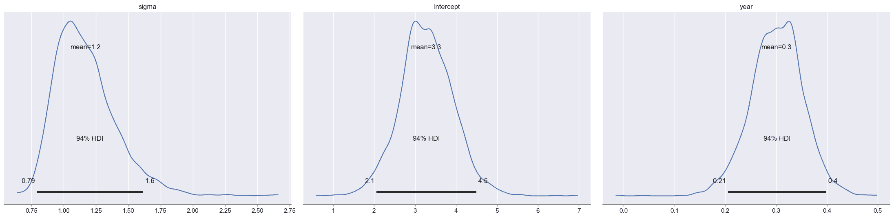

前两行各自代表一个系数。第三行 `log_totals_sigma` 是数据点围绕平均预测值的估计标准差。左列显示了该系数的后验分布（通过对样本直方图使用[核密度估计](https://en.wikipedia.org/wiki/Kernel_density_estimation)得出），右列显示了在哈密顿蒙特卡洛采样过程中获得的样本轨迹。

观察 `year` 系数（第二行）的后验分布，我们发现结果与频率学派版本相似：最大后验估计和最小均方误差估计都在 0.3 左右。通过检查直方图，我们应该预期在后验分布下，该系数通常会在 0.2 到 0.4 之间，超出此范围的值可能性相当低。这种不确定性是合理的：由于我们仅从十七个数据点估计这些系数，因此在我们估计的系数中存在一些不确定性是合理的。和之前一样，我们可以在数据背景下解释这些估计：每年，涡轮机的数量大约以 1.3 的倍数增长。

当我们使用采样进行推断时，可以将每个样本视为一条回归线：每个样本都有一个 `intercept` 值、一个 `year` 的系数值，以及一个残差的估计 $\sigma$。因此，我们可以将每个样本绘制成一条线：

```py
def identity(x):
    return x

def plot_posterior_samples(trace, turbines_df, num_lines=40, show_logy=True):
    f, ax = plt.subplots(1, 1)
    intercept = trace.posterior['Intercept'].values.flatten()
    slope = trace.posterior['year'].values.flatten()
    indices = np.random.choice(np.arange(slope.size), num_lines, replace=False)
    if show_logy:
        y_func = identity
    else:
        y_func = np.exp

    for i in indices:
        pred = y_func(intercept[i] + slope[i] * turbines_df['year'])
        ax.plot(turbines_df['year'], pred, color='gray', alpha=0.3)

    ax.scatter(turbines_df['year'], y_func(turbines_df['log_totals']))
    ax.set_xlabel('Years since 2000')
    if show_logy:
        ax.set_ylabel('log(turbine count)')
    else:
        ax.set_ylabel('turbine count')
```

```py
plot_posterior_samples(gaussian_trace, ok_turbines, show_logy=True)
```

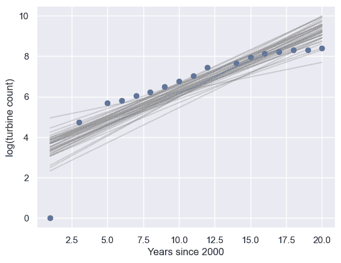

```py
np.identity?
```

```py
plot_posterior_samples(gaussian_trace, ok_turbines, show_logy=False)
```

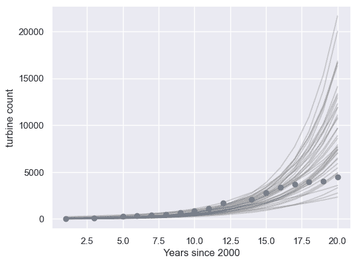

这些图表帮助我们看出，在对数尺度上，许多直线的斜率过高，这很可能是由于 $t=0$ 处的离群值造成的。这对应于在观察计数时，2016 年之后出现了过快的指数增长。

需要注意的是，这仅向我们展示了**平均**预测 `截距 + 系数 * 年份` 的不确定性：它没有展示平均预测周围变异的不确定性。具体来说，请记住，我们通过假设 $y \sim \mathcal{N}(X\beta, \sigma² I)$ 来获得线性回归的预测。这些线向我们展示了平均预测 $X\beta$ 的不确定性，但没有展示估计的方差 $\sigma$ 有多大：我们稍后会回到这一点。

**练习**：*你如何构建类似的图表来可视化之前频率学派结果的不确定性？*

#### 先验分布在哪里？

你可能已经注意到，我们刚刚实现了一个贝叶斯模型，但从未指定任何先验分布。在这种情况下，Bambi 会为我们选择“合理”的默认值，其灵感来源于 R 库 `rstanarm`。这些默认值被选为弱信息先验，它们不会对系数应为何值编码太多信息。

你可以在 [`rstanarm` 文档](https://cran.r-project.org/web/packages/rstanarm/vignettes/priors.html#default-weakly-informative-prior-distributions)中阅读更多关于这些默认选择的信息。

### 线性回归总结

我们看到线性回归可以在频率学派和贝叶斯学派两种范式中实现：归根结底，两种方法都为我们提供了估计的系数，以及一些不确定性的度量。我们可以使用这些系数来解释模型（如上所述），并为新的数据点进行预测。

我们看到，在使用线性回归进行预测时，我们首先将每个特征乘以其对应的系数，将它们全部相加以获得平均预测，并假设该平均值周围存在一些随机性。

为了从数据中确定系数，我们可以采用频率学派或贝叶斯学派的方法。在频率学派范式中，我们使用如最大似然估计（MLE）这样的频率学派方法进行估计；在贝叶斯学派范式中，我们则使用样本近似系数的后验分布（以观测数据为条件）。

在本章的剩余部分，我们将在频率学派和贝叶斯学派范式之间来回切换，以阐述各自的思想。

## 超越线性回归：广义线性模型

上述回归模型在 2016 年之前的年份中表现尚可，但它没有考虑到我们预测的变量是一个整数（意味着其取值为 $0, 1, 2, 3, \ldots$）。当我们说 $y|\beta \sim N(X\beta, \sigma² I)$，并对 $y$ 使用对数变换数据时，我们隐含地假设了 $y$ 永远不可能为 0。我们将首先提出一个问题：能否使用一种专门为此类数据设计的不同似然函数？在回答这个问题时，我们将探讨广义线性模型的两个例子：泊松回归和负二项回归。

### 泊松回归

*您可能会发现复习[《Data 140》教材的第 7.1 节](http://prob140.org/textbook/content/Chapter_07/01_Poisson_Distribution.html)会有所帮助，该节涵盖了泊松分布。*

回想一下，[泊松分布](https://en.wikipedia.org/wiki/Poisson_distribution)是一种关于计数和类计数值的分布。它有一个*正的*参数 $\lambda$，代表其均值（同时也是方差）。

在泊松回归中，我们将假设每个观测值 $y_i$​ 服从泊松似然，并使用线性组合 $x_i^T\beta$ 来帮助确定参数。泊松分布仅对正的参数值有定义，但 $x_i^T\beta$ 可能为负。有几种方法可以将可能为负的值转换为正值，以便用作参数（例如，取绝对值、平方等），但受上一节中对输出进行对数变换的启发，我们将采用指数变换。

因此，我们将使用 $\exp(x_i^T \beta)$ 作为均值。我们可以写出观测数据点 $y_i$​ 的似然函数：

$y_i | \beta \sim \text{Poisson}(\exp(x_i^T \beta))$ (3)

和之前一样，我们可以使用这个似然模型在频率学派或贝叶斯学派的框架下估计系数 $\beta$。在本节中，我们将选择采用贝叶斯方法，主要是为了利用我们在上一节编写的 `plot_posterior_samples` 函数来帮助我们可视化模型中的不确定性。

使用 Bambi，从线性回归切换到泊松回归相当简单：

```py
poisson_model = bmb.Model(formula='totals ~ year', data=ok_turbines, family='poisson')
poisson_trace = poisson_model.fit(random_seed=0)
```

```py
Auto-assigning NUTS sampler...
Initializing NUTS using jitter+adapt_diag...
Multiprocess sampling (4 chains in 4 jobs)
NUTS: [Intercept, year] 
```

正在加载...正在加载...

```py
Sampling 4 chains for 1_000 tune and 1_000 draw iterations (4_000 + 4_000 draws total) took 1 seconds. 
```

```py
az.plot_posterior(poisson_trace)
plt.tight_layout()
```

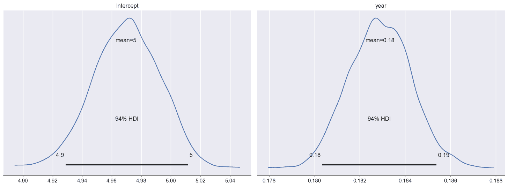

将此与高斯模型的结果进行比较，我们可以看到两个系数的后验分布**显著**变窄了。此外，`year`的系数值似乎小得多：之前的后验分布中心大约在 0.3，而现在整个分布似乎都紧密地集中在 0.183 附近。

```py
np.exp(0.183)
```

`1.2008144080808307`

这仅对应于 $20\%$ 的平均增长率，而我们之前模型的平均增长率为 $35\%$3。较低的增长率似乎是合理的：回想一下，线性回归得出的曲线增长过快，尤其是在 2016 年之后。但是，结果中的确定程度令人担忧：考虑到我们只有 17 个数据点，我们的结果应该包含更多的不确定性。我们可以使用 `plot_posterior_samples` 函数将每个样本绘制成一条线/曲线，来可视化模型是多么“过度自信”：

```py
plot_posterior_samples(poisson_trace, ok_turbines, show_logy=True)
```

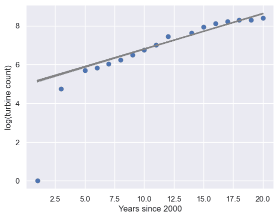

```py
plot_posterior_samples(poisson_trace, ok_turbines, show_logy=False)
```

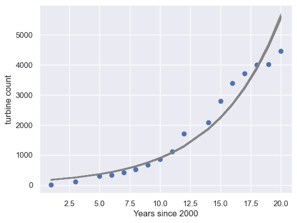

和之前一样，重要的是要记住，这些线只向我们展示了平均预测 $X\beta$ 中的估计不确定性：我们并没有可视化泊松模型本身所显示的任何不确定性。

为什么结果如此不同？

让我们思考一下选择泊松似然时所隐含的假设。特别是，泊松分布的一个重要特性是其均值等于其方差。因此，虽然线性模型可以允许平均预测为 $\log(N) = 4$ 且方差为 1.5，但泊松分布要求均值和方差必须相同。

这个问题因泊松分布建模的是真实计数而非对数计数而加剧：换句话说，考虑 2018 年，当时涡轮机数量约为 4000。均值为 4000 的泊松分布方差为 4000，换句话说，标准差仅为 63 左右。

显然，泊松分布对于拟合这些数据来说是一个糟糕的选择！当一个模型假设的方差低于数据中实际存在的方差时（就像这个泊松模型所做的那样），我们称数据为**过度离散**：这意味着相对于模型的假设，数据过于分散。为了解决这个问题，我们应该选择一个不同的分布，它能够让我们同时控制方差和均值。

这在之前的正态似然中不是问题：因为正态分布有独立的均值和方差参数，我们可以分别选择它们来反映方差可能高于均值这一事实。

### 负二项回归

[负二项分布](https://en.wikipedia.org/wiki/Negative_binomial_distribution)也是一种计数分布，但它允许比泊松分布更复杂的情况。我们可以从以下两种方式之一来理解它：

+   它是$r$ 个[几何随机变量]之和，每个变量的参数为$p$（成功概率）。

+   如果均值参数（上方的$\lambda$）也是随机的，那么它就像泊松分布。

负二项分布有多种不同的参数化方法。我们如何选择使用哪一种？答案有两个：

1.  我们需要一种允许我们选择均值的参数化方法，因为我们希望$y_i$​的均值为$\exp(x_i^T \beta)$（换句话说，我们想做几乎与泊松回归相同的事情，但我们希望对观测值使用负二项分布而非泊松分布）。

1.  由于我们通过 Bambi 使用 PyMC，因此受限于它所支持的参数化方式。

尽管该分布的形式明显更复杂，且操作它需要更多工作，但在回归模型中使用它仅需对我们之前所做的进行微小改动：

```py
negbin_model = bmb.Model(formula='totals ~ year', data=ok_turbines, family='negativebinomial')
negbin_trace = negbin_model.fit(random_seed=0)
```

```py
Auto-assigning NUTS sampler...
Initializing NUTS using jitter+adapt_diag...
Multiprocess sampling (4 chains in 4 jobs)
NUTS: [alpha, Intercept, year] 
```

加载中...加载中...

```py
Sampling 4 chains for 1_000 tune and 1_000 draw iterations (4_000 + 4_000 draws total) took 1 seconds. 
```

```py
np.sqrt(4000)
```

`63.245553203367585`

```py
ok_turbines
```

加载中...

```py
az.plot_posterior(negbin_trace)
plt.tight_layout()
```

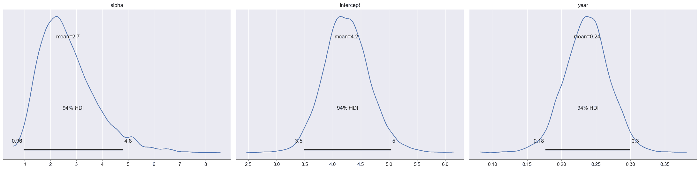

此处，`year`系数的后验分布范围更广，均值约为 0.24：

```py
np.exp(0.24)
```

`1.2712491503214047`

这大约对应 27%的增长率。我们可以可视化推断中系数的**不确定性**：

```py
plot_posterior_samples(negbin_trace, ok_turbines, show_logy=True)
```

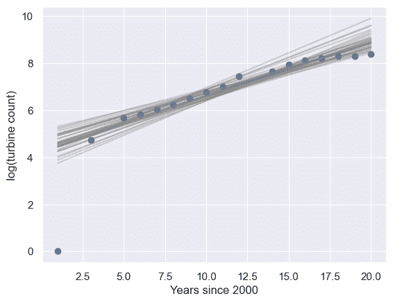

```py
plot_posterior_samples(negbin_trace, ok_turbines, show_logy=False)
```

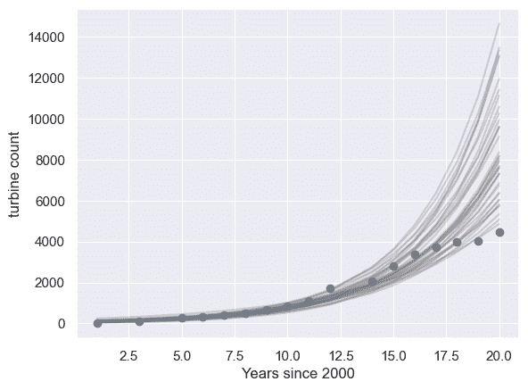

这似乎是一个整体上更好的拟合：各条线/曲线中的**不确定性**与观测数据相匹配，表明在给定观测数据的情况下，大多数预测线在某种程度上是合理的。再次重要的是要记住，这里可视化的不确定性仅在于平均预测，我们并未可视化负二项模型中估计方差的不确定性。

比较泊松模型和负二项模型，两者非常相似：

+   两种模型都采用了特征和系数的线性组合，其系数值有些相似

+   两种模型都使用指数函数对线性组合的结果进行了变换

关键区别在于我们对平均预测值周围观测数据点的似然模型：泊松模型假设了泊松分布，其方差由均值决定。而负二项模型则假设了负二项分布，其方差可以作为我们模型中的一个单独变量从数据中推断出来。这使得负二项模型能够更好地捕捉平均预测中的不确定性。

**练习**：*使用 `statsmodels` 在频率主义范式下实现泊松回归和负二项回归。结果相似吗？*

*提示：你可能会发现使用 `sm.families.Poisson()` 和 `sm.families.NegativeBinomial()` 很有帮助。*

## 广义线性模型

到目前为止，你已经在贝叶斯框架下看到了四种不同的回归模型：

+   线性回归，用于预测实值输出

+   逻辑回归，用于预测二元输出（分类）

+   泊松回归，用于预测计数

+   负二项回归，用于预测计数

让我们回顾一下它们的共同点和不同点：

1.  对于所有四种模型，计算我们对 $y_i$​ 的预测都始于计算 $x_i^T \beta$。这部分是 $x_i$​ 的一个*线性*函数，即使我们之后会对其进行非线性处理。

1.  每种模型都有一个不同的函数，我们用它来计算 $y_i$​ 从 $x_i^T \beta$ 得出的平均值。由于这个函数将线性变换后的输入 $x$ 与输出 $y$ 联系起来，你可能会期望我们称它为**链接函数**：这很有道理。然而，惯例恰恰相反，我们称它为**逆链接函数**。正如你从这个名字可能猜到的那样，**链接函数**是逆链接函数的逆。

1.  对于每一种情况，我们为数据点的似然使用了不同的分布。在所有情况下，该分布的均值始终是上述逆链接函数的输出。

下表总结了我们所见过的四个版本中，关于似然和链接函数的不同选择：

| 回归 | 逆链接函数 | 链接函数 | 似然 |
| --- | --- | --- | --- |
| 线性 | 恒等 | 恒等 | 高斯 |
| 逻辑回归 | sigmoid | [logit](https://en.wikipedia.org/wiki/Logit) | 伯努利 |
| 泊松回归 | 指数 | 对数 | 泊松 |
| 负二项回归 | 指数 | 对数 | 负二项 |

这些思想构成了所谓**广义线性模型**（GLMs）的基础。一旦我们选择了链接函数和似然分布，我们的模型就完全确定了，并且我们可以近似$\beta$中系数的后验分布。

### GLM 工作流程

使用 GLM 进行预测时，通常遵循以下一般步骤：

1.  通过确定您要预测的内容（$y$）以及用于预测它的内容（$x$）来**构建您的预测问题**。这取决于您试图解决的实际问题，以及可能有哪些数据可以帮助您解决它。

1.  以$(x, y)$对的形式**收集训练数据**。这可能需要在公开数据、您有权访问的私有或专有数据集中进行搜索，甚至可能需要外出收集新数据或付费收集数据。重要的是确保您收集的任何数据$x$ 对于预测$y$ 是有用的。在这一步，确定您可能想要计算的任何特征也很有帮助，特别是那些可能从$x$ 的现有列中推导出来的特征。

1.  为您的数据**选择一个合理的链接函数和似然模型**。例如，如果您的输出是二元的，那么逻辑回归可能比较合适。如果您的输出是计数值，那么泊松回归或负二项回归可能是一个很好的选择。您可以在[维基百科的广义线性模型页面](https://en.wikipedia.org/wiki/Generalized_linear_model#Link_function)上看到更多可能性。

1.  **使用训练数据拟合模型**：这通常涉及使用 Bambi、statsmodels 或`scikit-learn`等软件包，通过计算确定在训练数据集上有效的模型系数。

1.  **检查模型是否确实对数据拟合良好**：这一步通常称为模型检验，旨在确保模型能够并将在你的数据集上做出良好的预测。我们将在下一节深入探讨模型检验。

1.  **解释系数**：广义线性模型（GLMs）的一个优势在于其系数具有直观的解释性。在线性回归中，系数告诉我们，如果对应的预测变量增加一定量，输出预测值会增加多少。我们在本节前面看到，在泊松回归和负二项回归（或对$y$ 值进行对数变换的线性回归）中，系数表示的是乘以$\exp(\beta)$倍的倍增效应。在逻辑回归中，系数告诉我们对数几率增加了多少。

1.  根据新的$x$ 值，为$y$ 未知的新数据**生成新的预测**。通常，我们使用预测模型来帮助预测未来的数据点。这些预测是通过将我们在步骤 4 中学到的系数乘以新数据点的预测变量，并应用逆链接函数来完成的。这通常由计算处理：大多数用于拟合模型的软件包也具备为新数据点进行预测的能力。

1.  **报告系数和新预测的不确定性**：由于我们使用带有固有不确定性的随机数据来拟合模型，因此从这些数据中得出的任何结果也都具有不确定性。这包括我们在步骤 4 中拟合并在步骤 6 中解释的估计系数，以及我们在步骤 7 中做出的新预测。我们将在本章后面花更多时间讨论如何量化不确定性。
