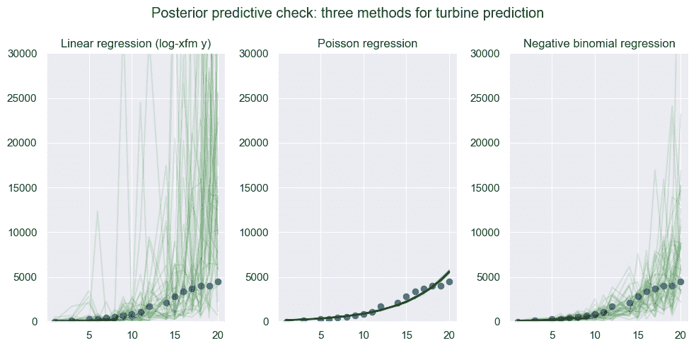

# 模型检验与评估

> 原文：[`data102.org/ds-102-book/content/chapters/03/model-checking`](https://data102.org/ds-102-book/content/chapters/03/model-checking)

[<svg viewBox="0 0 24 24" fill="currentColor" aria-hidden="true" width="1.25rem" height="1.25rem" class="myst-fm-license-cc-icon myst-fm-license-cc-icon-main inline-block mx-1"><title>内容许可：知识共享 署名-相同方式共享 4.0 国际许可协议 (CC-BY-SA-4.0)</title></svg><svg viewBox="0 0 24 24" fill="currentColor" aria-hidden="true" width="1.25rem" height="1.25rem" class="myst-fm-license-cc-icon myst-fm-license-cc-icon-by inline-block mr-1"><title>必须为创作者署名</title></svg><svg viewBox="0 0 24 24" fill="currentColor" aria-hidden="true" width="1.25rem" height="1.25rem" class="myst-fm-license-cc-icon myst-fm-license-cc-icon-sa inline-block mr-1"><title>演绎作品必须基于相同条款共享</title></svg>](https://creativecommons.org/licenses/by-sa/4.0/)[](https://github.com/ds-102/ds-102-book "GitHub 仓库：ds-102/ds-102-book")[](https://github.com/ds-102/ds-102-book/edit/main/ds-102-book/content/chapters/03/04_model_checking.ipynb "编辑此页面")

```py
import numpy as np
import pandas as pd
from IPython.display import YouTubeVideo

import statsmodels.api as sm
import pymc as pm
import arviz as az
import bambi as bmb

%matplotlib inline

import matplotlib.pyplot as plt
import seaborn as sns

# Turn off logging (console output) for PyMC
import logging
logging.getLogger("pymc").setLevel(logging.ERROR)

sns.set()
```

将模型拟合到数据时，一个重要的问题是：**这个模型能很好地代表数据吗**？

在本节中，我们将从频率派和贝叶斯的角度来回答这个问题。

我们将从两个角度考虑模型评估：

1.  我们的模型是否很好地拟合了我们用来拟合它们的数据（在预测的情况下，即我们的训练数据）？

1.  我们的模型（尤其是预测模型）能否很好地泛化到新的、以前未见过的数据？

在制定和拟合模型时，回答这两个问题都很重要。在实践中，通常更容易先回答（并调试/迭代）第一个问题，然后再处理第二个问题。

```py
YouTubeVideo('RlQNAjvm55A')
```

加载中...

## 频率派模型检验

在频率派框架下，我们常使用**拟合优度**指标来评估模型。让我们回顾一下用于预测俄克拉荷马州涡轮机数量的三个不同模型：

```py
# Load and preprocess the data
turbines = pd.read_csv('turbines.csv')
# The "year" column contains how many years since the year 2000
turbines['year'] = turbines['p_year'] - 2000
turbines = turbines.drop('p_year', axis=1)
# Turbines in Oklahoma from 2000 on
ok_filter = (turbines.t_state == 'OK')
ok_turbines = turbines[ok_filter].sort_values('year')

ok_turbines = ok_turbines[ok_turbines['year'] > 0]
ok_turbines["totals"] = np.cumsum(ok_turbines["t_built"])
# Log-transform the counts, too
ok_turbines["log_totals"] = np.log(ok_turbines["totals"])
ok_turbines
```

加载中...

```py
gaussian_model_intercept = sm.GLM(
    np.log(ok_turbines.totals), sm.add_constant(ok_turbines.year),
    family=sm.families.Gaussian()
)
gaussian_results = gaussian_model_intercept.fit()
print(gaussian_results.summary())
```

```py
 Generalized Linear Model Regression Results                  
==============================================================================
Dep. Variable:                 totals   No. Observations:                   17
Model:                            GLM   Df Residuals:                       15
Model Family:                Gaussian   Df Model:                            1
Link Function:               Identity   Scale:                          1.1810
Method:                          IRLS   Log-Likelihood:                -24.472
Date:                Sun, 12 Oct 2025   Deviance:                       17.716
Time:                        14:29:10   Pearson chi2:                     17.7
No. Iterations:                     3   Pseudo R-squ. (CS):             0.9131
Covariance Type:            nonrobust                                         
==============================================================================
                 coef    std err          z      P>|z|      [0.025      0.975]
------------------------------------------------------------------------------
const          3.2602      0.590      5.526      0.000       2.104       4.417
year           0.3023      0.047      6.435      0.000       0.210       0.394
============================================================================== 
```

```py
poisson_model_freq = sm.GLM(
    ok_turbines.totals, sm.add_constant(ok_turbines.year),
    family=sm.families.Poisson()
)
poisson_results = poisson_model_freq.fit()
print(poisson_results.summary())
```

```py
 Generalized Linear Model Regression Results                  
==============================================================================
Dep. Variable:                 totals   No. Observations:                   17
Model:                            GLM   Df Residuals:                       15
Model Family:                 Poisson   Df Model:                            1
Link Function:                    Log   Scale:                          1.0000
Method:                          IRLS   Log-Likelihood:                -755.42
Date:                Sun, 12 Oct 2025   Deviance:                       1366.3
Time:                        14:29:10   Pearson chi2:                 1.20e+03
No. Iterations:                     5   Pseudo R-squ. (CS):              1.000
Covariance Type:            nonrobust                                         
==============================================================================
                 coef    std err          z      P>|z|      [0.025      0.975]
------------------------------------------------------------------------------
const          4.9697      0.023    219.386      0.000       4.925       5.014
year           0.1829      0.001    132.547      0.000       0.180       0.186
============================================================================== 
```

```py
negbin_model_freq = sm.GLM(
    ok_turbines.totals, sm.add_constant(ok_turbines.year),
    family=sm.families.NegativeBinomial()
)
negbin_results = negbin_model_freq.fit()
print(negbin_results.summary())
```

```py
 Generalized Linear Model Regression Results                  
==============================================================================
Dep. Variable:                 totals   No. Observations:                   17
Model:                            GLM   Df Residuals:                       15
Model Family:        NegativeBinomial   Df Model:                            1
Link Function:                    Log   Scale:                          1.0000
Method:                          IRLS   Log-Likelihood:                -134.14
Date:                Sun, 12 Oct 2025   Deviance:                       7.1483
Time:                        14:29:10   Pearson chi2:                     1.90
No. Iterations:                    11   Pseudo R-squ. (CS):             0.6999
Covariance Type:            nonrobust                                         
==============================================================================
                 coef    std err          z      P>|z|      [0.025      0.975]
------------------------------------------------------------------------------
const          4.2059      0.544      7.725      0.000       3.139       5.273
year           0.2389      0.043      5.514      0.000       0.154       0.324
============================================================================== 
```

```py
/Users/ramesh/anaconda3/lib/python3.11/site-packages/statsmodels/genmod/families/family.py:1367: ValueWarning: Negative binomial dispersion parameter alpha not set. Using default value alpha=1.0.
  warnings.warn("Negative binomial dispersion parameter alpha not " 
```

### 使用对数似然进行模型比较

我们比较这三种模型的第一种方法是查看**对数似然**$\log(p(y|\beta, x))$。我们在研究更简单的频率派模型时已经见过这个量。它描述了在给定特定系数$\beta$和预测变量$x$ 的情况下，观测到$y$ 值的可能性有多大。对于

对于这三种模型中的每一种，似然函数的具体形式各不相同：

1.  第一个对数似然描述了在假设线性回归的情况下，观测到对数变换后的$y$ 值的**密度**

1.  第二个对数似然描述了在假设具有指数逆连接函数的泊松模型的情况下，观测到原始$y$ 值作为计数的**概率**

1.  第三个对数似然描述了在假设具有指数逆连接函数的负二项式模型的情况下，观测到原始$y$ 值作为计数的**概率**

因此，我们可以将对数似然解释为：“根据特定模型，数据出现的可能性有多大？”

请注意，由于存在两个关键差异（连续与离散似然以及对数变换数据），我们无法直接将第一个模型的对数似然与后两个模型进行比较。但是，我们可以直接比较后两个对数似然，因为它们各自描述了根据两个不同模型，观测到**相同观测值**$y_1, \ldots, y_n$​的可能性有多大。正如我们在最大似然估计中看到的，有理由认为对数似然值更高的模型对数据的拟合更好。

比较这些模型，我们看到泊松模型的对数似然值为 -755，而负二项模型的对数似然值约为 -134。我们还知道，由于模型拟合的方式，这些值代表了各自模型族可能达到的最佳对数似然值。因此，我们可以合理地得出结论：在负二项式广义线性模型下，数据出现的可能性远高于在泊松广义线性模型下。

直观上，这与我们在贝叶斯设定中看到的情况一致：由于泊松似然的方差过低，远离预测平均值 $\hat{y}$​ 的值出现的可能性极低，因此模型为我们实际观测到的涡轮机计数分配了很低的概率。

请注意，任何模型的对数似然值本身并不能告诉我们该模型的性能。相反，它作为**比较应用于同一数据集的不同模型时的相对度量**是有用的。因此，一般来说，对数似然值告诉我们一个模型在特定数据集上的表现如何，并可用于比较不同模型对同一数据集的拟合程度。

### 使用卡方统计量进行模型评估

我们也可以使用卡方（$\chi²$）统计量来评估模型：在这里，数值越大越好。虽然完整细节超出了本课程的范围，但一般来说，我们预期卡方统计量大致等于数据点数减去参数个数。在上面的例子中，我们有 17 个数据点（观测值）和两个参数（斜率和截距），因此我们预期值应接近 15。

我们可以看到，线性模型（对 $y$ 值进行对数变换后）的卡方值为 17.7，非常接近 15，表明该模型能很好地拟合数据。而泊松模型的卡方值则高达 1200，表明拟合效果非常差。

#### 卡方统计量背后的直觉

*即将推出：请观看视频*

```py
YouTubeVideo('wTNETHYrUl8')
```

加载中...

## 贝叶斯模型检验

### 后验预测分布

考虑一个模型，其观测数据点为 $x_{1:n} = x_1, \ldots, x_n$​，并有一个未知参数，其似然函数为 $p(x_{1:n}|\theta)$，先验分布为 $p(\theta)$。像往常一样，我们假设数据点在给定 $\theta$ 的条件下是条件独立同分布的。到目前为止，我们一直专注于获得后验分布 $p(\theta|x_{1:n})$。

我们也可以考虑一个新数据点在给定所有先前数据点（在边缘化掉未知参数 $\theta$ 之后）的条件下的分布。这被称为**后验预测分布**，将是我们进行模型检验的主要工具：

$p(x_{n+1} | x_1, \ldots, x_n)$ (1)

我们如何计算后验预测分布？回顾上一段，我们更了解在给定 $\theta$ 的条件下 $x_{n+1}$​ 的分布，因此我们可以使用全概率公式：

$p(x_{n+1}|x_{1:n}) = \int p(x_{n+1}|x_{1:n}, \theta)p(\theta|x_{1:n})\, d\theta$ (2)

我们可以简化第一个条件分布，因为给定 $\theta$ 时，$x_{n+1}$​ 与 $x_{1:n}$​ 是条件独立的；换言之，$p(x_{n+1}|x_{1:n}, \theta) = p(x_{n+1}|\theta)$。第二个条件分布是 $\theta$ 的后验分布。因此：

$\begin{align*} p(x_{n+1}|x_{1:n}) &= \int p(x_{n+1}|x_{1:n}, \theta)p(\theta|x_{1:n})\, d\theta \\ &= \int p(x_{n+1}|\theta)p(\theta|x_{1:n})\, d\theta \\ &= \mathbb{E}_{\theta|x_{1:n}}\left[p(x_{n+1}|\theta)\right] \end{align*}$ ​(3)

实际上，精确计算这个积分与计算贝叶斯规则中的分母一样困难，因为我们必须对所有可能的$\theta$进行积分。对于高维$\theta$的情况，如前所述，积分可能无法计算！在实践中，我们通常用样本来近似后验分布，然后用它来近似后验预测分布。

具体来说，为了计算新数据点的后验预测分布，我们使用由样本定义的 $\theta|x_{1:n}$​ 的经验分布来计算上述期望。

换句话说，给定近似 $p(\theta|x_{1:n})$ 的样本 $\theta^{(1)}, \ldots, \theta^{(t)}$，我们可以：

+   **计算特定值** $x_{n+1}$​ **的后验预测分布**，通过对 $(1/t)\sum_{i=1}^t p(x_{n+1}|\theta^{(t)})$ 取平均。

+   **从后验预测分布中抽取一个样本**，方法是：

    +   首先，从 $\theta^{(1)}, \ldots, \theta^{(t)}$ 中均匀随机抽取一个样本，称之为 $\theta^*$；

    +   然后从基于该样本的条件似然中抽取，$p(x_{n+1}|\theta^*)$

### 使用 PPD 检查回归

在贝叶斯广义线性模型中，我们观测到的数据点是 $y$ 值 $y_1, \ldots, y_n$​。因此，PPD 是 $p(y_{n+1} | x_{n+1}, y_1, \ldots, y_n)$。注意，由于预测/回归问题的性质，我们以对应的 $x$ 值为条件。$x$ 是固定且已知的，而 $y_{n+1}$​ 将依赖于 $x_{n+1}$​。另一种理解方式是尝试回答这个问题：“如果不知道 $x_{n+1}$​，你将如何预测 $y_{n+1}$​，并且这样的预测是否有用？”

PyMC 为我们处理了设置后验预测检查的所有细节，因此我们可以定义以下函数来帮助可视化其抽取的样本。最关键的一行是 `model.predict(trace, kind='response')`，它指示 PyMC 通过从后验预测分布中抽样，为每个 $x$ 值生成预测。

*练习：你可以传递给 `model.predict()` 函数的 `kind=` 参数还有哪些其他可能的值，它们分别有什么作用？*

```py
def show_posterior_predictive(
    model, trace, turbines_df, 
    is_log_y=False, num_lines=40, ax=None
):
    if ax is None:
        _, ax = plt.subplots(1, 1)
    N = turbines_df.shape[0]
    # Adds posterior predictive samples to the trace
    model.predict(trace, kind='response')

    y_name = model.response_component.response.name
    # a num_samples x 17 array with num_samples different
    # predictions from the PPC
    pred_arr = trace.posterior_predictive[y_name].values.reshape(-1, N)
    if is_log_y:
        pred_arr = np.exp(pred_arr)

    for i in range(num_lines):
        ax.plot(
            turbines_df['year'], pred_arr[i], alpha=0.1, color='green'
        )

    ax.scatter(turbines_df['year'], turbines_df['totals'])
    # This value is hard-coded to help us see the PPCs for all 3
    # models on the same scale
    ax.set_ylim([0, 30000])
```

现在，让我们使用这个函数来可视化上一节中我们查看的三个模型的 PPC。

```py
# First, we need to set up and draw posterior samples for each model
gaussian_model = bmb.Model(formula='log_totals ~ year', data=ok_turbines, family='gaussian')
gaussian_trace = gaussian_model.fit(random_seed=0, progressbar=False)

poisson_model = bmb.Model(formula='totals ~ year', data=ok_turbines, family='poisson')
poisson_trace = poisson_model.fit(random_seed=0, progressbar=False)

negbin_model = bmb.Model(formula='totals ~ year', data=ok_turbines, family='negativebinomial')
negbin_trace = negbin_model.fit(random_seed=0, progressbar=False)

# Now, visualize the PPC using the function we just defined
f, axes = plt.subplots(1, 3, figsize=(10, 5))
show_posterior_predictive(gaussian_model, gaussian_trace, ok_turbines, is_log_y=True, ax=axes[0])
axes[0].set_title('Linear regression (log-xfm y)')

show_posterior_predictive(poisson_model, poisson_trace, ok_turbines, is_log_y=False, ax=axes[1])
axes[1].set_title('Poisson regression')

show_posterior_predictive(negbin_model, negbin_trace, ok_turbines, is_log_y=False, ax=axes[2])
axes[2].set_title('Negative binomial regression')

f.suptitle('Posterior predictive check: three methods for turbine prediction')
plt.tight_layout()
```



每条绿线代表后验预测分布的一个样本。我们可以将这些视为模型根据其表征所设想的可能数据序列。

观察结果，我们可以立即得出几点发现：

+   我们再次看到泊松回归过于自信：每个后验预测分布样本都落在（或极其接近）回归线上，观测到的变异性微乎其微。

+   另外两个模型的轨迹均呈现上下波动，而真实模式是单调非递减的。这是我们模型的一个弱点：具体来说，我们假设$y$ 值在条件上是独立同分布的。

+   线性回归的样本表现出极大的变异性：我们可以看到其中许多预测显示 2015 年起风电装机量远超 15,000 台，这远高于实际观测值。这表明模型允许的变异性过大。

+   负二项式模型的值域合理得多，至少在 2018 年之前如此。可以想象，在不同的政治经济环境下，俄克拉荷马州的风电装机量可能根据这些预测增加或减少。虽然该模型仍存在些许过度变异，但相比线性回归模型已合理许多。

注意以上所有分析都需要一定的主观判断和领域知识！在许多情况下，当每个唯一的$x$ 值对应的不是单一观测$y$ 值而是一组数据点时，我们可以从后验预测检查中得出量化评估，例如比较观测$y$ 值的方差与后验预测样本的方差，但此类方法的细节已超出本课程范围。

*练习：回顾 2000 年的异常值（$t=0$）影响了我们的预测，可能导致所有三个模型的斜率估计偏高。尝试从数据集中移除该异常值后重新拟合上述三个模型。结果是否发生变化？如何变化及原因何在？*
