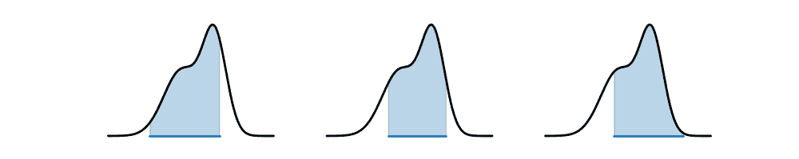

# 不确定性量化

> 原文：[`data102.org/ds-102-book/content/chapters/03/uncertainty-quantification`](https://data102.org/ds-102-book/content/chapters/03/uncertainty-quantification)

[<svg viewBox="0 0 24 24" fill="currentColor" aria-hidden="true" width="1.25rem" height="1.25rem" class="myst-fm-license-cc-icon myst-fm-license-cc-icon-main inline-block mx-1"><title>内容许可：知识共享 署名-相同方式共享 4.0 国际许可协议 (CC-BY-SA-4.0)</title></svg><svg viewBox="0 0 24 24" fill="currentColor" aria-hidden="true" width="1.25rem" height="1.25rem" class="myst-fm-license-cc-icon myst-fm-license-cc-icon-by inline-block mr-1"><title>必须为创作者署名</title></svg><svg viewBox="0 0 24 24" fill="currentColor" aria-hidden="true" width="1.25rem" height="1.25rem" class="myst-fm-license-cc-icon myst-fm-license-cc-icon-sa inline-block mr-1"><title>改编作品必须在相同条款下共享</title></svg>](https://creativecommons.org/licenses/by-sa/4.0/)[](https://github.com/ds-102/ds-102-book "GitHub 仓库：ds-102/ds-102-book")[](https://github.com/ds-102/ds-102-book/edit/main/ds-102-book/content/chapters/03/05_uncertainty_quantification.ipynb "编辑此页面")

```py
import numpy as np
import pandas as pd
from IPython.display import YouTubeVideo
from scipy import stats

import statsmodels.api as sm
import pymc as pm
import arviz as az
import bambi as bmb

%matplotlib inline

import matplotlib.pyplot as plt
import seaborn as sns

# Turn off logging (console output) for PyMC
import logging
logging.getLogger("pymc").setLevel(logging.ERROR)

sns.set()
```

我们处理的（几乎）每个数据集都存在一定程度的不确定性。从样本的随机性、测量误差、数据与其所代表的基础事实之间的差异，以及更多因素，都可能导致不确定性。

因此，任何我们使用数据**计算**得出的结果也会继承一些不确定性。所以，始终报告这种不确定性至关重要：

+   如果我们推断一个参数或趋势，就应当报告推断中的不确定性。

+   如果我们做出预测，就应当报告预测中的不确定性。

+   如果我们得出结论，就应当报告结论中的不确定性。

尽管从频率派和贝叶斯视角看，不确定性量化的表现形式略有不同，但上述核心理念在任何情况下都成立。

## 频率派不确定性量化

在频率派框架下，我们将数据视为随机的，而将未知量视为固定的。因此，我们量化的任何不确定性都仅针对数据！我们**不能**做出诸如“*未知量很可能在...范围内*”或“*参数为...的概率是...*”这样的陈述。

尽管这些表述可能更直观，并且可能符合我们在量化不确定性时想要表达的意思，但它们只有在为未知量建立概率模型的背景下才有意义：我们必须采用贝叶斯方法才能做出此类表述。

在频率论框架下，我们量化不确定性的主要方式是利用估计量的分布。具体来说，当我们用估计量 $\hat{\theta} = f(x_1, \ldots, x_n)$ 来估计某个参数 $\theta$ 时，该估计量是随机的，因为它依赖于随机数据（即使 $\theta$ 是固定的）。因此，我们可以利用 $\hat{\theta}$ 的分布来量化不确定性。

我们已经知道，如果掌握了 $\hat{\theta}$ 的分布，我们就可以构建一个**置信区间**，这能让我们了解如果观测到不同的数据集，我们的估计量可能会有多大变化。但在构建之前，我们需要先确定 $\hat{\theta}$ 的分布。

```py
YouTubeVideo('ZDqSXtm0vBM')
```

加载中...

### 利用中心极限定理进行不确定性量化

*关于中心极限定理的更多内容，请参阅 [Data 140 教材第十四章](https://data140.org/textbook/content/Chapter_14/00_The_Central_Limit_Theorem.html)。*

如果我们想利用 $\hat{\theta}$ 的分布来量化不确定性，那么首先要回答的问题是：“$\hat{\theta}$ 的分布是什么？”

当$\theta$为样本均值时，我们可以用统计学中最优美的结果之一来回答这个问题：**中心极限定理**。简而言之，该定理指出，若$\hat{\mu}$是数据点$x_1, \ldots, x_n$的样本均值，其中每个$x_i$的均值为$\mu$且（有限）方差为$\sigma²$，则$\hat{\mu}$的分布会收敛于一个均值为$\mu$、方差为$\sigma²/n$的正态分布。

请注意，类似的结果适用于任何最大似然估计！虽然细节超出了本课程的范围，但可以证明，如果 $\hat{\theta}_{MLE}$​ 是基于数据点 $x_1, \ldots, x_n$​ 对某个参数 $\theta$ 的最大似然估计，那么 $\hat{\theta}_{MLE}$​ 的分布**也**收敛于正态分布，其均值为 $\theta$，方差为 $1/(nI(\theta))$。这里，$I(\theta)$ 是似然函数的[费希尔信息](https://en.wikipedia.org/wiki/Fisher_information)，它量化了每个 $x_i$​ 为我们提供的关于 $\theta$ 的信息量。

虽然具体细节（例如，费希尔信息）超出了本课程的范围，但关键要点很重要：

渐近地（即当观测数量变得非常大时），**最大似然估计量的分布，如同样本均值的分布一样，收敛于正态分布**。

```py
YouTubeVideo('TiqwK0YYrNo')
```

加载中...

### 使用自助法进行不确定性量化

*你可能会发现复习[《Data 8》教材的第 13.2 章](https://inferentialthinking.com/chapters/13/2/Bootstrap.html)会很有帮助，该章节涵盖了自助法。*

在许多情况下，我们可能无法解析地计算出 $\hat{\theta}$ 的分布。在这些情况中的某些部分，我们可以使用**自助法**来量化不确定性。

#### 自助法的局限性

自助法在大多数情况下效果良好，但并非适用于所有情况。以下是一些关于何时使用（以及何时不使用）它的指导原则：

+   当单个样本的存在与否不会显著改变估计值时（例如，对于最小值或最大值，这种情况则不适用），自助法是一个**很好**的选择。

+   当数据点数量非常少时，自助法是一个**很好**的选择。

+   当待估计参数数量 $d$ 远小于数据点数量 $n$ 时（例如，对于神经网络，我们估计的参数数量非常庞大，这种情况则不适用），自助法是一个**很好**的选择。

```py
YouTubeVideo('hmQAc5VMBDY')
```

加载中...

```py
YouTubeVideo('ZQfrPKruYLg')
```

加载中...

### 置信区间

*你可能会发现回顾[Data 8 教材的第 13.3 节](https://inferentialthinking.com/chapters/13/3/Confidence_Intervals.html)会很有帮助，该节涵盖了置信区间。*

置信区间基于估计量的分布，提供了关于我们估计器不确定性的度量。请记住，置信区间提供的是关于过程（而非固定未知参数位置）的保证。具体来说，对于一个 95%的置信区间，我们知道 95%的数据集会产生包含真实参数的区间。但我们不知道我们的区间恰好是幸运的 95%之一，还是不幸的 5%之一。

```py
YouTubeVideo('Zn9NqVID-qg')
```

加载中...

### GLM 中的不确定性：比较系数区间与预测区间

在量化广义线性模型（GLMs）中的不确定性时，必须牢记不确定性有多个来源。例如，考虑我们从数据 $(x_1, y_1), \ldots, (x_n, y_n)$ 计算得出的系数估计值 $\hat{\beta}$​。这些是给定观测数据的最大似然估计值，因此其本身具有固有的不确定性。换句话说，如果我们观测到不同的数据集，可能会得到一组不同的估计系数 $\hat{\beta}$​。

现在，考虑我们对一个新数据点的预测估计值 $\hat{y}_{n+1}$​。为简化起见，我们将重点讨论标量 $x$ 的线性回归。在这种情况下，我们可以将新值 $y_{n+1}$​ 的分布写为：

$\hat{y}_{n+1} \sim \mathcal{N}\left(\hat{\beta}_0 + \hat{\beta}_1 x_{n+1}\,,\, \sigma²\right)$ (1)

这里存在两种不确定性来源：(1) 系数估计量 $\hat{\beta}$​ 的不确定性；以及 (2) 观测值的不确定性及其偏离平均预测值（即预测线）的程度，这由 $\sigma$ 量化。

因此，如果我们想为 $\hat{\beta}_0$​ 构建一个置信区间，我们只需要考虑第一种不确定性来源。但是，如果我们想为 $\hat{y}_{n+1}$​ 构建一个置信区间，我们需要考虑**两种**不确定性来源！这第二种区间通常被称为**预测区间**。

### 使用自助法量化广义线性模型中的不确定性

*文本即将推出：请参阅视频*

```py
YouTubeVideo('73I1wfQfmf4')
```

正在加载...

## 贝叶斯不确定性量化

在贝叶斯框架下，我们将未知参数视为随机变量。这意味着我们可以做出诸如“未知量很可能在 A 和 B 之间”的陈述，而这在频率主义框架下是无法实现的。

### 可信区间

这引出了**可信区间**的定义。对于参数 $\theta$，一个 $p\%$ 可信区间 $(a, b)$ 表示，在给定观测数据的情况下，参数 $\theta$ 落在 $a$ 和 $b$ 之间的概率为 $p\%$。例如，假设我们为 $\theta$ 生成了一个 $90\%$ 可信区间 $(0.3, 1.7)$。这告诉我们，根据观测数据，$\theta$ 在 0.3 和 1.7 之间的概率是 0.9，等价于 $\int_{0.3}^{1.7} p(\theta|x_1, \ldots, x_n) d\theta = 0.9$（假设 $\theta$ 是连续的）。

请注意，这个定义比置信区间要简单得多！这是采用贝叶斯方法的一个优势：将未知量视为随机变量，使我们能够对其取特定值的概率做出直观的陈述。

```py
YouTubeVideo('nGeZ7G34jPI')
```

正在加载...

然而，这个定义的一个问题是它**不唯一**！确实，对于给定的置信度/可信度水平，存在许多可能的可信区间。考虑以下分布，以及三个可能的 $80\%$ 可信区间。对于所有这三个区间，蓝色阴影区域的总面积都是 $80\%$，因此它们都是有效的 $80\%$ 可信区间。你更倾向于哪一个？



中间的那个似乎最吸引人：它覆盖了最高密度的区域，并且也是最窄的。这引出了**最高密度区间（HDI）**的定义，有时也称为最高后验密度（HPD）区间。HDI 是给定可信度/置信度水平下最窄的区间。

*练习：最高密度区间总是唯一的吗？如果不是，那么我们可以对后验分布施加什么约束来确保其唯一性？*

我们可以看到，在第 3.3 节中看到的区间是 PyMC 自动为我们构建的 HDI。

```py
YouTubeVideo('8ozFH1ZN7Qw')
```

加载中...

### 从样本构建最高密度区间

给定一个闭式后验分布，我们可以解析地找到 $a$ 和 $b$ 以最小化区间宽度。但在实践中，我们很少能得到闭式后验分布：我们通常最终会用样本来近似它们。那么，我们如何用样本来找到 HDI 呢？

让我们用一个来自 Beta 分布随机变量的样本做一个简单的例子：

```py
num_samples = 200
distribution = stats.beta(3, 4)
samples = distribution.rvs(num_samples)
samples[:5]
```

`array([0.37568015, 0.3054924 , 0.40978748, 0.10349559, 0.17014057])`

将这些样本称为$\theta_1, \ldots, \theta_{100}​。我们可以通过排序样本，选择任意满足$(j-i)/200 = 0.9$ 的$i$ 和$j$，并报告$[\theta_i, \theta_j]$来构建一个$90\%$的可信区间：

```py
sorted_samples = np.sort(samples)
(i1, j1) = (10, 190)
(i2, j2) = (15, 195)
credible_interval_1 = (sorted_samples[i1], sorted_samples[j1])
credible_interval_2 = (sorted_samples[i2], sorted_samples[j2])
print(credible_interval_1)
print(credible_interval_2)
```

```py
(0.12893626829279511, 0.7639256588702239)
(0.16097668346313884, 0.8235097328985005) 
```

我们如何找到最高密度区间？我们可以简单地搜索所有宽度为$200 \times 0.9 = 180$ 的区间，并找出最窄的那个。

```py
credibility = 0.9
narrowest_start_so_far = -1
narrowest_width_so_far = np.inf
interval_samples = int(num_samples * credibility)
for start in range(20): # Make sure you understand why we can stop at 20!
    end = start + interval_samples
    width = sorted_samples[end] - sorted_samples[start]
    if width < narrowest_width_so_far:
        narrowest_start_so_far = start
        narrowest_width_so_far = width
print((
    sorted_samples[narrowest_start_so_far],  
    sorted_samples[narrowest_start_so_far + interval_samples]
))
```

```py
(0.1028881402605869, 0.7219133542569751) 
```

### 预测的贝叶斯不确定性量化

正如在频率主义世界中一样，在贝叶斯广义线性模型中，我们也可以为预测构建可信区间！这些区间将使用后验预测密度构建，并继承未知系数推断中的不确定性，以及线性回归中类似$\sigma$等参数推断中的不确定性。

```py
YouTubeVideo('9wtfEgpIn8k')
```

加载中...
