# 非参数化方法

> 原文：[`data102.org/ds-102-book/content/chapters/03/nonparametric`](https://data102.org/ds-102-book/content/chapters/03/nonparametric)

[<svg viewBox="0 0 24 24" fill="currentColor" aria-hidden="true" width="1.25rem" height="1.25rem" class="myst-fm-license-cc-icon myst-fm-license-cc-icon-main inline-block mx-1"><title>内容许可：知识共享 署名-相同方式共享 4.0 国际 (CC-BY-SA-4.0)</title></svg><svg viewBox="0 0 24 24" fill="currentColor" aria-hidden="true" width="1.25rem" height="1.25rem" class="myst-fm-license-cc-icon myst-fm-license-cc-icon-by inline-block mr-1"><title>必须注明原作者</title></svg><svg viewBox="0 0 24 24" fill="currentColor" aria-hidden="true" width="1.25rem" height="1.25rem" class="myst-fm-license-cc-icon myst-fm-license-cc-icon-sa inline-block mr-1"><title>改编作品必须在相同条款下共享</title></svg>](https://creativecommons.org/licenses/by-sa/4.0/)[](https://github.com/ds-102/ds-102-book "GitHub 仓库：ds-102/ds-102-book")[](https://github.com/ds-102/ds-102-book/edit/main/ds-102-book/content/chapters/03/06_nonparametric.ipynb "编辑此页面")

## 定义

“参数化”和“非参数化”这两个术语有多种不同的含义。我们将定义其中两种，并只关注其中之一：

**定义 1（统计学中更常用）：这是我们在 Data 102 课程中重点关注的定义**

+   一种**参数化**方法是指我们对数据点之间的关系做出特定假设：例如，在线性回归中，我们假设目标变量 $y$ 是输入预测变量 $x_1, \ldots, x_n$​ 的线性函数。

+   一种**非参数化**方法是指我们不对目标变量与预测变量之间的关系做任何假设：相反，我们只致力于找到进行预测的最佳可能方式。

根据此定义，线性回归是参数方法的一个例子，因为我们假设（a）预测变量、系数和结果之间存在线性关系，并且（b）平均预测周围存在[同方差性](https://en.wikipedia.org/wiki/Homoscedasticity_and_heteroscedasticity)的正态分布噪声。另一方面，$k$ 近邻是非参数方法的一个例子：我们不对$x$ 或$y$ 的分布做任何假设，我们的预测仅基于训练集中的$k$ 个最近邻。

**定义 2（计算机科学中更常用）：**

+   **参数**模型是指参数数量（例如回归系数数量等）有限，且不随输入数据规模变化的模型。

+   **非参数**模型是指参数数量无限，或随数据点数量增加的模型。

在深入了解非参数方法之前，我们将首先将它们置于本书迄今为止讨论过的参数方法（以及你可能在之前的统计学和数据科学课程中花费大量时间学习的参数方法）的背景下。

```py
from IPython.display import YouTubeVideo
YouTubeVideo('DcjHq-5jpko')
```

加载中...

## 比较与对比：逻辑回归与$k$ 近邻

为了理解这两种不同分类方法的优缺点，我们将创建一个简单的合成数据集，并比较两个我们已经熟悉的模型：逻辑回归（参数方法）和$k$ 近邻分类（非参数方法）。

### 一个玩具数据集

我们将设置一个训练数据集，其点位于较小范围内，以及一个测试数据集，其点位于较大范围内，以帮助我们理解这些方法的泛化能力。

```py
import numpy as np
import matplotlib.pyplot as plt

%matplotlib inline

import seaborn as sns
sns.set()
```

```py
N_test = 500
N_train = 150

np.random.seed(2024)

# Create a training dataset
X_train = np.random.uniform(-1, 1, [N_train, 2])
y_train = (X_train[:, 0] * X_train[:, 1] > 0).astype(np.int64)

# Create a test dataset
X_test = np.random.uniform(-3, 3, [N_test, 2])
y_test = (X_test[:, 0] * X_test[:, 1] > 0).astype(np.int64)

def draw_results(x, color, plot_title='', ax=None, is_final=True):
    if ax is None:
        f, ax = plt.subplots(1, 1)
    img = ax.scatter(x[:, 0],x[:, 1], c=color, cmap='viridis', alpha=0.7);
    plt.colorbar(img, ax=ax)
    ax.set_title(plot_title)
    ax.axis('equal')
    ax.set_xlabel('$x_1$')
    ax.set_ylabel('$x_2$')
    if is_final:
        plt.tight_layout()
```

```py
draw_results(X_train, color=y_train, plot_title='Training data')
draw_results(X_test, color=y_test, plot_title='Test data (ground truth)')
```

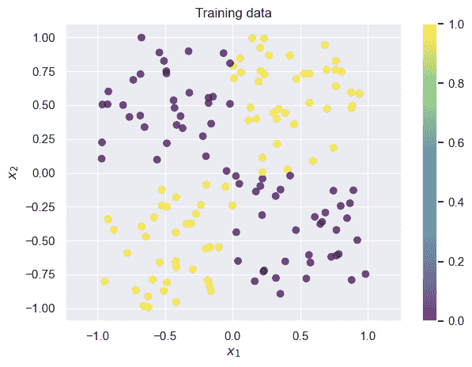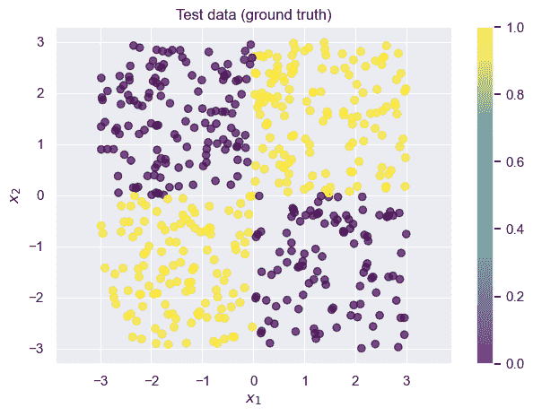

我们常称此类数据集为“玩具数据集”：它们有助于说明问题，但过于简化。真实数据集通常噪声更多、维度更高且更复杂。每当看到玩具数据集的示例时，务必记住你的数据集中可能存在额外的复杂性。

### 将逻辑回归应用于玩具数据集

令 $p$ 为基于 $x_1$​ 和 $x_2$​ 预测 $y$ 为 1 的概率。那么逻辑回归的公式是：

$p = \sigma(\beta_1 x_1 + \beta_2 x_2) \\ \underbrace{\log\left(\frac{p}{1-p}\right)}_{\text{logit: inverse sigmoid}} = \beta_1 x_1 + \beta_2 x_2$ ​(1)

回想一下，逻辑回归试图找到一个关于 $x_1$​ 和 $x_2$​ 的线性函数作为决策边界。在这种情况下，这对应于在上图中画一条线。不幸的是，对于这个数据集，几乎不可能找到任何准确率超过 $50\%$（即随机猜测）的线性决策边界：花点时间，通过在上图中想象画线来让自己确信这一点。

```py
def fit_and_predict_and_draw_results(
    model_class, model_args, model_name, X_train, X_test, y_train, y_test
):
    model = model_class(**model_args)
    model.fit(X_train, y_train)

    # Use the model to predict on the test set
    probs = model.predict_proba(X_test)[:, 1]
    y_hat = (probs > 0.5).astype(np.int64)

    f, axes = plt.subplots(1, 2, figsize=(10, 4.5))
    # Visualize the results
    draw_results(
        X_test, color=probs, ax=axes[0],
        plot_title=f"Predicted P(y=1) ({model_name})",
        is_final=False,
    )

    draw_results(
        X_test, color=y_hat, ax=axes[1],
        plot_title=f"Prediction ({model_name})"
    )

    accuracy = np.mean(y_test == y_hat)
    print(f"Accuracy on test set: {accuracy}")
    return model
```

```py
from sklearn.linear_model import LogisticRegression
fit_and_predict_and_draw_results(
    LogisticRegression, dict(penalty=None, solver='lbfgs'), 'logistic regression', 
    X_train, X_test, y_train, y_test
);
```

```py
Accuracy on test set: 0.626 
```

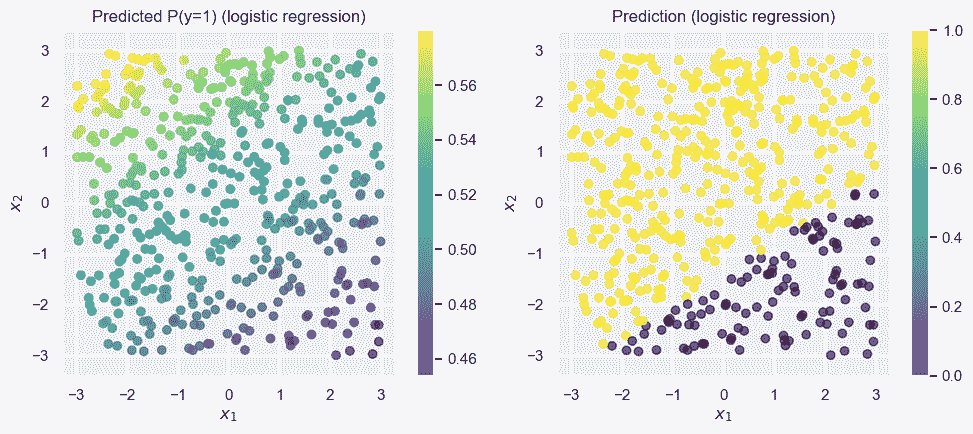

正如预期的那样，整体准确率接近 0.5（如果我们完全随机预测，也会得到这个结果）。对于这些数据，逻辑回归（不做任何特征工程）是一个*糟糕的*选择。

### 将$k$ 近邻分类器应用于玩具数据集

回想一下，$k$ 近邻分类器根据训练集中$k$个最近邻点的标签对每个点进行分类。

```py
from sklearn.neighbors import KNeighborsClassifier
fit_and_predict_and_draw_results(
    KNeighborsClassifier, dict(n_neighbors=3), 'kNN', 
    X_train, X_test, y_train, y_test
);
```

```py
Accuracy on test set: 0.952 
```

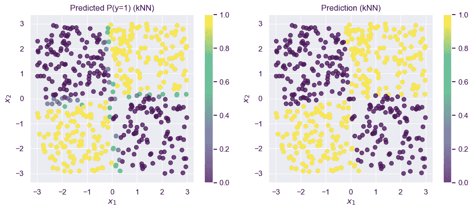

kNN 模型在这个数据集上表现好得多。最棒的是，我们无需进行任何特征工程或参数调优：它开箱即用。

```py
from IPython.display import YouTubeVideo
YouTubeVideo('YCfdENsb_YI')
```

加载中...

```py
from IPython.display import YouTubeVideo
YouTubeVideo('AfBgttM7wFc')
```

加载中...

### 逻辑回归与$k$ 近邻的优缺点

让我们来探讨这两种方法的一些优缺点。请注意，这远非详尽列表！

#### 逻辑回归

**优点**：

+   简单模型，每个输入特征只有一个参数（本例中为 2 个）。

+   参数可以很容易地用有意义的方式解释：系数$\beta_2$​告诉你“如果特征$x_2$​增加一定量$a$，则$y=1$ 的对数几率增加$\beta_2 a$。”

+   损失函数是凸函数，因此存在一个最佳答案，并且我们保证能够找到它。

+   存储/保存模型的成本很低，因为只有少数几个参数。

**缺点**

+   隐含地假设输入之间存在线性交互（例如，无法建模像$y = \text{sign}(x_1 x_2)$这样的关系）。

+   建模复杂或非线性交互需要良好的特征工程。

+   基础模型的复杂度有限：任何复杂/非线性交互都需要大量的特征工程。

#### $k$-最近邻

**优点**：

+   对数据不做任何假设（除了训练数据是代表性样本）

+   易于实现和理解其工作原理

**缺点**

+   预测结果可以解释，但我们无法进行比“这个新点看起来像我之前见过的这 5 个点，其中 3 个有 $y=1$，所以我预测 $y=1$”更有意义的分析。

+   在高维空间中效果不佳（但有一些解决方法）

+   保存模型需要保存所有训练点（但有一些解决方法）

```py
from IPython.display import YouTubeVideo
YouTubeVideo('SoDiaODgEDQ')
```

加载中...

## 决策树和随机森林

### 决策树

决策树是一种用于分类和回归的方法，它使用树状结构来决定对某个点预测什么值。我们从整个数据开始。在树的根节点，我们将根据 $x_1$​ 或 $x_2$​ 的特定值来分割数据。然后，我们对每个分割重复这个过程，根据需要构建尽可能深的树。我们分割点的目标是在树的叶子节点处创建尽可能同质的组（就 $y$ 而言）。让我们看看如何为这个问题构建决策树。

1.  我们的第一次分割是最困难的：我们可以看到，无论选择$x_1$​（或$x_2$​）的哪个值，分割的两边都会有一半黄点和一半紫点。但是，我们知道在$x_1 > 0$ 的点和$x_1 < 0$ 的点之间存在有意义的差异，因此我们选择在$x_1 = 0$ 处进行第一次分割。（我们同样可以选择$x_2 = 0$：选择$x_1$​是任意的，尽管阈值 0 的选择并非如此）。

1.  让我们从考虑上述分割的一半开始：即$x_1 > 0$ 的点，也就是上面图中的右半部分。对于这些点，在$x_2 = 0$ 处有一个非常自然的分割，能给我们完全同质的组：分割线上方的所有点都是黄色的（$y=1$），下方的所有点都是紫色的（$y=0$）。至此，我们完成了树这一分支的分割：两个子分支都是完全同质的。

1.  接下来，我们将回到 $x_1 < 0$ 的区域。结果表明，我们可以使用与之前相同的分割点，即在 $x_2 = 0$ 处。通常，决策树赋予我们在树的这一侧进行不同分割的灵活性！只是在这个玩具数据集中，相同的子分割（$x_2 = 0$）在我们原始分割（$x_1 = 0$）的两侧都适用。

现在，我们完成了。这是整棵树：

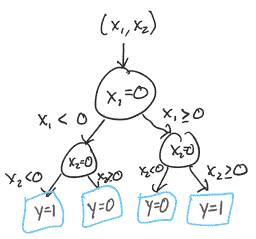

要预测一个新点的 $y$ 值，我们从根节点（顶部）开始，持续向下直到到达叶节点。这棵树最终非常对称，但在许多问题中情况并非如此。

```py
from IPython.display import YouTubeVideo
YouTubeVideo('sjfqHalgC9E')
```

加载中...

在 scikit-learn 中的实现方式如下：

```py
from sklearn.tree import DecisionTreeClassifier
fit_and_predict_and_draw_results(
    DecisionTreeClassifier, {}, 'decision tree', 
    X_train, X_test, y_train, y_test
);
```

```py
Accuracy on test set: 0.99 
```

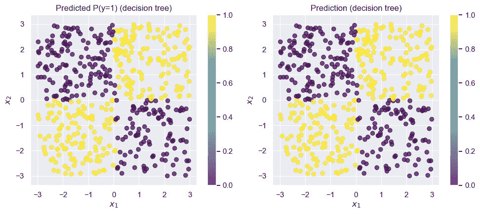

该决策树近乎完美。

### 噪声数据：决策树何时失效

对于底层结构简单的问题，小型决策树效果很好。但如果我们的数据噪声更多呢？让我们随机翻转一些数据点（训练数据的 $10\%$），看看会发生什么：

```py
y_train_noisy = y_train.copy()

pts_to_flip = np.random.random(N_train) < 0.1
y_train_noisy[pts_to_flip] = 1 - y_train_noisy[pts_to_flip]

draw_results(X_train, color=y_train_noisy, plot_title='Training data with noise')
```

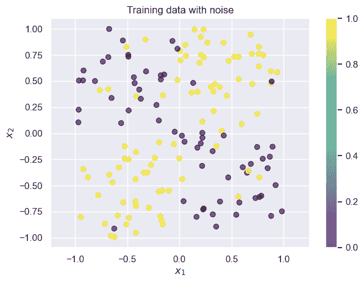

现在有少数几个点的训练标签是错误的。让我们再次尝试拟合一个决策树：我们将在噪声数据上训练，但会在干净数据上测试，以便评估模型是否能克服噪声学习到真实模式。

```py
# Note that we use the noisy training data from above by passing in `y_train_noisy`
fit_and_predict_and_draw_results(
    DecisionTreeClassifier, {}, 'decision tree trained on noisy data', 
    X_train, X_test, y_train_noisy, y_test
);
```

```py
Accuracy on test set: 0.746 
```

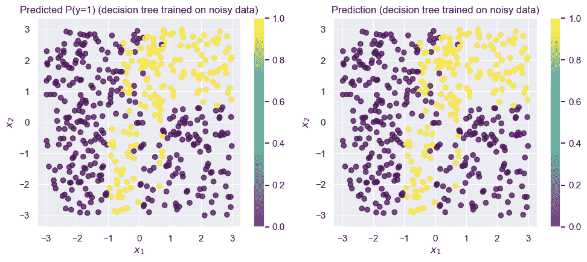

仅仅改变 $10\%$ 的数据点就完全破坏了这棵树！我们的准确率下降到了大约 $75\%$。虽然这是一个示例数据集，但在现实世界的数据集中，看到 $10\%$ 的数据被噪声污染并不罕见。

## 随机森林

我们将通过使用随机森林而非决策树来解决这个问题。随机森林基于决策树构建，并应用了两个关键思想：**自助聚合（Bagging）** 和**随机特征选择**。

### 自助聚合（Bagging）

我们将通过使用多棵树而非仅一棵树来解决这个问题：这被称为**集成学习**。我们将分别训练每棵树，然后在进行预测时结合它们的决策。理想情况下，我们会为每棵树获取一个全新的数据集并分别训练。不幸的是，我们通常无法获得那么多独立的数据集，而且如果我们将训练数据集分成 100 份，就会损失可用于训练每棵树的宝贵数据。

但是，我们已经知道了一种解决方法：可以使用自助法！请注意，这里我们使用自助法的目的与之前完全不同：不是用它来量化不确定性，而是用它来减轻数据中噪声的影响。这被称为**自助聚合（Bootstrap AGGregation）**，简称**Bagging**。

### 随机特征选择

第二个重要思想是**随机特征选择**。在这个示例中，我们一直使用两个特征 $x_1$​ 和 $x_2$​。但在许多实际问题中，你可能拥有数百甚至数千个特征。使用我们上面的算法，要让决策树正确处理这么多特征，它必须非常深（因为每个相关特征都需要一个节点/分裂点）。由于我们使用多棵树，我们不需要每棵树都完美。因此，我们将为每棵树只选择一个特征子集。

在实践中，对于 $K$ 个特征，人们通常在**回归**任务中每棵树使用 $K/3$ 个特征，而在**分类**任务中每棵树使用 $\sqrt{K}$​ 个特征。

那么，随机森林算法的工作原理如下：我们独立训练大量决策树，其中每棵树都在数据的自助采样样本和较少的特征子集上进行训练。

```py
X_train.shape
```

`(150, 2)`

```py
from sklearn.ensemble import RandomForestClassifier
fit_and_predict_and_draw_results(
    RandomForestClassifier, {}, 'random forest trained on noisy data', 
    X_train, X_test, y_train_noisy, y_test
);
```

```py
Accuracy on test set: 0.958 
```

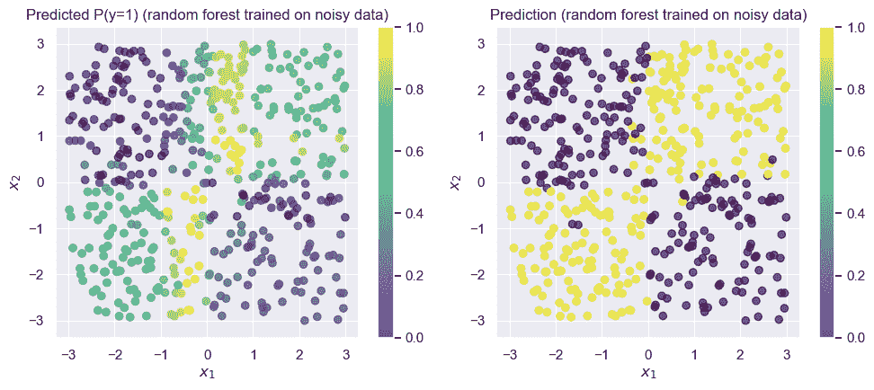

随机森林达到了 $95\%$ 的训练准确率。请记住，我们训练数据中的标签准确率仅为 $90\%$，因此这里的 $95\%$ 非常令人印象深刻！

这里有很多重要的细节我们尚未涉及。其中一些（例如，选择树的数量）是我们必须通过交叉验证等方法决定的超参数，而另一些（例如，在建树过程中每次迭代时如何决定最佳分割点）是算法的重要组成部分，超出了本课程的范围。

```py
from IPython.display import YouTubeVideo
YouTubeVideo('CZObqvT_gWU')
```

加载中...

## 可解释性

我们如何解释我们开发的模型？让我们看看之前已经计算出的结果，但现在我们也将解释模型本身。

### 解释逻辑回归

在逻辑回归（或任何广义线性模型）中，我们解释模型的主要方式是查看系数。如前面章节所讨论的，我们可以通过“如果 $x_i$​ 增加 $t$，那么 $LinkFunction(y)$ 增加 $\beta_i \times t$来解释系数 $\beta_i$​。在逻辑回归的情况下，这对应于对数几率增加 $t \times \beta_i$​。因此，让我们通过使用 `sklearn` 线性模型的 `.coef_` 属性来查看逻辑回归模型的系数：

```py
logistic_model = fit_and_predict_and_draw_results(
    LogisticRegression, dict(penalty=None, solver='lbfgs'), 'logistic regression', 
    X_train, X_test, y_train, y_test
);
print('Coefficients:', logistic_model.coef_)
```

```py
Accuracy on test set: 0.626
Coefficients: [[-0.03490349  0.05527346]] 
```


这告诉我们，对于 $x_1$​ 增加 1，对数几率减少 0.03。不幸的是，这种解释毫无意义，因为模型并未准确反映数据中的模式！这是一个重要的教训：模型的解释，充其量，只能和模型本身一样好。

### 使用特征工程解释逻辑回归

到目前为止，我们一直将逻辑回归描绘成对此问题的一个糟糕选择。但实际上，线性模型完全有能力在存在非线性模式时进行预测：我们只需要使用**特征工程**来定义好的特征。

对于这个特定问题，特征 $x_1 \times x_2$​ 将特别有用，因为它捕捉了对问题最重要的非线性交互作用。我们将其作为预测变量矩阵的第三列添加，然后尝试逻辑回归：

```py
from sklearn.linear_model import LogisticRegression
# Create a new feature: x1 * x2
def add_mult_feature(X):
    """Returns an array like X, but with a new feature that's X1 * X2"""
    new_feature = X[:, 0] * X[:, 1]
    return np.hstack([X, new_feature[:, None]])

# Define new versions of X with the extra feature
X_train_feat = add_mult_feature(X_train)
X_test_feat = add_mult_feature(X_test)

logistic_model_feats = fit_and_predict_and_draw_results(
    LogisticRegression, dict(penalty=None, solver='lbfgs'), 'logistic regression w/ $x_1 * x_2$ feat', 
    X_train_feat, X_test_feat, y_train, y_test
);
```

```py
Accuracy on test set: 0.996 
```

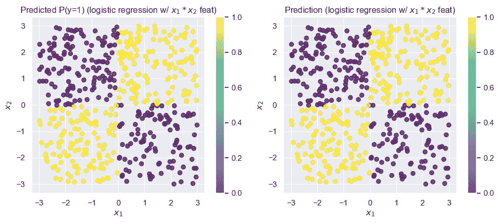

不出所料，这个模型的表现*好得多*！既然我们已经解决了模型准确性的问题，现在来看看是否能解释这些系数：

```py
logistic_model_feats.coef_
```

`array([[ 277.36746859, -56.97829336, 19397.32580951]])`

这告诉我们，$x_1$​或$x_2$​单独增加只会导致对数几率发生相对较小的变化。但是，第三个特征$x_1 \times x_2$​的系数却大了三个数量级！我们可以将其解释为：$x_1 \times x_2$​的增加会导致对数几率大幅增加，这正是我们观察数据时发现的模式：$x_1 \times x_2$​为正值时标记为“1”，为负值时标记为“0”。

### 解释 k-最近邻的预测

观察 kNN 模型的预测结果时，要得出与之前使用 GLM 系数时相同的广泛结论要困难得多。要对 kNN 分类器的行为做出一般性陈述，我们必须能够理解所有的训练数据点。在这个简单的二维示例中，或许可以通过观察决策边界来实现。但在更高维度中，这就困难得多了！正因如此，我们说 kNN 分类器的**可解释性**较差。

与其试图整体解释模型，我们不如只关注单个预测。对于 kNN 分类器做出的任何单个预测，我们总是可以提供促成该决策的训练集中$k$ 个最近邻点及其各自的标签。这通常能为了解预测为何以特定方式做出提供重要见解。我们将这些称为针对每个单独预测的**解释**。

```py
from sklearn.neighbors import KNeighborsClassifier
fit_and_predict_and_draw_results(
    KNeighborsClassifier, dict(n_neighbors=3), 'kNN', 
    X_train, X_test, y_train, y_test
);
```

```py
Accuracy on test set: 0.952 
```


考虑在 $(0.2, -2.9)$ 附近被错误分类的点。如果我们问为什么这个点被错误分类，答案就在训练集中。

```py
draw_results(X_train, color=y_train, plot_title='Training data')
```


我们可以看到，在我们的训练数据集中，第四象限的左下部分相当稀疏。如果我们考虑 $(0.2, -2.9)$ 处的点，我们可以看到它很可能与第三象限底部附近的“1”（黄色）点等距！这就是导致错误分类的原因。

因此，对于从 k-近邻分类器获得的任何预测，我们都可以得到一个**解释**，即使模型本身并不那么易于**解释**。

### 解释决策树

决策树是可解释的吗？我们会看到答案取决于树的大小。我们将从在干净（无噪声）数据集上训练的树开始：

```py
from sklearn.tree import DecisionTreeClassifier
tree_model = fit_and_predict_and_draw_results(
    DecisionTreeClassifier, {}, 'decision tree', 
    X_train, X_test, y_train, y_test
);
```

```py
Accuracy on test set: 0.99 
```


```py
from sklearn.tree import plot_tree

plt.figure(figsize=(12, 8))
plot_tree(tree_model, fontsize=12, filled=True, feature_names=['x1', 'x2']);
```

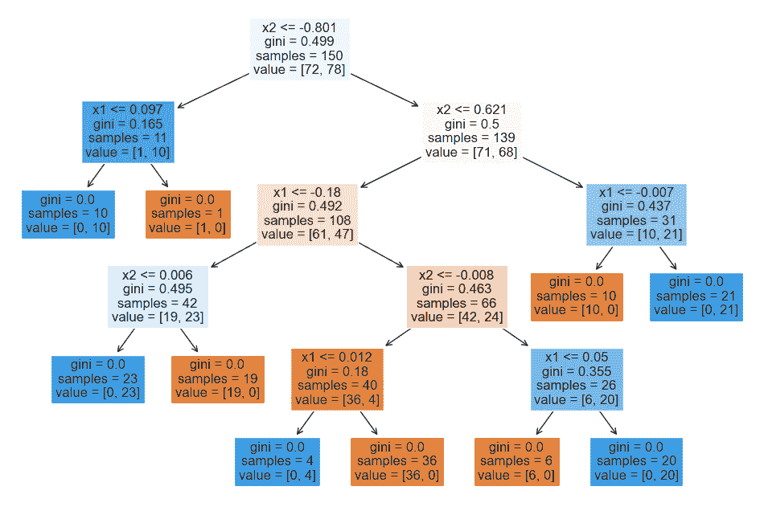

虽然由于初始分割的任意性，树的顶部有些反直觉，但我们可以看到较低的层很容易解释：我们在接近 0 的 $x_1$​ 和 $x_2$​ 值处进行分割。

那么，在数据的噪声版本上训练的树呢？

```py
from sklearn.tree import DecisionTreeClassifier
tree_model_from_noisy_y = fit_and_predict_and_draw_results(
    DecisionTreeClassifier, {}, 'decision tree', 
    X_train, X_test, y_train_noisy, y_test
);
```

```py
Accuracy on test set: 0.746 
```

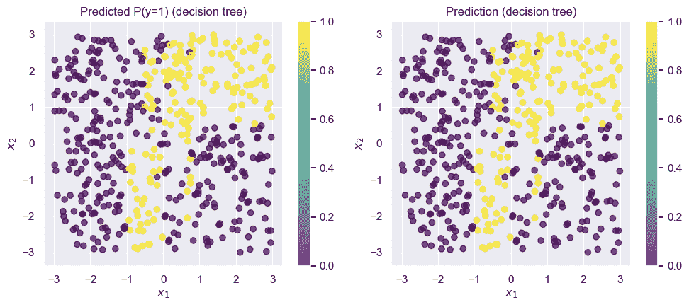

```py
plt.figure(figsize=(20, 20))
plot_tree(
    tree_model_from_noisy_y,
    fontsize=12, 
    filled=True, 
    feature_names=['x1', 'x2']
);
```

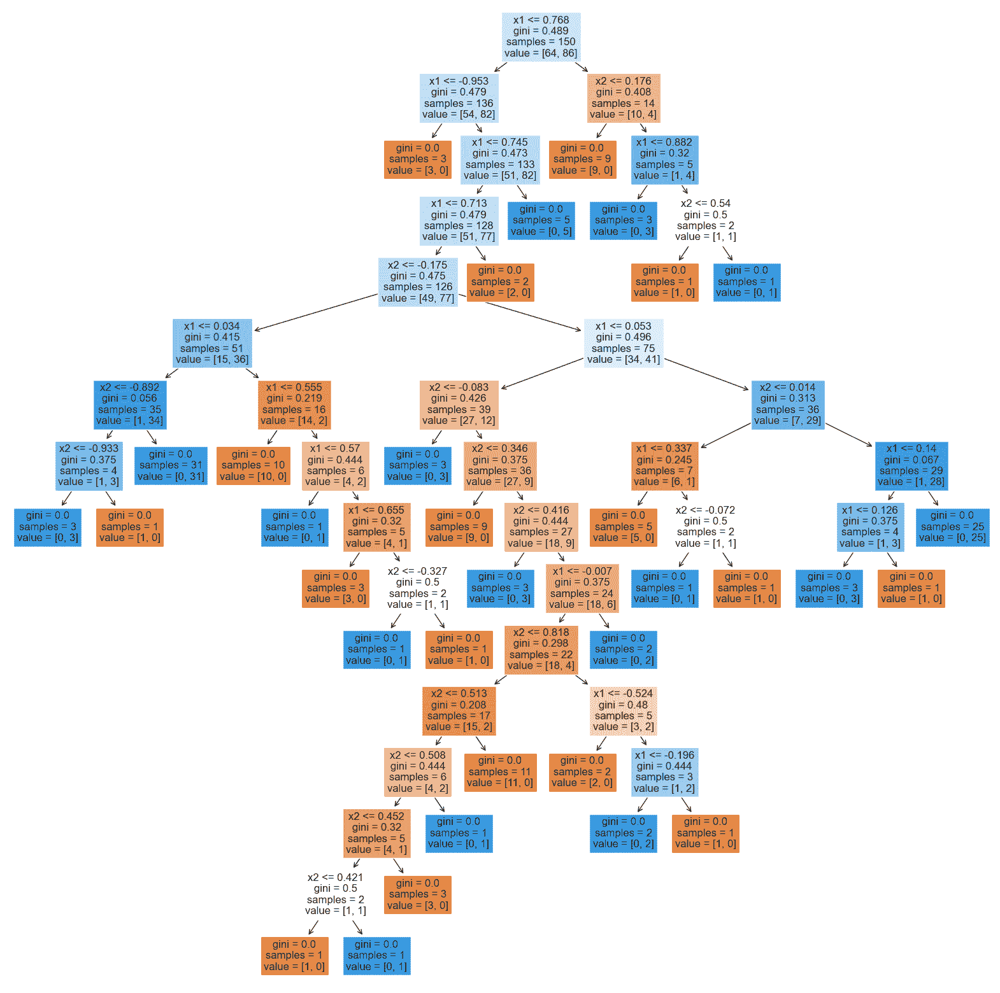

这棵树**非常**难以解释！追踪任何单个预测都可能需要我们向下深入多达 15 层：而且，这仅仅是一个简单的二维玩具数据集！在更高维度的真实世界数据集中，树可能更深。

### 解释随机森林

不幸的是，随机森林甚至更糟：我们不是解释一个可能很大的树，而是必须同时解释数百棵树！这是随机森林的一个关键弱点：虽然它们通常能达到很高的准确率，但往往难以解释。

```py
from IPython.display import YouTubeVideo
YouTubeVideo('5vrzxIyGU4w')
```

加载中...

### 黑盒模型的解释

*即将推出*

```py
from IPython.display import YouTubeVideo
YouTubeVideo('1odBKmKSPG0')
```

加载中...
