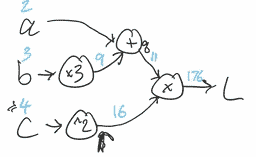
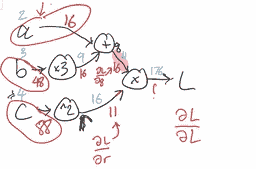

# 神经网络与反向传播

> 原文：[`data102.org/ds-102-book/content/chapters/03/neural-networks`](https://data102.org/ds-102-book/content/chapters/03/neural-networks)

[<svg viewBox="0 0 24 24" fill="currentColor" aria-hidden="true" width="1.25rem" height="1.25rem" class="myst-fm-license-cc-icon myst-fm-license-cc-icon-main inline-block mx-1"><title>内容许可：知识共享 署名-相同方式共享 4.0 国际 (CC-BY-SA-4.0)</title></svg><svg viewBox="0 0 24 24" fill="currentColor" aria-hidden="true" width="1.25rem" height="1.25rem" class="myst-fm-license-cc-icon myst-fm-license-cc-icon-by inline-block mr-1"><title>必须为创作者署名</title></svg><svg viewBox="0 0 24 24" fill="currentColor" aria-hidden="true" width="1.25rem" height="1.25rem" class="myst-fm-license-cc-icon myst-fm-license-cc-icon-sa inline-block mr-1"><title>演绎作品必须基于相同条款共享</title></svg>](https://creativecommons.org/licenses/by-sa/4.0/)[](https://github.com/ds-102/ds-102-book "GitHub 仓库：ds-102/ds-102-book")[](https://github.com/ds-102/ds-102-book/edit/main/ds-102-book/content/chapters/03/07_neural_networks.ipynb "编辑此页面")

神经网络是一类非常强大的方法，在计算机视觉和自然语言处理等领域已变得非常流行，在这些领域中，设计出好的特征可能具有挑战性。

虽然神经网络有着丰富的数学基础，但在本课程中，我们将重点关注大多数神经网络实现的核心计算思想之一：**反向传播**和**自动微分**。虽然这些思想最初是为神经网络构思的，但现在它们也以许多其他方式被使用：像 PyMC 这样的库使用自动微分来进行高效的贝叶斯推断；等等。

一般来说，对于任何解决方案涉及计算梯度的问题，自动微分和反向传播都很有用！

## 前馈神经网络

正如我们已经看到的，线性回归是一个简单但强大的模型：为了从特征向量 $x = (x_1, \ldots, x_k)$ 预测一个值 $y$，线性回归使用以下公式：

$y = Wx + b$ b(1)

这里，$W$ 是一个系数向量，有时也称为**权重**，而 $b$ 是一个我们称为截距或偏置的标量。正如我们在上一节中看到的，当 $x$ 和 $y$ 之间的关系是非线性时，线性模型可能会失效。我们还看到，如果我们想要建模复杂、非线性的交互关系，*同时仍然使用线性模型*，就需要定义更复杂的特征。

受此启发，如果我们尝试使用另一层线性回归来为我们计算特征呢？它可能看起来像这样：

$y = W_2(\overbrace{W_1 x + b_1}^\text{features}) + b_2$ ​(2)

此处，$W_1$​ 现在是一个 $m \times k$ 的权重矩阵，矩阵-向量乘法与加法 $W_1x + b_1$​ 的结果是一个 $m$ 维的特征向量。然后，我们使用向量 $W_2$​ 中的权重和标量 $b_2$​ 中的截距/偏置，对这些特征应用线性回归，从而得到 $y$。

遗憾的是，这种方法行不通，因为它简化为单层线性回归。通过一些代数运算，我们可以将上述方程简化为 $y = \big(W_2W_1\big)x + \big(W_2b_1 + b_2\big)$，这只不过是用一种不必要的复杂方式写出的线性回归。

为了防止简化为线性回归，我们可以应用一个非线性函数 $f$ 作为计算特征的一部分：

$y = W_2 \overbrace{f(W_1 x + b_1)}^\text{features} + b_2$ ​(3)

这就是目前最简单的神经网络，我们称之为具有一个隐藏层的**前馈**或**全连接**网络（所谓的“隐藏层”就是计算 $f(W_1 x + b_1)$) 的结果）。

非线性函数 $f$ 可以是任何函数，从 sigmoid 或 logistic 函数到 ReLU（受限线性单元）函数，即 $f(z) = \max(0, z)$。

为了拟合线性回归模型，我们必须估计出良好的系数。从概率的角度来说，我们是通过...来做到这一点的。为了拟合神经网络，我们必须估计出良好的权重$W_1, W_2, \ldots$和偏置$b_1, b_2, ldots$。

为了使我们的符号更简洁一些，我们将使用$\theta$来表示我们所有的参数：$\theta = (W_1, W_2, b_1, b_2)$。为了找到$\theta$的最佳值，我们将定义一个损失函数$\ell(\theta, y)$，然后使用随机梯度下降法来最小化它。

```py
from IPython.display import YouTubeVideo
YouTubeVideo('mgaohBtnub4')
```

加载中...

## 经验风险最小化

我们首先选择一个损失函数。通常，损失函数的选择取决于我们所要解决的问题，但两种常见的选择是平方误差损失（也称为$\ell_2$ 损失）和二元交叉熵损失（BCE）。让我们考虑$\ell_2$ 损失：

$\begin{align*} \ell(\theta, y) &= (y - \hat{y})² \\ &= \left(y - \left[W_2 f(W_1 x + b_1) + b_2\right]\right)² \end{align*}$ ​(4)

我们将最小化平均损失：

$\begin{align*} R(\theta) &= \frac{1}{n} \sum_{i=1}^n \left(y_i - \left[W_2 f(W_1 x_i + b_1) + b_2\right]\right)² \end{align*}$ ​(5)

这里，我们是在对训练集中数据的经验分布进行平均，这使其成为**频率主义风险**。最小化此损失的过程通常被称为**经验风险最小化**。

## 回顾：随机梯度下降

*关于随机梯度下降的更多内容，您可能会发现回顾 Data 100 教材的第章会有所帮助*。

（随机）梯度下降是一个强大的工具，只要我们能计算函数的梯度，它就能让我们找到任何函数的最小值。回想一下，梯度是一个关于每个参数的偏导数向量。在上面的例子中，我们的梯度将是

$\nabla_\theta \ell (\theta, y) = \begin{pmatrix} \frac{\partial \ell}{\partial W_1}(\theta, y)\\ \frac{\partial \ell}{\partial W_2}(\theta, y)\\ \frac{\partial \ell}{\partial b_1}(\theta, y)\\ \frac{\partial \ell}{\partial b_2}(\theta, y) \end{pmatrix}$ ​(6)

**梯度下降**是一种优化过程，我们从参数的初始估计值 $\theta^{(0)}$ 开始。然后我们反复应用以下更新来得到 $\theta^{(1)}, \theta^{(2)}, \ldots$：

$\theta^{(t+1)} = \theta^{(t)} - \alpha \nabla_\theta \ell(\theta^{(t)}, y)$ (7)

这里，$\alpha$ 是学习率（通常是一个小的正数，有时也称为步长），而 $y$ 是我们观测到的数据。在**随机梯度下降**中，我们不是使用所有数据来计算梯度，而是将数据分成批次，并在每次迭代中依次计算一个批次的梯度。

这意味着我们必须在每次迭代中计算梯度。因此，任何能让我们更快、更高效计算梯度的方法，都将使我们的整个优化过程更快、更高效。

```py
from IPython.display import YouTubeVideo
YouTubeVideo('2g9dRaB6_XA')
```

加载中...

## 梯度与反向传播

反向传播是一种通过按特定顺序应用链式法则来高效计算梯度的算法，该顺序旨在避免冗余计算。为了理解其工作原理，我们将考虑一个包含三个变量的非常简单的损失函数。我们将使用链式法则手动计算梯度，然后看看反向传播如何能更高效地进行相同的计算。

### 使用链式法则计算梯度

考虑一个涉及三个变量 $a$、$b$ 和 $c$ 的非常简单的损失函数：

$L(a, b, c) = (a + 3b)c²$ (8)

我们可以计算关于 $a$、$b$ 和 $c$ 的偏导数。为了更清晰地展示我们在何时何地使用链式法则，令 $q = a+3b$ 且 $r = c²$，于是有 $L = qr$。偏导数如下：

$\begin{align*} \frac{\partial L}{\partial a} &= \frac{\partial L}{\partial q}\cdot\frac{\partial q}{\partial a} = c² \cdot 1 \\ \frac{\partial L}{\partial b} &= \frac{\partial L}{\partial q}\cdot\frac{\partial q}{\partial b} = c² \cdot 3 \\ \frac{\partial L}{\partial c} &= \frac{\partial L}{\partial r}\cdot\frac{\partial r}{\partial c} = (a+3b) \cdot 2c \end{align*}$ ​(9)

即使在这个简单的例子中，我们也能看出其中涉及了一些冗余工作：在进行此计算时，我们需要计算两次 $\frac{\partial L}{\partial q} = c²$。在一个更复杂的表达式中，尤其是在有许多嵌套函数调用的情况下，冗余工作会变得严重得多。反向传播为我们提供了一种更高效计算这些梯度的方法。

```py
from IPython.display import YouTubeVideo
YouTubeVideo('79p0iipN-_g')
```

加载中...

```py
from IPython.display import YouTubeVideo
YouTubeVideo('79p0iipN-_g')
```

加载中...

### 反向传播：一个示例

与其将计算表示为代数表达式，不如将其表示为计算图。这是数学表达式的可视化表示。

给定 $a$、$b$ 和 $c$ 的具体数值，反向传播是一种计算损失和梯度（即所有偏导数）的高效方法，且没有冗余计算。

我们首先计算损失函数本身。这仅涉及执行图中箭头上方蓝色数字所指定的计算：



接下来，我们注意到，在上一节计算梯度时，我们的大多数表达式都是从损失函数开始，然后利用链式法则计算关于 $q$ 和 $r$ 等变量的偏导数。让我们尝试将这些偏导数写在图上，看看是否能利用它们继续反向工作。

1.  首先，我们从最简单的导数开始，即损失函数对其自身的导数：$\frac{\partial L}{\partial L}$​。结果就是 1！

1.  接下来，我们将计算损失相对于 $q$（图中右上分支）的导数。我们是如何从 $q$ 得到 $L$ 的呢？我们将其乘以了 16（也就是说，对于这些特定的数值，$L = 16q$）。因此，$L$ 相对于 $q$ 的偏导数就是 16。

1.  沿着图的上半部分继续，现在我们可以计算关于 $a$ 的导数。我们是如何从 $a$ 得到 $q$ 的？我们加了 9（也就是说，对于这些具体的数字，$q = a + 9$q=a+9）。因此，$q$ 关于 $a$ 的偏导数就是 1。但我们要计算的是 $\frac{\partial L}{\partial a}$​，而不是 $\frac{\partial q}{\partial a}$​。所以，我们将利用链式法则，乘以“到目前为止的导数”：即 $\frac{\partial L}{\partial q}$。因此，我们的答案是 $\frac{\partial L}{\partial a} = 1 \cdot 16 = 16$。

1.  接下来，我们来看图的 $b$ 分支。根据与上述类似的推理，“乘以三”模块输出处的导数就是 16。我们如何利用它来计算关于 $b$ 的导数呢？从 $b$ 到该值，我们乘以了 3。因此，链式法则中对应的项是 3。我们将其与目前已有的值 16 相乘，得到 48。

1.  最后，我们来看计算图底部的 $c$ 分支。首先计算关于 $r$ 的导数。与上面的步骤 2 类似，我们将 $r$ 乘以 11 得到 $L$，这意味着导数为 11。

1.  最后只剩下“平方”模块。其输出相对于输入的导数是输入的两倍（即 $\frac{\partial r}{\partial c} = 2c$）。由于输入是 4，这意味着我们的新项是 8，而此分支上的总导数为 $11 \cdot 8 = 88$。

现在完成了！我们已经计算出了导数，如下方已完成的计算图所示，其中反向传播的中间结果和最终结果以红色标注在箭头下方：



```py
from IPython.display import YouTubeVideo
YouTubeVideo('PqOz2vsfL14')
```

加载中...

### 反向传播

总的来说，成功运行反向传播只需要能够对损失函数的每个数学构建模块进行微分（别忘了，损失取决于预测值）。对于每个构建模块，我们需要知道如何计算前向传播（数学运算，如加法、乘法、平方等）和反向传播（乘以导数）。

### （可选）PyTorch 中的反向传播

让我们看看在 PyTorch 代码中这是如何实现的。首先为 a、b 和 c 定义张量：张量是 PyTorch 的基本数据类型，类似于 NumPy 中的数组。

```py
import torch

# Torch tensors are like numpy arrays
a = torch.tensor(2., requires_grad=True)
b = torch.tensor(3., requires_grad=True)
c = torch.tensor(4., requires_grad=True)
```

接着我们为 q 和 r 定义张量。请注意，每个张量既包含计算得到的值，也包含反向传播中计算梯度所需的必要操作：

```py
q = a + 3 * b
r = c ** 2
print(q, r)
```

```py
tensor(11., grad_fn=<AddBackward0>) tensor(16., grad_fn=<PowBackward0>) 
```

最后，我们定义损失函数：

```py
L = q * r
L
```

`tensor(176., grad_fn=<MulBackward0>)`

计算完损失后，我们可以让 PyTorch 运行反向传播，并通过 `.backward()` 方法计算所有导数：

```py
L.backward()
```

让我们看看每个输入的梯度：

```py
print(a.grad, b.grad, c.grad)
```

```py
tensor(16.) tensor(48.) tensor(88.) 
```

可以看到，结果与我们上面手动计算的结果完全吻合！

```py
from IPython.display import YouTubeVideo
YouTubeVideo('GBwLIjFF3Rg')
```

加载中...
