# 关联、相关性与因果关系

> 原文：[`data102.org/ds-102-book/content/chapters/04/association-correlation-causation`](https://data102.org/ds-102-book/content/chapters/04/association-correlation-causation)

[<svg viewBox="0 0 24 24" fill="currentColor" aria-hidden="true" width="1.25rem" height="1.25rem" class="myst-fm-license-cc-icon myst-fm-license-cc-icon-main inline-block mx-1"><title>内容许可：知识共享 署名-相同方式共享 4.0 国际许可协议 (CC-BY-SA-4.0)</title></svg><svg viewBox="0 0 24 24" fill="currentColor" aria-hidden="true" width="1.25rem" height="1.25rem" class="myst-fm-license-cc-icon myst-fm-license-cc-icon-by inline-block mr-1"><title>必须注明原作者</title></svg><svg viewBox="0 0 24 24" fill="currentColor" aria-hidden="true" width="1.25rem" height="1.25rem" class="myst-fm-license-cc-icon myst-fm-license-cc-icon-sa inline-block mr-1"><title>演绎作品必须基于相同条款共享</title></svg>](https://creativecommons.org/licenses/by-sa/4.0/)[](https://github.com/ds-102/ds-102-book "GitHub 仓库：ds-102/ds-102-book")[](https://github.com/ds-102/ds-102-book/edit/main/ds-102-book/content/chapters/04/01_association_correlation_causation.ipynb "编辑此页面")

```py
import pandas as pd
import numpy as np
%matplotlib inline
import matplotlib.pyplot as plt
import seaborn as sns

sns.set_style('whitegrid')
```

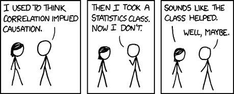

“*相关性不一定意味着因果关系*。” 你现在肯定已经听过很多次这句话了。在本节中，我们将理解关联、相关性和因果关系之间的关系。我们将探讨思考这些概念时可能出现的几个不同问题。

我们将首先探讨在思考关联、相关性和因果关系时可能犯的三个错误。然后，我们将回顾几种不同的衡量关联的方法，这些方法将在我们后续关于因果关系的讨论中使用。

## 预测 vs 因果关系

在许多应用中，我们可能对根据一个量预测另一个量感兴趣。我们已经见过这样的例子：广义线性模型（GLMs）帮助我们在给定许多其他变量的情况下预测一个变量。但重要的是要记住预测和因果关系之间的区别。下面这个例子就突出了这种差异。

假设我们有兴趣使用足球比赛电视转播的录音数据来预测在任何给定时间有多少人在鼓掌。直观上看，这似乎是一个我们可以做出相当不错预测的情况：更大的音频音量应该预示着更多人在鼓掌。然而，尽管我们的预测能力可能非常出色，但这完全不能暗示存在因果关系：事实上，我们观察到的数据（音频音量）是由我们试图预测的事物（人们鼓掌）引起的。

在许多情况下，我们的目标可能是预测能力，在这种情况下，这里的反向因果关系是可以接受的。然而，在我们试图推断因果关系的情况下，仅凭高预测能力是不够的。

## 将相关性（与关联性）误认为因果关系

陷入混淆关联性与因果关系的陷阱，往往比你想象的要容易。例如，考虑以下故事：

> 一个火星人来到地球，经过一年的研究后宣布发现了一个相关性：使用雨伞与淋湿之间存在关联——使用雨伞的人比不使用雨伞的人淋湿（即使只是裤子湿了）的概率更高。火星人推断，使用雨伞会导致人们被淋湿。

火星人观察到的相关性是真实存在的，但真实的因果关系比这稍微复杂一些：下雨时我们会使用雨伞，而下雨时我们也会被淋湿。虽然很容易指着这个例子嘲笑火星人有多愚蠢，但现实情况是，我们经常听到（甚至自己也会做出）类似的推断。

### 混杂变量

在因果关系推理中出现的一个关键问题是**混杂**变量的存在。

#### 晒伤与冰淇淋销量

举个例子，假设我们收集了全年关于晒伤和冰淇淋销量的每日数据。我们发现数据中存在强烈的正相关关系：冰淇淋销量较高的日子，晒伤率也显著更高。显然，晒伤并不会导致冰淇淋销量增加，冰淇淋销量增加也不会导致晒伤。这个例子忽略了天气的混杂效应：炎热晴朗的天气会导致人们购买更多冰淇淋，同时也会导致更多晒伤。我们可以使用有向图来说明这一点，类似于我们在贝叶斯图模型中使用的那种：

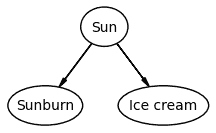

在这里，边表示*因果*关系（我们将在下一节正式阐述这个概念）。例如，此图声称太阳会导致晒伤率的变化。就像火星人的例子一样，这个例子中混杂变量（晴朗天气）的存在是显而易见的。

#### 相机与社交媒体点赞数

让我们看一个关系更复杂的例子。假设我们想知道使用高端数码单反相机是否会导致 Instagram 帖子的点赞数增加。如果我们收集数据并发现相机价格与点赞数之间存在强烈的正相关，这是否能让我们得出存在因果关系的结论？在这种情况下，答案是一个更模糊的“可能”。这里存在其他混杂因素：例如，已经拥有大量粉丝、资金雄厚的高知名度账户比业余账户更可能使用高端相机。在这种情况下，因果图可能看起来更像这样：

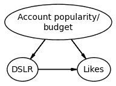

在没有关于账户规模和预算的进一步信息的情况下，很难确定因果关系。

### 虚假相关性

有时，无论我们是否试图得出关于因果关系的结论，我们观察到的相关性可能是*虚假的*：也就是说，它们可能只是偶然发生，或者由一系列可能否定我们想要得出的任何结论的混杂因素导致。[泰勒·维根的虚假相关性网站](https://www.tylervigen.com/spurious-correlations)上的一个示例如下：

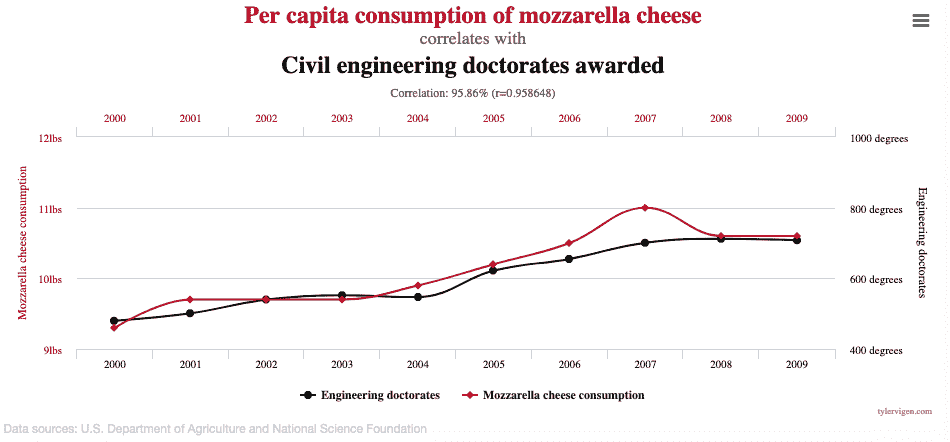

我们可以为这两个变量绘制一个有向图：在这种情况下，它们之间没有边，因为两者之间没有因果关系，也没有混杂变量：

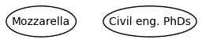

### 棉花糖实验

另一个例子是著名的“[棉花糖实验](https://en.wikipedia.org/wiki/Stanford_marshmallow_experiment)”。在这项研究中，研究人员给孩子们一个选择：要么立即得到一颗棉花糖，要么等待 15 分钟后得到两颗棉花糖。他们对这些学生进行了长达 30 年的跟踪，发现那些愿意等待额外奖励的学生在生活中取得了更大的成功（根据研究人员的衡量标准）。尽管最初的研究人员告诫人们避免直接进行因果关系的解读，但最常见和最广泛的解释却是因果性的：即孩子延迟满足的能力（即为了获得双倍棉花糖奖励而等待 15 分钟）导致了他们一生的成功。学校因此实施了辅导项目，以帮助学生建立自控力，抵抗吃掉第一颗棉花糖的冲动。

然而，后续研究揭示了一个[更为复杂和微妙的故事](https://anderson-review.ucla.edu/new-study-disavows-marshmallow-tests-predictive-powers/)：虽然许多后续研究显示了关联性，但在控制了社会经济背景或其他自控力衡量指标等因素后，抵抗棉花糖诱惑的预测效应似乎会减弱或消失。许多科学家认为，**这项研究真正衡量的并非自控力，而是对中产阶级或上层阶级成长环境的反应行为**：换句话说，是对资源不匮乏环境的反应。

像这样的故事说明了从观察性研究中确定因果关系的重要性和困难性。如果我们能以某种方式确定，教导幼儿自我控制必定会对其最终的生活结果产生重大影响，那么这似乎是一个值得追求的政策目标。如果这种影响不受社会经济背景影响，那就更是如此。然而，众多的混杂变量和模糊的因果关系方向凸显了需要能在随机对照试验之外的环境中确定因果关系的方法。

## 辛普森悖论

混杂变量可能导致的一个反直觉问题是**辛普森悖论**。让我们从一个假设的例子开始：假设一组餐厅评论家用两年时间品尝了两家热门餐厅 A 和 B 的菜肴。他们对自己点的每道菜都给出👎（不喜欢）或👍（喜欢）的评分。他们在下表中总结了数据：

```py
food = pd.read_csv('data/restaurants.csv')
food.pivot_table(
    values='count', index='Restaurant', columns='Dish rating', aggfunc=sum
)
```

```py
/var/folders/xb/x1ncwczj3ld6c06v8p22z_7m0000gn/T/ipykernel_13554/711508461.py:2: FutureWarning: The provided callable <function sum at 0x10494ce00> is currently using DataFrameGroupBy.sum. In a future version of pandas, the provided callable will be used directly. To keep current behavior pass the string "sum" instead.
  food.pivot_table( 
```

加载中...

仅看这些数据，似乎他们更喜欢餐厅 B 的食物（80%的成功率，而餐厅 A 为 60%）。

但现在，假设我们了解到他们的数据收集于 2019 年至 2020 年，并且评论家在 2020 年比 2019 年苛刻得多，这可能是由于疫情引发的阴郁情绪。此外，我们得知餐厅 A 专营外卖和送餐服务，这是 2020 年最安全、最常见的订餐方式。

基于这个额外背景，让我们按年份细分数据：

```py
food.pivot_table(
    values='count', index='Restaurant', 
    columns=['Year', 'Dish rating'], aggfunc=sum
)
```

```py
/var/folders/xb/x1ncwczj3ld6c06v8p22z_7m0000gn/T/ipykernel_13554/4218979607.py:1: FutureWarning: The provided callable <function sum at 0x10494ce00> is currently using DataFrameGroupBy.sum. In a future version of pandas, the provided callable will be used directly. To keep current behavior pass the string "sum" instead.
  food.pivot_table( 
```

加载中...

观察这些数据，餐厅 A 现在在两年中都显得更优！这被称为**辛普森悖论**：从汇总数据看餐厅 B 更好，但当我们分别查看每年数据时，餐厅 A 看起来更好。我们该如何解决这个难题？

让我们花点时间看看这些数字：

+   在 2019 年（前两列），餐厅 A 在评论家中的成功率为 100%（20/20），而餐厅 B 的成功率为 87.5%（70/80）。

+   在 2020 年（最后两列），餐厅 A 的成功率为 55.6%（100/180），而餐厅 B 的成功率为 50%（10/20）。

为什么会发生这种情况？这是因为年份（即疫情）的混杂效应。两家餐厅的评分都因评论家在疫情期间的苛刻评分而大幅受损，但由于餐厅 A 在 2020 年接到了更多订单，其整体数据受到的影响更大。

在继续之前，让我们用因果推断的语言来框定这个问题，以便利用我们围绕混杂变量建立的直觉。我们的问题可以稍作改写为：评论者对餐厅的选择（A 还是 B）是否会影响他们是否喜欢食物（从而给出 👍 评分）？在此设定中，我们的处理是餐厅的选择：A 或 B。我们的结果是他们是否喜欢一道菜（即，是否给出 👍 评分）。混杂变量是他们点菜的时间。为什么这是一个混杂变量？因为它对处理和结果都有因果影响。在 2020 年点菜导致评论者更频繁地选择适合外卖的选项（B）。在 2020 年点菜也导致评论者给出正面评价（👍）的频率降低。

```py
from IPython.display import YouTubeVideo
YouTubeVideo('4HI30EwghPk')
```

我们也可以像之前那样，用有向图来表示这个信息：

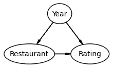

请注意，我们在这里使用了“年份”作为混杂变量，但这有点不精确：真正导致其他两个变量变化的并非年份本身，而是疫情。

疫情（在本例中以年份衡量）通过两种方式影响了数据：

1.  在 2020 年，评论者对餐厅 A 的菜品评分更多。

1.  在 2020 年，评论者要苛刻得多。

当查看按年份分开的数据时，我们可以看到他们在两个年份都更喜欢餐厅 A。但是，由于上述两个因素，在汇总数据时，餐厅 A 看起来更差。

请注意，尽管名称如此，这并非真正的悖论：这完全是由于混杂因素造成的。

### （可选）使用 Baker-Kramer 图可视化辛普森悖论

我们可以将上面要点中的百分比可视化在图表上。让 $x$ 轴代表疫情期间（混杂变量）2020 年点菜的百分比。让 $y$ 轴代表喜欢的菜品比例（结果）。我们将为每个餐厅画一条线：不同的线向我们展示了处理的效果。

对于按年份细分的数据，每个表格向我们展示的数据中，2020 年点菜的比例始终为 0（对于 2019 年数据）或 1（对于 2020 年数据）。这对应于四个标记点（两个蓝色圆圈和两个橙色方块）：

来源

```py
f, ax = plt.subplots(1, 1, figsize=(3, 3))
ax.plot([0, 1], [20/20, 100/180], marker='o', ls='--', label="Restaurant A")
ax.plot([0, 1], [70/80, 10/20], marker='s', ls='--', label="Restaurant B")

ax.legend()
ax.set_xlabel("Proportion of dishes ordered in 2020")
ax.set_ylabel("Proportion of dishes liked")

plt.tight_layout();
```

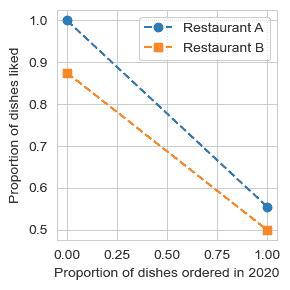

该图表显示，评论家们更偏爱餐厅 A（蓝线）而非餐厅 B（橙线）。但当我们查看上方第一个表格中的汇总数据时，我们实际上是在将餐厅 A（其菜品大多来自 2020 年）与餐厅 B（其菜品大多来自 2019 年）进行比较。这一点通过大圆圈/方块显示出来：

源代码

```py
f, ax = plt.subplots(1, 1, figsize=(3, 3))
ax.plot([0, 1], [20/20, 100/180], marker='o', ls='--', label="Restaurant A")
ax.plot([0, 1], [70/80, 10/20], marker='s', ls='--', label="Restaurant B")

ax.legend()

ax.scatter(.9, .6, marker='o', s=400, color='tab:blue')
ax.scatter(.2, .8, marker='s', s=400, color='tab:orange')

ax.set_xlabel("Percent of dishes ordered in 2020")
ax.set_ylabel("Percentage of dishes liked")

plt.tight_layout();
```

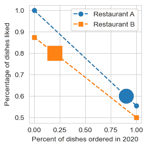

该图表被称为贝克-克雷默图：它突显了尽管餐厅 A 优于餐厅 B，但年份的混杂效应使得餐厅 A 看起来差得多。

## 伯克森悖论与碰撞因子

假设一位面包师决定将他最好的几条面包陈列在橱窗里，以帮助吸引顾客。对于他烤制的每一批面包，他都会对该批次面包的风味和外观进行评分（从 1 到 10）。风味和外观之间没有任何相关性，因此评分看起来像这样：

源代码

```py
np.random.seed(2026)
flavor = np.random.normal(5, 2, 300)
appearance = np.random.normal(5, 2, 300)
f_gray, ax_gray = plt.subplots(1, 1, figsize=(3, 3))
ax_gray.scatter(flavor, appearance, color='gray', alpha=0.45)
ax_gray.axis([0, 10, 0, 10])
ax_gray.set_xlabel('Flavor')
ax_gray.set_ylabel('Appearance');
```

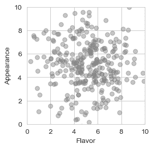

随后，他决定将风味和外观的评分相加：对于任何总分超过 10 的批次，他都会在橱窗中展示该批次的一条面包。

源代码

```py
 f_color, ax_color = plt.subplots(1, 1, figsize=(3, 3))
is_on_display = (flavor + appearance > 10)
ax_color.scatter(
    flavor[is_on_display], appearance[is_on_display], label='On display',
    color='tab:blue', marker='+', alpha=0.45
)
ax_color.scatter(
    flavor[~is_on_display], appearance[~is_on_display], label='In the back',
    color='tab:red', marker='x', alpha=0.45
)
ax_color.legend()
ax_color.plot([0, 10], [10, 0], 'k--')
ax_color.axis([0, 10, 0, 10])
ax_color.set_xlabel('Flavor')
ax_color.set_ylabel('Appearance'); 
```

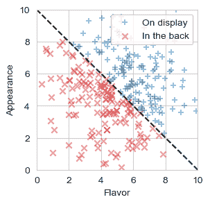

每天打烊时，他会把展示柜（如上图蓝色部分所示）里的面包送给朋友们吃。他的朋友们注意到外观和风味之间存在负相关：看起来更漂亮的面包往往味道更差。当他们向面包师提出这个问题时，面包师给他们看了第一张图，并告诉他们两者之间没有任何相关性。

谁是对的？

这与之前辛普森悖论的例子有一些相似之处：我们有两个变量（风味/外观），当引入第三个变量（展示）时，它们之间的关系发生了变化。但这里有一个非常重要的区别：因果关系的方向。如果我们为这些变量绘制因果图，它看起来会是这样：

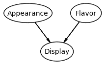

由于因果关系的方向不同，展示柜在这里不是一个混杂因素：我们反而称其为**碰撞因子**。

如果我们在分析中包含此类碰撞因子，就很可能得出错误的结论。在这里，面包师朋友们观察到的关联并不反映风味和外观之间的任何因果关系，而仅仅是由面包师如何选择哪些面包放入展示柜所导致的。

```py
from IPython.display import YouTubeVideo
YouTubeVideo('9qNIKKxQzIU')
```

## 更多示例

+   伯克利研究生录取案例：《[模式、预测与行动](https://mlstory.org/causal.html#the-limitations-of-observation)》一书对这个著名的辛普森悖论案例有精彩的讨论。

+   辛普森悖论也出现在体育领域（例如，[篮球](http://www.math.kent.edu/~darci/simpson/bballexamples.html)和[网球](https://metro.co.uk/2014/01/17/roger-federer-is-rubbish-at-tennis-because-he-tries-too-hard-4264338/)）、[物理学](https://doi.org/10.1063/1.4977784)、[COVID-19 死亡率](http://causality.cs.ucla.edu/blog/index.php/2020/07/06/race-covid-mortality-and-simpsons-paradox-by-dana-mackenzie/)等许多方面。

+   连续数据：*即将推出*

参考文献

1.  Selvitella, A. (2017). 量子力学中的辛普森悖论。《数学物理杂志》，*58*(3)。[10.1063/1.4977784](https://doi.org/10.1063/1.4977784)
