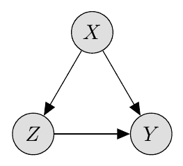
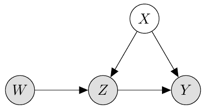

# 工具变量

> 原文：[`data102.org/ds-102-book/content/chapters/04/instrumental-variables`](https://data102.org/ds-102-book/content/chapters/04/instrumental-variables)

[<svg viewBox="0 0 24 24" fill="currentColor" aria-hidden="true" width="1.25rem" height="1.25rem" class="myst-fm-license-cc-icon myst-fm-license-cc-icon-main inline-block mx-1"><title>内容许可：知识共享 署名-相同方式共享 4.0 国际 (CC-BY-SA-4.0)</title></svg><svg viewBox="0 0 24 24" fill="currentColor" aria-hidden="true" width="1.25rem" height="1.25rem" class="myst-fm-license-cc-icon myst-fm-license-cc-icon-by inline-block mr-1"><title>必须向创作者署名</title></svg><svg viewBox="0 0 24 24" fill="currentColor" aria-hidden="true" width="1.25rem" height="1.25rem" class="myst-fm-license-cc-icon myst-fm-license-cc-icon-sa inline-block mr-1"><title>演绎作品必须采用相同许可协议共享</title></svg>](https://creativecommons.org/licenses/by-sa/4.0/)

*特别感谢[Yan Shuo Tan](https://sites.google.com/view/yanshuotan/home)，他撰写了本节的大部分内容。*

## 回顾与介绍

简要回顾我们目前所学的内容：

1.  我们定义了一个超总体模型，即 $(X_i,Z_i,Y_i(0),Y_i(1))$ 的分布：

    +   $Z$ 是（二元）处理决策，

    +   $Y(0)$ 和 $Y(1)$ 分别是该单元未接受/接受处理时的潜在结果，

    +   $X$ 是一个混杂变量（换句话说，它对 $Z$ 和 $Y$ 都有因果效应）。到目前为止，我们尚不需要对这些变量的分布做任何一般性假设（只需假设其存在即可）。

1.  我们定义了我们的关注量，即平均处理效应：$\tau = E[Y(1) - Y(0)]$，它告诉我们处理的平均效果。我们看到，除非做出进一步的假设，否则这是无法估计的。

1.  我们看到，在随机实验中，我们有以下情况：

    +   处理决策是随机的，因此**与潜在结果无关**。

    +   换句话说，$\big(Y(0),Y(1)\big)\perp\!\!\perp Z$。

在本节中，我们将探讨在存在未知混杂变量的情况下如何估计平均处理效应。我们将借助**自然实验**来帮助我们。请注意，你可能在 Data 8 课程中学习约翰·斯诺的霍乱研究时，已经见过[自然实验](https://inferentialthinking.com/chapters/02/2/snow-s-grand-experiment.html)。

## 线性结构模型 (LSM)

在某些领域（如经济学），通常使用*结构模型*，这类模型对所有变量的联合分布施加了一些限制，从而使得模型参数的估计更为容易。

我们将使用**线性结构模型**来描述我们的结果 $Y$ 与处理 $Z$ 以及混杂变量 $X$ 之间的关系：

$Y = \alpha + \tau Z + \beta^TX + \epsilon,$ (1)

其中 $\epsilon$ 均值为零，且独立于 $Z$ 和 $X$（在经济学中，我们说 $\epsilon$ 是*外生的*）。我们有时进一步假设 $\epsilon \sim \mathcal{N}(0,\sigma²)$，但这对于我们即将进行的任何分析都不是必需的。

*注：通常，我们还会进一步添加结构方程 $Z = f(X, \delta)$，其中 $\delta$ 是一个外生噪声变量，而 $f$ 编码了 $X$ 与 $Z$ 之间的结构关系。我们不会深入到这个细节层面，但在阅读这个方程时，你应该假设 $\textrm{Cov}(Z,X)$ 不一定为 0。*

这和我们学习广义线性模型时见过的*线性模型*，以及你在之前课程中见过的模型并不完全相同！虽然看起来非常相似，但我们之前使用的线性模型是关于关联和预测的陈述，而这个线性结构模型则是关于干预和行动的陈述。

具体来说，该模型假设对于单元 $i$，如果我们能设定 $Z_i = 1$，我们将观测到 $Y_i(1) = \tau + \beta^TX_i + \epsilon_i$；如果我们能设定 $Z_i = 0$，我们将观测到 $Y_i(0) = \beta^TX_i + \epsilon_i$。（如果 $Z$ 不是二元的，那么对于 $Z$ 的每个可能取值都会有一个潜在结果。）这是一个微妙但重要的点，同时也将线性结构模型定位为潜在结果框架的一个特例！

由此，我们看到该模型中的平均处理效应是 $\tau$（你能证明这是真的吗？），并且，每个单元的个体处理效应也是

$Y_i(1) - Y_i(0) = \tau.$ (2)

换句话说，线性结构模型隐含地假设了处理效应在所有单元中是恒定的。

### 因果图与线性结构模型

除了$Z$对$Y$的因果效应外，线性结构模型还引入了一些新的内容。它断言了其他变量之间的因果关系，即告诉我们如果干预$X$，$Z$和$Y$将如何变化。

上述线性结构模型可以用图形表示如下：

需要提醒的是，从$X$指向$Z$和$Y$的箭头断言了$X$同时导致$Z$和$Y$（即干预$X$会改变$Z$和$Y$的值），而从$Z$指向$Y$的箭头则断言了$Z$导致$Y$。

## 混杂与遗漏变量偏误

在许多场景中，混杂情况很复杂，涉及许多不同的变量，可能无法收集、观察或描述所有这些变量。在这种情况下，我们必须假设 $X$ 是未被观测到的。如果发生这种情况，那么和之前一样，我们会因为*混杂*而陷入困境。以下是一些例子。在每个例子中，我们只列出了一个可能的混杂因子 $X$，但很可能还有更多：你能为每个例子至少想出一个吗？

| 处理 $Z$ | 结果 $Y$ | 可能的混杂因子 $X$ |
| --- | --- | --- |
| 医疗保险 | 健康结果 | 社会经济背景 |
| 兵役情况 | 薪资水平 | 社会经济背景 |
| 家庭规模 | 母亲是否参与劳动力市场 | 社会经济背景 |
| 受教育年限 | 薪资水平 | 社会经济背景 |
| 吸烟 | 肺癌 | 社会经济背景 |

请注意，在大多数这些例子中，社会经济背景是一个混杂因子。这在经济学和计量经济学中尤其常见，本节中的大部分方法都源于这些领域。

让我们更精确地量化混杂效应。具体来说，我们将假设上述线性结构模型，然后看看当我们天真地尝试用 $Z$ 对 $Y$ 拟合线性回归，而不考虑 $X$ 时会发生什么。

令 $\hat{\tau}_{OLS}$​ 为最小二乘问题 $\min_{\tau,\alpha} \mathbb{E}[(\alpha + \tau Z - Y)²]$ 的解。我们于是得到

$\begin{align} \hat{\tau}_{OLS} & = \frac{\text{Cov}(Y,Z)}{\text{Var}(Z)} \\ & = \frac{\text{Cov}(\alpha + \tau Z + \beta^TX + \epsilon,Z)}{\text{Var}(Z)} \\ & = \frac{\text{Cov}(\tau Z,Z)}{\text{Var}(Z)} + \frac{\text{Cov}(\beta^TX,Z)}{\text{Var}(Z)} \\ & = \underbrace{\tau}_\text{真实 ATE} + \underbrace{\beta^T\frac{\text{Cov}(X,Z)}{\text{Var}(Z)}}_{\text{涉及 }X\text{ 的偏差}}. \end{align}$ ​​(3)

第二项是 $\tau_{OLS}$​ 估计量中的一个偏差：换句话说，它是真实值与估计量之间的差异，并且取决于被遗漏（即未观测到）的变量 $X$。因此，我们将此项 $\beta^T\frac{\text{Cov}(X,Z)}{\text{Var}(Z)}$​ 称为**遗漏变量偏差**。

*备注：$\frac{\text{Cov}(Y,Z)}{\text{Var}(Z)}$​ 是典型公式 $\hat{\tau}_{OLS} = (Z^TZ)^{-1}Z^TY$ 的无限总体版本，其中我们现在使用 $Z$ 和 $Y$ 来表示矩阵/向量。*

**为什么我们不能直接调整混杂因素？** 存在这样的混杂因素是有问题的，因为为了避免遗漏变量偏差，我们需要观测到它们，并将其加入我们的回归中（由于多种原因，收集此类数据可能并不总是可行的）。此外，总可能存在我们未意识到的*其他*混杂因素，这使得我们的因果结论笼罩在无法摆脱的疑云之中。

## 工具变量

在随机实验和有时不切实际的非混杂性假设之间，是否存在一条中间道路？

一种可行的方法是，当自然界为我们提供了一个“部分”自然实验时，即我们拥有一个真正随机的“工具”，它能向感兴趣的处理变量中注入部分随机性元素。这就是工具变量的思想。我们将首先从数学上定义这个概念，然后通过几个例子说明其含义。

**定义：** 假设上述线性结构模型成立。我们进一步假设存在一个变量 $W$，使得 $Z = \alpha' + \gamma W + (\beta')^TX + \delta$，其中 $\gamma \neq 0$（相关性），$W$ 独立于 $X$、$\delta$ 和 $\epsilon$（外生性）。这样的 $W$ 被称为*工具变量*。

*注：* 这取代了之前的方程 $Z = f(X,\delta)$。

现在让我们看看如何使用 $W$ 来识别平均处理效应 $\tau$。

$\begin{align} \textrm{Cov}(Y,W) & = \textrm{Cov}(\alpha + \tau Z + \beta^TX + \epsilon,W) \\ & = \tau \textrm{Cov}(Z,W) \\ & = \tau \textrm{Cov}(\alpha' + \gamma W + (\beta')^TX + \delta, W) \\ & = \tau\gamma \textrm{Var}(W). \end{align}$ ​​(4)

第二个等式源于 $W$ 的外生性。同时，对 $Z$ 和 $W$ 进行类似计算可得

$\textrm{Cov}(Z,W) = \gamma\textrm{Var}(W).$ (5)

将所有结果合并可得

$\tau = \frac{\frac{\textrm{Cov}(Y,W)}{\textrm{Var}(W)}}{\frac{\textrm{Cov}(Z,W)}{\textrm{Var}(W)}}.$ (6)

换句话说，$\tau$ 是 **W** 对 **Y** 的（无限总体）回归系数与 **W** 对 **Z** 的回归系数之比。

这引出了有限样本中平均处理效应（ATE）的**工具变量估计量**：

$\hat{\tau}_{IV} = \frac{\overbrace{(W^TW)^{-1}W^TY}^{\text{OLS coeff. of W for Y}}}{\underbrace{(W^TW)^{-1}W^TZ}_{\text{OLS coeff. of W for Z}}},$ (7)

这里再次（在不严格的意义上）使用符号，$W$、$Z$ 和$Y$ 指的是观测值向量。如果$\alpha' = 0$，那么这就是$\tau$的一个插件估计量，并且是一致的。

**对二元$W$ 的进一步解释：** 当$W$ 为二元变量时，我们可以证明

$\tau = \frac{\mathbb{E}[Y|W=1] - \mathbb{E}[Y|W=0]}{\mathbb{E}[Z|W=1] - \mathbb{E}[Z|W=0]}.$ (8)

因此，我们可以将工具变量（IV）视为衡量$W$ 对$Y$ 的表观处理效应与$W$ 对$Z$ 的表观处理效应之比。

### 工具变量的因果图

$W, Z, X$ 和 $Y$ 之间的关系可以表示为以下因果图：

如何解读此图：

+   从 $W$ 指向 $Z$ 的箭头表明 $W$ 对 $Z$ 具有因果效应。

+   没有任何箭头指向 $W$，意味着 $W$ 是外生的，即图中没有变量导致 $W$，特别是 $W$ 独立于 $X$。

+   从 $W$ 指向 $Y$ 的箭头缺失，意味着 $W$ 对 $Y$ 的唯一影响是通过 $Z$ 实现的。

+   我们将 $W$、$Z$ 和 $Y$ 标记为阴影，因为这些节点是已观测的；而 $X$ 未标记阴影，因为它是潜在的（未观测的）。

请注意，为了使工具变量法有效，我们不需要知道甚至不需要意识到 $X$ 是什么！无论存在多少混杂因素，或者我们是否能够列出所有混杂因素，只要我们能保证它们与工具变量没有任何因果关系（排除限制），工具变量法就会有效。

## 工具变量示例

让我们来探讨一下，对于上一节表格中的五个例子，我们可以使用什么作为工具变量。前四个例子取自计量经济学文献：

**示例 1：** $Z$ 是医疗保险，$Y$ 是健康结果，$X$ 是社会经济背景。Baicker 等人（2013）利用 2008 年俄勒冈州通过抽签方式扩大医疗补助计划。这里的工具变量 $W$ 是抽签分配。我们之前讨论过，由于依从性原因（只有一部分中签者实际加入了医疗补助计划），这是一个不完美的实验，因此工具变量法提供了一种克服此限制的方法。

**示例 2：** $Z$ 是兵役，$Y$ 是薪资，$X$ 是社会经济背景。Angrist（1990）使用越南战争时期的征兵抽签作为工具变量 $W$，并发现白人退伍军人的收入比非退伍军人低 15%。

**示例 3：** $Z$ 是家庭规模，$Y$ 是母亲的就业状况，$X$ 是社会经济背景。Angrist 和 Evans (1998) 使用兄弟姐妹性别构成（即兄弟姐妹出生时的指定性别）作为工具变量。这是合理的，因为兄弟姐妹性别构成存在伪随机性。其依据是，在美国，有两个同性别的孩子的父母比有两个不同性别孩子的父母更有可能生育第三个孩子。

**示例 4：** $Z$ 是受教育年限，$Y$ 是薪资，$X$ 是社会经济背景。Card (1993) 使用大学邻近度的地理差异作为工具变量。

**示例 5：** $Z$ 是吸烟，$Y$ 是肺癌，$X$ 是社会经济背景。不幸的是，这个例子不太适合使用工具变量：尽管经过数十年的寻找，至今还没有人找到一个令人信服的工具变量。这引出了一个重要的教训：**并非所有问题都适合使用工具变量，甚至自然实验！**

正如我们在这些例子中看到的，有时你需要相当巧妙才能想出一个合适的工具变量。Joshua Angrist、David Card 和 Guido Imbens（这些例子中多次提到他们）在这方面非常出色：事实上，他们因其集体工作成果获得了诺贝尔经济学奖！

## 扩展

### 多重处理变量 / 工具变量，以及两阶段最小二乘法。

到目前为止，我们考虑的是标量处理变量和工具变量 $Z$ 和 $W$。也可以考虑向量值的工具变量和处理变量。为了将 IV 推广到这种设置，我们需要将前面章节中的 IV 估计量重新表述如下。

首先定义条件期望$\tilde{Z} = \mathbb{E}[Z|W]$，并注意到$\tilde{Z} = \alpha' + W\gamma$。

如果我们对$Y$ 关于$\tilde{Z}$进行回归，得到的回归系数是

$\begin{align} \frac{\textrm{Cov}(\tilde{Z},Y)}{\textrm{Var}(\tilde{Z})} & = \frac{\textrm{Cov}(\tilde{Z}, \alpha + \tau Z + \beta^TX + \epsilon)}{\textrm{Var}(\tilde{Z})} \\ & = \frac{\textrm{Cov}(\tilde{Z}, \tau Z)}{\textrm{Var}(\tilde{Z})} \\ & = \tau\frac{\textrm{Cov}(\tilde{Z}, Z)}{\textrm{Var}(\tilde{Z})} \\ & = \tau. \end{align}$ ​​(9)

此处，第二个等式成立是因为 $W$ 独立于所有 $X$ 和 $\epsilon$，而第四个等式成立则基于条件期望的一个性质（也可以通过展开 $Z = \alpha' + \gamma W + (\beta')^TX + \delta$来手动验证）。

在有限样本中，我们因此得到以下算法：

**两阶段最小二乘法（2SLS）：**

+   步骤一：将 $Z$ 对 $W$ 进行回归，得到 $\tilde{Z} = W\hat{\gamma} = W(W^TW)^{-1}W^TZ$。

+   步骤二：将 $Y$ 对 $\tilde{Z}$ 进行回归，得到 $\hat{\tau}_{2SLS} = (\tilde{Z}^T\tilde{Z})^{-1}\tilde{Z}^TY$。

在标量设定下，很容易看出 $\hat{\tau}_{2SLS} = \hat{\tau}_{IV}$​，但这种表述方式的优势在于它直接适用于向量值的 $Z$ 和 $W$。

### （可选）工具变量的非参数视角

在本笔记中，我们已在结构线性模型的背景下介绍了工具变量。如果我们的模型是非线性的呢？

一个惊人的巧合是，对于二元处理 $Z$，表达式

$\tau = \frac{\mathbb{E}[Y|W=1] - \mathbb{E}[Y|W=0]}{\mathbb{E}[Z|W=1] - \mathbb{E}[Z|W=0]}.$ (10)

其意义超越了线性模型设定。这正是 Angrist 和 Imbens 于 1996 年发表的这篇开创性[论文](https://www.jstor.org/stable/2291629?seq=1)的主题。
