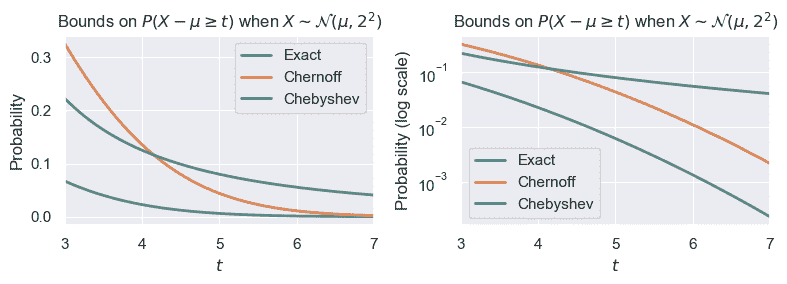
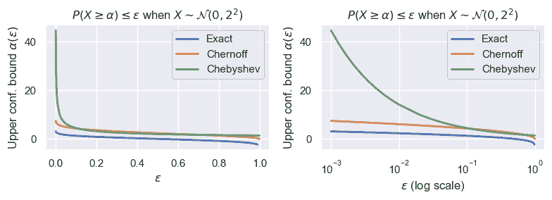

# 尾界与集中不等式

> 原文：[`data102.org/ds-102-book/content/chapters/05/concentration`](https://data102.org/ds-102-book/content/chapters/05/concentration)

[<svg viewBox="0 0 24 24" fill="currentColor" aria-hidden="true" width="1.25rem" height="1.25rem" class="myst-fm-license-cc-icon myst-fm-license-cc-icon-main inline-block mx-1"><title>内容许可：知识共享 署名-相同方式共享 4.0 国际 (CC-BY-SA-4.0)</title></svg><svg viewBox="0 0 24 24" fill="currentColor" aria-hidden="true" width="1.25rem" height="1.25rem" class="myst-fm-license-cc-icon myst-fm-license-cc-icon-by inline-block mr-1"><title>必须署名原作者</title></svg><svg viewBox="0 0 24 24" fill="currentColor" aria-hidden="true" width="1.25rem" height="1.25rem" class="myst-fm-license-cc-icon myst-fm-license-cc-icon-sa inline-block mr-1"><title>演绎作品必须使用相同许可协议分享</title></svg>](https://creativecommons.org/licenses/by-sa/4.0/)[](https://github.com/ds-102/ds-102-book "GitHub 仓库：ds-102/ds-102-book")[](https://github.com/ds-102/ds-102-book/edit/main/ds-102-book/content/chapters/05/01_concentration.ipynb "编辑此页面")

```py
import numpy as np
from scipy import stats
from IPython.display import YouTubeVideo

import matplotlib
%matplotlib inline
import matplotlib.pyplot as plt
import seaborn as sns

sns.set()
```

*在本节中，我们需要更精确一些，因此将使用大写字母表示随机变量，小写字母表示它们所取的值。*

*你可能需要回顾 Data 140 教材的 [12.3](https://data140.org/textbook/content/Chapter_12/03_Bounds.html) 和 [19.4](https://data140.org/textbook/content/Chapter_19/04_Chernoff_Bound.html) 节。*

## 动机与介绍

### 什么是集中不等式？

集中不等式提供了一种量化随机变量位于其分布**尾部**（即远离均值的分布两端部分）的可能性的方法。我们通常将这些不等式写成涉及随机变量 $X$ 与其均值 $E[X]$ 之间距离的形式。例如，考虑以下不等式：

$P(|X-E[X]|\geq t) \leq \epsilon$ (1)

它考察的是随机变量 $X$ 与其均值 $E[x]$ 之间的距离，并指出该距离较大（具体来说，大于某个阈值 $t$）的概率很小（具体来说，小于某个值 $\delta$）。

这类不等式有助于理解任意随机变量的行为，以及使用随机变量的算法。例如，考虑一组独立同分布的随机变量 $X_1, \ldots, X_n$​，及其样本均值：

$Y = \frac{1}{n} \sum_i X_i$ ​(2)

如果我们使用 $Y$ 来估计 $X_i$​ 的均值，那么我们已经可以保证 $Y$ 的平均值将是正确答案：$E[Y] = E\left[(1/n) \sum_i X_i\right] = E[X_i]$。但这个陈述并没有告诉我们偏离正确答案的可能性有多大。$Y$ 有可能与 $E[X_i]$ 相差甚远吗？发生这种情况的可能性有多大？

集中不等式为这类问题提供了答案：如果我们能保证

$P(|Y - E[X_i]| \geq t) \leq \epsilon,$ (3)

那么我们就能对自己的结果更有信心。假设上述陈述对于 $t=1$ 和 $\epsilon=0.01$ 成立。那么我们可以明确地陈述：“$Y$ 有很大可能落在真实均值 $E[X_i]$ 的 1 个单位范围内：其偏离更远的概率小于 $1\%$。”

如果 $X_i$​ 是从一个已知分布（如高斯分布、二项分布、泊松分布等）中抽取的，那么我们可以精确计算这些概率，也就不需要集中不等式了。当我们对一个随机变量的信息较少，并且希望做出**无论具体分布如何**都成立的强有力陈述时，这些不等式就很有用。

```py
YouTubeVideo('KiD4SHKpVho')
```

加载中...

上面的不等式是一个双侧不等式，因为它同时考虑了上尾和下尾。有时，我们也会考虑**单侧**集中不等式，例如 $\mathbb{P}(X-E[X] \geq t) \leq \epsilon$ 或 $\mathbb{P}(X-E[X] \leq -t) \leq \epsilon$。

### 为什么我们对集中不等式感兴趣？

```py
YouTubeVideo('AmPJr9F90wQ')
```

加载中...

### 示例：单侧上尾界

我们将从考察一个随机变量 $X$ 的上尾界开始，该变量具有未知密度 $f$ 和相应的累积分布函数 $F$。具体来说，我们希望找到一个概率上界 $\alpha$，使得在大多数情况下，$X$ 的取值小于 $\alpha$。形式上，我们可以用以下两种方式之一来表达：

$\begin{align*} P(X \geq \alpha) &\leq \epsilon \\ P(X < \alpha) &\geq 1-\epsilon \end{align*} (4)

对于较小的 $\epsilon$ 值，我们可以将此陈述理解为：我们有信心 $X$ 将低于 $\alpha$。因此，我们将使用以下术语：

+   $\alpha$ 是我们的**置信上界**，

+   $\epsilon$ 是我们的**失败概率**，并且

+   $1-\epsilon$ 是我们的**置信水平**。

通常，我们可以将界限表示为 $\alpha(\epsilon)$ 以明确显示其依赖性：我们指定某个期望的置信水平（或失败概率），并找到适用于该水平的界限。在实践中，我们希望这些界限尽可能小：我们总是可以选择 $\infty$ 处的平凡界限，但这对我们没有用处。因此，我们希望 $\alpha(\epsilon)$ 作为 $\epsilon$ 的函数增长得相对缓慢。

假设我们选择 $\epsilon = 0.05$，并且希望得到一个满足上述不等式的 $\alpha(0.05)$ 值。如果 $f$ 和 $F$ 已知，我们可以通过求解 $\alpha$ 轻松计算出这个值（在此示例中，我们假设 $X$ 是连续的，因此 $P(X < \alpha) = P(X \leq \alpha)$）：

$\begin{align*} P(X \leq \alpha) &\geq 1-\epsilon \\ F(\alpha) &\geq 1 - \epsilon \\ \alpha &\geq F^{-1}(1-\epsilon) \end{align*}$ ​(5)

换句话说，如果我们知道累积分布函数 $F$（以及其逆函数 $F^{-1}$），我们就可以计算出 $\alpha(0.05) = F^{-1}(0.95)$。

如果我们不知道累积分布函数呢？如果我们对随机变量 $X$ 一无所知，那么我们就束手无策了：我们无法做出任何适用于任意随机变量的关于 $\alpha$ 的陈述。但是，我们将看到，如果我们做出一些假设，或者仅仅知道关于 $X$ 的一些信息，那么我们就可以做出一些有趣的陈述。

### 示例：样本均值

集中不等式最常见的应用之一是样本均值。我们将回到独立同分布随机变量序列 $X_1, \ldots, X_n$​ 的例子，其均值为 $\mu$，样本均值为 $Y = (1/n)\sum X_i$​。

## 马尔可夫不等式

我们首先假设 $X$ 是**非负的**，并且我们知道其均值 $E[X]$。请注意，这些是相当弱的假设：如果我们知道 $E[X] = 10$ 且 $X$ 是非负的，那么 $X$ 的可能概率密度函数数量是巨大的！马尔可夫不等式对所有情况都成立，它告诉我们：

**马尔可夫不等式**：对于一个非负随机变量 $X$ 和边界 $\alpha > 0$，我们有

$P(X \geq \alpha) \leq \frac{E[X]}{\alpha}.$ (6)

**练习**：*假设一台老虎机的赔付金额为 $\$10$。以下哪些可能是该机器恰好赔付 $\$100$ 的概率值？* $2\%, 4\%, 5\%, 7\%$

```py
YouTubeVideo('DlY81PW4VEg')
```

加载中...

### 理解马尔可夫不等式的性质

让我们使用马尔可夫不等式来推导一个适用于任何非负随机变量的通用上置信边界。如果我们希望对于给定的 $\epsilon$ 值（即期望的置信水平/失效概率），有 $P(X \geq \alpha) \leq \epsilon$，那么我们有 $\epsilon = E[X]/\alpha$，或者等价地 $\alpha = E[X]/\epsilon$。关于这个边界，我们可以得出一些重要的观察结果：

+   随着 $\epsilon$ 减小，$\alpha$ 增大。请理解这其中的道理：如果我们希望边界 $\alpha$ 失效的概率非常小（即随机变量取值超过该边界的概率非常小），那么我们就必须将边界设得非常大。

+   *当 $\epsilon$ 变小时，我们的界增长得有多快？* 如上所述，一个好的界应该增长得相对缓慢。不幸的是，马尔可夫不等式提供了一个相对较差的界：该界以 $O(\epsilon^{-1})$ 的速度增长，这对于大多数随机变量来说并不是一个非常紧的界。

### [示例：使用马尔可夫不等式的样本均值](https://wiki.example.org/feynmans_learning_method#example-sample-mean-with-markovs-inequality "Link to this Section")

给定 $X_1, \ldots, X_n$​ 及其样本均值 $Y$，马尔可夫不等式在回答 **Y** 是否可能远离真实均值 $\mu$ 这一问题上表现如何？

$P(Y - \mu \geq \alpha) = P(Y \geq \mu + \alpha) \leq \frac{\mu}{\mu+\alpha}$ ​(7)

这是一个非常糟糕的界限！特别值得注意的是，它甚至没有随着样本数量$n$ 的增加而改善。如果我们要求在给定置信水平$\epsilon$和给定样本数量$n$ 下的置信上界$\alpha(\epsilon, n)$，我们会发现这个界限也与$n$ 无关：换句话说，无论我们收集多少样本，它都保持不变。这与我们对样本均值的直觉相悖：通常，我们期望收集的独立样本越多，结果就应该越好。这是我们在未来不等式分析中需要关注的一点。

**练习**：

1.  考虑一个参数为$\lambda = 5$ 的泊松随机变量$T$。使用概率密度函数/累积分布函数，找到满足$P(T \geq \alpha) \leq 0.05$ 的最小$\alpha$值。然后，使用马尔可夫不等式找出$\alpha$的一个上界。这说明了马尔可夫不等式在此例中的实用性如何？

1.  现在，令 $T_i \sim \mathrm{Poisson}(\lambda)$，其中 $i = 1, 2, \ldots, n$，并令 $S$ 为 $T_i$​ 的样本均值。若 $\lambda = 5$，请找出满足 $P(S \geq \alpha) \leq 0.05$ 的最小值 $\alpha$（*提示：利用[独立泊松随机变量之和仍服从泊松分布这一事实](https://data140.org/textbook/content/Chapter_07/01_Poisson_Distribution.html#sums-of-independent-poisson-variables)*）。然后使用马尔可夫不等式找出 $\alpha$ 的一个上界。与练习 1 的结果相比，差异如何？

*提示：对于这两个练习，你可能会发现 [`scipy.stats.poisson.ppf`](https://docs.scipy.org/doc/scipy/reference/generated/scipy.stats.poisson.html) 函数很有用。*

正如我们将看到的，马尔可夫不等式给出的界如此宽松，部分原因在于它使用的信息非常有限。

### 视频示例：抛掷有偏硬币

```py
YouTubeVideo('zq_JwBjlIbU')
```

加载中...

## 切比雪夫不等式与高阶矩

如果我们使用更多信息会怎样？具体来说，假设我们同时使用均值和方差。为此，考虑一个随机变量 $X$，我们想为其限定尾概率，然后考虑随机变量 $Z = (X-E[X])²$。我们可以看到 $Z$ 总是非负的，并且根据方差的定义，$E[Z] = \mathrm{var}(X)$。因此，如果对 $Z$ 应用马尔可夫不等式，我们就得到了切比雪夫不等式：

**切比雪夫不等式**：考虑一个已知（有限）均值和方差的随机变量 $X$。对于任意 $t > 0$，

$\mathbb{P}(\vert X - E[X] \vert \ge t) \le \frac{\mathrm{var}(X)}{t²}$ ​(8)

*证明：*

$\begin{align*} P(\vert X - E[X] \vert \geq t) &= P((X - E[X])² \geq t²) \\ &= P(Z \geq t²) \\ &\leq \frac{E[Z]}{t²} \\ &= \frac{\mathrm{var}(X)}{t²} \blacksquare \end{align*}$ (9)

### 理解切比雪夫不等式的性质

这表明，随机变量 X 不太可能远离其均值：距离 $|X-E[X]|$ 较大（具体来说，大于 $t$）的概率，与方差 $(X)$ 成正比地减小，与 $t²$ 成反比地减小。

让我们使用**切比雪夫不等式**来推导一个通用的置信上界，该上界将适用于任何已知均值和方差的随机变量。如果我们希望对于给定的 $\epsilon$ 值，满足 $P(X \geq \alpha) \leq \epsilon$，我们需要先进行一些代数运算，然后才能应用切比雪夫不等式。

$\begin{align*} P(X \geq \alpha) &= P(X - E[X] \geq \alpha - E[X]) \\ &\leq P(|X - E[X]| \geq \alpha - E[X]) \\ &\leq \frac{\mathrm{var}(X)}{(\alpha - E[X])²}, \end{align*}$ ​(10)

因此，我们有 $\epsilon = \frac{\mathrm{var}(X)}{(\alpha - E[X])²}$​。虽然我们可以使用二次公式来得到 $\alpha(\epsilon)$ 的表达式，但这里最重要的观察是：

+   界限 $\alpha(\epsilon)$ 与 $X$ 的方差成正比。

+   *当 $\epsilon$ 变小时，我们的界限增长有多快？* 界限 $\alpha(\epsilon)$α(ϵ) 与 $\epsilon^{-1/2}$ 成正比（即，它以 $O(\epsilon^{-1/2})$ 的速度增长），这比我们在马尔可夫不等式中看到的有了显著改进。问题依然存在：我们能做得更好吗？

### 示例：使用切比雪夫不等式的样本均值

给定 $X_1, \ldots, X_n$​ 及其样本均值 $Y$，切比雪夫不等式在回答 **Y** 是否可能远离真实均值 **μ** 这一问题上表现如何？

$P(|Y - \mu| > \alpha) \leq \frac{\mathrm{var}(Y)}{\alpha²} = \frac{\mathrm{var}(X_i)}{n\alpha²},$ (11)

这里我们利用 $X_i$​ 相互独立这一事实推导出 $\mathrm{var}(Y) = \frac{1}{n²} \sum \mathrm{var}(X_i) = \mathrm{var}(X_i)/n$。

这显著优于马尔可夫不等式给出的界：它告诉我们，随着$n$ 的增加，概率按$1/n$ 的比例减小。如果我们想针对给定的置信水平$\epsilon$和给定的样本数量$n$，求一个上置信界$\alpha(\epsilon, n)$，情况会如何？

$\begin{align*} \epsilon &= \frac{\mathrm{var}(X_i)}{n\alpha²} \\ \alpha &= \frac{\sigma_{X_i}}{\sqrt{n\epsilon}} \end{align*}$ ​​​​(12)

我们看到对$\frac{1}{\sqrt{n}}$​的依赖，这告诉我们随着样本数量的增加，我们的界以多快的速度缩小。

**练习**：再次考虑独立同分布的泊松随机变量 $T_i$​ 及其样本均值 $S$。使用切比雪夫不等式找出最小的 $\alpha$ 值，使得 $P(S \geq \alpha) \leq 0.05$。你的结果与真实概率以及马尔可夫界相比如何？

### 视频示例：使用切比雪夫不等式抛掷有偏硬币

```py
YouTubeVideo('WGdIZWKf9eQ')
```

加载中...

### 高阶矩界

切比雪夫不等式使用一阶矩和二阶矩（$E[X]$ 和 $E[X²]$）。对于任何非负随机变量 $X$ 和任何自然数 $k$，我们可以对 $X^k$ 应用马尔可夫不等式，从而得到高阶**矩界**：

$\mathbb{P}(X \geq \alpha) \leq \frac{E[X^k]}{\alpha^k}$ ​(13)

一些重要的观察：

+   如果我们用此方法寻找如上所述的上置信界 $\alpha(\epsilon)$，可以推导出该界以 $O(\epsilon^{-1/k})$ 的速率增长，这对于较大的 $k$ 值来说可能非常小。

+   使用这类界需要关于随机变量 $X$ 的额外信息：事实上，如果我们确切知道所有 $k = 1, 2, \ldots$  时的矩 $E[X^k]$，那么我们很可能也就知道了其累积分布函数。

## 矩母函数与切尔诺夫方法

*您可能会发现复习[《Data 140》教材第 19.2 节](https://data140.org/textbook/content/Chapter_19/02_Moment_Generating_Functions.html)会有所帮助。*

回顾微积分知识，我们可以用泰勒级数将指数函数 $e^x$ 表示为：

$e^x = 1 + x + \frac{1}{2!} x² + \frac{1}{3!} x³ + \frac{1}{4!} x⁴ + \cdots,$ (14)

受此启发，并结合我们之前观察到的可以利用随机变量的高阶矩来建立更好的尾界，我们将研究随机变量 $X$ 的**矩母函数**（或称 MGF）：

$M_X(\lambda) = E[e^{\lambda X}] = 1 + \lambda E[X] + \frac{\lambda²}{2!} E[X²] + \frac{\lambda³}{3!} E[X³] + \cdots$ (15)

关于矩母函数的一个非常重要的事实是：对于独立随机变量的和 $Y = X_1 + \cdots + X_n$​，其矩母函数 $Y$ 等于每个 $X_i$​ 的矩母函数的乘积：

$\begin{align*} M_Y(\lambda) &= E\left[e^{\lambda Y}\right] \\ &= E\left[e^{\sum_{i=1}^n \lambda X_i}\right] \\ &= E\left[\prod_{i=1}^n e^{\lambda X_i}\right] \\ &= \prod_{i=1}^n E\left[e^{\lambda X_i}\right] & \text{(by independence)} \\ &= \prod_{i=1}^n M_{X_i}(\lambda) \end{align*}$ ​(16)

### Chernoff 界

由于 $e^{\lambda X}$ 是一个非负随机变量，我们可以再次使用**马尔可夫不等式**来找到一个界：

$P(X \geq \alpha) = P(E[e^{\lambda X}] \geq e^{\lambda \alpha}) ~ \leq ~ \frac{E[e^{\lambda X}]}{e^{\lambda \alpha}} ~ = ~ \frac{M_X(\lambda)}{e^{\lambda \alpha}}$ ​(17)

这是一族界限，每个正的 $\lambda$ 对应一个。为了得到可能的最佳界限（即最小的），我们应该对所有非负的 $\lambda$ 进行最小化：

$P(X \geq \alpha) ~ \leq ~ \min_{\lambda \ge 0} \frac{M_X(\lambda)}{e^{\lambda \alpha}} (18)

这就是**切尔诺夫界**。

```py
YouTubeVideo('YpzSdCD81qg')
```

加载中...

一些重要的观察：

+   与之前我们看到的两个界限相比，这需要关于分布的更多信息。具体来说，如果我们知道一个分布的所有矩，在大多数情况下我们实际上就知道了这个分布。但是，我们很快会看到，如果我们能为一整类分布的矩母函数找到一个上界，它仍然是有用的：在这种情况下，我们可以用其上界来替换 $M_X(\lambda)$。

+   *当 $\epsilon$ 变小时，我们的界增长得有多快？* 求解上置信界 $\alpha(\epsilon)$，我们看到 $\epsilon = \frac{M_X(\lambda)}{e^{\lambda \alpha}}$​。如果我们求解 $\alpha$，会发现它随着 $\log(\epsilon^{-1})$ 增长：这比我们之前的两个结果要慢得多！因此，如果我们能找到一类矩母函数已知（或有界，如之前的观察所示）的随机变量，那么我们就能对这些随机变量施加更紧的界。

### 示例：使用切尔诺夫界的样本均值

给定 $X_1, \ldots, X_n$​ 及其样本均值 $Y$，切尔诺夫界在回答 *Y* 是否可能远离真实均值 $\mu$ 的问题上表现如何？由于我们知道随机变量和的矩母函数，我们将对变量 $nY = \sum X_i$​ 进行界定：

$P(Y - \mu \geq \alpha) = P(nY - n\mu \geq n\alpha) = P(nY \geq n(\mu + \alpha)) \leq \min_{\lambda > 0} \frac{\left[M_{X_i}(\lambda)\right]^n}{e^{\lambda n(\mu+\alpha)}}$ ​(19)

这甚至比切比雪夫界更好：随着$n$ 的增加，概率按$e^{-n}$ 的比例下降。

如果我们要求一个在给定置信水平 $\epsilon$ 和给定样本数量 $n$ 下的置信上限 $\alpha(\epsilon, n)$ 呢？由于需要对 $\lambda$λ 进行隐式优化（具体来说，$\lambda$ 的最优值将取决于 $n$），正确计算需要更大量的计算。但我们会看到，对置信水平 $\epsilon$ 的依赖是 $O(\log(\epsilon^{-1}))$，而对样本数量的依赖（与切比雪夫不等式一样）是 $n^{-1/2}$。

**练习**：再次考虑独立同分布的泊松随机变量 $T_i$​ 及其样本均值 $S$。使用切尔诺夫边界求最小的 $\alpha$ 值，使得 $P(S \geq \alpha) \leq 0.05$。你的结果与真实概率、马尔可夫边界以及切比雪夫边界相比如何？*提示：你可以轻松查到泊松分布的矩母函数。*

### 视频示例：使用切尔诺夫边界翻转有偏硬币

```py
YouTubeVideo('YpzSdCD81qg')
```

加载中...

## （可选）示例：比较已知高斯随机变量的界

#### 给定阈值的概率界

现在，我们将已学的每个界应用于一个已知均值 $\mu$ 和方差 $\sigma²$ 的高斯随机变量，$X \sim \mathcal{N}(\mu, \sigma²)$。对于此示例，我们还可以计算精确的界并进行比较。

我们不能使用马尔可夫不等式，因为这个随机变量可以取负值。

因为 $X - \mu$ 关于零对称，所以单侧的切比雪夫界为：

$P(X - \mu \geq t) = \frac{1}{2}P(|X - \mu| \geq t) \leq \frac{\sigma²}{2t²}$ ​(20)

接下来，让我们应用切尔诺夫方法。令 $Z = X - \mu \sim \mathcal{N}(0, \sigma²)$。那么 $Z$ 的矩母函数为 $M_Z(\lambda) = e^{\sigma² \lambda²/2}$。因此对于 $\lambda \ge 0$，

$\mathbb{P}(X - \mu > t) ~ \le ~ \min_{\lambda \geq 0} \exp \left( \frac{\sigma² \lambda²}{2} - \lambda t \right)$ (21)

我们如何对 $\lambda$λ 进行优化？认识到由于 $\exp(x)$ 是一个递增函数，我们有

$\min_{\lambda \geq 0} \exp \left( \frac{\sigma² \lambda²}{2} - \lambda t \right) = \exp \left(\min_{\lambda \geq 0} \left\{\frac{\sigma² \lambda²}{2} - \lambda t \right\} \right).$ (22)

指数中的量是一个二次函数 $f(\lambda)$，可以使用二次公式求其最小值，得到 $\lambda^* = \frac{t}{\sigma²}$​，以及 $f(\lambda^*) = \frac{-t²}{2\sigma²}$​。

综合以上，我们得到

$P(X-\mu > t) ~\leq ~\exp\left(-\frac{t²}{2\sigma²}\right)$ (23)

让我们将这两个边界与精确概率（我们可以使用累积分布函数计算）一起可视化：

```py
sigma = 2

t_min = 3
t_max = 7
t = np.linspace(t_min, t_max , 500)

chernoff = np.exp(-0.5*((t/sigma)**2))
chebyshev = 0.5 * ((sigma/t)**2)
exact_probability = 1 - stats.norm.cdf(t/sigma)

fig, axes = plt.subplots(1,2, figsize = (8,3))
for i, ax in enumerate(axes):
    ax.plot(t, exact_probability, label='Exact', lw=2)
    ax.plot(t, chernoff, lw=2, label='Chernoff')
    ax.plot(t, chebyshev, lw=2, label='Chebyshev')
    ax.set_xlim(t_min, t_max)
    ax.set_xlabel('$t$')
    ax.set_ylabel('$t$')
    ax.legend()
    if i == 1:
        ax.semilogy()
        ax.set_ylabel('Probability (log scale)')
    else:
        ax.set_ylabel('Probability')
    ax.set_title(r'Bounds on $P(X - \mu \geq t)$ when $X \sim \mathcal{N}(\mu, 2²)$')
plt.tight_layout()
```



#### 为给定概率设定阈值边界

假设我们不是给定一个阈值并要求计算超出该阈值的概率，而是想要相反的情况：我们想知道，给定一个期望的概率，一个边界或阈值，使得超出该边界的概率很小。这就是我们之前描述的**上置信界**。为了简化计算且不失一般性，我们假设 $\mu = 0$。如果我们为正态分布计算这个值，会发现：

+   对于切比雪夫不等式，我们有 $\epsilon = \frac{\sigma²}{2\alpha²}$​，或者说 $\alpha(\epsilon) = \frac{\sigma}{\sqrt{2\epsilon}}$​。

+   对于切尔诺夫界，我们有 $\epsilon = \exp\left(-\frac{\alpha²}{2\sigma²}\right)$，或者等价地 $\alpha(\epsilon) = \sigma\sqrt{2\log(1/\epsilon)}$​。

+   正如我们之前所见，精确概率是 $F^{-1}(1-\epsilon)$。

```py
sigma = 2

eps_min = 0
eps_max = 1
eps = np.linspace(eps_min, eps_max, 100)
eps = np.hstack([np.logspace(np.log10(eps[1]), -3, 10)[::-1], eps[1:]])

chernoff = sigma * np.sqrt(-2*np.log(eps))
chebyshev = sigma / np.sqrt(2*eps)
exact_probability = stats.norm.ppf(1-eps)

fig, axes = plt.subplots(1,2, figsize = (8,3))
for i, ax in enumerate(axes):
    ax.plot(eps, exact_probability, label='Exact', lw=2)
    ax.plot(eps, chernoff, lw=2, label='Chernoff')
    ax.plot(eps, chebyshev, lw=2, label='Chebyshev')
    ax.set_ylabel(r'Upper conf. bound $\alpha(\epsilon)$')
    ax.legend()
    if i == 1:
        ax.semilogx()
        ax.set_xlabel(r'$\epsilon$ (log scale)')
    else:
        ax.set_xlabel(r'$\epsilon$')
    ax.set_title(r'$P(X \geq \alpha) \leq \epsilon$ when $X \sim \mathcal{N}(0, 2²)$')
plt.tight_layout()
```



两个边界显然都是宽松的（即与真实值相比过大），但对于较大的 $t$ 值（或者等价地，对于较小的 $\epsilon$ 值），切尔诺夫界要紧密得多。

对于正态随机变量，以这种方式计算切尔诺夫界和切比雪夫界有点多余，因为我们已经知道真实的概率。尽管如此，这有助于我们理解这些界的优劣程度，并且我们将在下一节中看到，即使在我们不完全知道矩母函数的情况下，我们也可以应用这些相同的界。

## Hoeffding 不等式

到目前为止，我们已经看到利用随机变量的矩母函数可以得到极佳的尾概率界。但是，如果我们确切地知道矩母函数，那么我们也知道该随机变量的分布，在这种情况下，我们不妨直接使用累积分布函数（CDF）来求尾概率界。正如我们在前面的例子中看到的，即使是切尔诺夫界也不如使用实际的累积分布函数精确。

那么，切尔诺夫界（Chernoff bound）的意义何在？在许多情况下，我们可能不知道矩母函数的确切形式，但我们可以**界定**它：换句话说，我们可以找到关于 $\lambda$ 的某个函数 $h(\lambda)$，使得 $M_X(\lambda) \leq \lambda ~ ~ \forall \lambda$。

其中一个例子是**有界**随机变量：即随机变量的取值仅在下界 $a$ 和上界 $b$ 之间。

### Hoeffding 引理

Hoeffding 引理给出了任意有界随机变量的矩母函数（MGF）的上界。具体来说，给定一个随机变量 $X$，其均值为 $E[X]$，且取值在 $a$ 和 $b$ 之间，我们有

$M_X(\lambda) = E[e^{\lambda X}] \leq \exp\left\{\lambda E[X] + \frac{\lambda²(b-a)²}{8}\right\}$ (24)

关于该引理的证明和更多信息，请参阅[霍夫丁引理维基百科文章](https://en.wikipedia.org/wiki/Hoeffding%27s_lemma)。

```py
YouTubeVideo('40RQ_O0VK7M')
```

加载中...

### 霍夫丁不等式

我们可以对任何有界随机变量应用霍夫丁引理，并结合切尔诺夫界来限定尾概率。在本节剩余部分，我们将重点关注样本均值的特定情况，这正是霍夫丁不等式的核心内容。

设 $X_1 ,X_2, \ldots, X_n$​ 为定义在区间 $a$ 和 $b$ 之间、相互独立（但不必同分布）的随机变量。则霍夫丁不等式表明：

$P\left(\frac{1}{n}\sum_{i=1}^n (X_i - \mathbb{E}[X_i]) \geq t\right) \leq \exp\left(-\frac{2nt²}{(b-a)²}\right) \\ P\left(\frac{1}{n}\sum_{i=1}^n (X_i - \mathbb{E}[X_i]) \leq -t\right) \leq \exp\left(-\frac{2nt²}{(b-a)²}\right).$ (25)

我们也有双侧版本：

$P\left(\left|\frac{1}{n}\sum_{i=1}^n (X_i - \mathbb{E}[X_i])\right| \geq t\right) \leq 2\exp\left(-\frac{2nt²}{(b-a)²}\right).$ (26)

在 $X_i$​ 同分布且均值为 $\mu$ 的情况下，我们可以将第一个版本重写为：

$\mathbb{P}\left(\left[\frac{1}{n}\sum_{i=1}^n X_i\right] - \mu \geq t\right) \leq \exp\left(-\frac{2nt²}{(b-a)²}\right) \\$ (27)

这是一个非常显著的结果！回想一下，中心极限定理告诉我们，类似的结果在渐近意义下成立：也就是说，对于较大的 $n$ 值，样本均值会收敛于正态分布，因此，获得远离均值的值的概率会以 $e^{-t²}$ 的速度减小。但这个结论对 $n$ 的**任何**值都成立：无论 $n$ 是大是小，或者 $X_i$​ 的分布是否“良好”，这对于任何有界随机变量的样本均值都是成立的。

我们也可以在不了解随机变量 $X_i$​ 分布的任何其他信息的情况下知道这一点，只需知道它们的一些界即可。

正如之前一样，我们可以得出一些观察结果：

+   *当 $\epsilon$ 变小时，我们的界增长得有多快？* 求解上置信界 $\alpha(\epsilon)$，我们看到 $\epsilon = \frac{M_X(\lambda)}{e^{\lambda \alpha}}$​。求解 $\alpha$（示例见下文），我们可以看到它随 $\log(\epsilon^{-1})$ 增长：这比我们之前的两个结果要慢得多！因此，如果我们能找到一类矩母函数已知（或有界，如之前的观察）的随机变量，那么我们就可以对这些随机变量施加更紧的界。

*请注意下方视频中的一个小错误：最后一个方程应为 $P(Y \leq -t)$，而非 $P(Y \leq t)$*

```py
YouTubeVideo('f1tbEnldSt0')
```

加载中...

### 示例：使用霍夫丁不等式的样本均值

给定 $X_1, \ldots, X_n$​ 及其样本均值 $Y$，霍夫丁不等式在回答 **Y** 是否可能远离真实均值 **μ** 这一问题上表现如何？回答这个问题只需我们陈述该不等式并分析其结果：

$\mathbb{P}\left(Y - \mu \geq \alpha\right) \leq \exp\left(-\frac{2n\alpha²}{(b-a)²}\right) \\$ (28)

正如预期（因为霍夫丁不等式是利用切尔诺夫界推导出来的），我们看到了对 $n$ 的相同依赖性：概率按 $e^{-n}$ 的比例减小。如前所述，我们也看到了对 $\alpha$ 的依赖性，其形式为 $e^{-\alpha²}$，这与正态随机变量或中心极限定理中的情况一致。

如果我们要求在给定置信水平 $\epsilon$ 下的置信上界 $\alpha(\epsilon)$ 会怎样？

$\begin{align*} \epsilon &= \exp\left(-\frac{2n\alpha²}{(b-a)²}\right) \\ (b-a)² \log(1/\epsilon) &= 2n\alpha² \\ \alpha &= |b-a|\sqrt{\frac{\log(1/\epsilon)}{2n}} \end{align*}$ ​​​(29)

我们可以看到，虽然这个界对 $\epsilon$ 的依赖关系比我们在切比雪夫界中看到的要好得多，但它对 $n$ 的依赖关系是相似的：**这个界也按 $n^{-1/2}$ 的比例减小**。

### Hoeffding 不等式证明

不失一般性，如有必要，我们可以将 $X_i$​ 替换为 $X_i - \mathbb{E}[X_i]$，因此我们可以假设对于每个 $i$ 都有 $\mathbb{E}[X_i] = 0$，以简化我们的计算。令 $Z = \sum_{i=1}^n \frac{X_i}{n}$​​，并注意到每一项都介于 $a/n$ 和 $b/n$ 之间。那么

$\begin{align*} M_Z(\lambda) &= \prod_{i=1}^n M_{X_i}(\lambda) \\ & \leq \prod_{i=1}^n \exp \left( \frac{(b-a)²}{8n²}\lambda² \right) \\ & = \exp \left( \frac{(b-a)²}{8n}\lambda² \right) \end{align*}$ ​(30)

应用切尔诺夫方法：

$\begin{align*} P(Z > t) ~ & \le ~ \min_{\lambda \geq 0} \exp \left( \frac{(b-a)² \lambda²}{8n} - \lambda t \right) \\ & = \exp\left(-\frac{2nt²}{(b-a)²}\right). \end{align*}$ (31)

双侧界限的证明留作练习（和/或可以轻松查阅）。

```py
YouTubeVideo('OgdPPGNrRdM')
```

正在加载...

## 集中不等式与置信区间

我们已经多次看到，如果我们有一个估计量 $\hat{\theta}$，我们可以利用 $\hat{\theta}$ 的分布来为该估计量构建置信区间。到目前为止，我们依赖的方法要么是自助法，要么是精确计算分布，要么是使用中心极限定理来近似它。

然而，我们刚刚讨论的所有方法都适用于任何随机变量！因此，我们可以使用其中任何一种方法来为估计量 $\hat{\theta}$ 构建置信区间，特别是当该估计量是样本均值时（但即使不是也常常适用）。虽然其他方法完全有效，但在某些情况下，我们可能更倾向于使用集中不等式来构建置信区间：

+   *为何选择集中不等式而非精确计算分布？* 正如我们已经讨论过的，在许多情况下，我们可能无法确切知道随机变量的分布，并且精确计算分布可能并不可行。

+   *为何选择集中不等式而非自助法？* 使用自助法需要我们观察数据，并利用这些数据生成自助重采样。在某些情况下，如果我们希望在观察任何数据之前展示一个理论上的置信区间，使用集中不等式会很有帮助。

+   *为何选择集中不等式而非中心极限定理？* 正如我们已经讨论过的，中心极限定理仅适用于较大的$n$ 值，而我们在此推导出的结果适用于任何$n$ 值，以及任何分布形态。

```py
YouTubeVideo('uiwbn8DbCKk')
```

加载中...
