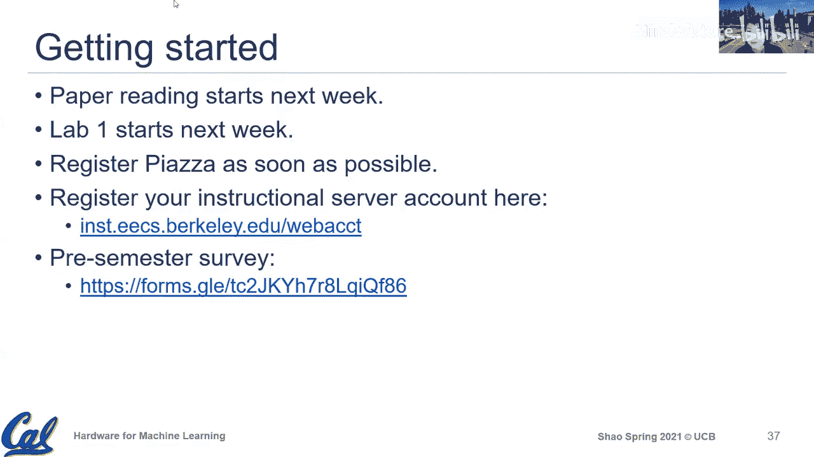

# 001：课程介绍

在本节课中，我们将要学习这门课程的整体概览、核心动机以及课程结构。我们将探讨机器学习硬件领域面临的挑战与机遇，并了解如何通过本课程的学习，成为一名能够构建高效硬件系统的实践者。

## 课程概述与动机

大家好，欢迎来到EE2902机器学习硬件课程。我是加州大学伯克利分校的Sophia Shao，将担任本课程的讲师。课程将在每周一和周三的太平洋时间下午2点到3点半进行线上授课。

本课程旨在搭建硬件设计与机器学习思维之间的桥梁。我们将以机器学习作为驱动范例，探讨如何设计未来的硬件系统，特别是如何应对新兴应用带来的独特需求。

本课程的具体目标是，在学期结束时，使你们能够构建高效的硬件系统。我们将使用机器学习作为驱动应用，探讨在为其设计硬件时需要考虑的硬件与软件优化，以及通用的硬件设计原则。

为了实现这一目标，我们将采取三种核心方法：
1.  理解机器学习应用的核心特征。
2.  学习实现高性能与高能效的核心硬件设计原则。
3.  通过来自业界的嘉宾讲座，了解实际部署中的挑战与行业实践。

## 机器学习的兴起与计算需求

上一节我们介绍了课程的整体目标，本节中我们来看看推动硬件发展的机器学习领域本身。

当我们谈论机器学习，尤其是深度学习时，有三个至关重要的组成部分：
1.  **更大的数据**：数据是深度学习发展的基石。例如，ImageNet数据集的构建及其上的成功，是深度学习早期突破的关键。
2.  **更优的算法**：这是机器学习研究的活跃领域，涉及新的网络架构和算子，以更好地从数据中学习。
3.  **更强的算力**：计算能力是当今深度学习得以广泛应用的重要支撑。早期的成功（如AlexNet）便得益于GPU的并行计算能力。

深度学习的影响力正以两种维度扩展：
*   **应用广度**：它已渗透到医疗、娱乐、安全、自动驾驶等众多领域。
*   **人才与研究的增长**：相关职位需求、论文发表数量均呈指数级增长。

这种广泛的采用和深入的研究，最终转化为对计算能力的巨大需求。根据OpenAI的数据，从AlexNet到近年最先进的模型，训练所需的计算量增长了超过30万倍。这对硬件设计师而言既是挑战，也是机遇。

## 硬件设计的挑战与机遇

面对指数级增长的计算需求，硬件行业传统的“法宝”——**摩尔定律**——正面临瓶颈。晶体管尺寸的微缩带来的性能和能效提升正在放缓，同时研发成本急剧上升。

这是一个“最好的时代，也是最坏的时代”。我们面临着巨大的算力需求，但依赖已久的技术红利正在减弱，这迫使我们寻找新的解决方案。

其中最有前景的方案之一是**领域专用加速器**。与CPU、GPU等通用处理器不同，DSAs是为特定应用领域（如深度学习）定制设计的硬件，旨在消除通用处理的低效，实现更高的性能和能效。

例如，苹果的SoC中除了CPU和GPU，还集成了专用的“神经引擎”。这种趋势表明，为了满足不同应用的计算需求，片上集成的专用加速器正变得越来越多。

## 机器学习硬件生态概览

机器学习硬件的繁荣吸引了众多参与者，形成了一个充满活力的竞争生态：
*   **传统半导体巨头**：如**英伟达**，其GPU因并行计算特性成为早期深度学习的理想平台，并持续通过Tensor Core等定制单元进行优化。
*   **初创公司**：如**Cerebras**，其创新的晶圆级芯片突破了传统芯片尺寸的限制，展示了硬件设计的激进创新。
*   **跨界软件/系统公司**：如**谷歌**的TPU、**特斯拉**的FSD芯片，这些拥有算法和数据优势的公司也纷纷进入硬件领域，以优化其整体系统。

为了公平比较不同硬件，行业建立了**MLPerf**等基准测试套件，这对硬件设计和选型至关重要。

## 课程目标：成为构建者

面对如此多的机遇与参与者，本课程的核心是让你们成为**构建者**。我们不仅希望你们成为机器学习的使用者或开发者，更希望你们能够构建自己的优化方案、管理系统，尤其是硬件优化方案，以实现具有竞争力的性能、能效和精度。

通过利用现代工具链的支持，即使是小团队也能取得显著成果。本课程旨在帮助你们掌握这些工具和能力。

## 课程具体信息与结构

现在，让我们了解本课程如何运作以实现上述目标。

我是讲师Sophia Shao，助教是Abraham。所有课程信息、Zoom链接和办公时间都会发布在课程网站和Piazza上。

课程组织如下：
*   **讲座**：每周两次，包含常规讲座和8场业界嘉宾讲座。
*   **论文研读**：每周一篇精选论文，帮助理解研究前沿。
*   **实验**：共三个，循序渐进。
    *   **实验1**：聚焦机器学习框架（PyTorch）和量化实验。
    *   **实验2**：使用**Verilog**设计机器学习加速器的处理单元。
    *   **实验3**：基于FPGA的大规模仿真与映射优化实验。
*   **项目**：学期后半段的重点，鼓励2人组队，利用提供的硬件平台进行开放式研究。
*   **考核**：无考试。评分由论文研读（10%）、实验（40%）和项目（50%）构成。

**先修要求**：需要具备计算机体系结构和数字逻辑设计的基础知识（如EE151/CS152），并需要Verilog经验。

**如何开始**：
1.  注册Piazza以获取课程通知。
2.  完成课前调查，让我们更好地了解你的背景和期望。
3.  关注下周发布的实验1和第一篇阅读材料。

## 总结

本节课我们一起学习了EE2902课程的概览。我们探讨了机器学习硬件领域的核心动机：由数据和算法驱动产生的巨大算力需求，以及硬件设计在“后摩尔定律”时代面临的挑战与机遇。我们看到了一个由传统厂商、初创公司和软件巨头共同构成的活跃硬件生态。本课程的目标是让你们掌握必要的知识和技术，成为能够构建高效机器学习硬件系统的实践者。课程将通过讲座、论文阅读、动手实验和开放项目相结合的方式，引导你们深入这一领域。期待与大家共同度过这个学期。