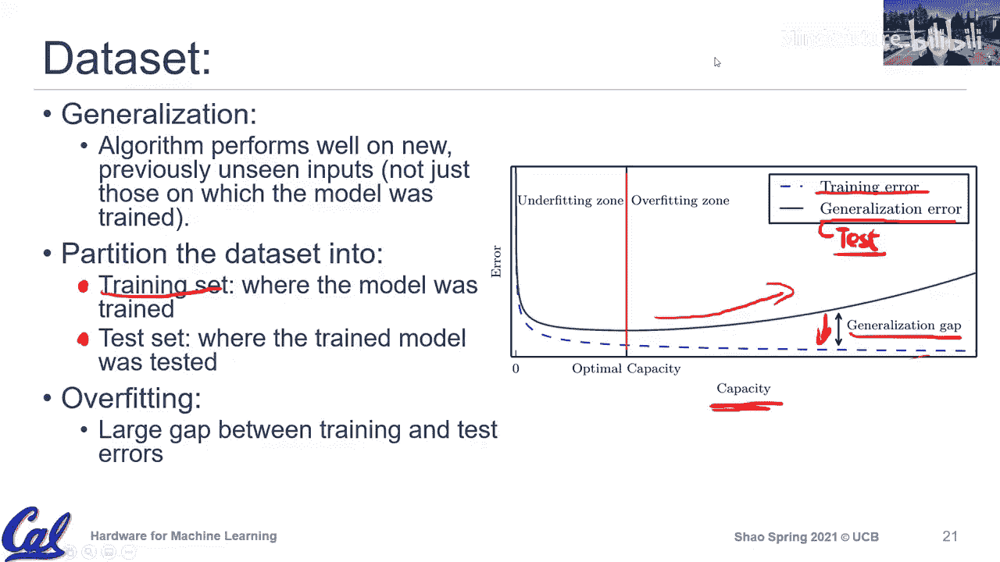

# 002：深度神经网络入门

在本节课中，我们将学习深度神经网络的基础知识。我们将从机器学习的核心概念开始，逐步深入到深度学习的具体架构和原理。课程将涵盖机器学习的基本组成部分，包括任务、经验和性能度量，并特别关注深度学习如何通过分层结构自动提取特征。最后，我们将简要介绍AlexNet作为深度学习成功的一个早期关键案例。

---

## 机器学习概述

上一节我们介绍了课程背景和硬件与机器学习的关系。本节中，我们来看看什么是机器学习。

机器学习是人工智能的一个子领域，其目标是让计算机能够从经验中学习，而无需进行明确的编程。一个机器学习算法通常包含三个核心组成部分：

1.  **任务**：算法需要完成的具体目标或功能，例如根据输入预测输出。
2.  **经验**：算法学习所依据的数据或观察结果，即数据集。
3.  **性能度量**：用于量化算法执行任务好坏的指标，例如准确率或误差。

以下是理解机器学习算法的三种范式：

*   **基于规则的系统**：由人类设计者明确指定所有规则，计算机仅负责执行和评估这些规则。例如早期的国际象棋程序。
*   **经典机器学习**：人类设计者手动选取或设计一些**特征**，然后由机器学习算法根据这些特征来学习决策规则。例如，在房价预测中，手动选取房屋面积和地理位置作为特征。
*   **深度学习**：算法通过多层的**分层网络结构**，自动从原始数据中学习并提取特征，从简单特征逐步构建复杂特征，最终用于决策。

深度学习的关键在于其“深度”的分层结构，这使得它能够自动处理特征工程，从而在处理大规模、高维度数据时更具可扩展性。

---

## 深度学习核心概念

上一节我们了解了机器学习的整体框架。本节中，我们聚焦于深度学习的具体机制。

深度学习是机器学习的一种，其核心是使用包含多个隐藏层的神经网络。这种分层结构使得网络能够自动学习数据的层次化特征表示。

一个简单的图像识别网络可能包含以下层次：
1.  第一层检测图像中的**边缘**。
2.  第二层基于边缘组合检测**角点**和简单形状。
3.  第三层基于更复杂的形状组合识别完整的**物体**（如汽车、人脸）。

这种从简单到复杂的特征自动提取和组合，是深度学习强大能力的基础。其成功也依赖于三个关键要素：**算法（模型）**、**大规模数据集**和**强大的计算硬件**。

---

## 机器学习算法组件详解

上一节我们介绍了深度学习的特点。本节中，我们回到更基础的层面，详细拆解一个机器学习算法的各个组件。

我们以垃圾邮件分类任务为例，说明三个核心组件：

1.  **任务**：预测一封电子邮件是否是垃圾邮件。这是一个二分类任务，输入是邮件内容，输出是“是”或“否”。
2.  **经验**：用于学习的数据集，即大量已被用户标记为“垃圾邮件”或“非垃圾邮件”的历史邮件。
3.  **性能度量**：分类的准确率，即被正确分类的邮件比例。在训练过程中，我们追求此度量值的提升。

进一步地，执行一个“任务”可以分解为两个部分：
*   **模型**：用于进行预测的数学结构。例如线性回归模型 `y = w0 + w1*x`，或复杂的深度神经网络。
*   **优化方法**：用于调整模型参数以提升性能度量的算法。最常见的方法是**梯度下降**，它通过计算损失函数相对于模型参数的梯度，并沿梯度反方向更新参数，以最小化损失。

---

## 实例：线性回归

上一节我们以分类任务为例。本节中，我们来看一个回归任务的经典例子——线性回归，以具体化上述概念。

假设我们想根据房屋面积预测其价格。

*   **经验/数据集**：已知的房屋面积和对应价格的数据点集合 `(x_i, y_i)`。
*   **任务**：给定新的房屋面积 `x`，预测其价格 `y`。
*   **模型**：采用线性模型 `h(x) = w0 + w1*x`。其中 `w0` 是截距，`w1` 是斜率。
*   **性能度量/损失函数**：使用**均方误差**来衡量预测值与真实值的差距。公式为：
    `J(w0, w1) = (1/2m) * Σ (h(x_i) - y_i)^2`
    其中 `m` 是训练样本数量。目标是最小化 `J(w0, w1)`。
*   **优化方法**：使用**梯度下降**来找到使损失函数 `J` 最小化的参数 `w0` 和 `w1`。

---

## 数据与泛化

上一节我们讨论了算法的内部机制。本节中，我们关注算法外部的关键因素——数据。

数据集通常被划分为两部分：
*   **训练集**：用于训练模型、调整参数的数据。
*   **测试集**：用于评估训练好的模型在**未见过的数据**上表现的数据。

这种划分是为了评估模型的**泛化能力**，即模型对新数据的适应能力。在训练过程中，需要警惕**过拟合**现象：模型在训练集上表现极好（训练误差低），但在测试集上表现很差（测试误差高）。这意味着模型过度“记忆”了训练数据的细节，而非学习其普遍规律。

优化方法和损失函数的设计（如加入正则化项）有助于减少过拟合，提升模型的泛化能力。

---

## 总结

本节课中，我们一起学习了深度神经网络的基础知识。我们从区分人工智能、机器学习和深度学习等术语开始，建立了对机器学习算法核心组件（任务、经验、性能度量）的理解。我们探讨了深度学习通过分层网络自动提取特征的核心思想，并通过线性回归实例具体分析了模型、损失函数和优化方法的作用。最后，我们强调了数据集划分和模型泛化能力的重要性。这些概念为后续深入学习机器学习硬件加速技术奠定了坚实的基础。