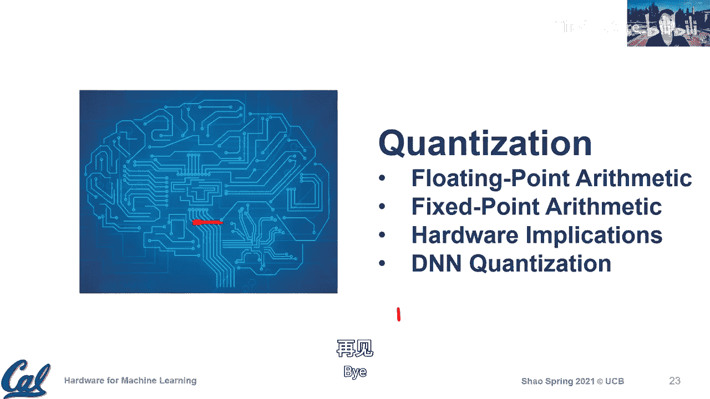

# 003：深度神经网络与量化入门

在本节课中，我们将完成对机器学习流程的讨论，深入探讨深度学习，并开始介绍量化技术。这是一个充满活力的研究领域，有许多初创公司提出新想法，例如苹果公司去年收购的AI初创公司Xnor.ai，其核心技术就是低精度机器学习。

## 机器学习流程回顾

上一讲我们讨论了人工智能、机器学习和深度学习等术语。机器学习流程通常包含三个核心组件：**经验**（数据集）、**性能度量**（成本函数）和**任务**（模型与优化方法）。深度学习是机器学习的一个子集，擅长处理高维数据，并能自动从简单特征中提取复杂特征，构建层次化网络。

## 成本函数详解

成本函数用于量化模型预测值与期望值之间的误差，是训练过程中的性能度量指标。在线性回归中，我们常用**均方误差**。

### 防止过拟合

在训练中，我们不仅要最小化训练误差，还要防止模型对训练数据**过拟合**，以确保其能泛化到新数据。以下是两种常用技术：

**1. 正则化**
正则化通过在成本函数中添加一项，来表达对**更简单模型**的偏好，通常意味着更小的权重。这有助于减少过拟合风险。
*   **L2正则化（权重衰减）**：在成本函数中添加所有权重平方和的一项，公式为：`Cost = Original_Cost + λ * Σ(wi²)`。
*   **L1正则化**：在成本函数中添加所有权重绝对值之和的一项，公式为：`Cost = Original_Cost + λ * Σ|wi|`。

**2. Dropout**
Dropout在训练过程中，随机将网络中的一部分神经元输出置零（即“丢弃”）。这相当于同时训练了多个不同的子网络（集成学习），有助于防止模型对特定神经元的依赖，增强泛化能力。在推理时，会使用完整的网络。

## 优化方法详解

优化方法的目的是通过调整模型权重，最小化成本函数。最常用的方法是**梯度下降**。

### 随机梯度下降

在实际训练中，我们很少使用全部数据计算梯度，而是采用**随机梯度下降**。它将数据集分成多个**批次**，每次迭代仅用一个批次的数据计算梯度并更新权重。批次大小是一个重要的超参数，会影响收敛速度和硬件利用率。

### 动量

为了帮助优化过程跳出局部最小值，找到全局最小值，我们引入**动量**的概念。动量不仅考虑当前梯度，还考虑之前权重更新的方向，形成一种“惯性”。
权重更新公式变为：`v = ρ * v - η * ∇J(w)`， `w = w + v`。其中，`v`是动量，`ρ`是动量因子，`η`是学习率，`∇J(w)`是梯度。

## 从机器学习到深度学习

深度学习，特别是深度神经网络，因其在处理图像、语音等高维数据上的成功而成为主导模型。其核心特点是**深度**（多层网络）以及**线性变换**与**非线性变换**的结合。

### 深度神经网络术语

*   **层**：网络由输入层、输出层和多个隐藏层组成。
*   **激活**：指各层节点的输出值，与输入数据相关。
*   **权重**：指连接节点的边上的参数，在训练后固定，是模型固有的部分。

### 非线性激活函数

非线性激活函数对于网络学习复杂模式至关重要。目前最常用的是**修正线性单元**。
*   **ReLU**：函数为 `f(x) = max(0, x)`。它计算简单，能缓解梯度消失问题，并产生大量零激活，有助于模型稀疏化，提高硬件效率。
*   **ReLU变体**：如Leaky ReLU，在输入为负时给予一个小的斜率，以避免神经元“死亡”。

## 训练与推理

*   **训练**：包含**前向传播**（计算预测）和**反向传播**（根据误差计算梯度并更新权重）。涉及全部四个组件：数据、成本函数、模型和优化。
*   **推理**：仅包含**前向传播**。使用训练好的模型和固定的权重，根据新输入数据产生预测。只涉及数据和模型。

## 案例：AlexNet

AlexNet是深度学习早期成功的典范。它使用了**交叉熵损失函数**（适用于多分类问题），并在优化中采用了我们讨论过的**带动量的随机梯度下降**和**权重衰减**。其结构包含了卷积层、池化层和全连接层。

## 总结

本节课我们一起学习了机器学习流程的核心组件，深入探讨了成本函数中的正则化与Dropout技术，以及优化方法中的随机梯度下降与动量。随后，我们过渡到深度学习，了解了深度神经网络的基本术语、ReLU激活函数，并区分了训练与推理过程。最后，我们以AlexNet为例回顾了这些概念的应用。下节课我们将开始深入讨论量化技术。