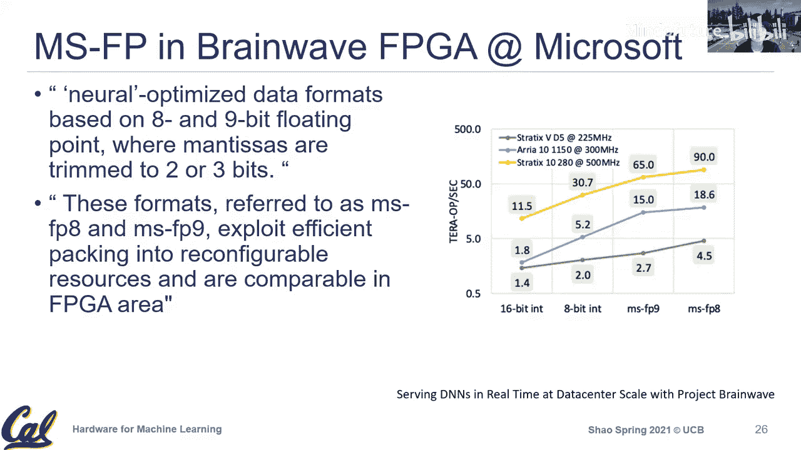

# 004：量化

在本节课中，我们将深入学习量化技术，特别是其对硬件设计的影响。量化是一种通过降低数据表示精度来减少计算和存储需求的关键技术，在边缘设备的高效机器学习模型部署中尤为重要。

## 概述

上一节我们介绍了机器学习的基本概念和深度学习模型。本节中，我们将深入探讨数据表示，特别是量化技术。量化通过使用更低精度的数据（如8位整数代替32位浮点数）来执行计算，从而显著减少硬件资源消耗，包括计算单元的面积、能耗以及内存带宽需求。我们将从浮点数和定点数表示的基础知识开始，逐步深入到深度学习中的量化实践。

## 浮点数表示回顾

在计算机系统中，我们通常使用科学计数法来表示数字。对于十进制数，其形式为：
`值 = 有效数字 × 10^指数`
例如，`6.02 × 10^23`。

在二进制系统中，我们使用类似的浮点数表示法：
`值 = (-1)^符号位 × 有效数字 × 2^指数`

一个标准的浮点数由三部分组成：
1.  **符号位**：表示数值的正负。
2.  **指数位**：决定数值的范围。
3.  **有效数字位（尾数）**：决定数值的精度。

常见的标准是IEEE 754浮点数格式，例如：
*   **FP32（单精度）**：1位符号位 + 8位指数位 + 23位有效数字位。
*   **FP16（半精度）**：1位符号位 + 5位指数位 + 10位有效数字位。

降低精度（如从FP32到FP16）可以减少数据存储和传输的开销，但会引入精度损失。幸运的是，深度学习模型对这类误差通常具有较好的容忍度。

## 定点数表示

与浮点数不同，定点数的小数点位置是固定的。这本质上是在进行整数运算，但我们需要跟踪一个“缩放因子”来理解整数所代表的实际值。

定点数的值可以通过以下公式从存储的整数值 `x` 重建：
`真实值 y = S * x + Z`
其中：
*   `S` 是缩放因子（斜率），决定了整数单位对应的实际值大小。
*   `Z` 是零点（偏置），用于调整数值范围的偏移。

例如，用3位存储整数 `x`：
*   若 `S=1, Z=0`，则 `x=7` 表示 `y=7`。
*   若 `S=0.25, Z=0`，则 `x=7` 表示 `y=7*0.25=1.75`（相当于小数点左移）。
*   若 `S=4, Z=0`，则 `x=7` 表示 `y=28`（相当于小数点右移，用3位表示了5位的范围）。

定点数运算的硬件实现（加法和乘法）比浮点数运算简单得多，因此在面积和功耗上具有显著优势。

## 硬件影响与动机

量化之所以重要，是因为它在硬件层面带来了巨大的效率提升。

以下是不同数据表示在硬件开销上的对比（基于较旧的45纳米工艺数据，但趋势依然成立）：
*   **能耗**：16位定点加法比16位浮点加法节能约8倍。
*   **面积**：16位定点乘法器比16位浮点乘法器面积小10倍以上。
*   **精度间对比**：16位浮点运算比32位浮点运算在面积和能耗上也有数倍的优势。

此外，降低数据位宽直接减少了模型参数的存储空间，降低了内存带宽需求。

需要指出的是，即使在“8位量化”的系统中，内部的乘累加单元可能使用更高位宽（如24位或32位）的寄存器来累积中间结果，以防止溢出，最终再将结果量化回8位输出。

## 深度学习中的量化

现在，我们将定点数表示应用到深度学习计算的核心——矩阵乘累加运算中。

对于一个输出激活值，其原始浮点计算为：
`输出 = Σ (权重 * 输入)`

当我们用量化后的值（`Q`表示整数值，`S`表示缩放因子，`Z`表示零点）代替原始值时，公式变为：
`S_output * (Q_output - Z_output) = Σ [ S_weight * (Q_weight - Z_weight) * S_input * (Q_input - Z_input) ]`

为了简化，通常假设零点 `Z` 为0。经过整理，我们可以得到计算量化输出的公式：
`Q_output = (S_weight * S_input / S_output) * Σ (Q_weight * Q_input)`

这个公式揭示了量化的核心：
1.  **核心计算**：`Σ (Q_weight * Q_input)` 是完全在整数域进行的乘累加操作，硬件效率极高。
2.  **缩放因子**：比例 `(S_weight * S_input / S_output)` 是一个浮点常数，可以在计算前后通过简单的浮点乘法或移位操作完成。

因此，大部分繁重的矩阵运算可以用高效的整数硬件完成。

## 如何确定缩放因子S

缩放因子 `S` 的选择是量化好坏的关键。一个常见的方法是：
`S = (数值范围) / (量化后范围)`
例如，对于8位量化（范围0-255），如果某层激活值的实际范围是[-1.5, 2.0]，则范围宽度为3.5，那么缩放因子 `S = 3.5 / 255`。

确定“数值范围”有多种策略：
*   **最大最小值**：直接使用观测到的最大、最小值。
*   **基于均值和标准差**：使用 `均值 ± N * 标准差` 来确定范围，以排除 outliers。

在实验中将探索不同的方法对模型精度的影响。

## 总结

本节课我们一起深入学习了量化技术。我们从浮点数和定点数的基础表示法开始，理解了降低数据精度如何带来显著的硬件效益，包括更小的面积、更低的功耗和内存占用。接着，我们探讨了如何将定点数运算应用到深度学习的矩阵计算中，推导出了量化计算的关键公式，即将浮点计算转化为高效的整数乘累加运算加上后续的缩放调整。最后，我们讨论了确定缩放因子的策略。量化是连接高效算法与高效硬件设计的桥梁，对于在资源受限的设备上部署机器学习模型至关重要。