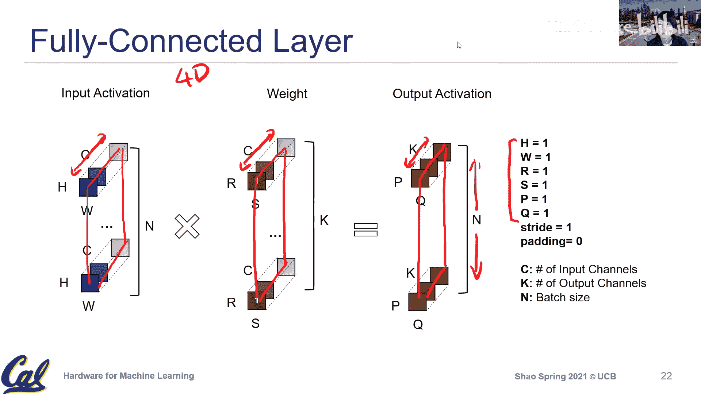

# 005：核心计算（Kernel Computation）


在本节课中，我们将要学习深度学习的核心底层操作，即计算原语（Kernel）。我们将重点探讨卷积（Convolution）和全连接层（Fully Connected Layer）的计算模式、参数及其硬件映射的含义。理解这些基础操作是设计高效机器学习硬件和软件生态系统的关键。

## 量化研究的延伸讨论

在上一节中，我们讨论了数据表示，特别是浮点数和定点数。本节中，我们来看看量化领域的一些最新研究方向。

除了我们讨论过的训练后量化（Post-Training Quantization），该领域还存在大量活跃研究。一个重要的方向是量化感知训练（Quantization-Aware Training）。其核心思想是在模型训练过程中就引入对权重和激活值的量化，使得最终部署的模型直接就是低精度版本。这样可以在训练时就将量化误差考虑进损失函数中，有望训练出对低精度更友好的模型。

另一个相关方向是将稀疏性（Sparsity）也引入训练过程。深度学习算子中天然存在稀疏性，如果在训练时就鼓励零值和低精度值，可能得到更易于量化的推理模型。

在浮点数格式方面，除了标准的IEEE FP16和FP32，业界也在探索更适合深度学习的格式。例如，Google的TPU和NVIDIA最新的Tensor Core GPU都支持BFloat16格式。其公式表示为：
```
BFloat16: 1位符号位 + 8位指数位 + 7位尾数位
```
与FP16（5位指数，10位尾数）相比，BFloat16牺牲了部分精度以换取更大的数值表示范围，这对于覆盖深度学习中常见的激活值范围特别有益。

微软也提出了自定义的浮点格式家族（MS-FP），旨在用最少的位数满足深度学习的精度和范围需求，并已部署在其基于FPGA的BrainWave加速器上。这些探索表明，低精度优化不仅是硬件决策，更取决于应用对精度的容忍度，需要软硬件协同设计。

## 卷积计算详解

现在，让我们进入今天的核心内容：卷积计算。卷积神经网络（CNN）是深度学习在计算机视觉领域取得早期突破的关键，理解其计算模式至关重要。

我们将使用以下颜色和术语约定：
*   **蓝色**：输入激活（Input Activation），即上一层的输出或原始输入数据。
*   **绿色**：权重（Weights），即模型训练学习到的参数。
*   **红色**：输出激活（Output Activation），即本层的计算结果，将作为下一层的输入。

### 基础二维卷积与参数

我们从基础的二维卷积开始。假设输入是一张图像。

*   **输入激活维度**：高度 `H` 和宽度 `W`。
*   **权重/滤波器维度**：我们用 `R` 和 `S` 表示滤波器的高度和宽度。例如，一个3x3的卷积核，`R=3`, `S=3`。
*   **输出激活维度**：高度 `P` 和宽度 `Q`。

卷积操作的本质是**乘累加（Multiply-Accumulate）**。对于输出特征图上的每一个元素，我们都需要将滤波器与输入图像上对应的局部区域进行元素级乘法，然后将所有乘积结果相加。

例如，要计算输出元素 `a`，需要进行 `R * S` 次乘法和 `(R * S - 1)` 次加法。这构成了最底层的计算原语。

### 步长（Stride）

步长 `stride` 定义了滤波器在输入图像上每次移动的步幅。当 `stride=1` 时，滤波器每次移动一个像素；当 `stride=2` 时，则每次移动两个像素。步长会影响输出特征图的尺寸，步长越大，输出尺寸越小。

### 填充（Padding）与卷积类型

*   **有效卷积（Valid Convolution）**：也称为无填充（No Padding）卷积。它只使用输入图像中“完全有效”的区域进行卷积，因此输出尺寸会小于输入尺寸。输出尺寸由输入尺寸 `(H, W)`、滤波器尺寸 `(R, S)` 和步长 `stride` 共同决定。
*   **相同卷积（Same Convolution）**：通过填充（Padding）零值像素，使得输出特征图的高度和宽度与输入保持一致。填充的圈数是一个可调参数。虽然在数据层面增加了零，但硬件可以通过巧妙的寻址或仅在计算单元附近填充来高效实现，开销并不大。

### 三维卷积：引入通道

在实际的深度学习模型中，数据通常是三维的。

*   **输入通道 `C`**：例如RGB图像有 `C=3` 个通道。在深层网络中，`C` 可能达到数十甚至数百。
*   此时，输入激活和权重都变为三维张量（高度 `H`， 宽度 `W`， 通道 `C`）。
*   计算一个输出元素时，需要在所有 `C` 个通道上分别进行二维卷积，然后将 `C` 个结果累加。因此，计算量变为 `R * S * C` 次乘加操作。

### 四维卷积：引入输出通道与批处理

为了提取更丰富的特征，我们使用多个滤波器。

*   **输出通道 `K`**：每个滤波器产生一个输出通道。`K` 定义了输出激活的深度。
*   **权重张量升级**：权重变为四维张量，维度为 `(K, C, R, S)`。可以理解为有 `K` 个不同的三维滤波器（每个尺寸为 `C x R x S`）。
*   计算时，使用第 `k` 个滤波器与输入激活进行三维卷积，得到输出激活的第 `k` 个通道。

最后，在训练时，我们通常以批（Batch）为单位处理数据以提高并行度和训练稳定性。

*   **批大小 `N`**：同时处理 `N` 个独立输入样本。
*   **张量最终形态**：
    *   输入激活：`(N, H, W, C)`
    *   权重：`(K, C, R, S)`
    *   输出激活：`(N, P, Q, K)`

这种四维张量的布局（如NHWC或NCHW）是硬件和框架优化内存访问模式的重要考量。

### 循环嵌套表示

上述复杂的卷积操作可以用一个七层嵌套循环来抽象表示，这有助于我们理解计算顺序和设计硬件数据流：
```cpp
for n in range(N): // 批
  for k in range(K): // 输出通道
    for p in range(P): // 输出高度
      for q in range(Q): // 输出宽度
        for c in range(C): // 输入通道
          for r in range(R): // 滤波器高度
            for s in range(S): // 滤波器宽度
              // 乘累加操作
              output[n, k, p, q] += input[n, c, p*stride + r, q*stride + s] * weight[k, c, r, s]
```

## 全连接层作为卷积的特例

全连接层（或矩阵乘法）可以看作是卷积操作的一个特例。当我们将卷积的以下参数设为1时：
*   空间尺寸：`H=1`, `W=1`, `R=1`, `S=1`
*   步长 `stride=1`
*   填充 `padding=0`

此时，四维卷积操作就退化成了二维矩阵乘法：
*   输入激活从 `(N, 1, 1, C)` 变为矩阵 `(N, C)`
*   权重从 `(K, C, 1, 1)` 变为矩阵 `(K, C)`
*   输出激活从 `(N, 1, 1, K)` 变为矩阵 `(N, K)`

计算简化为：
```
输出 = 输入 · 权重^T
```
因此，从硬件视角看，一个支持通用卷积的引擎，通过配置参数，也能直接执行全连接层计算。反之，也可以通过`im2col`等方法将卷积转换为矩阵乘法来执行。

## 总结



本节课中，我们一起深入学习了深度学习的核心计算原语。我们从量化的前沿研究讨论开始，然后重点剖析了卷积操作的各个维度参数（空间尺寸、步长、填充、输入/输出通道、批大小）及其对计算和存储的影响。我们看到了卷积如何通过嵌套循环抽象表示，以及全连接层如何作为卷积的一个特例。理解这些基础概念是后续学习如何将这些计算高效映射到硬件（如GPU、TPU等专用加速器）上的关键基石。下一讲，我们将进一步探讨这些计算模式在硬件上的具体映射和优化策略。