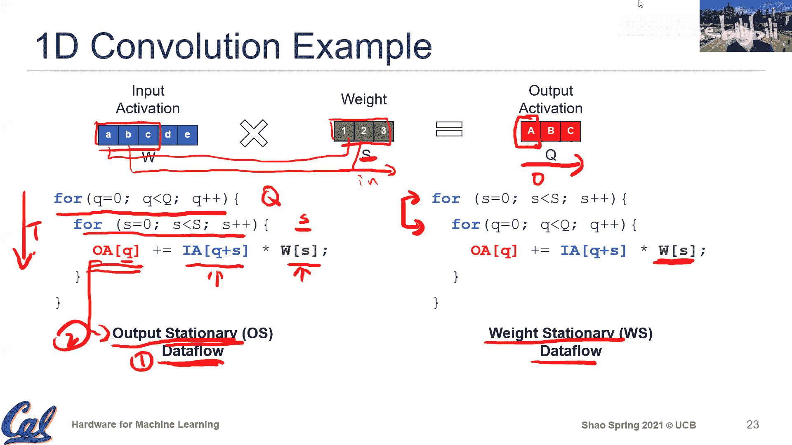

# 006：数据流

## 概述
在本节课中，我们将学习卷积运算在硬件上的执行方式，并引入“数据流”这一核心概念。我们将探讨不同的硬件执行策略，特别是数据流如何影响硬件设计的效率。课程将从回顾卷积运算的基本参数开始，然后介绍几种不同的卷积执行方法，最后深入讲解数据流的概念及其在硬件设计中的重要性。

---

## 卷积运算回顾与硬件映射

上一节我们介绍了卷积层的执行和不同的卷积参数。本节中，我们来看看这些执行如何实际映射到硬件上。

卷积运算可以用一个七层嵌套循环来描述，其核心是乘累加操作。我们用以下颜色和字母表示：
*   **蓝色**：输入激活，尺寸为 `H x W x C`
*   **绿色**：权重，尺寸为 `R x S x C x K`
*   **红色**：输出激活，尺寸为 `P x Q x K`

其中，`N` 是批次大小。执行卷积的总乘累加操作数为 `R x S x C x P x Q x K`。

这个循环嵌套定义了**需要完成的计算**，但并未指定**如何执行**。硬件设计的核心在于如何高效地组织这些计算和数据移动。

---

## 卷积执行的不同方法

以下是几种执行卷积运算的优化方法。

### 1. 直接卷积
直接卷积是最直观的方法，即严格按照循环嵌套的顺序执行乘累加操作。
*   **公式**：`for n, p, q, k, r, s, c: output[n, p, q, k] += weight[r, s, c, k] * input[n, p+r, q+s, c]`
*   **现状**：早期被认为效率不高，但随着专用硬件（如GPU的张量核心）的发展，直接卷积因其简单性和硬件优化支持，已成为当前最高效、最常用的方法之一。

### 2. 基于矩阵乘法的卷积
此方法通过 `im2col` 操作将卷积转换为通用矩阵乘法。
*   **核心思想**：将每个卷积窗口的输入数据展开成矩阵的一列，从而将卷积运算转化为 `GEMM`。
*   **优势**：可以利用高度优化的 `GEMM` 库（如 `cuBLAS`）。
*   **劣势**：`im2col` 操作会导致输入数据被复制多份，显著增加内存开销和带宽压力。

### 3. 基于快速傅里叶变换的卷积
此方法利用卷积定理，在频域进行更高效的计算。
*   **核心公式**：`Conv(time) = IFFT( FFT(input) ⊙ FFT(weight) )`，其中 `⊙` 表示逐元素相乘。
*   **优势**：对于大尺寸卷积核（如 `11x11`, `13x13`），能显著减少计算量。
*   **劣势**：`FFT` 变换本身有开销。现代卷积神经网络普遍使用小卷积核（如 `3x3`, `1x1`），使得 `FFT` 的收益不再明显，因此当前使用较少。

### 4. Winograd 变换卷积
此方法通过数学变换重组计算，减少乘法次数。
*   **核心思想**：将卷积计算重新关联，用更多的加法来换取更少的乘法。
*   **示例**：一个 `2x2` 输出、`3x3` 权重的卷积，Winograd 算法可以将乘法次数从 6 次减少到 4 次。
*   **现状**：有一定应用，但收益受限于数据移动开销，且需要硬件支持特定的数据访问模式，其普及程度不如直接卷积。

---

## 硬件设计核心原则：局部性与并行性

在深入数据流之前，我们需要理解硬件优化的两个基本原则：**局部性**和**并行性**。

### 局部性
数据移动是主要开销。局部性旨在将频繁访问的数据保存在靠近计算单元的地方。
*   **时间局部性**：同一数据项在短时间内被多次使用。可通过设计缓存层次结构来优化。
*   **空间局部性**：同一数据项被多个并行计算单元同时需要。可通过广播网络或片上互联来优化，以减轻内存带宽压力。

### 并行性
通过部署大量并行计算单元来提升吞吐量。
*   **挑战**：确保所有计算单元都被充分利用（高利用率）。
*   **关键**：结合空间局部性，使单一数据读取能服务多个计算单元，是保持高利用率的关键。

深度学习的卷积运算天然具有大量的数据重用机会和并行性，为应用这些硬件优化原则提供了理想条件。

---

## 数据流：定义与示例

数据流在深度学习硬件上下文中，特指**执行计算和数据移动的具体顺序**。它定义了硬件如何调度卷积的嵌套循环。

我们使用**循环嵌套的顺序**来精确描述一种数据流。不同的循环顺序意味着不同的数据重用模式和硬件结构。

### 输出固定数据流
在这种数据流中，最内层循环遍历权重维度，外层循环遍历输出位置。
*   **循环表示**：`for q in Q: for s in S: # 计算`
*   **特点**：在连续的计算周期内，**输出激活**的地址保持不变（被累加），而权重和输入激活在变化。这有利于将部分和存储在靠近计算单元的寄存器中。

### 权重固定数据流
在这种数据流中，最内层循环遍历输出位置，外层循环遍历权重维度。
*   **循环表示**：`for s in S: for q in Q: # 计算`
*   **特点**：在连续的计算周期内，**权重**的地址保持不变，而输入和输出激活在变化。这有利于将权重缓存起来重复使用。

“固定”一词指的是在连续计算周期内保持不变的操作数。选择哪种数据流决定了硬件需要为哪种数据（输出、权重或输入）设计更复杂的本地存储层次。

---

## 总结

本节课中我们一起学习了：
1.  **卷积的多种执行方式**：包括直接卷积、`im2col+GEMM`、`FFT`卷积和Winograd卷积，并了解了它们各自的优缺点及适用场景。
2.  **硬件设计核心原则**：**局部性**（时间与空间）和**并行性**是优化深度学习硬件性能的基石。
3.  **数据流的概念**：数据流是描述计算执行顺序的框架，它通过循环嵌套的顺序来定义，并决定了哪种数据（输出、权重、输入）在计算中被“固定”重用，从而指导硬件存储层次的设计。

理解数据流是分析现代深度学习加速器（如TPU、NVDLA）设计的关键。下一节课，我们将以具体的硬件为例，深入探讨这些数据流是如何在实际芯片中实现的。