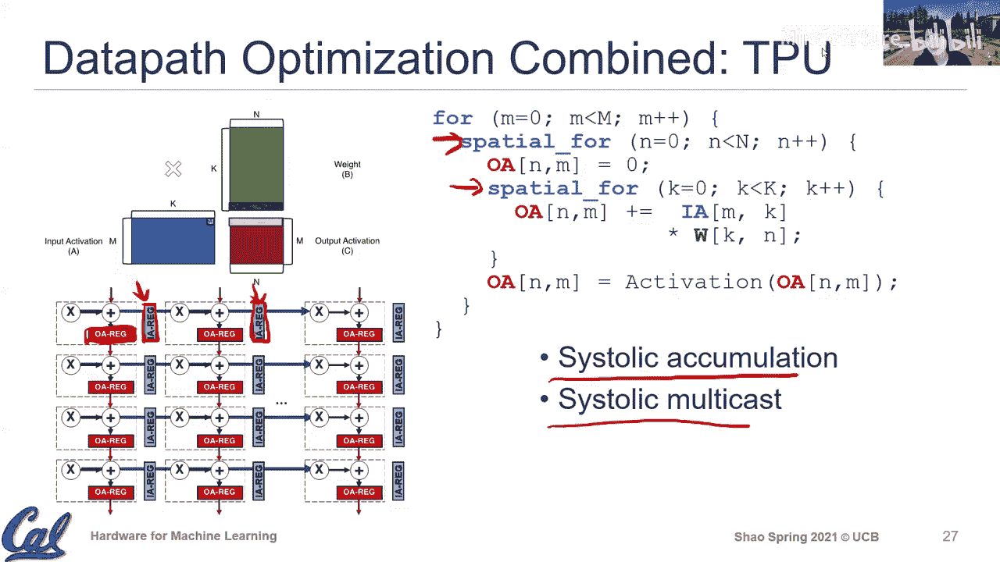

# 007：加速器设计原理

在本节课中，我们将学习在硬件上执行深度学习算子的硬件含义、通用硬件设计原则，以及这些原则如何在当今的深度学习硬件中体现。我们将从加速器的历史背景谈起，深入探讨其核心设计优化策略。

## 概述

近年来，从大型公司到初创企业，都在为机器学习等新兴应用构建专门的硬件引擎。构建加速器或进行所谓的领域特定架构加速并非全新的概念。在计算机硬件设计史上，许多成功的想法会反复出现。例如，早期的领域特定加速器就是协处理器，特别是浮点协处理器。在个人计算机早期，英特尔386处理器没有浮点流水线，而387则作为独立的浮点加速器提供给需要高效执行浮点运算的客户。这说明了领域特定加速或硬件加速的理念早已存在，并在计算需求量大、要求高吞吐量的应用推动下，得到了新的发展。

上一节我们介绍了数据流的概念，它用于描述计算的执行顺序。本节中，我们将探讨如何在硬件上实现不同的执行顺序，特别是数据流中最内层循环的执行顺序，并分析其对性能和可扩展性的影响。

## 数据流在硬件中的体现

我们使用数据流来描述执行顺序，并通过循环嵌套表示法来具体说明。通过结合**时间循环**和**空间循环**，我们可以利用数据局部性和并行性。以下是两种在当今深度学习硬件设计中常用的数据流。

### 输出驻留数据流

顾名思义，输出驻留数据流意味着在（最内层循环）执行期间，输出数据保持不变。

在循环嵌套表示中，输出索引 `Q` 在最内层循环中不发生变化，因此输出保持“驻留”。而输入和权重的索引则在最内层循环中变化。

**硬件含义**：由于同一输出数据被重复访问，存在时间局部性。为了利用这一点，硬件设计中通常会添加一个专用的**输出激活寄存器**来缓存该数据，从而减少对更大容量SRAM的访问。

### 权重驻留数据流

权重驻留数据流意味着在（最内层循环）执行期间，权重数据保持不变。

在相应的循环嵌套中，权重索引与最内层循环无关，因此权重被重用。

**硬件含义**：由于同一权重数据被重复使用，硬件设计中会添加一个专用的**权重寄存器**来缓存该权重值，以减少对权重缓冲区的访问。

> **设计权衡**：在实际高效的硬件设计中，通常会结合使用这两种策略，并可能使用多入口寄存器。需要仔细权衡寄存器大小和复杂度，因为输出激活通常是32位宽，而权重可能是8位，减少输出激活的SRAM访问通常能带来更大的能效收益。

## 为何需要加速器：通用计算的效率瓶颈

为了理解加速器的优势，让我们先看看通用处理器在执行深度学习核心运算（如矩阵乘法）时的效率瓶颈。一个简单的三层矩阵乘循环，在通用RISC-V核上直接编译后，会发现大量指令周期花费在数据索引、地址计算和循环控制等“管理开销”上，而非核心的乘加计算。

一项关于视频解码应用的能量分析研究揭示了通用计算中的主要效率瓶颈：

*   **指令获取与解码**：获取和解码大量细粒度指令的开销非常显著。
*   **数据缓存访问**：频繁的数据移动也消耗大量能量。
*   **核心计算**：实际在功能单元（如乘法器、加法器）中执行计算所消耗的能量占比反而较小。

这些“管理开销”对于维持处理器的通用性和灵活性是必要的，但对于执行固定的、计算密集型的深度学习算子而言，则成为了主要的效率瓶颈。这促使我们转向更专用的加速器设计。

## 加速器核心优化策略

基于上述效率分析，加速器设计主要围绕降低“管理开销”和提升“计算吞吐”展开。

### 策略一：粗粒度指令集

为了降低指令处理（取指、译码）的开销，深度学习加速器通常采用**粗粒度指令集**。

*   **指令数量少**：指令集非常精简，只包含数据搬运和核心计算等少数几种指令。
*   **指令粒度粗**：每条指令对应一个高级操作（如执行一个完整的256x256矩阵乘法），可以持续成百上千个周期，完成海量底层操作。硬件内部通过状态机或专用控制器来处理细粒度的循环和索引，而无需反复取指译码。

**示例**：谷歌TPU的指令集主要包含：从主机内存加载数据到缓冲区、将权重加载到权重缓冲区、执行矩阵乘法/卷积、执行非线性激活函数、将结果写回主机内存。

这种设计将能量和周期更多地集中在实际计算上，而非指令管理上。在软件层面，类似的优化思想体现为**算子融合**，即将卷积、激活、池化等连续操作合并执行，减少中间数据的搬运。

### 策略二：并行数据通路设计

粗粒度指令意味着单条指令蕴含巨大的并行计算潜力。如何设计数据通路来高效支持这种并行性？我们通过将循环嵌套中的某些维度映射为**空间循环**来实现。

考虑矩阵乘法 `C[M][N] = A[M][K] * B[K][N]`。我们主要关注两个维度的并行化：

#### 1. 空间K映射（累加维度并行）

将缩减维度 `K` 映射为空间循环，意味着同时进行 `K` 个乘加操作，然后对部分和进行累加。

**实现方式A：加法树**
*   **描述**：使用一个组合逻辑加法树，在同一周期内完成多个部分和的累加。
*   **优点**：在并行度（K值）不大时非常高效，无需在树中添加流水线寄存器。
*   **缺点**：当并行度很大时，加法树深度增加，关键路径变长，可能不得不插入流水线寄存器，影响扩展性。`output = sum( A[i] * B[i] for i in range(K) )` （通过加法树硬件实现）

**实现方式B：脉动累加**
*   **描述**：在累加路径的每一步都插入寄存器，使部分和像流水一样在寄存器链中传递并逐步累加。
*   **优点**：关键路径短（仅为一次乘加），高度规则，扩展性极佳，非常适合大规模并行设计（如TPU的256x256阵列）。
*   **缺点**：每一步都需要进行寄存器读写，在并行度较小时可能不如加法树紧凑。`P_sum[0] = 0; for i in range(K): P_sum[i+1] = P_sum[i] + (A[i] * B[i])`

#### 2. 空间N映射（输出维度并行）

将输出维度 `N` 映射为空间循环，意味着同时计算输出矩阵的一整行（或一整列）。

**核心挑战与实现**：此并行模式的关键在于**单播输入数据的多播**。同一个输入元素需要被分发到所有并行计算单元中。

**实现方式A：直接连线**
*   **描述**：通过物理连线将输入寄存器直接扇出到所有计算单元。
*   **优点**：简单直接，延迟低。
*   **缺点**：当并行单元数量很多时，长连线的物理设计（时序、功耗）变得复杂。

**实现方式B：脉动多播**
*   **描述**：在输入分发的路径上也插入寄存器链，让输入数据通过寄存器逐级传播到各个计算单元。
*   **优点**：信号规整，易于物理实现和扩展。
*   **缺点**：引入了额外的寄存器开销和初始延迟。

**组合案例**：
*   **NVDLA风格**：可能采用 **空间N（直接连线多播）** + **空间K（加法树累加）**。
*   **TPU风格**：采用 **空间N（脉动多播）** + **空间K（脉动累加）**，构成了其著名的二维脉动阵列。

> **关于存储层次**：在高效加速器设计中，计算单元通常不直接访问大型SRAM。为了最大化数据复用和最小化能耗，会在SRAM和计算单元之间加入多级寄存器或寄存器文件，用于缓存输入激活、权重和部分和（输出激活）。

## 总结

本节课我们一起学习了深度学习硬件加速器的核心设计原理。我们从历史背景了解到，领域特定加速并非新概念。我们深入探讨了**输出驻留**和**权重驻留**数据流及其硬件实现含义。通过分析通用处理的效率瓶颈，我们引出了加速器两大核心优化策略：**1）采用粗粒度指令集以降低指令管理开销**；**2）设计并行数据通路以挖掘计算并行性**。在并行数据通路设计中，我们重点分析了**空间K映射**（累加并行）的加法树与脉动累加实现，以及**空间N映射**（输出并行）的直接多播与脉动多播实现，并了解了这些基础模式如何组合成现代加速器（如NVDLA、TPU）的架构。下一节课，我们将继续探讨加速器设计中的**内存优化**策略。