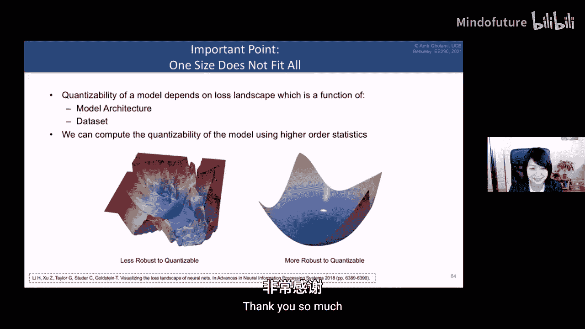

# 008：高效神经网络的量化方法


## 概述

在本节课中，我们将学习神经网络量化的基本概念、方法及其在高效部署中的关键作用。量化通过将高精度数值（如FP32）映射到低精度表示（如INT8），可以显著减少模型的内存占用、计算能耗并提升推理速度。我们将从量化基础开始，逐步深入到高级主题和前沿研究方向。

## 基本概念

上一节我们概述了量化的重要性，本节中我们来看看量化的一些核心概念和不同方法。

### 均匀量化与非均匀量化

量化是将一个实数域中的值映射到低精度整数值的过程。例如，将范围在[-2.5, 5.0]的FP32值映射到8位整数（0-255）。

**均匀量化**将实数范围均匀地划分为多个区间（桶），每个区间映射到一个整数。其数学公式可表示为：
`r = S * (q - z)`
其中，`r`是实数值，`S`是缩放因子（scale），`q`是量化后的整数值，`z`是零点（zero-point），用于精确表示实数0。

然而，神经网络权重和激活值的分布通常不是均匀的（例如，呈高斯分布）。**非均匀量化**试图在值密集的区域分配更多的量化级别，理论上能获得更好的精度。但非均匀量化在硬件上部署效率低下，通常需要查找表，因此当前主流研究集中在**均匀量化**上。

### 对称量化与非对称量化

在确定量化范围时，我们使用裁剪范围[α, β]。如果选择α = -β，则称为**对称量化**，此时零点`z`自动为0，计算得以简化。如果α ≠ β，则称为**非对称量化**。

对称量化虽然简单，但在某些场景下并不高效。例如，在ReLU激活函数之后，所有值都是非负的，使用对称量化会浪费一部分比特去表示永远不会出现的负值区间。此时，**非对称量化**是更优的选择。

### 逐层量化与逐通道量化

对于一个神经网络层，我们可以为整个层的所有权重选择一个统一的量化参数（α, β），这称为**逐层量化**。然而，同一层中不同的卷积核或通道可能具有不同的值分布范围。

因此，更优的做法是**逐通道量化**，即为每个通道或卷积核单独计算量化参数。这样做几乎没有额外开销，并能更准确地捕捉数据分布，从而获得更高的量化精度。

### 动态量化与静态量化

对于权重，由于其值在训练后是固定的，我们可以预先（静态地）计算其量化参数。但对于激活值，其范围可能因输入数据而变化。

*   **静态量化**：在部署前，使用一个校准数据集来预先确定激活值的量化范围。这种方法速度快，但可能因输入分布变化而精度下降。
*   **动态量化**：在运行时实时计算每个输入激活的张量范围，并据此进行量化。这种方法通常更准确，但由于计算范围需要额外开销，在硬件上执行速度较慢。

### 训练后量化与量化感知训练

这是决定量化工作流程的另一个关键区别。

*   **训练后量化**：在模型训练完成后，直接对权重和激活进行量化，不进行任何重新训练。这种方法非常快速，甚至是“即插即用”的，但在低精度（如INT4）下可能导致显著的精度损失。
*   **量化感知训练**：在模型训练（或微调）过程中，模拟量化的效果，让模型权重能够适应量化带来的误差。这种方法能显著提升低精度量化的模型精度，但需要额外的训练时间和计算资源。

---

## 高级概念与核心方法

上一节我们介绍了量化的基本分类，本节中我们来看看实现量化时更深入的技术细节和挑战。

### 伪量化与纯整数量化

在研究和部署中，量化算法的实现方式至关重要，主要分为两类：

*   **伪量化（或模拟量化）**：在训练或评估时，权重和激活以量化形式存储，但实际的前向计算（如矩阵乘法）仍在浮点数（如FP32）上进行。这种方法便于研究和快速验证，但无法获得硬件加速带来的实际速度提升，且在某些操作（如残差连接、批归一化）上可能与真实硬件行为存在差异。
*   **纯整数（或定点）量化**：所有计算，包括乘加累加，都在整数域进行。累加通常在更高位宽的整数（如INT32）中进行，然后通过**缩放**和**舍入**操作将结果映射回低精度（如INT8）。这是能在实际硬件上获得加速的正确方式。

实现纯整数量化的一个巧妙方法是**二值量化**，即将缩放因子`S`约束为2的幂次方的倒数。这样，在从高精度累加结果向低精度量化值转换时，复杂的浮点除法可以简化为高效的整数乘法和位移操作。

以下是纯整数量化中卷积运算的简化表示：
```python
# 假设对称量化，忽略零点z
# W_q: 量化后的权重 (INT8)
# X_q: 量化后的输入 (INT8)
# S_w, S_x: 权重和输入的缩放因子
# S_y: 输出的缩放因子

# 在整数域进行乘加累加，结果用更高精度（如INT32）存储
accumulator_int32 = int32_matmul(W_q, X_q)
# 缩放并量化回INT8
Y_q = round(accumulator_int32 * (S_w * S_x / S_y))
```

### 混合精度量化

将整个网络的所有层统一量化到极低精度（如INT4）通常会导致严重的精度损失。**混合精度量化**的核心思想是：并非所有层对量化误差的敏感度相同。我们可以为网络中的不同层分配合适的比特宽度。

如何自动确定每层的最佳精度呢？一个关键洞察是利用**损失函数景观**。对于一个训练好的模型，如果我们轻微扰动某一层的参数，并观察损失函数的变化：
*   如果损失变化剧烈（景观“陡峭”），说明该层对参数变化敏感，应分配较高精度（如INT8）。
*   如果损失变化平缓（景观“平坦”），说明该层对参数变化不敏感，可以分配较低精度（如INT4）。

通过将每层的精度选择建模为一个优化问题（例如，在满足整体模型大小和延迟约束下，最小化精度损失），我们可以系统地搜索出最优的混合精度配置。

---

## 硬件协同设计与未来方向

上一节我们探讨了通过算法优化来提升量化效果，本节中我们来看看如何将算法与硬件特性协同设计，以达到极致的效率。

### 硬件感知的神经网络设计

传统的网络设计（如ResNet、MobileNet）主要追求更高的准确率。但在资源受限的边缘设备上，我们需要**硬件感知的神经网络设计**。这意味着在设计网络时，就将目标硬件的特性（如计算峰值、内存带宽、缓存大小）考虑在内。

例如，深度可分离卷积虽然参数少，但其**算术强度**低，意味着它受限于内存带宽而非计算能力。在某些硬件上，即使将其计算精度从FP32降到INT8，也可能无法获得显著的加速，因为瓶颈在于数据搬运。因此，针对特定硬件，可能需要减少这类层的使用，或调整网络结构。

### 神经架构搜索与硬件协同设计

自动化这一过程的方法是**硬件感知的神经架构搜索**。其基本流程如下：
1.  定义一个包含多种基础操作（如3x3卷积、1x1卷积、深度可分离卷积）的搜索空间。
2.  在目标硬件上精确测量每种操作的性能（延迟、能耗）。
3.  训练一个**随机超网络**，该网络以概率形式包含所有可能的操作路径。
4.  通过优化，使超网络学习到的路径采样概率分布能够满足目标硬件上的性能约束（如最大延迟），同时保持高准确率。
5.  从训练好的超网络中采样，即可得到为特定硬件量身定制的高效网络架构。

更前沿的方向是**硬件与算法的协同设计**：不仅根据现有硬件设计网络，也根据目标工作负载（如一组特定的神经网络模型）来共同设计硬件架构本身（如处理单元阵列的大小、内存层次结构等）。这是一个充满挑战但潜力巨大的开放研究领域。

---

## 总结

本节课中我们一起学习了神经网络量化的核心知识。我们从**基本概念**入手，区分了均匀/非均匀、对称/非对称、动态/静态、训练后/量化感知训练等不同量化方法。接着，我们深入探讨了**高级概念**，明确了伪量化与纯整数量化的区别，并介绍了通过混合精度量化来突破低精度瓶颈的策略。最后，我们展望了**硬件协同设计**的未来，包括硬件感知的NAS以及算法-硬件联合优化这一激动人心的方向。



量化是使深度学习模型得以在资源受限环境中高效部署的关键技术，它连接了算法创新与硬件加速，是机器学习硬件领域不可或缺的一部分。