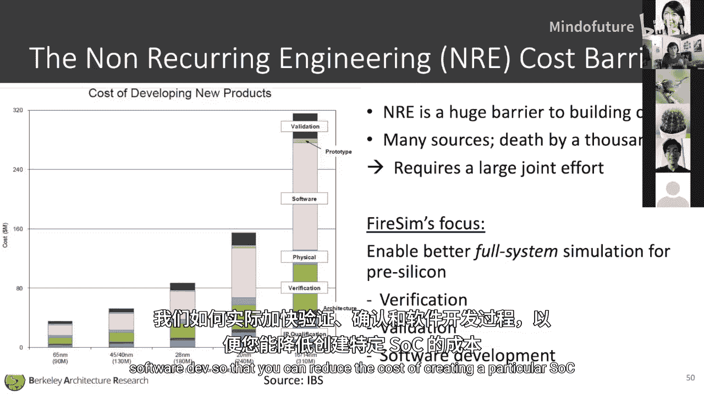
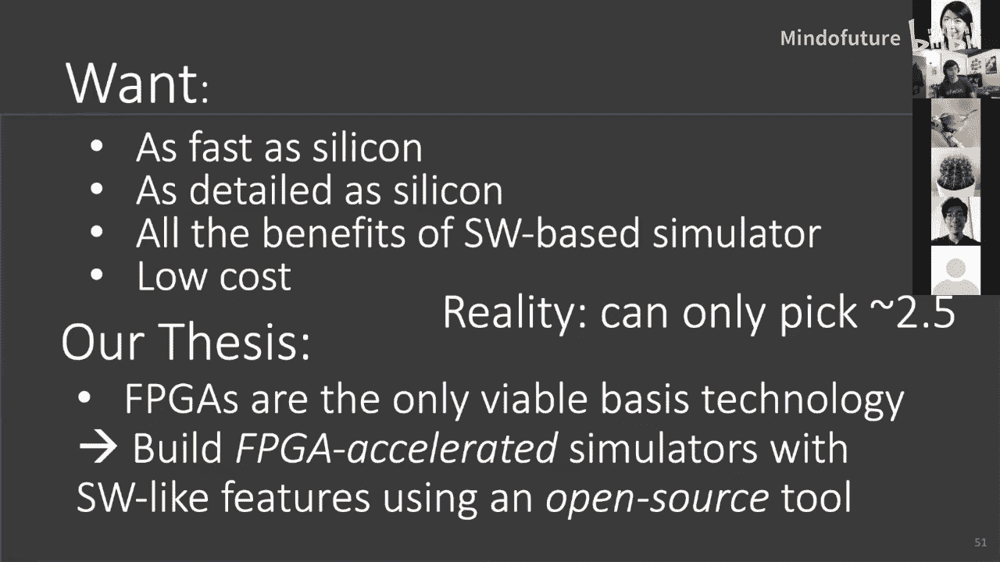
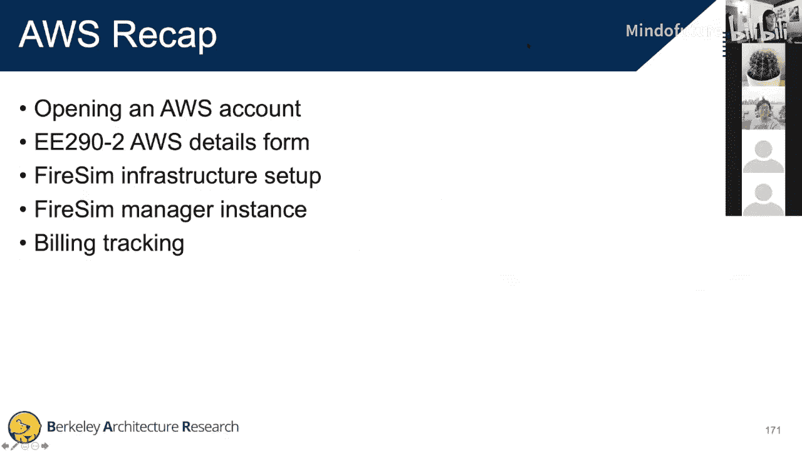

# 009：Chipyard & FireSim 教程 🚀


在本节课中，我们将学习伯克利研究基础设施的核心：Chipyard 和 FireSim。我们将了解它们如何协同工作，为机器学习硬件设计提供从RTL生成到性能评估的完整流程。课程的后半部分将指导你完成FireSim在AWS上的设置，为实验三做好准备。

---

## 概述 📋

Chipyard是一个集成了多种开源硬件IP（如处理器核心、加速器、缓存）和工具链的框架，用于快速构建和配置片上系统（SoC）。FireSim则是一个基于FPGA加速的仿真平台，能够对Chipyard生成的SoC设计进行快速、准确的性能仿真。本节课将介绍这两个工具的基本概念、工作流程，并手把手指导你完成FireSim在AWS云平台上的初始设置。

---

## Chipyard 基础 🏗️

上一节我们概述了课程内容，本节中我们来看看Chipyard的具体构成。

Chipyard旨在解决开源硬件IP集成和性能评估的挑战。它不是一个单一的IP，而是一个组织和集成各种生成器（Generators）与工具的环境。

### 核心组件与流程

Chipyard包含多个流程，允许你针对不同的目标（如软件仿真、FPGA仿真、流片）进行设计。

*   **软件仿真流程**：这是你在实验二中使用的流程。你修改RTL（如Gemini加速器），通过Firrtl编译器生成Verilog，最后使用VCS或Verilator等工具进行仿真。
*   **FireSim流程**：这是实验三将使用的流程。设计通过特定的构建过程转换，然后交由FireSim进行基于FPGA的加速仿真。
*   **VLSI流片流程**：设计经过面向流片的转换后，可接入名为“Hammer”的VLSI流程，最终生成可用于制造的版图。

### 核心语言：Chisel 🔨

Chipyard的基础设施主要基于Chisel构建。Chisel是一种嵌入在Scala中的硬件构造语言，其核心优势在于创建**参数化生成器**，而非单一的硬件实例。

以下是一个用Chisel编写的简单移动平均滤波电路示例：
```scala
class MovingAverage extends Module {
  val io = IO(new Bundle {
    val in = Input(UInt(32.W))
    val out = Output(UInt(32.W))
  })
  val reg = RegNext(io.in)
  io.out := (io.in + reg) >> 1.U
}
```
通过Scala的高级特性，我们可以轻松地将其参数化为一个通用的FIR滤波器：
```scala
class FirFilter(consts: Seq[SInt]) extends Module {
  val io = IO(new Bundle {
    val in = Input(SInt(32.W))
    val out = Output(SInt(32.W))
  })
  val taps = Seq(io.in) ++ consts.map { c =>
    val reg = RegNext(io.in)
    reg * c
  }
  io.out := taps.reduce(_ + _)
}
```
Chisel代码通过Firrtl编译器处理，Firrtl可以类比为LLVM。它接收Chisel代码，进行一系列优化和转换，最终输出针对不同后端（如仿真、FPGA、ASIC）的Verilog代码。

### 关键IP：Rocket Chip 与 BOOM 🚀

Chipyard的核心SoC生成器是Rocket Chip。它提供了一个可重用的SoC组件库和创建自定义SoC的API。

*   **Rocket Core**：默认的按序执行RISC-V CPU核心，支持RV64GC扩展，可启动Linux并支持加速器。
*   **BOOM (Berkeley Out-of-Order Machine)**：高性能超标量乱序执行核心，可作为Rocket Core的直接替代品，支持相同的软件栈。

加速器（如Gemini）通过**Rocket协处理器接口（RoCC）** 连接到核心，允许执行自定义指令并与内存子系统交互。

### 系统集成与配置

如何将所有IP集成并配置成一个完整的SoC是一大挑战。Chipyard通过以下方式解决：

1.  **Diplomatic参数协商**：用于解决不同IP模块间参数（如总线位宽、地址空间）的自动协商问题，确保系统正确连接。
2.  **基于Scala的配置系统**：允许用户通过简洁的Scala代码从底层向上构建系统。例如，你可以从一个基础配置开始，逐步添加特定核心、缓存和加速器。

以下是一个配置示例的简化概念：
```scala
// 这是一个概念示例，非实际代码
class MySoCConfig extends Config(
  // 添加基础Rocket配置
  new BaseRocketConfig ++
  // 使用BOOM核心
  new WithBoomCore ++
  // 添加Gemini加速器
  new WithGeminiAccel ++
  // 配置L2缓存
  new WithL2Cache(size="512KB")
)
```

---

## FireSim：FPGA加速仿真 ⚡

上一节我们介绍了用于构建SoC的Chipyard，本节中我们来看看如何用FireSim对SoC进行高性能仿真。



FireSim的目标是为流片前的设计提供**全系统、周期精确的仿真**，以加速验证、确认和软件开发流程。



### 核心理念

FireSim不是简单的FPGA原型设计，而是**FPGA加速的仿真器**。关键区别在于**时序解耦**。

*   **问题**：如果直接将SoC RTL部署到FPGA上（原型），由于FPGA通常运行频率（如100 MHz）低于目标硅频率（如1 GHz），会导致内存访问延迟等时序特征失真，无法获得准确的性能数据。
*   **FireSim解决方案**：在FPGA上实现目标设计（Target）时，加入一个解耦层。**每个FPGA时钟周期模拟一个目标时钟周期**，而像DRAM访问这样的延迟则被建模为精确的周期数。这样就能在较慢的FPGA上获得与目标硅频率一致的性能仿真结果。

### 架构与工作流程

FireSim主要包含两部分：
1.  **编译器**：接收Chipyard设计，生成用于FPGA仿真的网表和相关文件。
2.  **管理器**：在AWS上编排和管理仿真任务。你可以通过一个“管理实例”（头节点）来启动“构建农场”（编译设计）和“运行农场”（在多个FPGA实例上执行仿真）。

### 优势与应用

FireSim能实现快速、大规模且功能丰富的仿真：
*   **性能评估**：获得真实的硬件性能数据，用于设计空间探索。
*   **大规模仿真**：可扩展至模拟数据中心级别的千节点系统，成本远低于实际搭建。
*   **强大调试**：支持波形输出、printf合成、断言检查等，调试能力接近软件仿真器。
*   **开源**：整个平台完全开源。

---

## AWS 与 FireSim 实践设置 🛠️

前面我们学习了Chipyard和FireSim的理论知识，本节我们将进行FireSim在AWS云平台上的实践设置。请跟随以下步骤操作。

> **重要提示**：在收到课程提供的AWS促销码之前，请勿在账户中添加信用卡信息或进行任何会产生费用的操作。你可以先熟悉流程，收到促销码后再完成设置。

### 第一步：创建AWS账户并设置区域

1.  访问 [AWS官网](https://aws.amazon.com/) 并创建新账户。账户类型选择“个人账户”。
2.  使用你的伯克利邮箱等信息完成注册。
3.  登录AWS控制台，在页面右上角将**区域（Region）设置为“美国东部（弗吉尼亚北部）us-east-1”**。这是唯一支持F1 FPGA实例的区域。

### 第二步：申请提升F1实例限额

新AWS账户默认无权启动F1实例。
1.  在控制台找到“EC2”服务并进入。
2.  在左侧导航栏找到“限额（Limits）”。
3.  点击“请求增加限额（Request limit increase）”。
4.  在搜索框中输入“EC2”，选择“所有F实例”。
5.  区域选择“US East (N. Virginia)”，将新限额值设置为64（最终可能批准为16）。
6.  在用例描述中填写：“用于EE290课程，使用FireSim进行硬件仿真，需要F1实例。”
7.  提交请求。通常会在几小时到一天内通过。

### 第三步：填写表单获取促销码

填写课程提供的Google表单，提交你的姓名、学号、邮箱和AWS账户ID。课程助教将通过邮件向你发送价值200美元的AWS促销码和预构建的AMI镜像访问权限。

### 第四步：设置密钥对

1.  在EC2控制台左侧导航栏，找到“密钥对（Key Pairs）”。
2.  点击“创建密钥对”。
3.  名称输入 **`firesim`**，密钥对类型选择“RSA”，私钥文件格式选择“.pem”。
4.  创建并妥善保存下载的`.pem`文件。这是后续登录实例的凭证。

### 第五步：（收到促销码后）兑换并启动临时实例

1.  在AWS控制台，进入“账单仪表板（Billing Dashboard）”，选择“积分（Credits）”，兑换收到的促销码。
2.  返回EC2控制台，点击“启动实例（Launch Instance）”。
3.  选择“Amazon Linux 2 AMI”。
4.  实例类型选择“t2.nano”（这是免费套餐可选的低成本实例）。
5.  在“配置安全组”等步骤使用默认设置，直到“审核和启动”。
6.  在最后一步，系统会提示选择密钥对。在下拉菜单中选择之前创建的 **`firesim`** 密钥对，然后启动实例。

### 第六步：在临时实例上配置AWS CLI

1.  实例启动后，在EC2控制台获取其“公有IPv4地址”。
2.  在本地终端，使用以下命令SSH连接到实例（将`<path-to-key>`和`<public-ip>`替换为实际值）：
    ```bash
    chmod 600 <path-to-key>/firesim.pem
    ssh -i <path-to-key>/firesim.pem ec2-user@<public-ip>
    ```
3.  在实例中，运行 `aws configure` 命令。你需要提供AWS访问密钥。
    *   获取密钥：在AWS控制台右上角点击你的用户名 -> “安全凭证（Security Credentials）” -> “访问密钥（Access Keys）” -> “创建新的访问密钥”。下载CSV文件。
    *   在 `aws configure` 提示符下，依次输入CSV文件中的访问密钥ID、秘密访问密钥、区域（`us-east-1`）和输出格式（`json`）。

### 第七步：运行FireSim首次设置脚本并订阅AMI

1.  在临时实例的SSH会话中，根据FireSim文档或助教在聊天中提供的命令，运行一系列以 `sudo yum install python3 ...` 开头的安装命令。
2.  看到“Success”提示后，在EC2控制台**终止（Terminate）** 这个t2.nano实例，避免产生不必要的费用。
3.  最后，通过FireSim文档提供的链接，订阅“FPGA Developer AMI”。点击“接受条款（Accept Terms）”。此过程可能需要30分钟到1小时完成。

### 第八步：启动FireSim管理实例（开始实验三时进行）

当你准备开始实验三时，需要启动一个长期运行的管理实例。
1.  启动实例时，在AMI选择页面，搜索并选择课程提供的特定AMI（例如 `Berkeley Firesim Manager AMI - Spring 2021`）。你可能需要在“共享给我（Shared with Me）”选项卡中查找。
2.  实例类型建议选择 `r5.large`（性能与成本平衡）。
3.  **关键配置**：
    *   在网络设置中，选择“firesim”网络。
    *   在安全组设置中，选择现有的“firesim”安全组。
    *   启用“终止保护”。
4.  启动时，同样选择 **`firesim`** 密钥对。
5.  启动后，使用SSH登录该管理实例，将本地的 `firesim.pem` 文件复制到实例上的 `~/.ssh/` 目录。
6.  按照实验三文档说明，在实例中设置环境变量（通常通过 `source` 命令），然后即可开始使用 `firesim` 命令来管理你的仿真任务。

### 费用监控提醒 💸

务必定期通过AWS的“账单仪表板”监控你的积分使用情况。当积分消耗接近150美元时，应格外小心，如需更多资源请及时联系助教。200美元的积分应足够完成实验三。

---

## 总结 🎯

本节课我们一起学习了伯克利机器学习硬件研究的两大核心基础设施。
*   **Chipyard** 是一个强大的SoC设计框架，它集成了丰富的开源硬件IP（如Rocket Chip, BOOM），并通过Chisel语言和灵活的配置系统，让快速构建和定制复杂SoC成为可能。
*   **FireSim** 是一个基于FPGA加速的仿真平台，它通过时序解耦技术，在云上实现了对Chipyard生成设计的快速、精确的性能仿真，支持大规模系统模拟和深度调试。
*   最后，我们逐步完成了在AWS上设置FireSim运行环境的实践指南，为接下来的实验三做好了准备。



掌握这些工具将极大地助力你的硬件设计、仿真和评估工作。