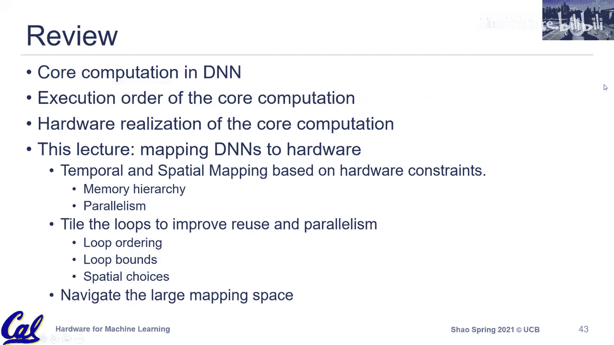

# 010：映射


在本节课中，我们将要学习如何将机器学习计算任务映射到专用的硬件加速器上。我们将探讨映射问题的核心概念、需要考虑的硬件约束、以及不同的映射策略如何影响性能和效率。

## 概述

映射，有时也称为分块、调度或编译，是指将特定维度的计算问题（如一个神经网络层）映射到特定硬件架构上的过程。这个过程需要考虑问题本身的维度（如矩阵大小）和硬件的具体规格（如计算单元阵列大小、片上缓存容量）。目标是找到一个正确的执行顺序，使其能在目标硬件上高效运行。

上一节我们介绍了硬件加速器的核心计算原语和架构设计。本节中，我们来看看如何将计算任务有效地映射到这些硬件上。

## 映射问题与硬件约束

映射问题有两个关键输入：一是问题特定的配置（如神经网络层的类型和维度），二是硬件特定的规格。我们需要结合这两者来找到一个高效的执行顺序。

以下是映射过程中需要考虑的主要硬件约束。

### 1. 脉动阵列尺寸

硬件加速器（如Google TPU或AWS Inferentia）通常采用脉动阵列设计，其尺寸（如128x128）是固定的。然而，实际的计算问题（如矩阵乘法）维度（M, K, N）可能远大于这个硬件尺寸。

**解决方案**：通过添加时间循环来进行分块。硬件尺寸由空间循环表示，而超出硬件尺寸的部分则通过额外的时间循环来处理。

例如，对于一个2x2的脉动阵列（空间循环N0和K0的循环边界为2），要计算更大的矩阵，我们添加时间循环N1和K1：

```
for m in range(M):
    for n1 in range(N1):
        for k1 in range(K1):
            # 硬件并行执行 (n0:2, k0:2) 部分
            for n0 in range(2):
                for k0 in range(2):
                    # 计算核心
```

这样，大问题被分解成多个小块，由硬件分多次执行。

### 2. 片上缓存容量

在专用加速器中，数据移动通常需要由程序员显式管理，通过特定的指令将数据加载到片上缓存（如权重缓存、输入激活缓存）。这与CPU中由缓存层次结构隐式管理数据不同。

**核心约束**：映射方案必须确保每次加载到片上缓存的数据量不超过该缓存的容量，否则会导致无效的执行或错误结果。

**解决方案**：通过添加更多层的时间循环，将数据块进一步切分得更小，以适应有限的缓存大小。

例如，如果权重矩阵（大小 N x K）超过了权重缓存的容量，我们不能一次性全部加载。我们需要添加一个外层时间循环，每次只加载权重矩阵的一个子集：

```
for n2 in range(N2):
    # 将部分权重（大小 N1 x K）移动到权重缓存
    move_in(weights[n2*N1:(n2+1)*N1, :])
    for m in range(M):
        for n1 in range(N1):
            for k1 in range(K1):
                # ... 计算部分
```

反之，如果片上缓存容量大于当前分块所需，我们可以考虑加载更大的数据块，以更好地利用缓存并可能重叠计算与通信。

### 3. 内存层次结构

现代加速器可能具有更复杂的内存层次，例如共享缓存或邻近缓存（如AWS架构中所述）。这引入了数据共享的机会，但也会影响访问延迟和带宽。映射策略需要考虑这些层次，通过添加更多循环层级来利用数据局部性。

## 映射空间的维度

为了更结构化地理解映射选择，我们可以将其分解为几个关键维度。

以下是映射决策的三个主要维度。

### 循环顺序

循环嵌套中各个循环的排列顺序会影响数据移动量，从而影响性能。

**示例**：考虑一个包含循环 `M2`（输入激活相关）和 `N2`（权重相关）的内核。不同的循环顺序会导致输入激活被重复加载的次数不同。
*   若 `M2` 为外层循环，`N2` 为内层循环，则对于每个 `M2` 块，权重需要被整体加载一次，但输入激活块可能被重复使用。
*   若顺序交换，则对于每个 `N2` 块，输入激活需要被整体加载一次，而权重块可能被重复使用。
最优顺序取决于 `M`、`N` 的相对大小以及片上缓存容量。

### 循环边界

即每个循环的迭代次数（分块大小）。这直接由硬件约束决定：
*   **下限**：必须满足片上缓存容量限制，确保数据块能放入缓存。
*   **优化目标**：在满足容量限制的前提下，最大化缓存利用率，平衡计算与数据移动，以实现高性能和高能效。

### 空间化选择

此维度涉及将某些循环从“时间循环”转换为“空间循环”，以利用多个并行硬件单元（如多个加速器核或芯片）。

**模型并行**：将权重维度（如 `N`）的空间化。即将权重的不同部分分布到不同的加速器上。每个加速器持有模型的一部分。
`spatial for n in range(2):`  # 在两个加速器间分配权重

**数据并行**：将输入激活维度（如 `M`）的空间化。即将输入数据批次的不同部分分布到不同的加速器上。每个加速器处理不同的输入数据。
`spatial for m in range(2):`  # 在两个加速器间分配输入数据

## 映射调优的挑战

映射空间非常庞大，针对不同硬件和不同网络，最优映射可能截然不同。手动寻找最优解无法扩展。因此，该问题自然演变成一个**自动调优优化问题**。

目标有两个：
1.  **找到高性能的映射**：最小化内核执行时间或能耗。
2.  **快速找到解决方案**：编译/调优时间本身也需要很短。

目前的研究方向包括使用启发式搜索、遗传算法、强化学习等机器学习方法来自动探索巨大的映射空间，以期快速找到接近最优的配置。

## 总结

本节课中我们一起学习了机器学习计算任务的映射问题。
*   我们了解到映射需要同时考虑**问题维度**和**硬件约束**，后者主要包括**计算并行度**（脉动阵列大小）和**内存容量**（片上缓存大小）。
*   我们探讨了通过操作**循环嵌套**（添加时间循环、调整循环顺序和边界）来满足约束并优化性能。
*   我们介绍了映射空间的三个关键维度：**循环顺序**、**循环边界**和**空间化选择**（对应模型并行与数据并行）。
*   最后，我们认识到由于映射空间的复杂性和问题依赖性，自动调优已成为该领域的重要研究方向，旨在高效地寻找兼具高性能和短编译时间的映射方案。



理解这些映射概念对于设计高效的硬件加速器及其配套软件栈至关重要。