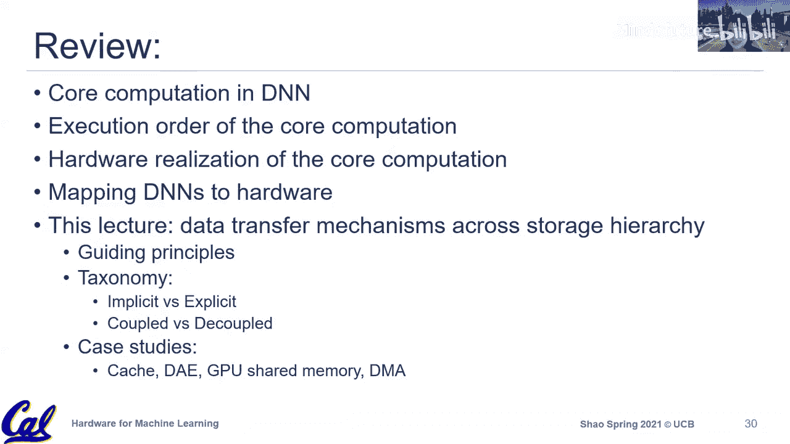

# 011：数据编排

在本节课中，我们将深入学习数据编排。数据移动在硬件设计中至关重要，尤其是在深度学习加速器的背景下。我们将探讨数据编排的核心概念、设计原则，并通过一个分类法来系统化地理解不同的数据移动策略。

上一节我们讨论了计算映射的挑战，本节中我们来看看数据移动的具体机制。

## 数据移动的重要性

数据移动在硬件设计中扮演着关键角色。在深度学习加速器中，数据移动消耗的能量通常比计算单元（ALU）本身还要多。下图展示了典型深度学习加速器中不同内存层级访问的能量消耗对比。

此外，片上存储（如缓冲器）不仅消耗大量能量，也占据了芯片面积的很大一部分。因此，高效的数据编排对于优化性能和能效至关重要。

## 什么是数据编排？

数据编排不仅仅是数据的被动移动，它更强调有目的地优化和管理数据传输，以满足特定的性能目标。任何数据编排方案都需要考虑两个核心方面：

1.  **数据供给**：确保数据在功能单元需要时，能够及时地出现在正确的位置。
2.  **数据释放**：当数据不再被需要时，应尽快将其从缓冲区中释放，以腾出空间供其他数据使用。

以下是设计数据编排方案时需要考虑的一些具体问题：

*   **何时发起传输？** 太早会浪费缓冲区空间，太晚则会导致计算单元空闲等待。
*   **数据应放置在何处？** 需要将数据放置在靠近消费者的位置，以获得良好的数据局部性。
*   **谁是消费者？** 需要明确数据的最终使用者，这关系到数据的目的地。
*   **如何同步？** 当有多个消费者时，需要同步机制来确保数据访问的正确性。
*   **数据的访问模式是什么？** 是顺序流式访问，还是带步长的访问？了解模式有助于优化。
*   **何时可以释放数据？** 消费者使用完毕后，应尽快释放数据以重用缓冲区空间。

## 数据编排的设计原则

以下是指导高效数据编排的几个核心原则：

*   **局部重用**：利用数据局部性，通过内存层次结构（如缓存）将频繁使用的数据保存在靠近计算单元的地方。
*   **空间重用**：支持多播，让多个消费者高效地共享同一份数据，减少内存访问开销。
*   **高效利用带宽**：充分利用片上和外部的内存带宽。
*   **传输与计算重叠**：在计算单元执行任务的同时，让内存系统忙于获取后续所需的数据，以隐藏内存延迟。例如，**双缓冲**就是一种实现此目标的简单技术。
*   **精确同步**：只在必要时进行同步，避免代价高昂的全局同步，确保正确性的同时最小化开销。
*   **控制成本**：在实现复杂编排方案时，需权衡其带来的面积和功耗成本，优先采用简单的结构。

## 数据编排的分类法

为了系统化地理解不同的数据移动策略，我们引入一个基于两个维度的分类法。首先，我们需要明确数据移动交易中的四个关键角色：

1.  **生产者**：当前持有数据的代理。
2.  **消费者**：将消费数据的代理。
3.  **请求者**：发起数据请求的代理。它可能与消费者是同一个实体，也可能是独立的。
4.  **分发者**：负责定位数据所在（例如在内存层次结构中的位置），并将数据从生产者路由到消费者的代理（例如缓存系统）。

### 维度一：耦合 vs. 解耦

这个维度关注**请求者**和**消费者**是否是同一个代理。

*   **耦合架构**：请求者和消费者是同一个代理（例如，CPU流水线既发出加载指令，也消费返回的数据）。这是当今通用CPU的主流设计。
    *   **优点**：设计简单直观。
    *   **缺点**：在数据返回前，需要预留存储空间（如寄存器），可能导致资源利用率不高。
*   **解耦架构**：请求者和消费者是分离的代理（例如，独立的“访问切片”和“执行切片”）。
    *   **目标**：让请求者提前运行，预取数据，从而在消费者需要时数据已准备就绪，以隐藏内存延迟。
    *   **挑战**：需要复杂的同步机制来确保请求和消费的顺序正确匹配。

### 维度二：隐式 vs. 显式

这个维度关注**请求者**是否明确知道**生产者**的位置，是否需要**分发者**。

*   **隐式数据移动**：请求者不知道数据的具体位置，依赖分发者（如缓存层次结构）来定位和获取数据。
    *   **示例**：CPU的`load`指令。
    *   **优点**：对程序员透明，易于编程。
    *   **缺点**：需要复杂的硬件结构（如缓存标签、MSHR等），带来较高的面积和功耗开销。
*   **显式数据移动**：请求者明确知道数据的源地址和目的地址，直接发起传输。
    *   **示例**：GPU中将数据从全局内存复制到共享内存的操作，或加速器中的DMA传输。
    *   **优点**：硬件开销低，效率高。
    *   **缺点**：需要程序员或编译器显式管理数据移动，编程更复杂。

这两个维度是正交的，可以组合成四种类型的数据编排策略。

## 案例研究

以下是四种组合的具体案例：

1.  **隐式+耦合**
    *   **描述**：请求者/消费者统一，且依赖隐式分发（缓存）。
    *   **典型示例**：现代通用CPU的缓存层次结构。
    *   **特点**：易于编程，通用性强，但硬件开销大。

2.  **隐式+解耦**
    *   **描述**：请求者（访问切片）和消费者（执行切片）分离，但仍使用隐式缓存进行数据分发。
    *   **典型示例**：“解耦访问/执行”架构的研究论文。
    *   **特点**：旨在隐藏延迟，但同步复杂，在通用计算中较难广泛应用。

3.  **显式+耦合**
    *   **描述**：请求者/消费者统一，但数据移动是显式管理的。
    *   **典型示例**：GPU的共享内存编程模型。程序员需要显式地将数据从全局内存`cudaMemcpy`到共享内存，然后在同一个SM（流多处理器）内进行计算。
    *   **特点**：比完全隐式控制更精细，但编程负担仍在单个执行单元内。

4.  **显式+解耦**
    *   **描述**：具有独立的请求者（如DMA引擎）和消费者（计算单元），并进行显式的数据搬运。
    *   **典型示例**：绝大多数现代领域专用加速器（如Google TPU、许多AI芯片）采用的方式。它们使用DMA引擎提前将数据从主存搬运到片上的暂存器（Scratchpad）。
    *   **特点**：硬件效率高，允许计算与数据传输充分重叠。这是加速器设计的首选方案，但需要专门的编程模型或编译器支持来管理显式数据移动。

## 总结

本节课中我们一起学习了数据编排的核心概念。我们了解到数据移动是硬件，特别是深度学习加速器设计中的关键瓶颈。高效的数据编排需要平衡**及时供给**和**及时释放**。我们介绍了一个有用的分类法，通过**耦合/解耦**和**隐式/显式**两个维度，将各种数据移动策略系统化地组织起来。通用CPU通常采用**隐式+耦合**的缓存系统以追求易编程性，而追求极致效率的领域专用加速器则普遍采用**显式+解耦**的DMA方式。理解这些策略的优缺点，有助于我们在设计或选择硬件时做出更好的权衡。

