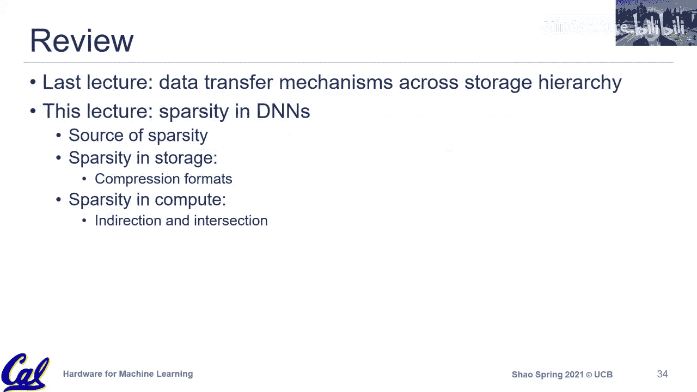

# 012：稀疏性

在本节课中，我们将探讨机器学习算法与硬件协同设计中的一个重要交叉领域：稀疏性。我们将了解为什么神经网络中存在大量零值，以及如何利用这些零值来设计更高效的硬件。课程将涵盖稀疏性的来源、在存储和计算中利用稀疏性的方法，并分析当前硬件广泛采用稀疏性支持所面临的挑战。

## 稀疏性的来源与重要性

上一节我们介绍了算法与硬件协同设计的背景，本节中我们来看看为什么稀疏性是一个重要的优化机会。

神经网络中的核心计算操作（如卷积和矩阵乘法）本质上是乘积累加运算。当输入激活或权重中的任何一个操作数为零时，乘法结果为零，该计算是无效的。研究表明，在许多神经网络中，权重和激活值中有高达50%至90%是零值。这为减少存储开销和计算量提供了巨大潜力。

以下是稀疏性的主要来源：

*   **激活值中的稀疏性**：ReLU等非线性激活函数会将所有负值置零，这是激活值中零值的主要来源。即使在训练过程中，某些层的激活值密度也可能很低。
*   **权重中的稀疏性**：
    *   **剪枝**：将模型中不重要的、值很小的权重直接置零。
    *   **正则化**：在训练过程中，通过L1正则化等方法倾向于产生更小、更稀疏的权重，这也能间接引入零值。

权重稀疏性在模型部署中尤其有价值，因为权重在训练后是静态的，便于进行静态优化。

## 结构化稀疏与非结构化稀疏

在利用稀疏性之前，需要理解一个关键区别：结构化稀疏与非结构化稀疏。

*   **非结构化稀疏**：零值随机分布在数据中，没有固定模式。虽然能带来理论上的存储和计算节省，但由于需要复杂的索引和间接寻址来跳过零值，在硬件上实现高效支持非常困难，甚至可能导致性能下降。
*   **结构化稀疏**：零值以某种可预测的模式出现（例如，固定比例、整行/整列为零）。硬件可以针对这些模式进行高效优化。例如，英伟达的Tensor Core支持特定压缩比（如2:1）的结构化稀疏权重。

目前，商业硬件对非结构化稀疏的支持有限，部分原因在于其硬件实现开销较大。而结构化稀疏由于更容易实现，正开始被采纳。

## 存储中的稀疏性：压缩格式

既然数据中存在大量零值，一个自然的想法是通过压缩来减少存储和传输的数据量。支持压缩格式更多是软件和库层面的优化，已被广泛采用。

以下是几种常见的压缩格式：

*   **位掩码**：为原始数据中的每个元素使用一个比特来标记其是否为零（1为非零，0为零）。同时，只存储非零值数组。其优点是简单规整，但元数据开销固定。当数据精度较低（如4位或8位整型）时，该开销会变得显著。
*   **游程编码**：不单独记录每个零，而是记录连续零值的“游程”长度。它用一个计数器来记录两个非零值之间连续零的个数。这种格式在存在长串连续零时效率很高，但其效果和开销高度依赖于数据模式。
*   **压缩稀疏行/列**：这是科学计算和高性能计算中处理稀疏矩阵的标准格式，在机器学习框架中也得到广泛支持。
    *   **CSR** 使用三个数组：`values`（存储非零值）、`column_indices`（存储每个非零值所在的列索引）、`row_ptr`（存储每行非零值在`values`数组中的起始和结束位置）。它便于进行行访问。
    *   **CSC** 格式与CSR类似，但按列优先顺序存储，便于列访问。

随着机器学习中多维张量的普及，出现了将CSR/CSC思想推广到多维空间的尝试（例如TACO编译器项目），旨在允许每个维度独立选择稠密或稀疏的存储格式。这种通用化的表示方法可能为未来硬件设计提供有潜力的通用原语。

## 计算中的稀疏性：硬件机制

在计算中跳过零值操作是硬件加速器研究的重点。根据稀疏性出现在一个还是两个操作数，以及数据对齐的方式，可以将硬件机制分为三类。

### 1. 间接机制

当只有一个操作数（如权重）稀疏，另一个操作数稠密时，硬件需要根据稀疏操作数的非零元素索引，去间接访问稠密操作数中对应的元素进行计算。

**核心思想**：使用稀疏张量的非零元素索引作为指针，来获取稠密张量中对应的数据。

例如，在稀疏矩阵与稠密向量乘法中，硬件需要一个间接单元，根据稀疏矩阵非零元素的位置（列索引j），去读取稠密向量x中对应的元素`x[j]`。

### 2. 交集机制

当两个操作数（权重和激活）都稀疏时，目标是只对两个操作数都非零的元素对执行计算。这需要找到两个稀疏索引集的交集。

**核心思想**：并行比较两个稀疏操作数的索引，仅当在两个操作数中同一位置都找到非零值时，才触发乘法运算。

硬件上通常表现为一个并行比较器阵列，用于快速匹配两个稀疏输入的非零索引。

### 3. 仲裁机制

这是一种不同的思路，以SEN加速器为代表。它放弃在输入端对齐稀疏的权重和激活，而是允许所有非零权重和激活自由进入计算单元相乘。由于不知道乘积结果应该累加到哪个输出位置，因此在后端需要一个复杂的仲裁逻辑，将产生的部分和路由到正确的输出累加器中。

**核心思想**：计算总是会发生，难点在于将结果归位。通过输出端的仲裁来替代输入端的对齐。

这种方法避免了前端复杂的索引匹配逻辑，但将开销转移到了后端的仲裁网络上。

## 总结与挑战

本节课我们一起学习了机器学习中的稀疏性。我们探讨了稀疏性的来源（ReLU、剪枝、正则化），区分了结构化与非结构化稀疏的差异。接着，我们了解了在存储中利用稀疏性的常见压缩格式（位掩码、游程编码、CSR/CSC）。最后，我们深入分析了在计算中跳过零值的三种主要硬件机制：间接、交集和仲裁。

尽管稀疏性研究在过去几年非常热门，但在商业硬件中的广泛采用仍然有限，尤其是对于非结构化稀疏。主要挑战在于：
1.  支持非结构化稀疏所需的索引和间接访问开销可能抵消其带来的收益。
2.  稀疏模式高度依赖于数据和模型，通用的高效硬件支持设计困难。
3.  需要整个软件栈（框架、编译器、库）的协同支持。

未来，结构化稀疏和更通用的稀疏张量表示（如TACO）可能为硬件设计提供更可行的路径。理解这些基本原则，有助于我们评估层出不穷的稀疏加速器提案。