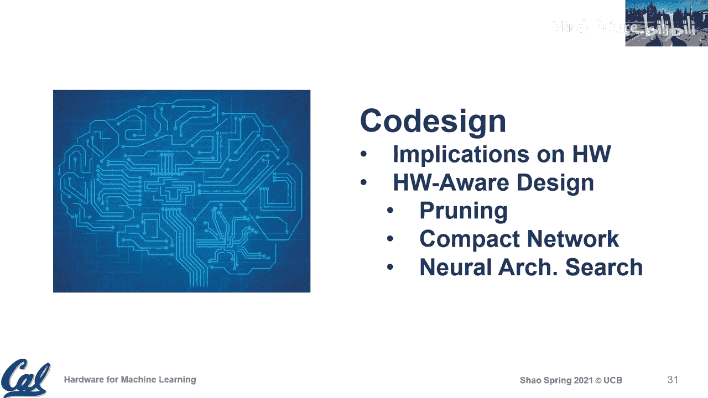

# 013：软硬件协同设计

在本节课中，我们将要学习软硬件协同设计的概念、重要性及其在机器学习硬件领域的应用。我们将探讨硬件优化与软件优化如何相互影响，并了解当前研究中的一些关键趋势。

---

## 概述

软硬件协同设计是指在设计过程中，同时考虑并优化硬件和软件，以实现特定的性能、吞吐量、延迟、功耗或尺寸等目标。在机器学习领域，这通常涉及到一个多目标优化问题，需要权衡多种因素。

上一节我们讨论了稀疏性及其在硬件中的挑战，本节中我们来看看更广泛的协同设计概念。

---

## 为何协同设计至关重要

在讨论特定领域的硬件时，设计过程通常需要考虑该领域应用的需求，并思考如何提高效率。我们之前讨论过专业化或定制化，包括控制粒度、并行计算以及数据编排。

然而，即使在一个特定领域内，也存在不同的权衡。例如，我们可能希望进行高度专业化，但也需要支持该领域内不同应用或原语的差异。这引出了一个微妙的问题：在专业化策略上，我们应该走多远？

---

## 数据流设计的权衡

数据流设计是硬件优化的一个关键方面。我们讨论过两种常见的数据流：权重驻留和输出驻留。权重驻留数据流在寄存器级别重用权重，而输出驻留数据流则重用输出。

以下是两种数据流在能量消耗上的典型分解对比：

*   **权重驻留数据流**：权重缓冲区访问能耗较低（例如占总能耗的35%），但累加缓冲区访问能耗成为主导（超过50%），因为每个周期都需要访问部分和。
*   **输出驻留数据流**：累加缓冲区访问能耗显著降低（例如降至10%），但权重缓冲区访问能耗增加，因为每个周期都需要访问权重。

这个分析表明，很难断言哪种数据流总是更优。其效率取决于多种因素，包括应用特性、缓冲区大小、内存层次结构以及精度。因此，设计过程需要考虑这些依赖关系，而不是寻找一个“放之四海而皆准”的解决方案。

---

## 支持灵活性的硬件优化

认识到数据流选择的复杂性后，一个自然的思路是让硬件更具灵活性，以支持多种数据流模式。

一种方法是在权重缓冲区和累加缓冲区前都设置小型寄存器集合（称为收集器）。这样，硬件可以根据具体场景灵活地分配寄存器，支持多级数据流，从而可能比固定单一数据流的架构更高效。

这种微架构层面的优化，即使在张量核心或处理单元内部，也能通过增加灵活性来适应不同的设计场景，提升效率。

---

## 应用多样性对硬件设计的影响

硬件设计的权衡不仅存在于微架构层面，也受到应用多样性的影响。即使是同一个神经网络，不同层也可能偏好不同的数据流。

研究表明，对于某些网络层，权重驻留数据流更优；而对于其他层，输出驻留数据流更优。这进一步说明了硬件设计不应过于特化，而应增加一定的灵活性，允许用户根据需求进行配置，以更高效地处理多样性。

除了数据流，其他硬件参数如向量大小（脉动阵列中的网格维度）和量化精度，也会与软件算法产生交互影响，共同决定最终的准确性和硬件成本。理解这些交互是进行协同设计空间探索的关键。

---

## 软件端的协同设计趋势

接下来，我们简要讨论软件端考虑硬件成本进行优化的趋势。在协同设计讨论中，通常从以下三个角度展开：

1.  **剪枝**：减少网络中的参数或计算量。
2.  **紧凑网络设计**：手动设计更高效的网络结构。
3.  **神经架构搜索**：自动搜索高效的网络架构。

---

### 剪枝与硬件感知

剪枝是一种通过将权重或激活值置零来引入稀疏性，从而减少内存占用和计算量的技术。早期的剪枝工作主要关注间接指标，如参数数量或FLOPs的减少。

然而，这些间接指标并不总能转化为实际的性能或能效提升，因为其收益高度依赖于硬件对稀疏性的支持效率。因此，出现了**硬件感知剪枝**的研究。

硬件感知剪枝在优化过程中，会通过硬件估计工具来评估剪枝操作是否能带来真实的能耗或延迟收益，而不仅仅是参数数量的减少。这使得优化目标更直接地关联到硬件性能。

---

### 紧凑网络设计

除了在现有网络结构上剪枝，另一种思路是直接设计更高效、更紧凑的网络结构。例如，MobileNet系列网络中引入了**深度可分离卷积**。

标准卷积的计算量可以表示为：
`计算量 ≈ K * C * R * S * 输出高度 * 输出宽度`

深度可分离卷积将其分解为两步：
1.  **深度卷积**：对每个输入通道独立进行空间卷积（`R * S`），没有跨通道计算。计算量约为 `C * R * S * 输出高度 * 输出宽度`。
2.  **逐点卷积**：使用1x1卷积进行跨通道信息融合。计算量约为 `K * C * 1 * 1 * 输出高度 * 输出宽度`。

这种设计显著降低了理论计算量和参数量。然而，它也改变了数据复用模式，对硬件实现提出了新的挑战，例如可能导致硬件利用率下降。因此，在评估这类“高效”算子时，需要结合具体的硬件特性进行分析。

---

### 神经架构搜索

神经架构搜索旨在自动化地寻找高性能的网络架构。早期的NAS工作也主要优化间接指标（如FLOPs）。近期的趋势是引入**硬件感知的NAS**，在搜索过程中直接优化延迟、能耗等硬件相关指标，从而找到在目标硬件上真正高效的网络结构。

---

## 总结

本节课中我们一起学习了软硬件协同设计在机器学习硬件中的核心思想。我们了解到：

*   协同设计是一个并发的硬件与软件优化过程，旨在达成多项目标。
*   硬件设计（如数据流选择）存在复杂的权衡，没有单一的“最优解”，需要结合应用特性和硬件参数进行探索。
*   软件端的优化（如剪枝、网络设计）越来越需要**硬件感知**，直接优化性能/能效指标，而非间接的理论指标。
*   当前的研究趋势是增加硬件的灵活性以应对多样性，并在软件算法设计中更深入地考虑硬件行为，从而实现更有效的协同优化。

通过理解这些协同设计的原理和趋势，我们可以更好地评估机器学习硬件或系统的提案，并洞察其创新性与重要性。