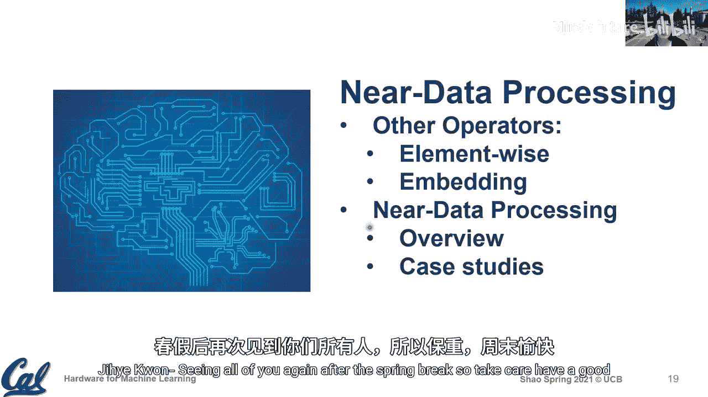

# 014：其他算子与近数据处理

在本节课中，我们将完成关于软硬件协同设计（特别是神经架构搜索）的讨论，并探讨一些尚未深入讨论的其他重要算子。这些算子通常具有较低的计算-内存比，这引出了“近数据处理”的话题。我们还将回顾一个重要的早期项目——智能内存（IRAM），并探讨其与现代架构研究的联系。

## 神经架构搜索（NAS）回顾

上一节我们介绍了软硬件协同设计的理念，本节我们将深入了解神经架构搜索（NAS）的具体细节。NAS旨在自动寻找高效的神经网络架构，而非依赖人工设计。

以下是NAS流程的三个核心组成部分：

1.  **搜索空间**：定义了所有可能网络架构的集合，包括层类型、连接方式、通道数、深度等超参数。
2.  **搜索策略**：用于在庞大的搜索空间中高效导航的算法，例如强化学习、进化算法或可微分搜索。
3.  **性能评估**：评估候选架构性能的方法，传统上侧重于准确率，现在也越来越多地考虑目标硬件上的延迟、能耗等指标。

一个关键趋势是将硬件性能反馈整合到NAS流程中。例如，针对iPhone和三星手机分别搜索出的网络，在各自目标硬件上的延迟性能显著优于在对方硬件上运行的性能，尽管它们的准确率和计算量（FLOPs）相近。这凸显了为特定硬件定制网络架构的价值。

## 其他重要算子分析

到目前为止，我们的讨论主要集中在卷积和全连接（矩阵乘）算子上。然而，在实际部署（如数据中心）中，其他类型的算子也占据了重要地位。

### 逐元素运算

逐元素运算对两个相同尺寸的张量进行按位操作，如加法、乘法。其计算模式可表示为：
`C[i,j] = A[i,j] op B[i,j]`
其中 `op` 代表加法或乘法等操作。

这类运算在LSTM、残差网络等模型中非常常见。尽管从算法角度看它们似乎“免费”（不增加参数量，计算简单），但从硬件角度看，它们具有极低的数据复用率，属于内存带宽密集型操作。

以ResNet-50中的残差加法层为例：当我们在系统级（SoC）设计上面临选择——是将更多芯片面积分配给加速器的本地暂存器（Scratchpad）还是共享的二级缓存（L2）时，不同算子的偏好不同：
*   卷积层受益于更大的本地暂存器，因为其数据复用率高。
*   残差加法层则几乎无法从更大的本地暂存器中获益，因为它本质上是流式操作。但在多核共享L2的场景下，更大的L2缓存有助于减少片外内存访问。

因此，即使是不起眼的逐元素运算，也可能对系统级内存架构决策产生重大影响。

### 嵌入查找层

嵌入查找层在推荐系统中至关重要，用于将稀疏的高维特征（如用户ID、商品ID）转换为稠密的低维向量。其核心操作可视为一个稀疏矩阵-向量乘法。

在具体实现中（如Caffe2的`SparseLengthsSum`算子），由于批处理的存在，它通常转化为稀疏矩阵-矩阵运算。其挑战在于如何处理间接内存访问和非规则的数据模式。优化手段包括利用稀疏性、缓存热点嵌入表项等。这本质上将问题引向了我们之前讨论过的稀疏线性代数领域。

从Facebook数据中心的经验来看，推荐模型大量使用了嵌入查找和全连接层，这解释了为什么在全数据中心范围内，全连接层比卷积层消耗了更多的计算时间。

## 近数据处理与智能内存（IRAM）项目

当我们讨论计算-内存比较低的算子时，自然会想到如何通过减少数据移动来提升性能，即“近数据处理”的理念。这让我们回想起约20年前在伯克利启动的智能内存（IRAM）项目。

IRAM项目的核心假设是：将处理器逻辑和DRAM内存集成在同一块芯片上，从而极大提升内存带宽，缓解“内存墙”问题。在此基础上，研究者探索了向量处理器等架构，以充分利用高带宽。

尽管将逻辑和DRAM的制造工艺集成在同一芯片上面临巨大技术挑战，至今仍未完全实现，但IRAM的研究催生了向量处理器架构等宝贵成果。其思想在现代以芯粒（Chiplet）为基础的异构集成技术中得以延续，即通过先进封装将不同工艺制造的处理器芯片和内存芯片集成在一起，提供高带宽互连。

这个案例说明了架构研究与底层技术的紧密互动：一个愿景可能因技术路径的变化而未能直接实现，但其探索过程往往能催生其他重要的创新。

## 课程总结与后续安排

本节课我们一起学习了神经架构搜索（NAS）的完整流程及其与硬件协同设计的关联，分析了几种关键但常被忽视的算子（逐元素运算、嵌入查找）的特性及其对硬件设计的影响，并回顾了近数据处理思想的早期实践——IRAM项目。

**总结要点如下：**
1.  NAS是实现软硬件协同自动优化的重要工具，其搜索结果可针对特定硬件进行定制以获得最佳性能。
2.  逐元素运算等低计算-内存比算子对系统内存层次结构的设计有独特影响，不能因其计算简单而忽视。
3.  嵌入查找等算子的核心挑战可归结为稀疏计算和间接访问问题。
4.  近数据处理是一个长期的研究愿景，其实现形式随着半导体技术的发展而演变。

**后续课程安排：**
春假后，我们将迎来一系列嘉宾讲座，来自业界和学术界的专家将分享在机器学习硬件领域的实践经验，包括MLPerf基准测试、谷歌TPU的设计洞见以及存内计算的前沿挑战。请大家利用春假时间充分休息，并为期末项目做好准备。项目提案请于本周五前提交。