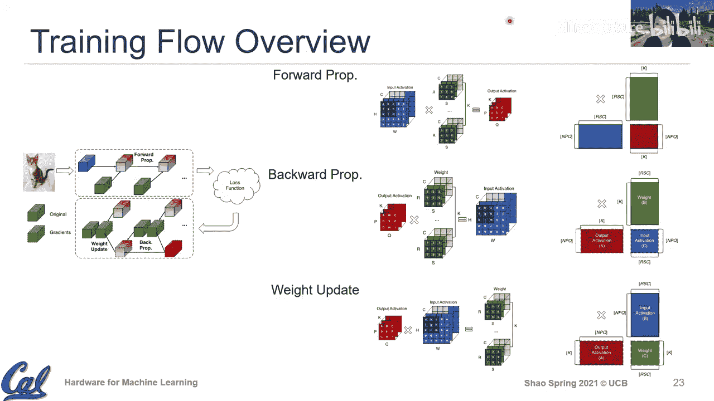

# 015：训练流程与核心算子

在本节课中，我们将深入探讨机器学习训练流程中的核心计算算子。我们将回顾训练的基本流程，并将其与我们已经熟悉的推理过程进行对比。通过分析前向传播、反向传播和权重更新这三个核心计算，我们将理解它们在硬件实现上的异同，以及从推理硬件扩展到训练硬件所需考虑的关键因素。

---

## 训练流程回顾

在之前的课程中，我们主要聚焦于推理过程，即模型的前向传播。然而，完整的机器学习训练流程包含更多组件。

一个典型的机器学习算法包含三个核心部分：
1.  **数据集**：用于学习的经验数据。
2.  **性能度量（损失函数）**：用于评估模型预测好坏的反馈机制。
3.  **任务（模型）**：我们试图学习并优化的函数。

训练过程不仅包括**前向传播**以进行预测，还包括根据损失函数的反馈来更新模型的**反向传播**。因此，训练流程可以概括为：
*   **前向传播**：输入数据通过模型，得到预测输出。
*   **损失计算**：比较预测输出与真实标签，计算误差（损失）。
*   **反向传播**：将误差从输出层向输入层反向传播，计算模型参数的梯度。
*   **权重更新**：根据计算出的梯度，更新模型的权重参数。

本节中，我们将重点关注反向传播阶段涉及的两个核心计算：梯度反向传播和权重更新。

---

## 核心计算算子分析

在硬件层面，我们关心的是这些流程对应的基础计算原语。我们将使用统一的颜色和维度表示法进行分析：
*   **绿色**：权重（Weights），维度为 `[R, S, C, K]`（卷积核高、宽、输入通道、输出通道）。
*   **蓝色**：输入激活（Input Activations），维度为 `[N, P, Q, C]`（批次、图像高、宽、输入通道）。
*   **红色**：输出激活（Output Activations），维度为 `[N, P, Q, K]`（批次、图像高、宽、输出通道）。
*   **带虚线的张量**：表示对应张量的梯度。

理解这些计算的一个有效方法是关注**归约维度**，即在计算过程中被累加求和并最终在输出中消失的维度。

### 1. 前向传播（推理）

这是我们已深入讨论过的部分。其计算本质是卷积或矩阵乘法。

**公式/代码描述（以类GEMM形式表示）：**
`输出[N, P, Q, K] = 输入[N, P, Q, C] * 权重[R, S, C, K]`
其中，需要在维度 `R`, `S`, `C` 上进行归约（累加）。

**关键点：**
*   **归约维度**：`R`, `S`, `C`。这些维度在输出中不存在。
*   **硬件映射**：在脉动阵列等硬件中，通常沿归约维度进行数据流编排，以实现乘积累加。

### 2. 反向传播（计算输入梯度）

此步骤的目标是将输出层的梯度传播到输入层，计算输入激活的梯度（`dInput`）。

**核心变化：**
*   **输入与输出互换**：将前向传播的输出梯度作为输入，目标是计算输入梯度。
*   **归约维度改变**：归约维度从 `(R, S, C)` 变为 `K`（输出通道数）。

**公式/代码描述：**
`输入梯度[N, P, Q, C] = 输出梯度[N, P, Q, K] * 权重转置[K, R, S, C]`
其中，需要在维度 `K` 上进行归约。

**涉及的额外操作：**
*   **权重转置**：为了将 `K` 维度变为可归约的维度，需要对权重张量进行转置操作。
*   **列到图像转换**：如果计算是以类GEMM形式完成的，可能还需要一个后处理步骤将结果转换回标准的图像（激活）格式。

### 3. 权重更新（计算权重梯度）

此步骤的目标是计算权重的梯度（`dWeight`），以便后续更新权重。

**核心变化：**
*   **输出变为权重梯度**。
*   **归约维度改变**：归约维度变为 `N`, `P`, `Q`（批次和图像空间维度）。

**公式/代码描述：**
`权重梯度[R, S, C, K] = 输入[N, P, Q, C] * 输出梯度转置[N, P, Q, K]`
其中，需要在维度 `N`, `P`, `Q` 上进行归约。

**涉及的额外操作：**
*   **输出梯度转置**：为了将 `(N, P, Q)` 维度对齐为归约维度，需要对输出梯度张量进行转置操作。

---

## 从推理硬件到训练硬件

基于以上分析，我们可以得出以下结论：

1.  **核心计算不变**：训练中的三个核心算子（前向、反向传播、权重更新）本质上仍然是矩阵乘法或类矩阵乘法操作。这是许多硬件公司能够相对快速地从支持推理扩展到支持训练的根本原因。
2.  **数据变换增多**：训练流程引入了额外的数据预处理和后处理操作，主要是**转置**和**数据格式重组**（如im2col和col2im），以确保数据以正确的维度布局送入计算单元。
3.  **性能调优更复杂**：由于归约维度在不同算子间发生变化（`(R,S,C)`, `K`, `(N,P,Q)`），硬件（尤其是编译器）需要处理更多样化的矩阵形状和尺寸组合。性能高度依赖于具体问题的维度，这对性能调优和分块策略提出了更高要求。
4.  **精度要求**：虽然本节课未深入讨论，但训练通常需要更高的数值精度（如混合精度训练中的BF16）或特殊的硬件支持来管理梯度，这也是设计训练硬件时需要考虑的重要因素。

---

## 总结

本节课中，我们一起学习了机器学习训练流程的完整计算图景。我们回顾了训练与推理的区别，并深入剖析了训练中三个核心计算算子：前向传播、梯度反向传播和权重更新。通过关注“归约维度”这一关键概念，我们清晰地看到了这些算子在计算模式上的相似性与差异性。主要的差异体现在归约维度的变化以及由此带来的数据变换操作上。理解这些底层原语，有助于我们把握从推理硬件扩展到训练硬件时所面临的核心挑战与机遇，即：在保持高效矩阵乘法核心的同时，增强对数据布局变换的支持和更灵活的维度适应性。