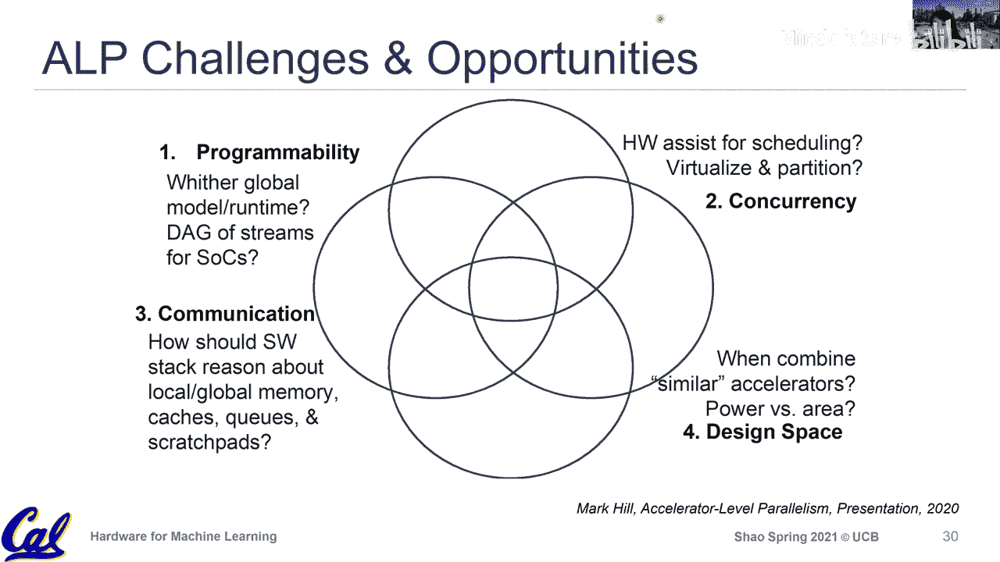

# 016：加速器级并行性


## 概述

在本节课中，我们将学习**加速器级并行性**。我们将从单个加速器设计的视角中跳出来，从系统层面审视多个专用IP核如何协同工作，以及这种集成带来的机遇与挑战。我们将回顾计算机架构中利用并行性的历史，并重点探讨在移动SoC和数据中心场景下，如何通过硬件与软件的协同设计来管理异构加速器资源，以实现更高的性能和效率。

---

## 从历史视角看并行性

上一节我们介绍了课程的整体方向，本节中我们来看看计算机架构如何通过不同层级的并行性来提升性能。这是一个贯穿硬件设计历史的核心思想。

### 比特级并行性

比特级并行性是最基础的层级，它通过增加数据通路的宽度（例如从32位到64位）来并行处理更多信息。在指令集架构和底层电路设计中都有体现。

*   **核心思想**：使用更宽的位宽（如64位ALU）一次处理更多数据。
*   **现代趋势**：在机器学习等领域，出现了**反向趋势**，即采用低精度计算（如INT8、FP16）。公式表示为：`低精度 = 减少位宽 -> 更高能效 -> 释放资源用于其他并行性`。这并非放弃并行，而是通过优化每个操作的成本来换取系统层面更大的并行潜力。

### 指令级并行性

指令级并行性是通用处理器设计的基石，旨在通过硬件机制（如流水线、乱序执行、推测执行）挖掘单个线程内的并行性，并对软件完全透明。

*   **核心思想**：硬件自动识别并并行执行无依赖关系的指令，无需程序员干预。
*   **设计哲学**：在硬件内部创建一个“魔法区”，所有复杂性由硬件管理，软件接口保持简洁。这体现了硬件设计师对抽象层的忠诚维护。

### 线程级并行性与数据级并行性

当指令级并行性的提升遇到瓶颈时，架构开始向软件暴露更多复杂性，以利用更粗粒度的并行性。

1.  **线程级并行性**：通过多核/多处理器系统并行执行多个线程。软件（程序员或运行时系统）需要负责线程创建、同步和通信。这标志着硬件“魔法区”的边界开始扩展，将部分责任移交给了软件层。
2.  **数据级并行性**：通过向量单元或GPU对大量数据执行相同的操作。编程模型（如CUDA、OpenCL）需要显式地管理数据并行任务。硬件与软件之间的协作区域变得更大、更复杂。

**过渡**：从指令级到线程/数据级并行性的演变，是一个硬件控制权逐渐下放、软硬件协同设计区域不断扩大的过程。这为理解当前的**加速器级并行性**奠定了基础。

---

## 加速器级并行性

上一节我们回顾了并行性利用的历史演进，本节中我们来看看其最新的前沿——加速器级并行性。

### 什么是加速器级并行性？

随着摩尔定律放缓，仅靠通用核心的提升已不足够。领域专用架构兴起，导致现代SoC集成了众多异构计算单元：CPU集群（大小核）、GPU、NPU、DSP、ISP等。ALP关注的是如何协调这些**异构的、可能同时工作的加速器**，让它们高效协作以完成共同任务（如处理一帧图像），而非独立运行。

### 移动SoC中的现状与挑战

现代移动SoC是ALP的典型代表。其特点包括：
*   **高度异构**：集成多种为不同任务优化的IP核。
*   **高度并发**：单个用户任务（如视频录制）可能涉及CPU、GPU、ISP、编码器等多个加速器。
*   **市场碎片化**：存在数百种不同的SoC设计，各有其专属的加速器和驱动库。

以下是当前面临的主要挑战：

**1. 可编程性与抽象**
如何为众多异构加速器设计统一的编程模型和软件栈？现状是各厂商提供私有库，导致应用优化困难且碎片化。例如，Facebook研究发现，为覆盖大部分设备需要适配海量SoC，最终他们往往选择仅优化通用的CPU/GPU路径。

**2. 并发管理与调度**
当多个加速器需要协同工作时，由谁（硬件、操作系统、运行时库）来负责调度、资源共享和依赖管理？硬件需要提供足够的可配置性和状态可见性，以支持高效的软件调度。

**3. 通信与资源共享**
加速器间通信常通过低效的DMA拷贝进行。如何设计高效的片上互连和缓存一致性协议，以实现加速器间的低延迟数据共享？代码示例的挑战在于缺乏标准：
```c
// 理想情况：高效的数据共享
data = accelerator_a.process(input);
accelerator_b.consume(data); // 希望data能快速传递，而非通过内存拷贝
```

**4. 庞大的设计空间**
SoC架构师需要在面积、功耗、性能、灵活性之间做出权衡。设计空间随加速器数量指数级增长，需要更好的建模和设计探索工具。

---

## 总结



本节课中我们一起学习了**加速器级并行性**这一前沿概念。我们从计算机架构利用并行性的历史脉络讲起，经历了比特级、指令级、线程级和数据级并行性，最终看到当前系统级芯片正朝着集成多种异构加速器的方向发展。ALP的核心挑战在于如何定义和管理硬件与软件之间不断扩大的“协同设计区”，以解决可编程性、并发调度、高效通信和复杂设计空间探索等问题。这不仅是技术的演进，更是设计哲学从“硬件隐藏一切”向“软硬件协同暴露与优化”的转变。理解这一趋势，对于未来参与高性能、高能效计算系统设计至关重要。