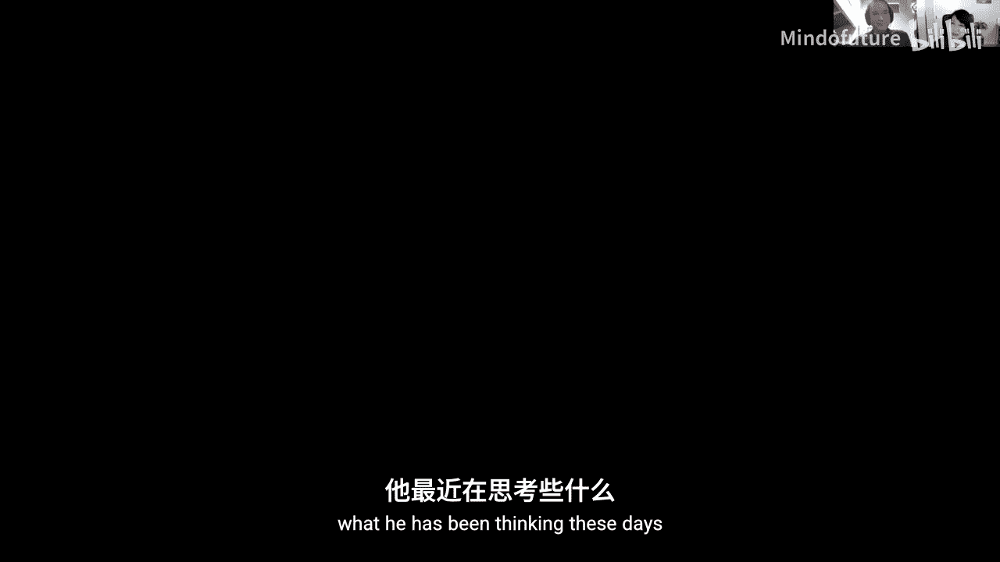
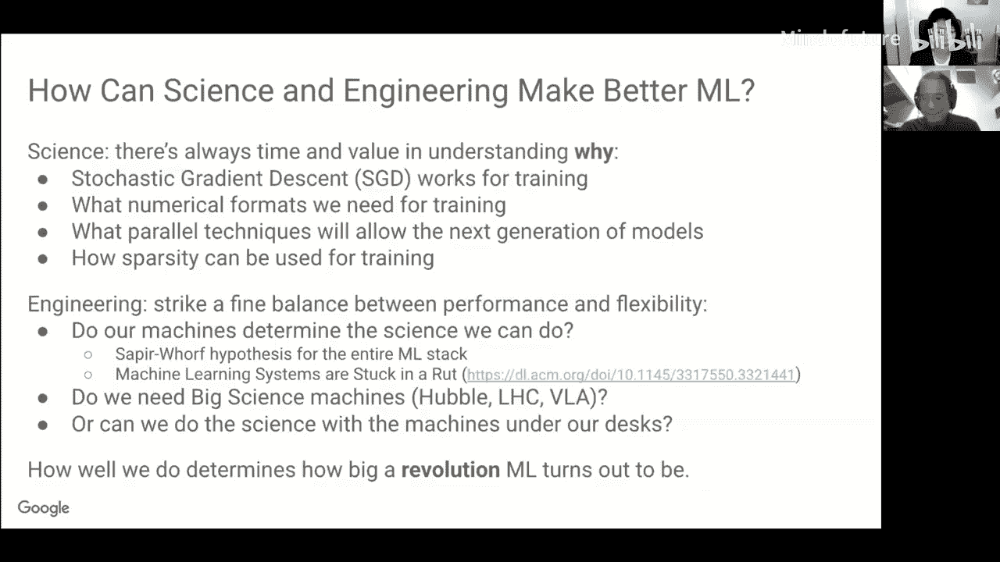

# 017：神经网络与TPU设计

在本节课中，我们将跟随Google的Cliff Young，探讨神经网络设计的思考，特别是TPU的设计理念。我们将从科学探索与工程实践的辩证关系出发，审视当前机器学习革命中的机遇与挑战，并深入了解TPU等专用加速器的设计思路与未来方向。

---

## 科学革命与工程实践

上一节我们介绍了课程背景，本节中我们来看看Cliff Young对当前机器学习领域科学探索与工程实践关系的看法。

计算机科学作为一个学科，其名称中明确包含“科学”一词，这有时令人感到不安。我们正处于机器学习革命的一个有趣节点：**工程实践领先于科学理解**。科学与工程之间的对话，对于我们在构建机器和理解机器学习技术潜力方面取得深刻进展至关重要。

工业革命的历史提供了一个类比。詹姆斯·瓦特在1770年左右发明了早期蒸汽机，但直到大约80年后，开尔文勋爵和热力学领域才为其提供了坚实的科学解释。如果我们能更早地理解其背后的科学原理，或许就能更快地开发出像丰田普锐斯这样高效的产品。

同样，对于TPU和神经网络，我们是否因为忙于构建“蒸汽机”而错过了发现“电力”的机会？我们是否因为缺乏对神经网络内部复杂动力学的科学理解，而无法构建出更高效的架构？这是当前面临的核心问题。

---

## 计算机架构革命与TPU的诞生

上一节我们讨论了科学与工程的关系，本节中我们来看看机器学习如何驱动了计算机架构的革命。

2012年AlexNet在ImageNet竞赛中的突破性表现，开启了现代深度学习时代。这一突破得以实现，很大程度上得益于NVIDIA在通用GPU（GPGPU）上的投资。NVIDIA牺牲了一年的图形性能，使GPU变得更可编程，从而为神经网络计算提供了前所未有的强大算力。

在Google内部，我们注意到矩阵乘法消耗了数据中心总CPU周期的1%，这是一个强烈的需求信号。虽然GPU性能强大，但其成本在Google的规模下变得非常高昂。这促使我们启动了**TPU项目**。

以下是TPU v1的核心设计要点：
*   **专精于推理**：TPU v1被设计为专用于神经网络推理的协处理器。
*   **脉动阵列**：核心是一个256x256的脉动阵列矩阵乘法器，包含65536个算术逻辑单元。
*   **量化算术**：采用8位整数运算，而非传统的32位浮点数，以大幅提升能效和性能。
*   **激进的时间表**：从项目正式启动到在数据中心部署，仅用了15个月。
*   **显著的性能提升**：与当时的CPU和GPU相比，在性能和能效上均获得了超过10倍的提升。

TPU v1可能是世界上第一台真正的“矩阵机器”。随后的TPU v2转向了更通用的**训练任务**，这要求支持浮点运算、大规模数据并行，并构建了包含256个计算节点的“Pod”级系统。TPU v3则引入了水冷技术，进一步提升了计算密度。

---

## 深度学习加速器的现状与未来

上一节我们回顾了TPU的发展历程，本节中我们来看看整个深度学习加速器领域的现状。

过去几年出现了深度学习加速器的“寒武纪大爆发”，有超过100家初创公司投身于此。市场在**推理**和**训练**方面出现了分化：
*   **推理市场**将趋于碎片化，因为不同场景（数据中心、手机、物联网设备）对功耗、成本和性能的要求差异巨大。
*   **训练市场**则呈现出令人惊讶的架构趋同。无论是Google TPU、NVIDIA A100、华为昇腾，还是其他主要参与者，其训练芯片在高层面上都采用了相似的技术组合：**密集计算单元（通常是脉动阵列）+ 高带宽内存（HBM）+ 专有高速互连**。

这种趋同意味着训练可能正在形成一个通用的计算范式。然而，计算机架构的历史表明，在辐射性创新之后往往会跟随**大规模灭绝事件**（例如，CPU在21世纪初的统治地位）。这是一个充满活力的时期，但也需要警惕收敛的迹象。

---

## 核心架构问题与科学挑战

上一节我们看到了行业的趋同，本节中我们深入探讨几个悬而未决的核心架构科学问题。

目前，许多设计决策仍基于工程经验而非科学原理。以下是一些关键的开放性问题：

**脉动阵列的规模**
Google TPU使用128x128的阵列，而NVIDIA和其他许多初创公司选择了更小的规模（如16x16）。目前没有明确的“正确”答案，性能表现也各有千秋。我们需要一个科学理论来解释何种规模最优及其原因。

**内存系统的最佳设计**
当前训练芯片普遍采用HBM，但IBM的系统展示了将主机DRAM作为HBM后备存储的潜力，这可能支持更大的模型，但尚未被广泛采用。此外，我们缺乏像Mark Hill的“缓存3C模型”那样，用于理解和设计神经网络内存层次结构（包括本地暂存器、HBM和网络内存）的清晰理论框架。

**互连与并行化**
训练通常采用**数据并行**（复制权重，汇总梯度）和**模型并行**（分割权重矩阵）两种方式。随着模型规模扩大到数千个节点，模型并行变得必要，但这引入了复杂的通信模式。未来的互连技术将如何演变？我们最终是否需要像人脑那样的小世界网络（密集的局部连接加上稀疏的长程连接）？目前，算法仍在快速变化，因此构建通用、高带宽的互连是更安全的选择。

---

## 数值格式：精度、效率与混合计算

上一节我们讨论了硬件结构，本节中我们来看看计算的核心——数值格式的选择。

在数值格式领域存在一场“拉锯战”：
*   **高性能计算**社区倾向于要求更高的精度（如四精度浮点数），以确保复杂模拟的数值稳定性。
*   **机器学习**社区则倾向于使用更低的精度（如FP16、Google的BF16、甚至INT8）来提升计算效率和能效。

TPU v1使用了8位整数，而TPU v2为训练引入了BF16浮点格式。一个有趣的发展方向是**混合精度算法**。硬件开始支持多种精度（如双精度、单精度、半精度），算法可以据此进行协同设计，在需要高精度的步骤（如梯度累加、某些优化器）使用高精度，在计算密集型步骤（如矩阵乘法）使用低精度，从而在保证训练效果的同时最大化硬件利用率。

未来的科学问题是：神经网络能否自己学会管理精度？为什么不能通过训练让网络在需要时组合使用多个低精度神经元来表示高精度数值，从而将精度管理的负担从硬件架构师转移到算法上？

关于新型格式（如Posits），其理论上有优势，但缺乏大规模实践来揭示其潜在缺陷。我们更倾向于使用已知缺陷和应对方案的成熟格式。

---

## 稀疏性：机遇与挑战

上一节我们探讨了数值精度，本节中我们转向另一个可能带来巨大效率提升的方向——稀疏性。

稀疏性有太多类型：权重剪枝、Dropout、混合专家系统、注意力稀疏化、图神经网络等。当前的挑战在于如何**在训练中有效利用稀疏性**。

硬件处理稀疏计算的主要难点在于**随机访存**或**关联查找**。经典的高性能计算稀疏库（如CSR/CSC格式）在稀疏度极高（>98%）时才有效率，而神经网络的稀疏度通常在70%到98%之间。最近的研究表明，通过将稀疏访问模式“分块”并限制在GPU的单个流多处理器内，可以有效地利用硬件局部性，这是一个有希望的方向。

科学问题在于：**我们能否实现稀疏训练？** 如果能，我们将能直接发现更优的网络结构。工程问题在于：**是否存在值得构建的稀疏架构？** 其关键在于如何以可接受的硬件开销来高效处理关联查找操作。稀疏性的价值取决于我们能达到多高的稀疏度，以及该稀疏度是否可靠。

---

## 未解之谜与未来展望

上一节我们分析了稀疏性的潜力，本节中我们来看看神经网络中那些令人困惑且可能指引未来方向的“怪异”现象。

科学革命往往源于对异常现象的观察。神经网络领域充满了这类“怪事”：
*   **知识蒸馏**：为什么先训练一个大模型，再用它来教导一个小模型，比直接训练这个小模型效果更好？这背后的原理是什么？
*   **反馈对齐**：在反向传播中使用完全随机的反向矩阵竟然也能训练网络，这颠覆了传统认知。
*   **彩票假设**：训练似乎只是从随机初始化的权重中“释放”出早已存在的子网络。
*   **矩阵分解**：为什么某些因式分解（如可分离卷积）有效，而其他则无效？

这些现象表明，我们对神经网络为何工作以及如何工作缺乏根本性的科学理解。目前，工程价值驱动着我们前进，但探索这些“为什么”可能为下一代更高效的算法和硬件指明方向。

当前，大型语言模型（如GPT-3）正在引发一场“太空竞赛”，推动着模型规模和计算需求的极限。这属于“大科学”范畴。但最终，经济可行的、可普及的智能助手需要**成本削减和效率提升**。未来的进步可能更多地来自桌面级设备上的创新，而非仅仅依赖万级节点的大型集群。

---

## 总结与反思

本节课中，我们一起探讨了机器学习硬件设计的前沿思考。

我们回顾了TPU的设计理念与发展历程，审视了深度学习加速器行业的现状与趋同趋势。我们深入讨论了多个悬而未决的架构科学问题，包括脉动阵列规模、内存系统设计、互连技术、数值格式选择以及稀疏计算的机遇与挑战。最后，我们列举了神经网络中诸多未被科学解释的“怪异”现象，强调了在工程实践飞速发展的同时，加强基础科学理解的重要性。

Cliff Young的分享启示我们，在构建强大机器学习硬件的同时，应当时刻保持科学探究的精神。理解“为什么”不仅能帮助我们建造更好的“蒸汽机”，或许还能让我们更早地发现“电力”。科学与工程的协同并进，将是推动机器学习领域持续突破的关键。

---
*感谢Cliff Young带来的精彩分享和启发性的讨论。*