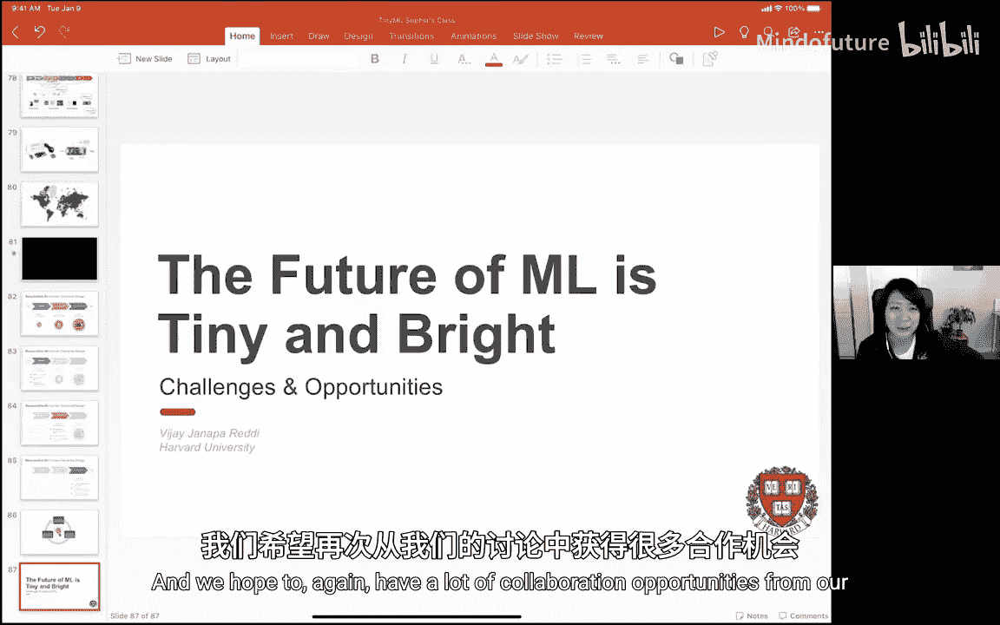

# 018：机器学习的未来是微小而光明的

## 概述
在本节课中，我们将跟随哈佛大学副教授、ML Commons 创始成员 Vijay Janapa Reddi 的分享，探讨机器学习领域一个快速发展的分支——微型机器学习。我们将了解其核心概念、面临的挑战、所需的系统基础设施，以及如何通过社区协作推动这一领域的发展。

---

## 个人背景与核心观点

首先，让我们了解一下讲者的背景，这有助于理解他看待问题的视角。

我本科毕业于圣克拉拉大学，硕士毕业于科罗拉多大学博尔德分校，博士毕业于哈佛大学。之后在德克萨斯大学奥斯汀分校任教，并在谷歌休假工作过一段时间。

在我的研究历程中，有几个关键经验塑造了我对当前问题的看法：

**第一，网络工作站项目**。这个源自伯克利的项目让我认识到，微小的、商品化的系统通过巧妙的架构设计，可以集合起来解决宏大的问题。其核心启示是：**微小的商品化系统能够对解决重大问题产生显著影响**。

**第二，运行时编译器研究**。在哈佛攻读博士期间，我主要研究编译器，特别是运行时或即时编译器。这项研究让我深入理解了**硬件与软件的协同设计**，以及如何通过审视整个计算栈（从硬件到应用软件）的交互来优化系统。

**第三，移动计算研究**。在德克萨斯大学期间，我深入研究了如何构建高能效的移动设备。当时我发现，尽管移动设备数量庞大且发展迅速，但研究界却将大量精力集中在数据中心和大型仓库级计算系统上。这促使我开始关注那些被主流忽视但潜力巨大的领域。

这些经验共同指向几个原则：关注廉价、可扩展的商品化系统；重视硬件与软件的跨层协同设计；以及构建开源工具和框架以促进生态系统繁荣。这些原则将贯穿我们今天对微型机器学习的讨论。

---

## 什么是微型机器学习？

上一节我们回顾了影响我研究视角的关键经验，本节中我们来看看这些视角如何应用于一个新兴领域——微型机器学习。

微型机器学习是机器学习领域增长最快的方向之一。它专注于在资源极度受限的微控制器设备上运行机器学习模型。我所说的“微小”，是指内存可能只有 **16KB** 的 SRAM 和 **1MB** 的闪存。这些设备需要在超低功耗（通常低于 **1毫瓦**）下，直接在传感器端进行实时数据分析，而不是将数据卸载到云端或大型计算设备。

微型机器学习的愿景是实现始终在线的机器学习，并最终依靠电池或能量收集设备运行，甚至实现生物降解，以减少电子垃圾。

---

## 为何需要微型机器学习？

我们已经了解了微型机器学习的定义，你可能会问：为什么我们需要它？以下是一些现实世界的应用场景和驱动力：

**以下是微型机器学习的几个关键应用场景：**
*   **关键词唤醒**：例如“Okay Google”或“Hey Siri”，这是设备上的微型语音识别。
*   **视觉唤醒词**：例如智能门铃检测到有人时自动拍照或开门。
*   **异常检测**：例如通过声音分析预测工业电机的故障，实现预测性维护。
*   **智能设备**：例如能感知用户习惯并自动启动的咖啡机、烤箱等。

这些应用看似简单，但部署到现实世界却异常复杂。以在办公室安装摄像头进行人员检测为例，你需要获得建筑许可、聘请电工布线、签订合同，整个过程成本高昂、效率低下。

而如果该智能传感功能可以集成在一个微型、电池供电、能持续工作数年的设备中，你就可以直接将其贴在墙上，无需任何复杂的部署流程。这极大地降低了机器学习的应用门槛，使其能够真正“无处不在”。

另一个例子是野生动物保护。在森林中部署用于监测盗猎的摄像头，如果设备功耗高达几十瓦，就需要庞大的太阳能电池板和频繁的电池更换，难以实现。微型机器学习使得超低功耗的智能监测成为可能。

因此，微型机器学习的核心价值在于：**将现有机器学习能力“压缩”到极致，从而解锁海量的真实世界应用场景**。

---

## 核心挑战：系统基础设施

上一节我们看到了微型机器学习的巨大潜力，本节中我们来看看实现它的首要挑战——构建能够支持其发展的系统基础设施。

要让机器学习在嵌入式设备上运行，首先需要一个推理框架。这听起来简单，但嵌入式系统的异构性和资源限制带来了巨大挑战。

**硬件层面的碎片化问题**：
在数据中心，我们面对的硬件架构（如x86 CPU、NVIDIA GPU）相对统一。但在嵌入式领域，情况截然不同。仅以ARM Cortex-M系列微控制器为例，就有M0、M3、M4、M7、M33等多种型号，它们的指令集架构和功能（如是否有浮点单元）各不相同。此外，还有Pensilica DSP、Qualcomm DSP、Synopsis微控制器等多种解决方案。每个芯片厂商都会为了极致的能效而对硬件进行深度定制，导致生态高度碎片化。一个为特定微控制器编译的模型，很可能无法在另一个上运行。

**资源极度受限**：
内存是主要瓶颈。微控制器的SRAM可能只有16KB，闪存约1MB。这1MB的空间需要容纳推理引擎库和神经网络权重。相比之下，即使经过量化、剪枝等优化，最精简的MobileNet模型也仍有几MB大小。

**软件与库的假设不成立**：
在通用计算中我们习以为常的功能，在嵌入式系统中可能不存在或不可用。
*   **动态内存分配**：会导致内存碎片。在内存极度受限的环境中，碎片化可能使应用崩溃。嵌入式开发者要求确定性：要么启动时立即失败，要么一直稳定运行。
*   **操作系统与库依赖**：不能假设存在操作系统或标准库支持，因为不同微控制器提供的支持差异很大。

因此，设计一个通用的微型机器学习推理框架，核心难题是：**如何构建一个能在高度异构的生态系统中运行，且不依赖动态内存分配和外部库支持的通用推理框架？**

---

## 解决方案：TensorFlow Lite Micro 的设计哲学

面对上述挑战，我们团队开发了 TensorFlow Lite Micro。它的设计选择可能有些反直觉。

**为何选择解释器架构？**
通常，解释器（如Python）因性能开销大而被认为效率低下。但在微型机器学习中，每个算子（如卷积）的执行需要成千上万个周期，解释器调度的相对开销就显得微不足道了。解释器架构带来了关键优势：
1.  **灵活性**：模型保持为原始文件，易于进行无线更新。
2.  **可扩展性**：允许硬件供应商为其特定架构提供高性能算子库。框架开发者无需为所有碎片化的ISA编写优化内核，只需调用硬件供应商提供的库即可。这通过一个硬件抽象层实现。

**TensorFlow Lite Micro 的核心设计原则**：
*   **极小的二进制体积**：不链接外部库以控制体积。
*   **无动态内存分配**：保证运行的确定性和稳定性。
*   **裸机运行**：不依赖任何操作系统。
*   **可移植性**：目标是能够在各种异构的嵌入式系统上运行。

这种设计使得 TensorFlow Lite Micro 能够作为一个基础层，连接上层的模型优化工具链和底层多样化的硬件，从而支持微型机器学习生态的发展。

---

## 衡量进步：微型机器学习基准测试

有了运行框架，下一个问题是如何衡量和比较不同微型机器学习系统的优劣？这就需要基准测试。

衡量机器学习系统性能本身就很复杂，涉及应用场景、数据集、模型、框架、编译器、优化库、硬件等多个层次。在微型机器学习领域，还需加入功耗、内存占用等独特指标。

**机器学习基准测试的通用目标**：
1.  **确保结果可复现**。
2.  **工作负载具有代表性**，能反映实际生产需求。
3.  **鼓励创新**，设定合理的标杆以推动行业进步。
4.  **保持公平和实用性**，兼顾商业和研究需求。
5.  **保持可负担性**，让学术界也能参与。

MLPerf 便是基于这些原则建立的社区驱动型机器学习基准测试套件。它定义了任务、参考模型、数据集、质量目标（如达到FP32精度的特定百分比）和一套清晰的运行规则。

**微型机器学习基准测试的独特性**：
微型机器学习与**传感器**紧密耦合，这是其最显著的特征。实时处理音频、视觉、时间序列等传感器数据是核心需求。因此，其基准测试需要反映这些特点。

**TinyMLPerf 基准套件**：
目前，TinyMLPerf 社区确定了四个初始基准测试：
1.  **关键词检测**：有限词汇的语音唤醒。
2.  **视觉唤醒词检测**：二元分类，如检测图像中是否有人。
3.  **异常检测**：基于声音的时间序列分析，用于预测性维护。
4.  **微型图像分类**：使用极小的ResNet8模型进行图像分类。

我们与嵌入式基准测试专家EEMBC合作，开发了开源的测试工具“runner”，用于在目标设备上执行基准测试并精确测量性能和功耗。第一轮正式提交将于近期开始。

---

## 推动社区：研究与教育

上一节我们讨论了衡量技术的标尺，本节我们来看看如何培育和壮大微型机器学习社区本身。

**促进研究创新**：
微型机器学习是一个典型的交叉学科领域，涉及嵌入式系统、机器学习、应用开发。为了凝聚研究力量，我们创办了 **TinyML Research Symposium**，汇集来自不同领域的学者，共同探讨微型机器学习特有的数据集、算法、应用和跨层优化问题。

**教育与普及**：
这或许是最重要的一环。我们不仅要推进前沿研究，更有责任让更多人掌握并善用这项技术。
传统机器学习教学侧重于模型设计和训练。但要真正“应用”机器学习，需要端到端的部署能力，包括数据收集、预处理、训练、为部署优化模型，以及在目标设备上执行推理。

微型机器学习提供了一个完美的教学场景：学生可以在一个小小的嵌入式设备上完成从数据收集到模型部署的完整闭环，亲身实践负责任的人工智能设计。

为此，我们设计了 **TinyML 在线课程**（可在edX上找到），并配套了开发套件，旨在全球范围内推广应用的机器学习。课程特别强调了**人工智能伦理**，因为与传感器深度结合的微型机器学习设备，未来可能以更隐蔽的方式影响人们的行为，我们必须从开始就灌输负责任的设计理念。

例如，我们有一个项目帮助纳瓦霍语使用者创建自己的关键词检测模型。当技术能够服务于个人的、本土化的需求时，它的意义和影响力会更加深远。

---

## 总结

本节课中，我们一起探讨了微型机器学习这一充满活力的领域。

我们首先了解了其核心定义：在资源极度受限的微控制器上进行超低功耗的实时机器学习推理。接着，我们探讨了其巨大的应用潜力，以及实现它所面临的核心挑战——高度碎片化的硬件生态和极端的资源限制。

针对这些挑战，我们介绍了 **TensorFlow Lite Micro** 作为一种解决方案，其解释器架构和独特设计旨在实现跨平台的可移植性和确定性。然后，我们讨论了如何通过 **TinyMLPerf** 基准测试来科学地衡量和比较不同系统的进展，这是推动领域发展的关键。

最后，我们认识到，技术的进步离不开社区的繁荣。通过 **TinyML Research Symposium** 促进跨学科研究，以及通过 **教育和普及** 让全球更多人能够接触、理解和应用微型机器学习，对于实现其“让一切设备变得智能”的光明未来至关重要。

机器学习的未来不仅是庞大的云和数据中心，也是**微小、无处不在、并且光明的**。这需要我们共同构建强大的工具、公平的标尺和包容的社区。