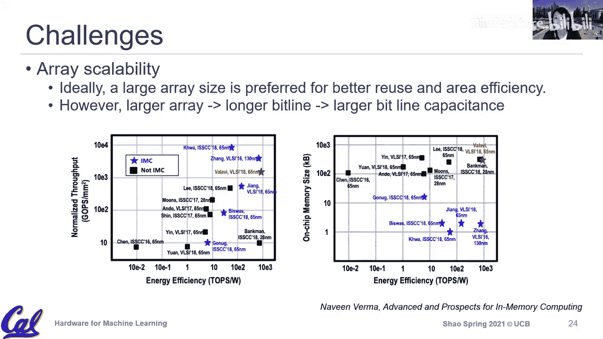

# 019：高级技术

在本节课中，我们将深入探讨如何利用更先进的底层技术来设计和优化深度学习硬件。我们将重点关注“内存内计算”这一核心概念，并分析几种利用不同存储技术（如闪存、SRAM）来实现高效矩阵乘加运算的方法。课程最后将对相关挑战和机遇进行总结。

---

## 概述

大家好，欢迎来到机器学习硬件课程的第22讲。本学期已接近尾声。

在今天的课程中，我们将更深入地探讨技术栈，思考人们如何利用更先进的技术为深度学习硬件创造机会。深度学习硬件领域实际上有很多激动人心的新动态，尤其是在初创公司方面。例如，Cerebras公司制造了世界上最大的晶圆级处理器芯片，旨在通过将计算贴近数据来减少数据移动的能耗。许多初创公司和研究机构正在重新审视“内存内计算”等想法，因为深度学习应用的规律性和容错性使得一些过去难以实现的技术变得可行。本节课我们将聚焦于利用内存技术进行计算，特别是模拟计算方式，以实现更高的能效。

---

## 数据处理的核心挑战：数据移动

在之前的课程中，我们讨论的一个重要原则就是数据移动。即使在数字领域，数据流优化的核心也是试图降低数据移动的成本。我们讨论了推拉模型、环形网络等架构权衡。对于数据密集型操作，能耗主要由数据移动主导。特别是当使用低精度计算时，计算本身能耗显著降低，这使得数据移动的能耗占比更加突出。因此，优化计算基板以提高效率的终极目标，是尽可能将数据移动到离处理器更近的地方。

---

## 解决方案：利用数据局部性

在数字或系统架构领域，一个最重要的架构原则是局部性。我们如何利用局部性来减少数据移动？在深度学习背景下，我们拥有非常规整的架构，例如金字塔式的内存层次结构。通过利用数据重用和数据局部性，我们可以将频繁使用的数据放在离计算单元更近的地方。我们讨论过两种重用类型：
*   **时间重用**：如果一个数据块即将被再次使用，就将其保留在附近。
*   **空间重用**：通过广播网络，将一份数据同时分发给多个计算单元。

在模拟计算和内存内计算的讨论中，这两种重用类型依然存在，只是通过不同的硬件设计来实现。

---

## 内存内计算的概念

“内存内计算”或“存算一体”并非新概念。过去五六十年间，几代工程师一直致力于将计算尽可能靠近内存。总体而言，它尚未被广泛采用，我们稍后会讨论一些根本性的技术原因，如可扩展性、非理想特性等。对于通用计算，精度通常非常重要，而且应用程序的多样性和控制流的复杂性使得为通用工作负载设计存算一体硬件非常困难。

然而，深度学习是一个对硬件设计者来说非常有趣且令人兴奋的范例。它功能强大，能解决许多问题，并且虽然不简单，但非常规整。大量的规律性使得一些过去对通用工作负载不可行的想法，对深度学习变得可行。深度学习具有确定性行为且对误差有一定容忍度，这使得存算一体面临的许多挑战变得不那么严峻。因此，人们开始重新审视这些想法，探索是否能将其用于深度学习计算。

从高层次看，这个概念相当直接。我们试图将计算尽可能靠近数据。在典型的数字加速器模板中，我们从缓冲区读取输入激活和权重，然后在一个计算单元进行运算，并存储部分和。而在存算一体中，我们更像是采用了权重固定的数据流。我们不是将输入和权重数据都提取到某个计算发生的地方，而是将输入数据送到存储权重的内存阵列中，计算就在存储权重的内存内部完成，然后我们从内存中获取累加结果。在这里，内存不仅用于存储权重，还用于计算结果。这种计算通常以模拟方式进行。

对于任何用于深度学习的数据存算一体技术，你都会看到类似的系统架构图。权重被分布式存储，输入激活被读取。如果计算以模拟方式进行，我们通常需要对输入激活进行数模转换，并对累加的部分和进行模数转换。最近的一些研究也在关注，为了获得合理的精度，数模转换器和模数转换器需要怎样的精度。总的来说，在高层架构上，系统其余部分大多数时候仍然是数字的，但具体被模拟化的部分是乘积累加运算。事实证明，这部分运算以模拟方式实现是相当可行的。

---

## 内存内计算的一般架构

如果我们放大这个架构图，可以看到更多细节。输入仍然需要从输入激活存储器中读取，但不需要移动的是权重，因为权重就驻留在内存中，计算也在内存中完成。当输入被移动时，我们需要进行数模转换，将数字输入转换为模拟信号。同时，我们仍然有一个类似于空间重用的广播机制，通过字线来跨列重用输入激活。

具体来说，乘法运算的实现方式取决于技术，但累加通常是通过位线以电流相加的方式完成的。我们不是像在数字领域那样进行加法运算，而是在模拟领域将电流在位线上累加起来，然后通过模数转换器将最终的总电流转换回部分和，用于输出激活。基本原理是相同的，我们仍然利用了一些重用。累加大多数时候是通过位线进行电流相加来实现的。

另一个非常重要的因素是位线累加所支持的精度或准确度。即使对于低精度算术，累加也有较高的精度要求，因为我们需要将权重和输入结合起来。这也是许多存算一体方案面临的挑战之一，与数模/模数转换器设计的精度和复杂性有关。

再次强调，即使是初创公司的方案或研究想法，其重点也是如何在模拟领域进行乘积累加运算。但这些设计中的大部分其他计算，例如残差加法等其他算子，在大多数情况下仍然需要在数字领域完成。我们还没有看到完全模拟的深度学习计算硬件，大多数设计是模拟和数字组件的混合。就目前所见的设计而言，模拟组件只出现在乘积累加部分。

这是深度学习硬件的一些通用模式。输入激活在转换后通过字线传送，权重存储在存储单元中，输出部分和在位线上累加。这些是通用原则。

---

## 内存技术概览

在讨论具体技术之前，我们先简要回顾不同的内存类型。构建内存有不同的方法，我们可以根据内存容量和需求使用不同的技术。许多关于存算一体的讨论都与随机存取存储器有关，特别是非易失性存储器（如商业闪存）和易失性存储器。我们将看到，一些商业初创公司正在使用基于闪存的非易失性存储器进行深度学习处理。在研究方面，也有大量工作探索使用SRAM或DRAM技术来支持内存内计算。

接下来，我们将使用三个驱动性示例，来讨论非易失性存储器、SRAM甚至DRAM如何用于内存内计算。

---

## 技术示例一：基于闪存的存算一体

有一些初创公司正在这个领域尝试使用闪存技术，并且已经有硬件可用。在深入之前，我们先简要了解一下闪存晶体管，并建立连接，说明它为何能用于执行乘积累加操作。

闪存晶体管的关键概念与我们目前所见的大多数晶体管类似，但有一个新特点：栅极并不直接连接，而是有一个新的**浮栅**。你可以将其视为一个电荷存储层，我们可以在这里存储额外的电荷。通过存储额外电荷，从功能角度来看，这实际上可以用来改变晶体管的阈值电压。

对于典型的晶体管，阈值电压是固定的。而对于闪存晶体管，特别是带有浮栅的，我们可以通过编程改变浮栅中的电荷量来改变阈值电压，这成为了一种可编程地改变晶体管行为的方式。我们将主要关注所谓的单级闪存晶体管，即存储0或1，但也有多级闪存单元可用，通过调制浮栅中存储的电荷量，可以存储多位信息（如2位甚至4位）。

那么，这如何改变晶体管行为呢？对于闪存晶体管，我们使用浮栅来改变单元的阈值电压。如果没有存储电荷，晶体管处于开启状态；如果存储了电荷，则处于关闭状态。我们如何区分是存储了1还是0呢？区别在于它改变了晶体管的阈值电压，使得在有电荷和无电荷的情况下，具有不同的电压-电流特性。具体来说，如果没有电荷（左侧情况），我们有一个相对较低的阈值电压；如果有电荷（右侧情况），则需要更高的阈值电压才能开启晶体管。因此，我们有两种不同的电压-电流特性：低阈值电压对应开启状态（存储1），高阈值电压对应关闭状态（存储0）。

为了判断是存储1还是0，我们施加一个介于开启阈值电压和关闭阈值电压之间的电压。通过施加这个电压，我们可以观察晶体管是开启还是关闭。如果晶体管开启（有电流），则意味着它存储的是1（浮栅无电荷）。如果晶体管关闭（无电流），则意味着它存储的是0（浮栅有电荷）。这种技术已经商业化，主要用于存储。但因为它可以存储0和1，甚至通过不同电荷量实现多级存储，人们产生了将其不仅用作存储设备，还用作计算设备来执行乘积累加功能的想法。

---

### 闪存如何执行乘积累加

那么，我们如何使用闪存单元来执行乘积累加功能呢？这是来自Mythic公司（一家初创公司）的示意图。他们的基本想法是使用基于闪存的非易失性存储器来进行深度学习。他们执行乘积累加的基本方式如下：

乘法是通过每个闪存单元实现的。根据每个单元中存储的值（是1还是0，或者是多级单元中的某个值），通过施加栅极电压（字线电压）来查看是否产生电流。权重被编程到每个单元中，输入激活则作为字线电压施加到每个单元。通过施加电压，根据权重是1还是0，我们可能从每个单元获得电流或没有电流。这就是我们进行单个乘法的方式。

对于累加，我们通过位线将所有单元的电流加在一起。单个单元可能不同，但累加总是通过将不同单元的电流直接相加来完成。这与我们在数字领域进行部分和累加的想法相同。

因此，尽管一些技术看起来很复杂，但根本上，它们是通过位线累加进行乘法运算，而乘法则取决于技术。对于闪存单元，乘法基本上是通过将权重存储在浮栅中，然后通过向字线施加输入电荷来查看是否能开启单元，从而实现乘以1或乘以0的操作。

Mythic公司的想法是通过使用这种基于闪存的非易失性存储器，可以获得高性能和低功耗，特别是可以跳过大量的权重数据移动能耗（输入仍然需要移动）。他们目前主要专注于推理，在极低精度方面表现相当出色。当精度提高时，问题会变得更棘手，例如在单个单元中存储多个值时的误差容忍度。他们似乎在精度和能效方面都达到了合理水平，例如每焦耳5万亿次操作是一个合理的能效数字。

具体来说，技术相当直接，但需要考虑很多细节，核心仍然是在模拟领域进行矩阵乘法中的乘积累加部分。我们将讨论可扩展性和精度方面的一般性挑战，但这是该领域的一项商业化努力，并且已经提供了有趣的产品来支持此类计算。

---

### 挑战与考量

关于权重存储在闪存位中的问题：是的，权重存储在闪存位中。对于许多此类硬件，它们假设我们不会频繁重写或更新权重。因此，可扩展性非常重要。我们需要布局或配置硬件，以便所有权重都可以存储在硬件上，这样在运行时就不需要覆盖权重，因为写入或更改权重总是昂贵的部分。与数字领域中我们讨论的重用（重新获取权重并存储在寄存器中）不同，在这里，我们需要复制或拥有足够大的阵列来存储网络的所有权重。

Mythic公司有另一种示意图显示其芯片规模也相当大。他们的做法是将芯片的不同分区用于不同层的不同权重。因此，在大多数情况下，至少对于目标场景，实际上不需要重写权重。

如果模型有10层，是否可以同时进行所有层的乘积累加？不一定。如果有10层，我们仍然可以像数字硬件中那样进行流水线处理。例如，当第一层处理第N张图像时，第二层可以处理第N-1张图像的输出，依此类推。大多数时候，即使对于单个层，你也需要将所有权重布局到单元上。

正如Brian Zimmer下周客座讲座可能会更详细地介绍的那样，这肯定是一个挑战。但同样，正如我们所提到的，即使是一些旨在获得高片上内存大小和高可扩展性的数字硬件也会遇到这些问题。有些问题可以通过流水线等技术来解决，但在这里，权重被编程一次后就保持不变。许多Mythic的用例，至少从我们之前看到的一些讲座来看，是针对安防摄像头等进行视觉人体识别。在这种情况下，可以合理地假设你有一个固定的网络，可能网络并不非常复杂，然后你将网络固定在硬件上，永不更改。

正如Dan已经提到的，对此类存储器进行编程在延迟方面非常慢，而且对于许多非易失性存储器，还存在耐久性问题。此外，我们假设权重的大小可以与总内存匹配。如果你处理的是一个无法容纳的巨大模型，通常这类硬件针对的是较小的目标网络，或者它们拥有足够多的硬件。但更改权重在这里始终是一个挑战。

我们已经讨论了精度问题。在不产生高错误率影响精度的情况下，实际可以存储多少位？这是许多使用非易失性存储器的硬件公司面临的挑战。还有许多其他可用技术，你会看到更多研究出版物使用这类新兴非易失性存储器件来支持存算一体。它们仍然存在相同的问题：更改权重的编程过程非常具有挑战性，例如可以更改多少次、速度有多快，以及始终存在的精度问题。对于Mythic针对的安防摄像头等用例可能没问题，但对于其他场景，这种方案的通用性如何？另一方面，正如微型机器学习讲座中提到的，安防摄像头用例中的模型确实相当小，这是一个足够大的市场，可以覆盖硬件的部分非经常性工程成本。

---

## 项目进展与客座讲座预告

在后勤方面，我们最后一位客座演讲者是来自英伟达的Brian Zimmer，期待他的讲座。在思考模拟和内存计算的总体机遇和问题时，我们今天的讨论更侧重于机遇方面，即为什么它是可行的。Brian将为我们提供更多关于采用此类技术所面临挑战的观点。

关于项目方面，检查点一已经完成，大家做得很好。大多数团队似乎都在正轨上，并取得了很好的进展。有几个团队可能需要调整方向或认真考虑什么是可行的。我们期待在检查点二看到目前的进展。与检查点一类似，我们有一个签到电子表格，链接相同，只是不同的标签页，时间仍然是周二和周四。请选择你的时间段，以便我们有机会再次与你交谈（即使是线上）。同样，准备两到三张幻灯片展示你当前的进展，没有特定格式，但这次我们期待看到更具竞争性的结果。上次主要是关于你尝试做什么、拥有的基础设施和总体架构图。对于检查点二，这确实是你展示至少非常接近交付成果以及一些定量结果和评估的机会，这些将是项目的重要组成部分。

---

## 技术示例二：基于SRAM的存算一体

接下来，我们将简要讨论SRAM。基本原理是相似的，我们仍然调制字线和位线。快速回顾一下我们在数字逻辑课中讨论过的6T SRAM单元：字线用于选择要读取或写入的单元，数据通过位线和位线互补对差分地写入或读取。

总的来说，这与基于闪存的非易失性内存内计算有更多的相似之处而非差异。位线仍然用于存取，我们仍然通过位线和位线互补对进行累加。具体是使用位线还是位线互补对，取决于存储的值。

例如，如果我们存储的是-1，那么-1在这里表示为1。如果左下角晶体管中存储的是1，我们就会对位线进行放电（对于-1，我们放电位线）。但如果我们存储的是+1，我们就会对位线互补对进行放电。然后，通过比较位线和位线互补对，我们得到最终的累加值。

同样，正如我提到的，累加仍然通过位线完成，我们使用字线来选择启用哪个单元，然后根据存储的不同值（即权重），输入被视为字线中的启用信号，部分和累加通过位线完成。

这是基于SRAM的累加。我们已经看到了很多这方面的研究，可以说在这个领域有更多的研究试图使其可行。这里存在一些根本性的挑战，除了我们讨论过的精度问题之外，这些挑战对SRAM设计来说是相当根本的。

与闪存相比，SRAM的写入要容易得多，所以我们肯定没有那个问题。但与数字设计相比，精度问题仍然存在。这里的另一个挑战是可扩展性。我们提到过SRAM设计，通常我们希望拥有足够大的SRAM阵列以获得足够的密度和面积来实现更多重用。但一般来说，阵列越大，其尺寸（宽和长）就越大。位线越长，位线电容就越高。我们之前讨论过的充放电本质上是单元电容和位线电容之间的电荷重新分配。我们基于每个单元的电容和位线电容进行电荷重新分配。如果我们有一条超长的位线（即大型阵列），位线电容会很高，这使得通过单个单元的充放电产生的电压差很难辨别，因为我们进行的是电荷重新分配。对于大型SRAM单元，很难感知单个单元的电荷是如何重新分配的。因此，这也存在误差容忍度问题。最终，我们无法观察到单元中发生的所有累加。

因此，对于目前所见的大多数设计（同样，主要在研究领域），它们通常非常小。一个自然而然的问题是：这能做到多大？因为我们不能一直构建千字节级别的阵列，我们需要做得更大。但一旦我们做得更大，就会遇到这种电荷重新分配问题。

我从Novin Burma那里找到了一份非常有趣且全面的不同技术比较。当然，我们看到内存内计算具有非常好的能效（图中蓝色部分），但一旦涉及到可扩展性，许多设计都处于较低水平。请记住，这是一个对数刻度。通常，为了获得合理的性能和精度，我们最多只能看到单个数字或几十千字节的小型阵列。而对于其他数字设计，我们通常考虑的是大得多的规模，即使几十或几百千字节在数字加速器设计中也是非常标准的。因此，阵列可扩展性是SRAM设计面临的最大挑战之一。

---

## 总结

时间有点不够了，我们就讲到这里。我们将在Brian的客座讲座中看到他涵盖的更多内容，也可能再谈一点关于DRAM的设计，那可能更不常见。我想说，最流行的设计要么是基于非易失性存储器的，要么是基于SRAM的，这是两种最常用的设计。我们主要讨论了它们为何可行，可能感觉相当直观和直接。但我们也会在Brian的讲座中看到一些更具体的挑战。

本节课我们一起探讨了利用先进技术进行内存内计算以优化深度学习硬件的核心思想。我们分析了数据移动是主要能耗瓶颈，而存算一体通过将计算贴近数据来应对这一挑战。我们重点介绍了基于闪存和SRAM的两种存算一体实现方式，了解了其利用模拟计算进行乘积累加的基本原理，同时也指出了它们在精度、可扩展性、权重更新等方面面临的挑战。这是一个充满机遇与挑战的活跃研究领域。

很高兴见到大家，祝大家本周愉快，我们下周再见。保重，再见。