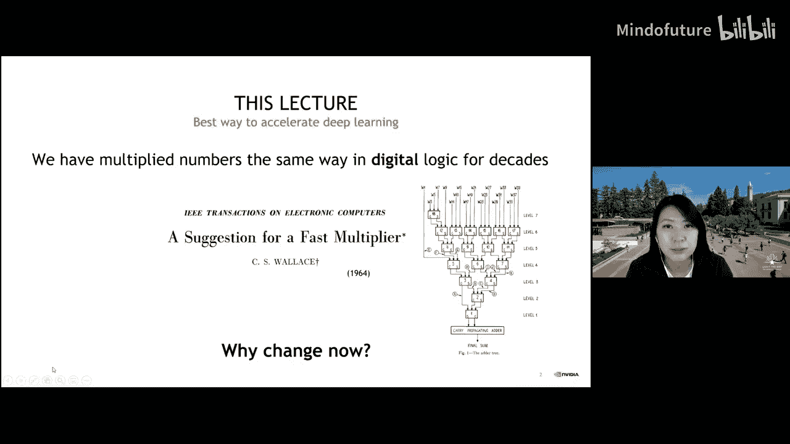
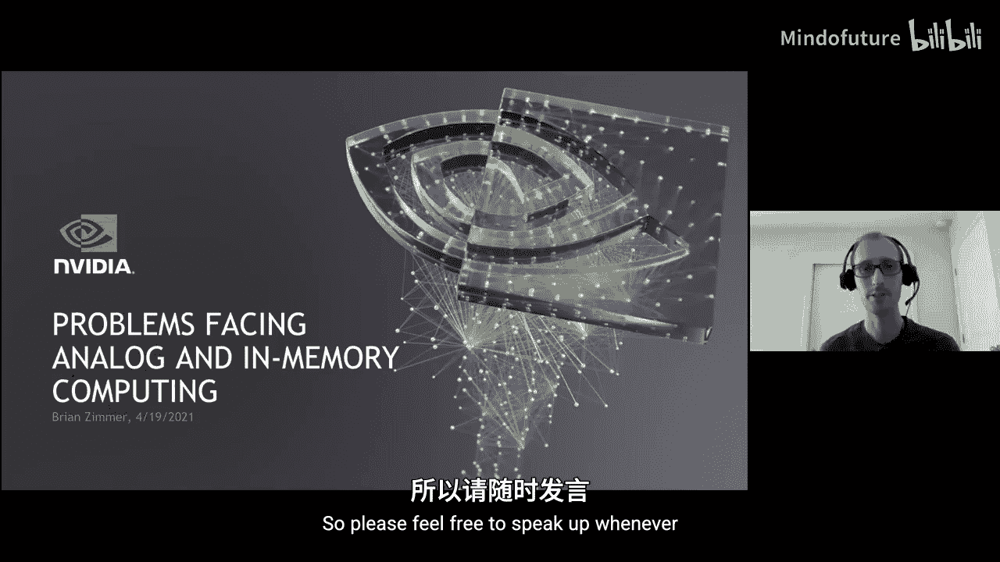
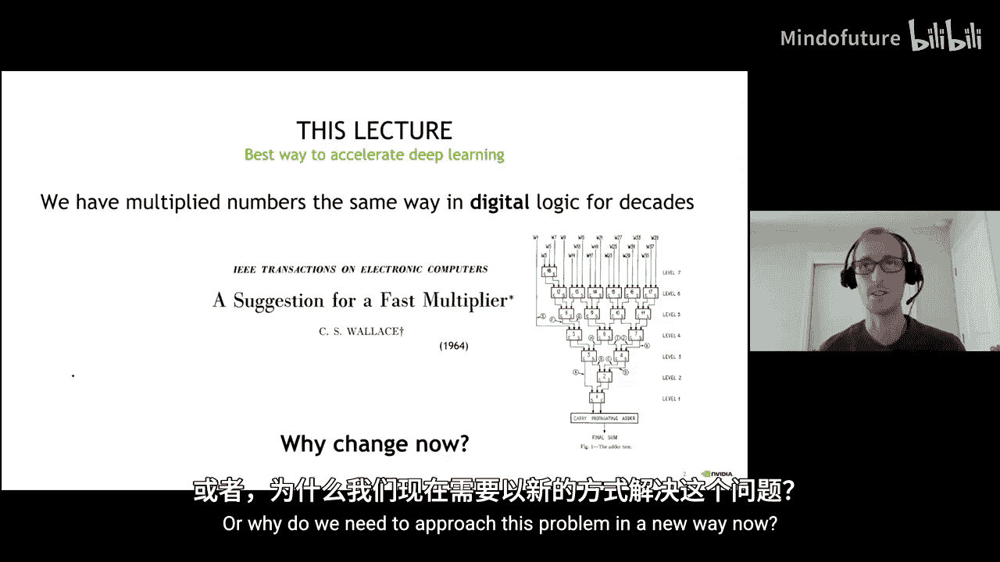
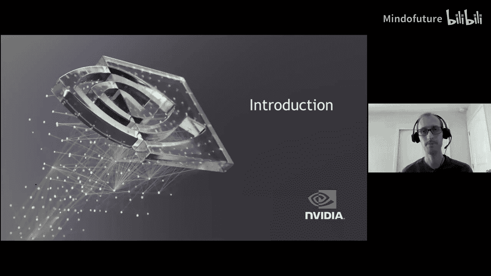
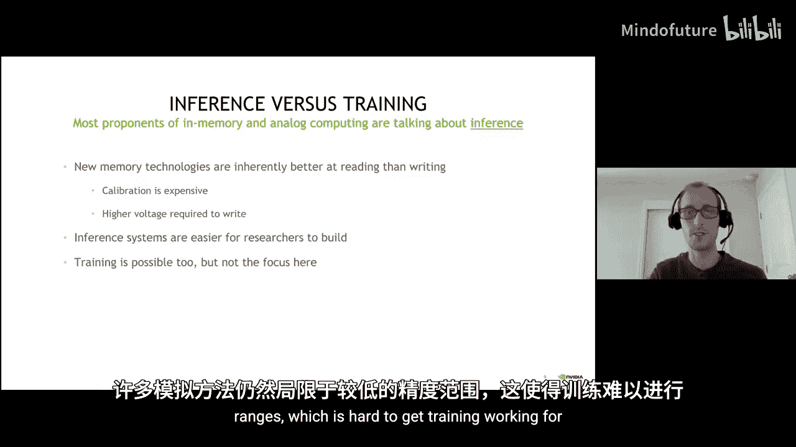
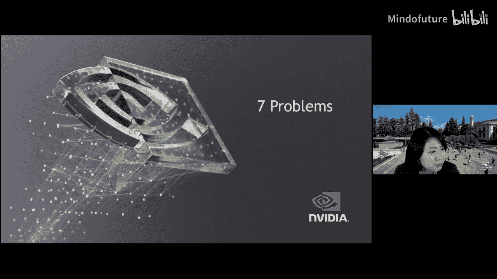
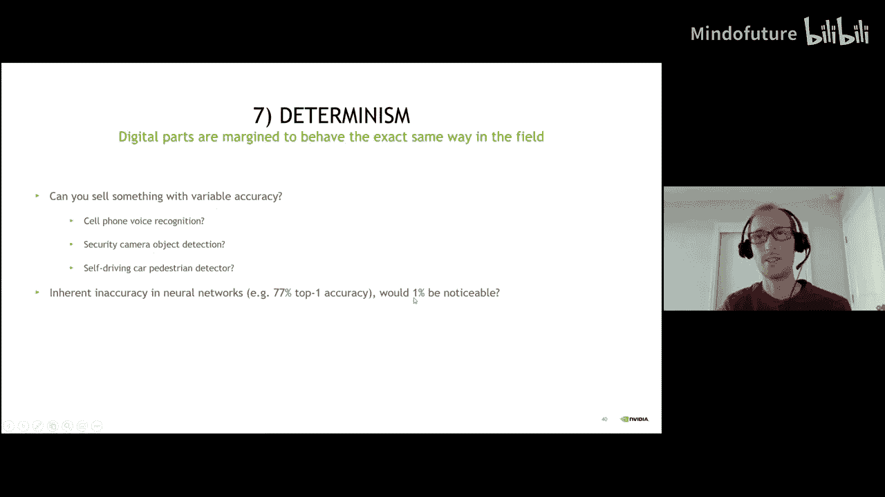
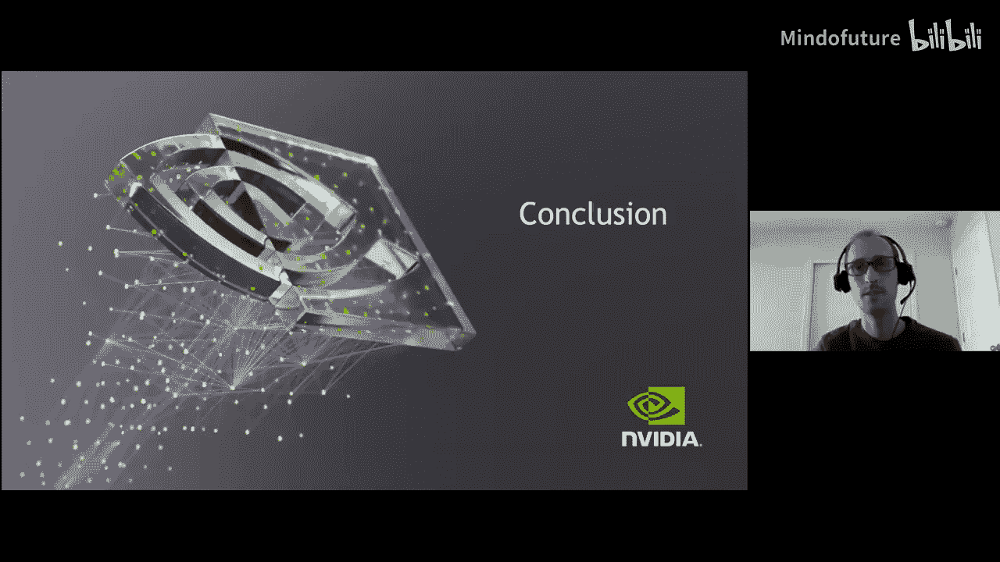
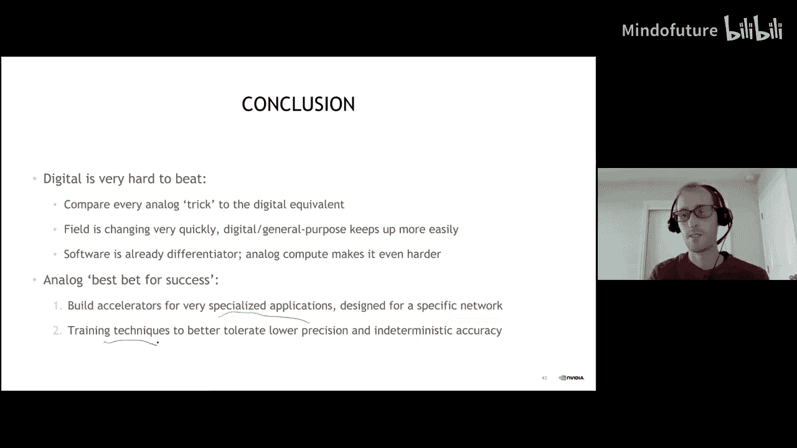
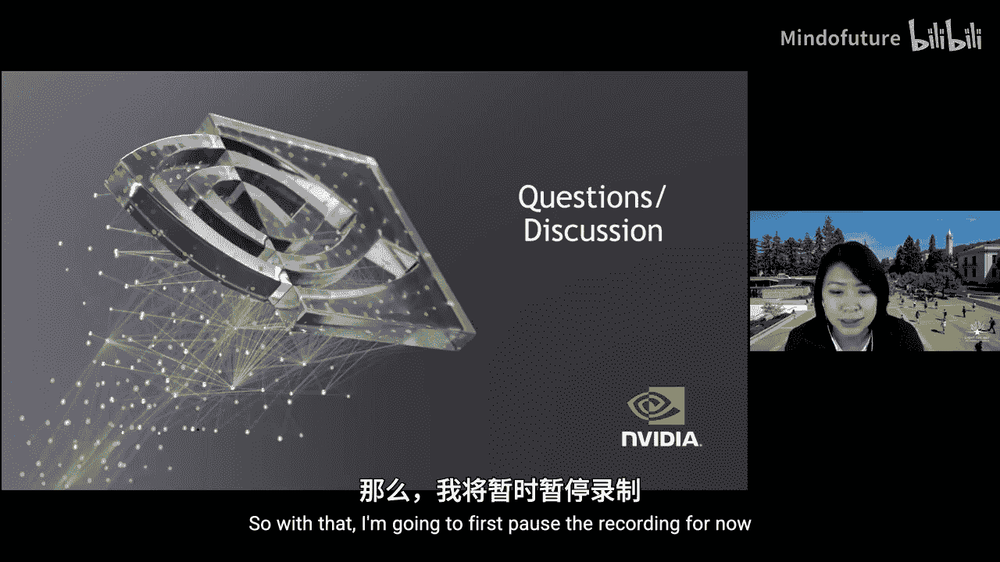

# 020：模拟与内存计算面临的问题

## 概述
在本节课中，我们将跟随NVIDIA的Brian Zimmer，探讨在深度学习中采用模拟计算和内存计算所面临的核心挑战与机遇。我们将从数字计算与模拟计算的基本对比出发，分析模拟/内存计算在追求更高能效和面积效率时遇到的七个关键问题，并思考该领域的未来发展方向。

## 数字计算与模拟计算对比
上一节我们介绍了课程背景，本节中我们来看看数字计算与模拟计算的基本区别。

数字计算系统通常包含输入SRAM、权重SRAM和输出SRAM。数据从存储中读出，在算术逻辑单元（ALU）中进行乘加运算，结果再写回存储。这个过程可以用类似CPU的指令来描述，其核心是使用标准单元（如全加器、半加器、逻辑门）构建的乘法器。整个数据路径可以通过约100行的RTL代码描述，并由综合工具进行优化实现。

模拟计算或内存计算的核心理念，是将计算“折叠”到存储阵列内部进行，以规避数字计算中的一些低效环节。其典型流程是：从输入SRAM读取数字值，通过数模转换器（DAC）转换为模拟电压或电流。这个模拟信号被施加到存储权重的内存单元（可以是SRAM、RRAM、DRAM等）上。通过同时开启多个存储行，利用位线上的电荷或电流求和效应直接完成乘积累加运算。最后，通过模数转换器（ADC）将模拟结果转换回数字值，并存入输出SRAM。其优势在于，电流域的求和近乎“免费”，有望节省大量在数字乘法器和加法器中开关逻辑门的能量。

## 数字计算的性能基线
在深入探讨模拟计算的挑战之前，我们需要建立一个清晰的数字计算性能基线，作为比较的基准。

数字系统通过架构优化来提升效率，核心思想是数据复用。例如，在卷积运算中：
*   **输入激活复用**：从输入SRAM读取一次数据，可广播到多个计算通道，从而分摊读取能耗。
*   **权重复用**：从权重SRAM读取一组权重，可用于多次计算，分摊读取和存储能耗。
*   **部分和累加**：中间结果在累加器中暂存，最终写回输出，分摊写操作能耗。

通过调整复用因子、关键路径和计算精度（如4位、8位），可以在性能（TOPS/mm²）和能效（TOPS/W）之间进行权衡，形成一个广阔的设计空间。一个常见的能效指标是TOPS/W，即每瓦特每秒可执行的万亿次操作。

## 模拟/内存计算的愿景与范畴
模拟计算的愿景在于利用神经网络本身对非完全精确计算的容忍性。即使最高精度的网络也有错误率，因此或许可以牺牲少量计算精度来换取显著的能效提升。

我们需要区分几个概念：
*   **模拟计算**：在模拟域（电压、电流、时间）执行核心数学运算。
*   **内存计算**：在存储数据的内存阵列内部或附近执行计算。它可以是模拟的，也可以是数字的（例如，在内存中逐周期进行数字累加）。

应用场景广泛，从需要数千个GPU的数据中心，到功耗极低的边缘设备。目前，大多数模拟/内存计算研究集中于推理任务，因为：
1.  新型存储器通常读操作优于写操作。
2.  推理系统更容易构建。
3.  训练通常需要更高精度，而模拟方法目前难以实现。

## 面临的七大核心问题
以下是模拟和内存计算领域需要解决的七个核心研究问题。

### 1. 面积效率问题
面积效率（如TOPS/mm²）是关键但常被忽视的指标。它直接影响芯片成本和可解决问题的规模。低面积效率会重新引入“内存墙”问题，因为低效的存储或计算单元增大了数据必须移动的距离。

影响面积效率的因素包括：
*   **存储单元密度与变异**：高密度存储单元（如多级RRAM）变异更大。
*   **设计规则**：自定义存储单元（如增加晶体管或电容）通常需使用更保守的设计规则，难以与经过高度优化的标准6T SRAM单元竞争。
*   **工艺节点落后**：许多新型存储器技术比最先进的数字工艺落后几代，限制了片上存储容量。

一个极端的例子是，早期某些低面积效率的设计，若想实现实时高分辨率目标检测，需要多个光罩尺寸的芯片，这在实际中不可行。

### 2. 实现高精度计算的问题
数字计算可以相对容易地适配不同精度（4位、8位、浮点）。而模拟设计在精度提升方面存在“悬崖效应”，需要为不同的精度范围完全改变设计方案。

**挑战体现在多个方面：**
*   **权重精度**：例如，通过晶体管尺寸比例在单个位单元中存储多比特信息。但工艺变异会导致比例失配，限制可实现的精度。
*   **输入精度**：通过字线电压或脉冲宽度表示多比特输入。在先进工艺中，字线的高电阻会导致阵列首尾单元看到的信号波形不同，引入误差。
*   **符号处理**：处理有符号数需要额外设计，例如使用差分位线（正负值分开）或原位取反，这会增加面积开销。

**报告变异性的方法多样，但各有局限：**
*   **分离测试DAC/ADC**：无法反映位单元和整体计算路径的误差。
*   **测量实际累加值**：对大量真实或极端输入/权重组合进行测量，绘制输出误差分布，更能反映系统级表现。
*   **报告网络精度损失**：在标准数据集（如CIFAR-10, ImageNet）上运行完整网络，报告精度下降百分比。这是最直接的证据，但受网络选择、量化方法等非硬件因素影响大，难以横向比较。

### 3. 收益递减问题
即使在模拟域实现了“零能耗”的乘加运算，其在整体系统能效提升上也存在上限。

**原因在于：**
*   **阿姆达尔定律**：在数字基线中，乘加运算本身的能耗可能只占系统总能耗的~50%。其余能耗来自数据移动、存储读写、控制逻辑等。因此，即使完美优化MAC，最大理论增益也只有约2倍。
*   **工艺节点劣势**：若模拟计算模块必须采用旧工艺节点实现，那么其他数字部分（SRAM、互连）的能效也会比先进节点差，可能抵消核心计算带来的增益。

因此，必须从全系统角度评估能效，而不仅仅是核心模拟宏单元的性能。

### 4. 数据复用（摊销）问题
数字架构通过巧妙的数据复用大幅降低存储访问能耗。而许多内存计算方案在进行原位乘加时，权重一旦与当前输入相乘，就无法被下一个输入复用，导致存储访问开销无法被摊销。

**后果严重：**
*   在数字基线中，通过复用，权重读取能耗可能被分摊16倍或更多。模拟方案需要在此单项上实现6倍以上的能效优势才能打平。
*   在某些极端情况下（如位串行近似乘法），缺乏复用会导致操作数量呈平方增长，能效和面积效率极低。

此外，不同应用的数据复用程度差异巨大。例如，高分辨率图像处理中权重复用次数远高于低分辨率，这会影响对片外存储访问成本的容忍度。

### 5. 模数转换器（ADC）的限制问题
模拟计算的结果需要通过ADC转换回数字信号。ADC的成本（面积、能耗）随精度位数呈指数增长。

**核心矛盾在于：**
*   一次模拟累加涉及大量单元（如1024个通道），理论上可能产生需要极高精度ADC（如25位）才能无剪裁表示的巨大数值范围。
*   实际中，可以通过剪裁（Clipping）分布尾部的极端值，来降低对ADC精度的要求。

**量化训练技术是关键辅助手段：**
*   **训练后量化（PTQ）与量化感知训练（QAT）**：通过选择合适的量化范围（如使用99.9%分位数而非最大值作为范围上限）和重新训练，可以让网络权重分布更适应量化，在较低比特数下保持精度，从而降低对ADC精度的需求。

**目前有两种主要设计思路：**
1.  **短行 + 低精度ADC**：每次只开启少数几行，使用简单高效的低比特（如3-4位）ADC，然后在数字域进行多组结果的累加。
2.  **长行 + 高精度ADC**：一次开启很多行（如>1000行），使用昂贵的高精度ADC，但其成本被大量的操作次数所摊销。

### 6. 灵活性问题
专用模拟/内存计算硬件难以适应快速演变的算法和多样化的网络结构。

**具体挑战包括：**
*   **权重更新与流水**：对于多层网络，需要重复使用同一计算阵列。权重加载可能带来延迟和能耗开销，需要复杂的“乒乓”缓冲或双阵列设计来隐藏权重更新延迟。
*   **负载均衡**：若以空间方式映射不同网络层到硬件不同部分，需要精细的负载均衡以保证高利用率。时间复用的方式（同一硬件依次执行各层）在灵活性上通常更有优势。
*   **阵列尺寸选择**：确定最优的位线长度（即一次计算涉及的通道数）需要在ADC摊销收益和灵活性之间权衡。
*   **电压频率缩放**：数字设计可通过调节电压来灵活权衡性能与能效，而模拟电路可能对工作点更敏感。

### 7. 确定性问题
数字电路通过设计余量确保所有芯片行为一致。模拟/内存计算芯片则因工艺变异，每个芯片的行为都会有细微差异。

**这引发了系统级问题：**
*   这种芯片间的差异是否可接受？对于安全摄像头或许可以，但对于自动驾驶的行人检测则可能至关重要。
*   如何定义可接受的精度波动范围（例如1%的精度损失）？这需要与算法和系统需求共同考虑。

## 总结与展望
本节课中，我们一起学习了模拟与内存计算在加速深度学习时面临的七大核心问题：面积效率、高精度实现、收益递减、数据复用、ADC限制、灵活性以及确定性。

**总结来看：**
*   **数字计算难以被击败**：对于每一个模拟优化技巧，通常都存在对应的数字优化方案。数字设计流程成熟，且能快速适应算法变化。
*   **软件栈是关键差异点**：高效的软件映射和编译优化对发挥硬件性能至关重要，更灵活的硬件通常更容易获得好的软件支持。
*   **模拟计算仍有价值与机会**：该领域已取得显著进展。其最佳应用场景可能在于更专用、对能效和面积有极端要求的领域，而非追求通用性。
*   **训练技术需持续进步**：需要更多能有效处理低精度和非理想硬件特性的训练算法，以释放模拟硬件的潜力。

模拟与内存计算是一个充满挑战但机遇并存的研究方向，其发展需要电路、架构、算法等多个层面的协同创新。