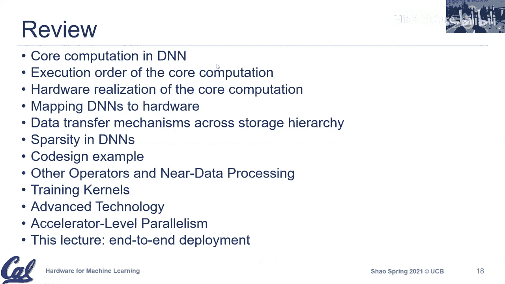

# 021：端到端部署 🚀

在本节课中，我们将探讨机器学习加速器的端到端部署。我们将超越单个加速器内核的性能，审视在实际部署（无论是云端还是边缘）时需要考虑的完整处理流水线、系统级约束和实际挑战。

---

## 概述：超越加速器内核

上一节我们讨论了加速器级并行性。本节中，我们来看看将加速器集成到完整系统中的实际考量。一个常见的误解是，只需优化神经网络加速器即可。然而，端到端部署涉及从数据预处理到后处理的整个流水线，其中许多步骤可能仍在CPU上运行，并受到数据移动、调度和系统碎片化的影响。

---

## 完整的处理流水线

在评估硬件性能时，我们常看到仅报告卷积或矩阵乘法等核心算子性能的数据。然而，一个真实的机器学习应用流水线包含更多阶段。

以下是典型机器学习部署流水线中的关键组成部分：

*   **数据获取与注入**：从源（如摄像头、数据库）获取原始数据。
*   **数据预处理**：调整数据格式以供模型使用，例如调整图像大小、视频帧提取、特征修剪或格式转换。
*   **机器学习推理/训练**：执行核心的神经网络计算。
*   **后处理**：对模型输出进行分析、解释或格式化。

来自Facebook和Google的数据表明，预处理和数据移动阶段可能消耗相当多的计算周期，有时甚至成为处理速率的瓶颈。例如，在将数据从CPU馈送到TPU的过程中，数据移动所花费的时间可能非常显著。

---

## 阿姆达尔定律与系统瓶颈

阿姆达尔定律指出，系统的整体加速受限于其顺序执行部分。即使我们极大地加速了可并行部分（例如使用专用加速器），顺序部分最终将成为瓶颈。

在机器学习部署的语境下：
*   **可并行部分**：通常是密集的神经网络算子（如卷积），这正是大多数加速器优化的目标。
*   **顺序部分**：包括数据预处理、后处理、框架开销、调度以及CPU与加速器之间的数据移动。

因此，仅优化“蓝色”的AI计算部分可能无法实现预期的端到端性能提升。必须考虑整个流水线的性能剖析。

---

## 部署场景的多样性

机器学习工作负载的部署场景多种多样，对性能有不同的要求：

*   **单流**：处理单个数据流（如单个摄像头），通常有严格的延迟要求。
*   **多流**：同时处理多个数据流（如自动驾驶汽车的多摄像头），涉及复杂的调度和资源共享。
*   **服务器**：处理来自用户的异步、不可预测的请求，需要保证服务质量。
*   **离线批处理**：处理大量数据，主要追求高吞吐量，对延迟不敏感。

MLPerf等基准测试套件试图为这些不同场景提供标准化的评估方法。在评估或选择硬件时，必须明确目标应用属于哪种场景。

---

## 实际部署约束

在实际部署加速器时，会遇到一些在学术论文或产品白皮书中常被忽略的约束。

### 1. CPU仍然至关重要 🖥️

尽管专用加速器备受关注，但CPU在许多部署中仍然扮演着核心角色：
*   **现有基础设施**：数据中心已有大量CPU，对于计算强度不高的任务，直接使用CPU更为经济。
*   **编程简易性**：CPU的编程模型成熟、工具链完善，部署难度远低于为各种定制加速器编写代码。
*   **处理流水线**：如前所述，预处理、后处理、控制逻辑等通常仍在CPU上运行。

### 2. 热约束与性能可变性 🔥

在边缘设备（如VR/AR头盔、手机）上部署时，热设计和功耗预算成为关键限制因素。
*   **热限制**：设备可能为了控制发热和功耗，不得不降频运行CPU/GPU，导致实际性能远低于峰值。
*   **性能可变性**：即使在同代SoC中，由于制造差异、老化、共运行应用的不同，性能也可能存在波动。在碎片化严重的Android生态中，有成百上千种不同的SoC配置，这给为所有设备提供一致性能的软件优化带来了巨大挑战。

### 3. 资源共享与干扰 ⚡

当多个处理单元（CPU、GPU、多个加速器）共享系统资源（如最后一级缓存、内存带宽、互连总线）时，会产生干扰。
*   **干扰影响**：一个代理的繁忙活动可能影响另一个代理的访问延迟，导致性能波动，难以提供稳定的服务质量保证。
*   **系统级管理**：需要更智能的资源管理和调度策略，以协调CPU和加速器之间以及多个加速器之间的资源共享。

---

## 总结与展望

本节课我们一起学习了机器学习硬件端到端部署的复杂性。我们认识到：

1.  **必须审视完整流水线**：评估性能时，需考虑从数据注入到结果输出的全过程，而不仅仅是核心AI算子的速度。
2.  **阿姆达尔定律依然适用**：顺序执行部分（如数据预处理、移动）可能成为系统瓶颈。
3.  **部署场景多样**：单流、多流、服务器、离线等场景有不同的约束和目标。
4.  **实际约束重大**：CPU仍是部署基石，热限制和性能可变性影响边缘设备体验，资源共享引发的干扰是系统级设计的新挑战。

未来，随着市场碎片化加剧和集成度提高，如何设计统一的软硬件接口、管理异构计算资源、并提供可靠的服务质量，将是推动加速器广泛落地的关键。正如IBM System/360通过统一指令集架构解决了当时的碎片化问题一样，机器学习硬件领域也可能需要类似的抽象层来简化部署。

---

**下节课预告**：我们将进行课程总结与项目展示，回顾本学期所学，并欣赏同学们在机器学习硬件设计上的实践成果。