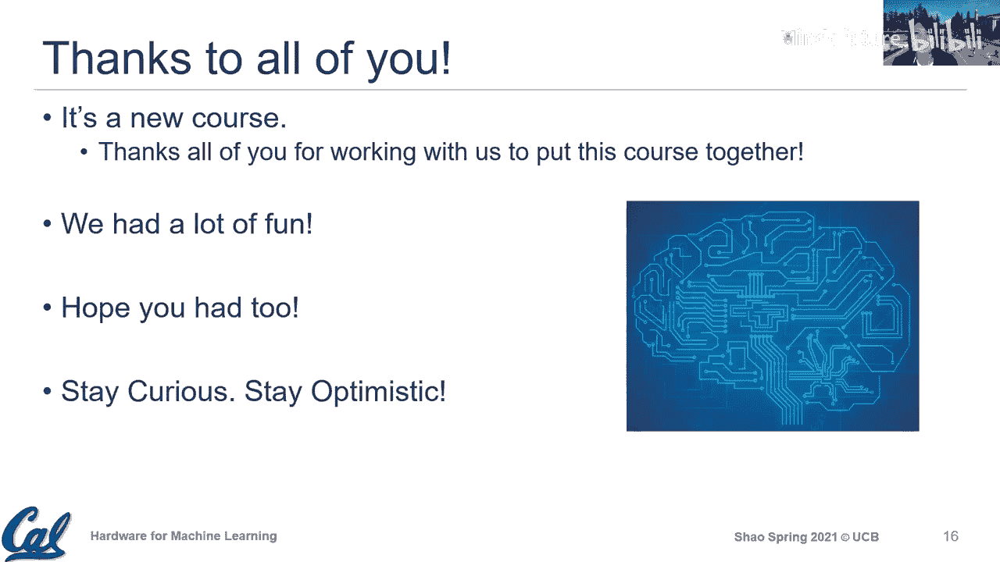

# 022：课程总结与展望

在本节课中，我们将对本学期的“机器学习硬件技术”课程进行总结，并探讨该领域未来的挑战与机遇。我们将回顾所学核心概念，并思考如何将这些知识应用于更广泛的硬件设计领域。

## 课程概述与学期回顾

本学期我们共同探索了机器学习硬件这一激动人心的领域。课程旨在连接硬件设计与机器学习应用，强调通过理解应用特性并利用核心硬件设计原则来构建更高效的专用系统。

上一节我们介绍了多种加速器架构，本节中我们来看看对整个课程的总结与反思。

随着学期接近尾声，我们已涵盖了一系列广泛的主题。我们从通用的机器学习及其不同范式入手，讨论了机器学习流程中的三到四个组件。我们探讨了所使用的各种基本运算单元（Primitives），以及如何使其运行得更快。课程初期，我们通过使用PyTorch和思考量化流程，让大家获得了更多实践体验。在后续的客座讲座中，你们也看到了该领域更前沿的研究，以及工业界如何通过支持不同格式（如Google的BFloat16、微软的MS-FP8）甚至设计自己的格式来应对这一问题。

我们还讨论了不同类型的加速器，一些定制化程度更高，一些则更灵活。例如，SambaNova的加速器相当灵活，可以处理多种应用；而TPU则专为高效执行矩阵运算而设计。我们强调了映射（Mapping）的重要性，例如亚马逊的讲座包含的两个组件就与我们的Lab2和Lab3非常契合：一部分是加速器设计（脉动阵列架构），另一部分是编译器部分（如何将运算编译到硬件上）。因此，我们也着重强调了映射的重要性，即如何将计算任务映射到硬件上。

课程还涉及了与协同设计、不同算子与训练相关的多个主题，并通过NVIDIA Brian Kelleher的客座讲座探讨了先进技术。当然，机遇众多，但我们也需要看到使用这些技术时更现实的考量，尤其是在更广泛的应用领域中，它们可能只适用于利基市场，同时也存在更本质的限制。

在系统层面，我们讨论了端到端部署以及加速器级并行的概念。随着各种应用兴趣的增长，如何协调、设计所有不同的加速器或IP，使它们能够协同工作变得尤为重要。

希望通过对所有这些主题的覆盖，能让大家对当今的做法、重要因素以及核心组成部分有一个全面的了解。主讲座阐述了核心主题，客座讲座则强化了这些主题，并展示了这些原则如何在工业实践中被采纳或应用。你们可能会发现，我们今天所讲的内容正是工业界正在做或计划做的事情。

## 核心设计原则与行业视角

本课程非常强调原则的重要性。许多硬件设计原则当然对机器学习非常有用，但总体上，这些原则在过去五六十年中已应用于通用硬件设计，例如利用局部性、利用并行性。所有这些原则仍然相关，并且因为我们专注于更特定、更专门的应用，实际上可以发掘出更多潜力。

课程的一个重要部分是行业视角。我们有一系列精彩的客座讲座，主讲人都是工作在最前沿、思考极具挑战性问题的科学家和工程师。你们也能看到他们或其组织所采取的问题解决方法，与本课程推荐的一些设计决策或原则有相似之处。建立这种行业联系也非常重要，我们尽力将学生与行业合作伙伴联系起来。

## 实验与项目实践

我们通过实验让大家做好准备。你们拥有非常多样化的背景，我们希望通过本课程至少让大家在使用一些基础设施（无论是商业化的还是我们的研究基础设施）时感到得心应手。也许以前你们觉得这些基础设施庞大复杂，缺乏经验，但通过将实验作为课程组成部分，你们至少可以以用户的身份接触这些设施。在未来的职业生涯中，你们或许可以更积极地参与这些基础设施的开发。即使不使用完全相同的设施，这也让你们对当前在学术界和工业界使用的代表性基础设施有所了解。

实验旨在让大家从不同视角看待硬件软件协同设计：从应用到硬件设计，再到更偏向编译器的映射过程思考。同时也让大家熟悉我们的研究基础设施，以便为开展项目做好准备。

在看到项目检查点一和检查点二后，我个人非常兴奋。你们所有人都完成了一些非常重要且有趣的工作，有些更新甚至让我感到有些惊喜。做得非常出色，下周我们将庆祝你们的成果。

## 项目展示与报告提交

以下是关于项目展示和最终报告的具体安排：

*   **项目展示**：定于下周一进行。我们将使用下午的时间段，每个团队大约有20分钟时间展示项目，并留出一些问答时间。我们将使用相同的电子表格来最终确定时间段并让大家报名。
*   **最终报告**：截止日期是阅读周的周五。报告不需要很长，最多8页。我们希望你们能借此机会记录所取得的进展，反思所学，描述遇到的技术挑战及解决方法。

## 更广阔的机遇：超越机器学习硬件

本课程专注于机器学习硬件，但在此刻，我想进行更广泛的概括。当然，机器学习领域存在大量机遇，但其他领域也存在许多机遇。我们讨论机器学习硬件或更广义的“面向X的硬件”，不仅仅是因为机器学习重要，还因为存在根本性的技术挑战，促使我们需要思考更专用的硬件。

一个表明计算机架构进入“新黄金时代”的强烈信号，是2018年图灵奖授予Hennessy和Patterson。他们总结了过去五十年的三个核心经验教训：

1.  **软件进步启发架构创新**：硬件始终是为软件设计的。我们需要定量方法、基准测试来评估硬件性能。许多通用架构原则（如缓存、分支预测、预取）都受到软件行为的启发。
2.  **硬件软件接口至关重要**：如何设计硬件软件接口为架构创新开辟了许多机会。指令集架构的粒度、硬件控制向软件的暴露程度，都是关键讨论点。未来的硬件设计必须充分考虑软件将如何与之交互。
3.  **市场检验架构争论**：架构与半导体产业紧密相连。许多想法最终需要在工业中应用，以检验其是否解决了实际问题。市场将给出答案，目前我们看到众多初创公司和老牌企业都在进行创新，谁将胜出仍是开放的问题。

机器学习硬件正是这一趋势的一部分。它由机器学习应用强大的计算需求驱动，涉及如何向系统暴露基本运算单元，以及如何设计硬件软件之间的抽象层次。

## 对硬件设计师的启示：成为“文艺复兴”式的全栈思考者

对于思考连接硬件和软件领域的你们，我想强调：最终这将是一个相当复杂的软硬件系统。无论你未来是数字设计师、计算机架构师、软件工程师还是系统程序员，拥有一**系统视角**都至关重要。即使只负责整个拼图的一小块，也需要思考接口、集成以及如何与系统的其他部分协同工作。

从教育角度，我鼓励大家成为“文艺复兴”式的硬件设计师，不要自我设限。深入理解你的专业领域固然重要，但同时也应了解其上一层和下一层的知识。这样你至少能理解相关术语，与那些领域的专家进行有效对话，并关注其中的机遇。能够进行跨层优化、打破抽象的人，需要至少精通一个以上的领域。

## 未来硬件设计的思维模式

最后，我想分享两个我个人对未来硬件设计思维模式的看法：

1.  **架构具有时间性**：硬件是时代的反映，随着应用和技术的假设变化而演进。不要被历史经验束缚，要有勇气构建反映当前时代挑战的硬件。核心原则（如局部性、并行性）是永恒的，但具体实现机制可以随假设变化而创新。
2.  **架构具有空间性**：现代计算系统日益空间分布化。我们不再仅仅建造功能强大的单线程“摩天大楼”，而是在构建更扁平、由众多可能专门化的“房屋”（加速器）组成的架构。关键在于如何高效地组织、协调这些“房屋”，使它们能够通信、共享数据、协同工作以完成更大的任务。理解整个系统以及你构建的部分如何与周围环境集成变得非常重要。

## 总结与致谢

本节课中我们一起回顾了整个学期的学习历程，从机器学习硬件的基础知识到系统级思考，并展望了更广阔的硬件设计未来。我们以机器学习硬件为起点，但将其泛化到过去几年所学的经验教训中。

我衷心感谢本学期与我们并肩作战的GSI Abraham (Abe) Gonzalez，他在这个充满挑战的学期付出了巨大的努力。我也要感谢在座的所有同学，感谢你们的时间、参与和反馈。在这个虚拟学期中，与你们的互动让我个人受益匪浅，也带来了很多乐趣。

你们应该为自己感到骄傲，成功完成了三个实验和项目工作。请保持好奇与乐观。硬件设计师通常更乐观，因为我们总是在寻找解决问题的方法，而不是抱怨问题。

课程即将结束，但学习永无止境。我期待未来与大家保持联系。祝大家学期末一切顺利，享受暑假，迎接未来所有激动人心的机会。

保持联系，我们下次再见！