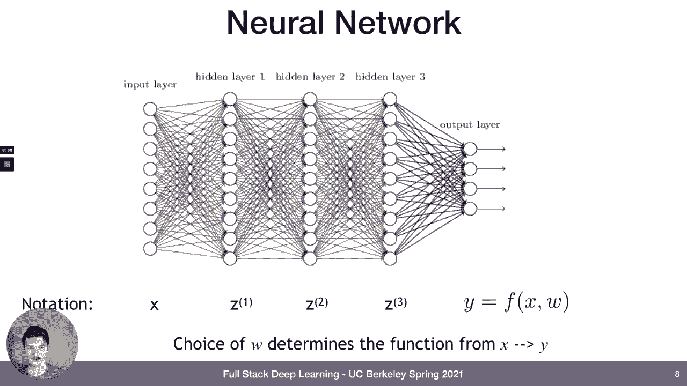
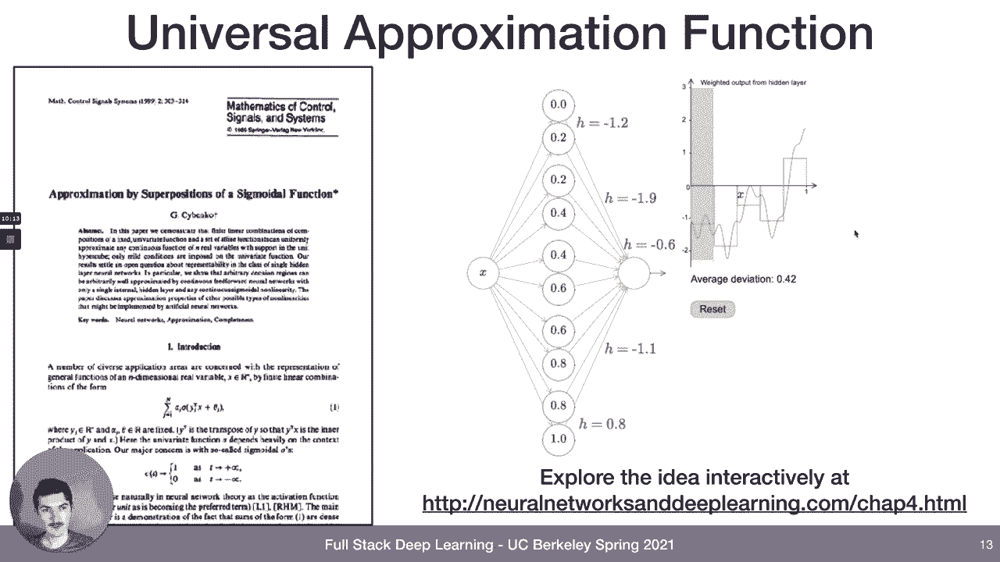
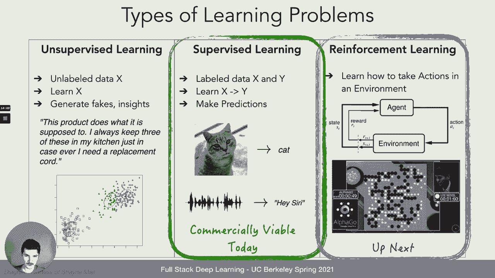
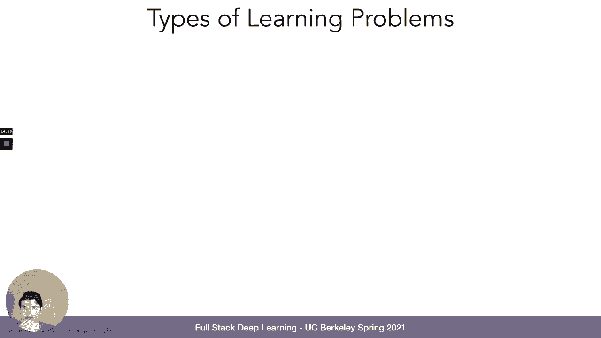
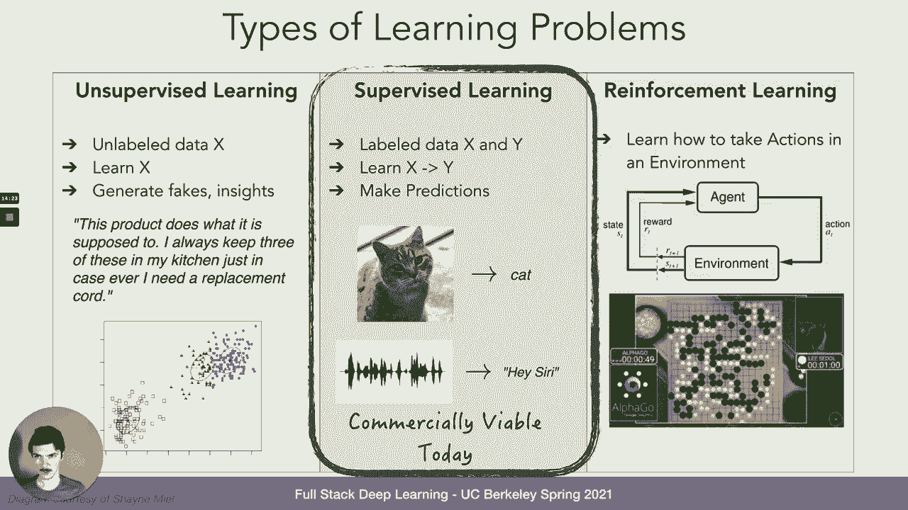
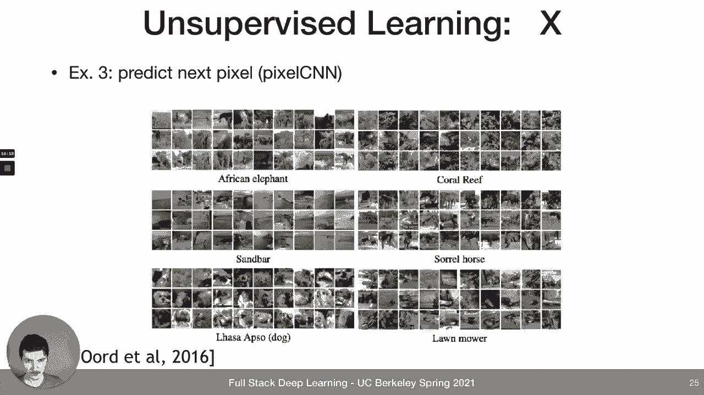
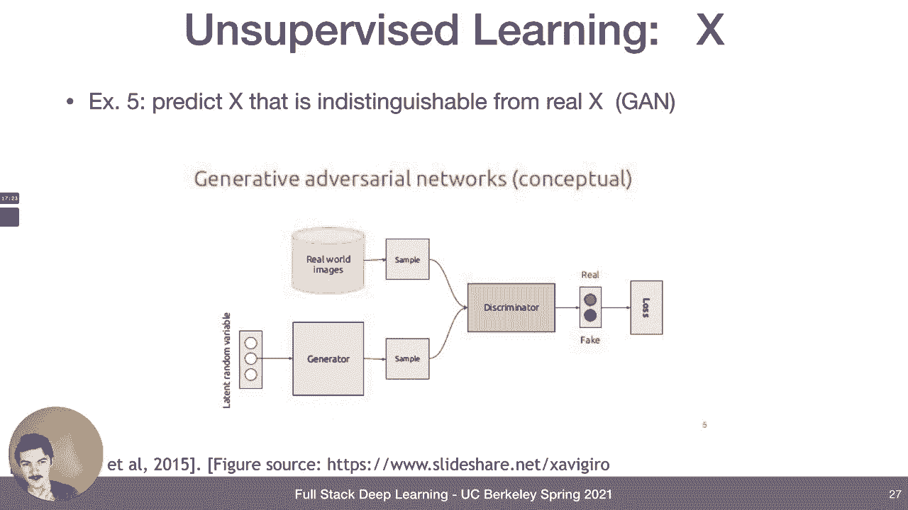
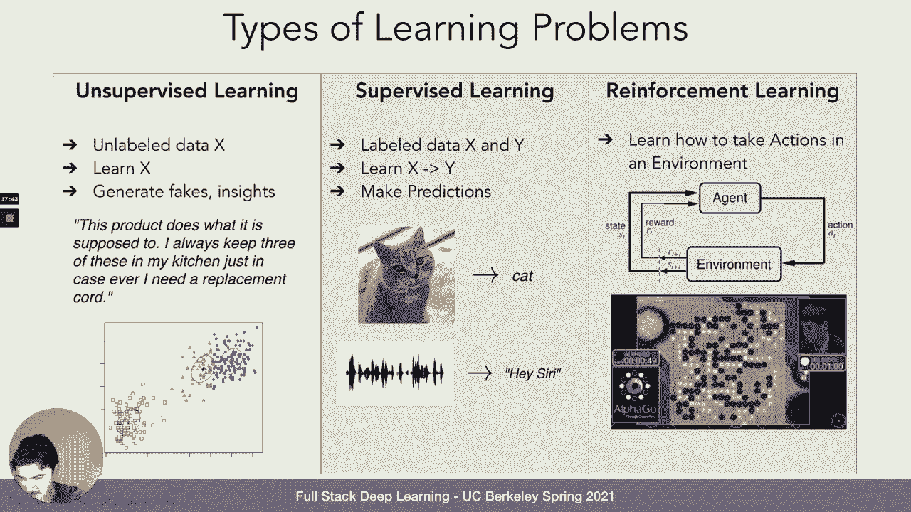
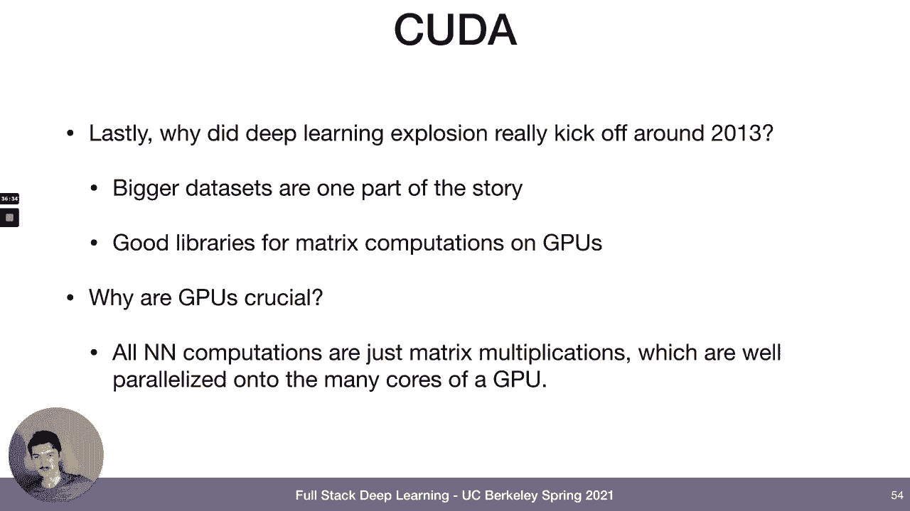

# 1：L1 深度学习基础 🧠

在本节课中，我们将学习深度学习的基础知识。课程内容涵盖神经网络、万能近似定理、机器学习问题类型、损失函数与梯度下降、网络架构考量以及GPU计算等核心概念。虽然这些内容对许多同学来说是复习，但它们是构建深度学习知识体系的基石。

## 神经网络：从生物灵感出发 🧬

神经网络之所以被称为“神经”，是因为其设计灵感来源于我们身体中进行计算的生物神经元。神经元是一种细胞，从主体延伸出许多被称为树突的结构，可以将其视为信息的接收器。如果树突接收到足够的刺激，整个神经元就会产生一个称为“放电”的动作，本质上是一个电脉冲。这个脉冲从细胞体开始，沿着被称为轴突的长分支传播，轴突末端的分支会连接到其他神经元的树突。因此，这是一个由神经元组成的网络，当它们受到足够刺激时就会放电，电信号沿着长分支传播并依次刺激其他神经元。

从数学角度看，这可以简化为一个相当简单的函数，通常称为**感知机**，其概念可以追溯到20世纪50年代。我们可以将到达树突的刺激视为输入，即 `x₀, x₁, x₂` 等。树突本身（即与输入信号接触的部分）受该输入刺激的程度由一个权重决定，即 `w₀, w₁, w₂`。我们将所有这些加权输入求和，即 `Σᵢ (wᵢ * xᵢ)`，这就像是神经元被输入刺激的过程。此外，还有一个偏置项 `b`，因为这是一个线性函数，我们通常需要一个偏移量作为截距。最后，整个求和结果被包裹在某种**激活函数**中。因为神经元的工作原理是：如果受到足够刺激，它就完全“开启”（放电）；如果刺激不足，它就保持“关闭”。因此，激活函数本质上是一个阈值函数：如果求和结果超过某个阈值，就传递信号；否则，大部分情况下保持关闭。

## 激活函数：从Sigmoid到ReLU 📈

那么，有哪些好的激活函数呢？经典的神经网络文献主要使用左侧的**Sigmoid函数**。它是一个简单的函数，无论输入是什么，输出都会被“压缩”到0和1之间。对于负输入，它渐近于0；对于正输入，它渐近于1；在0附近，它会迅速从0变为1。作为一个激活函数，它有一个很好的导数（也称为梯度），图中用橙色线表示。双曲正切函数是另一个曾被使用的函数，但我们将跳过它。

近年来，人们主要使用右侧的激活函数，称为**线性整流单元**，简称 **ReLU**。它本质上是一个最大值函数，因为它直接规定：无论输入是什么，如果大于0，就原样输出；如果小于或等于0，则输出0。它的梯度存在一个不连续点，但这没关系。基本上，如果输入大于0，梯度就是1；否则为0。这实际上是2013年开启深度学习革命的部分创新所在。

## 网络架构：从神经元到网络 🕸️

我们讨论了神经元，但什么构成了神经网络呢？如果你像图中所示那样将感知机排列成层，就形成了“网络”这一术语的来源。通常，有一个**输入层**，对应你的输入数据。输入层连接到一个**隐藏层**，这个隐藏层再连接到另一个隐藏层，隐藏层的数量可以是多个。最后，有一个**输出层**。构成这个网络的每一个感知机都有自己的权重和偏置。正是这些权重和偏置的设置，决定了神经网络如何响应输入。

## 万能近似定理：网络的强大表达能力 🌐

接下来我们要讨论的是**万能性**。这个神经网络代表了某个函数 `y`，即 `y = f(x; w)`，其中 `x` 是输入，`w` 是所有权重的设置。让我们看看左侧这个函数 `f(x)`，它有很多峰和谷。我们如何知道是否存在一个神经网络，以及一组权重设置，能够基本上表示这个函数呢？

总结一些理论结果，你可以证明任何具有一个隐藏层的两层神经网络（即输入层到一个隐藏层再到输出层），都可以找到一组权重，能够近似任何函数。这就是所谓的**万能近似定理**。关于为什么这是成立的，可以有一些直观理解。如果你访问那个 neuralnetworksanddeeplearning.com 网站，查看第四章，基本上你可以将隐藏层中的每一个感知机（可能有成千上万个）视为一个脉冲函数。如果这些“柱子”（图中橙色部分）足够多，并且它们能上下移动，你就能表示任何东西。这几乎就像是这个函数的傅里叶变换。所以这相当有趣。

关键要点是：神经网络具有难以置信的通用性。至少在理论上，你可以使用神经网络来表示任何函数。

## 机器学习问题类型：三大类别 🎯

那么，我们用神经网络来做什么呢？我们将其用于机器学习。机器学习问题有哪些类型呢？大致可以分为三个主要类别：**监督学习**、**无监督学习**和**强化学习**。当然还有迁移学习、元学习、模仿学习等不同类型，但这是三个大的类别。

*   **无监督学习**：你获得的是未标记的数据 `x`。`x` 可能是音频片段、文本字符串或图像，但没有其他关联信息。目标是从数据中学习其结构，即学习 `x` 本身。这样做的原因是你可能希望生成虚假的音频片段、图像或评论，或者获得对数据可能包含内容的洞察。例如，你可以使用神经网络生成一些虚假的文本（如亚马逊评论）。另一个概念是**聚类**：你有一些数据，对其一无所知，也没有标签，但仅仅根据其结构，你可能会推断出存在一些聚类。这意味着某个过程产生了这些数据，使得这边的数据来自一个过程，那边的数据来自另一个过程。
*   **监督学习**：你获得的是成对的 `(x, y)` 数据，其中 `x` 是原始输入数据，`y` 是其标签。例如，`x` 可能是一张图像，`y` 可能是“它里面有一只猫吗？”这样的标签。目标是学习一个从 `x`（图像）到 `y`（标签）的函数。这样做的目的就是为了能够进行预测。例如，给定一张图像，我可以说它是一只猫；给定一个音频片段，我可能能够识别出是某人在说“嘿，Siri”。这样的例子不胜枚举。
*   **强化学习**：目标是学习如何采取行动。有一个智能体（可能是一个机器人、计算机病毒等），它可以采取行动（例如向前移动、看向某处）。当它采取行动时，环境会对其做出反应，你可以将其解释为环境向智能体提供奖励（或不提供），并改变智能体所处的状态。例如，如果一个机器人在某个位置，它采取了一个向前移动的动作，那么现在它就在另一个位置了，并且可能（也可能没有）获得相关奖励。你可以使用强化学习来训练游戏智能体。例如，动作可能是在围棋棋盘上放置一枚棋子，奖励可能是你最终是否赢得了游戏，而状态显然就是围棋棋盘的状态。

目前，商业上可行的主要是监督学习。强化学习无疑是下一个重点。无监督学习在现阶段也正在兴起，例如OpenAI将GPT-3产品化及其所带来的一切可能性，这都属于无监督学习的范畴。

## 无监督学习示例：从语言到图像 🖼️

无监督学习问题的一个例子可能是预测文本字符串中的下一个字符。Andrej Karpathy 有一篇名为“Char-RNN”的博客文章，基本上就是使用循环神经网络一次输入一个字符，然后RNN也可以输出字符。最终你学习到的是一个语言模型，如果你用一个词启动它，它就会通过一个接一个地生成字符来持续写作，其输出能力令人印象深刻。

另一个无监督学习问题可能是理解词与词之间的关系。这里的输入实际上是词汇表中的单词。想象你的词汇表有30,000个不同的单词，那么每个单词可以被表示为一个向量（在对应单词位置为1，其他位置为0的列表）。如果你将一堆这样的向量输入到一个经过适当设置和训练的系统中，你实际上可以确定单词之间存在某些关系，例如经典的例子：男人与女人的关系，就像国王与王后的关系。这非常有趣。

在计算机视觉领域，你可以尝试预测下一个像素，而不是文本中的下一个字符。你可以从图像的一小部分开始，然后通过例如将图像压缩到一个非常小的表示（称为**潜在向量**），再将这个潜在向量扩展回图像的方式来训练这类模型。这可以学习到一个高度压缩的表示。

最后，这条研究路线的巅峰可能是**生成对抗网络**。其思想是，有一个生成器，用于生成这类虚假的图像或文本；但同时还有另一个模型，一个称为判别器的神经网络。判别器的目标是能够区分生成的图像/文本与真实的图像/文本。而生成器的目标是产生能够欺骗判别器的图像或文本。如果你设置好这个系统并进行训练，你会得到非常令人印象深刻的结果，并且这些结果每年都在变得更加出色。我们都见过深度伪造视频。如果你访问“This Person Does Not Exist”网站，你会看到无限多个由GAN生成的人脸，看起来非常有趣。我今天还看到了“This Anime Does Not Exist”网站。

在强化学习中也有很多例子。

## 损失函数与风险最小化：从线性回归说起 📉

接下来，让我们谈谈所谓的**风险最小化**和**损失函数**的概念。

我们先简单讨论一下**线性回归**。这里展示的是一维数据：x轴上有一个维度（某个数值），y轴上是另一个维度（输出）。所以这是一维输入数据产生一维输出。我们可能想问的问题是：如果我们得到一个输入，比如30，我们如何预测输出可能是什么？给定我们已经看到的所有这些数据，当我们看到一个新的数据点（但我们只看到输入部分，不知道输出应该是什么）时，我们能预测输出应该是什么吗？

答案是肯定的。数学上一种稳健的方法是给这些数据拟合一条**最佳拟合线**。之所以是一条线，是因为没有理由相信它应该是线以外的其他形式。但我们如何找到这条线应该是什么样子呢？这条线能够告诉我们，如果我们输入 `x`，它会给出 `y`，因为它会将 `x` 乘以某个数再加上另一个数，即 `y = ax + b`。但 `a` 和 `b` 应该设置为什么值呢？我们如何设置这条线？

我们可以做的是，最小化我们观察到的所有数据点与某条候选线之间的**平方误差**。给定一条由两个数字 `a` 和 `b` 定义的线，我们可以计算在所有已见数据上的平方误差，公式如图所示。然后，我们可以尝试找到使平方误差最小化的线参数 `a` 和 `b`，那将是最佳拟合线。

更一般地，我们可以称这个平方误差函数为**损失函数**，我们的目标是最小化这个损失函数。我们找到使损失函数最小化的权重和偏置（如 `a` 和 `b`）的设置。这就是**经验风险最小化**的全部思想。

在神经网络中，函数 `f`（给定权重 `w` 和偏置 `b`）作用于 `x`，这就是神经网络。权重和偏置是神经网络的参数。损失函数可以是均方误差，也可能是其他类型的损失函数。但这基本上就是你如何训练或确定神经网络是否解决问题的方式。

对于**分类**任务，所有东西都会改变。回归是试图从输入预测某个实值输出，而分类是从输入预测某个**类别输出**。输出永远不会是像2.3这样的值，而会是确切的0、1或2，这些值对应于数据的标签。对于分类，我们通常使用**交叉熵损失**。你们将在本周的阅读材料中详细了解这一点。

## 梯度下降：优化权重的核心方法 ⬇️

好的，我们有了损失函数，这样我们就能看到，如果我们有一些权重，我们可以理解模型的好坏。但我们实际上用它来做什么呢？我们的目标是找到优化（即最小化损失）的权重和偏置。这个损失函数（给定数据）可能看起来非常复杂。我们能做的是，通过以下方式更新每个权重：将权重设置为当前权重值减去某个 `α`（可称为**学习率**）乘以损失函数关于该权重的**梯度**。

我们从一些随机参数开始，在观察到的数据上评估它们，计算损失函数。然后，为了改善神经网络对数据的拟合，我们将通过上述操作更新每个权重：只需减去损失函数关于该权重的梯度乘以某个学习率。这就是全部。我们希望的方式是，始终朝着最陡下降的方向移动。有一些技巧可以确保，如果你的数据存在于空间中某个相对较小的区域，梯度下降会比数据处于所谓的“良好条件”（通常意味着在所有维度上具有零均值和相等方差）时更困难，因为后者为梯度下降提供了最有利的条件。

我们可以讨论权重初始化，可以讨论归一化。这些都是**一阶方法**：梯度下降就是计算一阶梯度，然后用该梯度更新权重。也有**二阶方法**，你可以计算损失函数关于权重的二阶导数，但我们通常不使用它们，因为它们的计算量非常大。不过，有一些近似的二阶方法可以在更快地训练神经网络方面发挥作用。如果你只记住一个名字：**Adam**，那将是我们实验中要使用的优化器，它试图做的就是近似二阶优化。

最后，我们可以查看所有见过的数据，计算损失，更新每个权重。但在实践中，可能更好的是只在一个数据子集上计算梯度，而不是整个数据集。这被称为**批量梯度下降**或**随机梯度下降**。随机梯度下降可能使用大小为1的批次：你查看一个数据点，计算其损失，然后用该损失更新所有权重，然后查看下一个样本。这就是随机梯度下降。这样做的原因是，每一步的计算量要少得多。你不需要遍历所有数据（例如ImageNet上有100万张图像）来第一次更新权重；你可以只看32张图像，计算损失，更新权重。然后，在下一批32张图像中，模型将更适合数据。因此，它使用更少的计算量训练得更快，但噪声更大。不过，这基本上就是我们实际所做的。

## 反向传播：高效计算梯度 🔄

现在我们可以谈谈**反向传播**，因为我们已经将整个学习的概念简化为仅仅优化一个损失函数。我们只是试图找到最小化这个损失函数的权重和偏置，并且我们已经想出如何通过随机梯度下降来实现：取一批数据，计算其损失函数，计算每个权重相对于该损失函数的梯度，然后用该梯度乘以学习率 `α` 来更新每个权重。但是，我们如何高效地计算这些梯度呢？说起来容易，“我们计算梯度”，但我们实际上怎么做呢？

梯度只是导数的另一个说法，而导数你在微积分课上学过。你可以符号化地进行，给定一个函数，你可以找出它的梯度是什么。但神经网络从来不只是像 `e^x` 那样简单的函数，计算它的梯度永远不会那么容易。它由许多计算组成，而每个计算确实都有梯度，因为它可能只是一个像 `ax + b` 这样的线性函数，这确实有梯度。然后，我们可以应用**链式法则**来处理所有内容，这样我们就可以得到损失函数相对于神经网络底部（离损失函数非常远）的权重的梯度，只需通过神经网络的所有层进行链式传递。这就叫做反向传播。

好消息是，我们甚至不需要自己编写导数代码，因为我们使用**自动微分**软件。像 PyTorch 或 TensorFlow 这样的框架会自动为你计算梯度。所以，你只需要编程实现前向函数 `f(x)`（给定权重 `w`），然后 PyTorch 就会自动为你计算梯度。

## 网络架构考量：超越基础MLP 🏗️

最简单的神经网络架构就是我们一直在讨论的，也称为**多层感知机**。它实际上就是感知机排列成层。有时这被称为**全连接层**。我们知道，理论上我们只需要这个就能表示任何类型的函数，但我们可能需要一个无限大的网络和极其大量的数据来实际学习到能正确工作的权重。

因此，我们可以做的是，将我们对世界的已有知识编码到神经网络的**架构**中。例如，对于计算机视觉，我们使用**卷积网络**。这意味着有一组权重以某种方式绑定在一起，因此无论它们应用于输入的哪个位置，它们总是处于一个局部结构中。这实际上发生在我们眼睛中（我们从对眼睛和大脑的研究中得知），并且这对世界来说也是有意义的，因为世界是由物体组成的，当你围绕它们移动或它们靠近你时，这些物体不会发生剧烈变化。边缘就是边缘，即使它离你更近，它也不会改变。

对于序列处理（如自然语言处理），我们经常使用**循环网络**，它们具有时间不变性。这通常是正确的：语言的规则不会随着序列的进行而改变。因此，你的神经网络可以通过以某种特定方式构建来“知道”这一点。

当我们优化这些神经网络时，我们可以有10层，每层不宽（例如只有10个通道），但有100层；或者我们有10层，但每层有100个通道。这就是深度与宽度的权衡。哪个更好？这在某种程度上取决于我们在实践中观察到的结果，目前没有理论能真正帮助你。但某些方法在实践中效果更好。因此，成为深度学习从业者的一部分，就是通过实践、阅读论文、参加像这样的课程来获取这些知识。

**跳跃连接**：你可以将输入绕过处理它的层进行连接，使得该层的输出被加到输入本身上。这往往在反向传播中很有帮助。我们还有很多其他技巧。

## GPU计算：深度学习的加速引擎 ⚡

最后，为什么事情在2013年爆发？我们有了更大的数据集，但我们也获得了在GPU上进行矩阵计算的优秀库，特别是NVIDIA的CUDA。这意味着使用图形处理单元，在此之前它们只用于游戏。但随着NVIDIA发布CUDA库，你可以使用图形处理单元进行通用矩阵计算，这非常适用于包括深度学习在内的许多科学计算。它对深度学习如此关键的原因是，神经网络中的所有计算（我们见过的所有计算）都只是矩阵乘法，而矩阵乘法很容易并行化。

---

本节课中，我们一起学习了深度学习的基础构建模块：从受生物启发的神经网络和激活函数，到其强大的万能近似能力。我们探讨了监督、无监督和强化学习三大问题类型，并理解了通过损失函数和梯度下降（特别是反向传播）来训练模型的核心理念。我们还简要了解了如何通过特定的网络架构（如CNN、RNN）和利用GPU计算来更高效地解决实际问题。这些概念为后续更深入的学习奠定了坚实的基础。