# 2：从零编写神经网络代码 📝

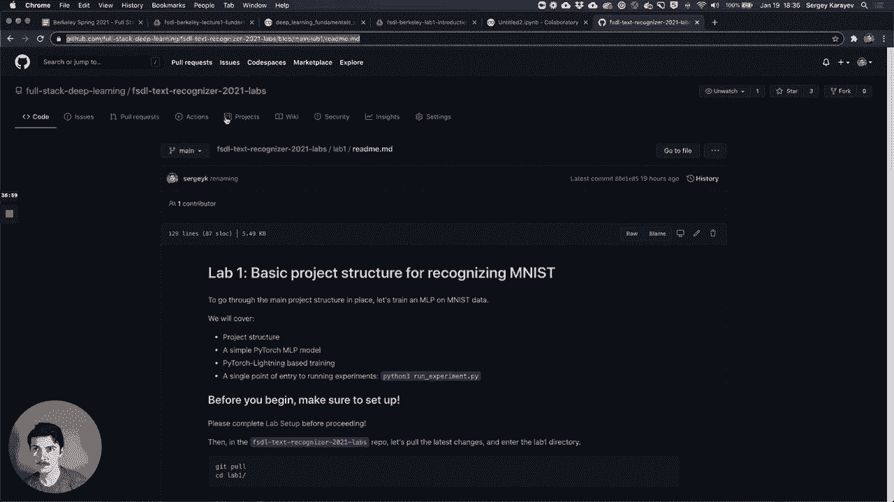


在本节课中，我们将学习如何从零开始编写一个简单的神经网络。我们将使用Google Colab环境，并逐步实现线性回归、损失函数、反向传播以及非线性模型。课程内容涵盖从环境配置到模型训练的全过程。


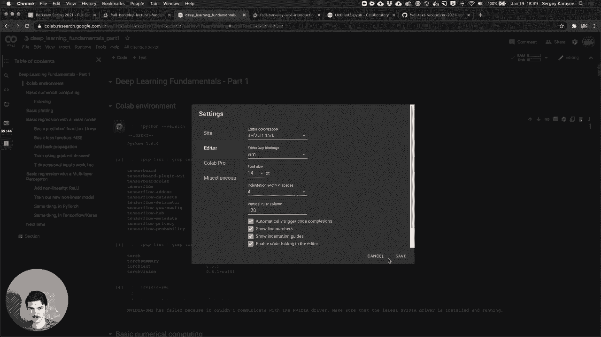

## 🛠️ Colab环境介绍

上一节我们介绍了课程目标，本节中我们来看看我们将要使用的开发环境——Google Colab。

Google Colaboratory（简称Colab）是一个在深度学习领域非常出色的产品。它是一个笔记本界面，但比你可能见过的标准Jupyter Notebook拥有更多优势。它可以连接到一个包含GPU的运行时环境。

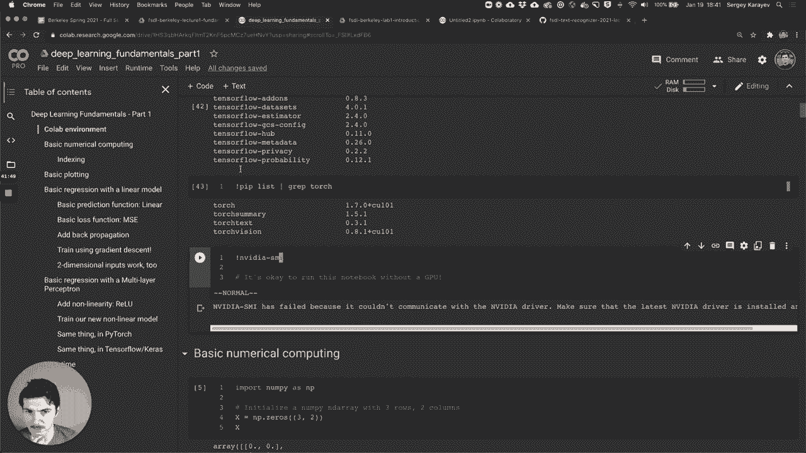

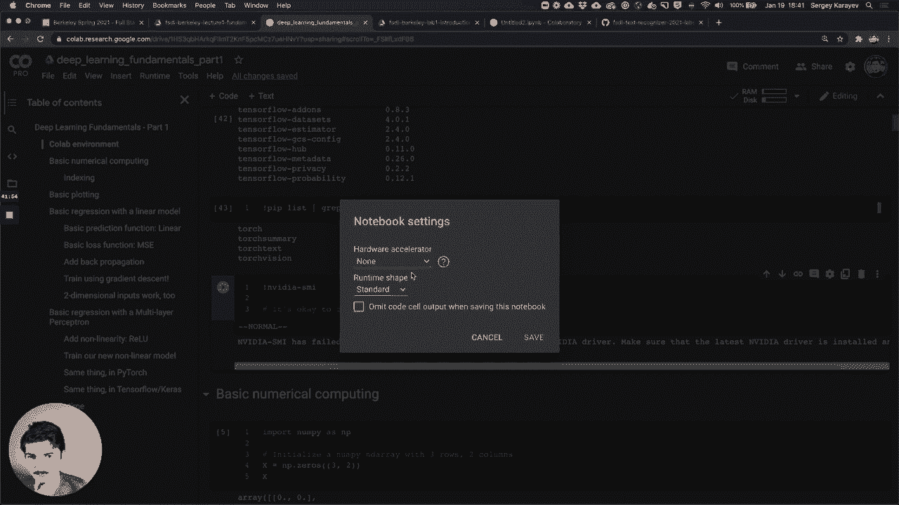

以下是Colab环境的一些关键特性：
*   它运行Python 3，并连接在Google计算引擎后端。
*   你可以通过“运行时”->“更改运行时类型”来请求GPU硬件加速器。
*   它预装了大量的Python包，包括TensorFlow和PyTorch。
*   你可以通过添加标题（如`# 标题`）来生成目录，方便组织工作。

## 🔢 数值计算基础

在开始编写神经网络之前，我们需要回顾一下数值计算的基础知识。我们将使用NumPy库。

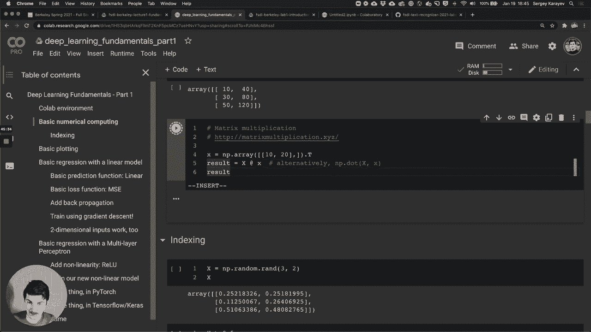

我们可以创建一个数组，并对其进行各种操作。

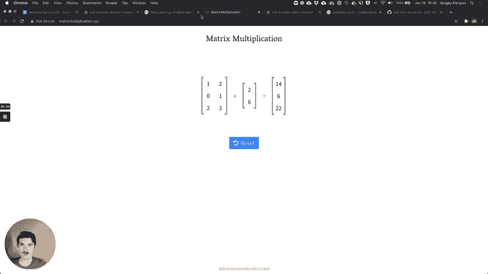

以下是NumPy数组的基本操作示例：
*   创建数组：`x = np.zeros((3, 2))` 创建一个3行2列的全零数组。
*   设置值：`x[0, :] = 1` 将第0行的所有列设置为1。
*   形状查看：`x.shape` 打印数组的形状。
*   广播运算：`X + x`，其中`X`是矩阵，`x`是向量，NumPy会将向量`x`加到矩阵`X`的每一行。
*   矩阵乘法：`X @ x` 或 `np.dot(X, x)` 执行矩阵乘法。
*   索引与掩码：`mask = x > 0.5` 生成一个布尔掩码，`x[mask] = 1` 利用掩码进行赋值。

我们还可以使用Matplotlib进行绘图，例如绘制随机矩阵或函数图像。

## 📈 线性回归实现

现在，让我们回到在讲座中看到的线性回归例子。我们将生成一些一维数据，并尝试用线性函数去拟合它。

首先，我们生成50个一维数据点`x`，其值在-1到1之间。我们设定真实的权重`w=5`和偏置`b=10`，从而生成真实值`y_true = x * w + b`。

接下来，我们编写一个`Linear`类来表示线性函数。

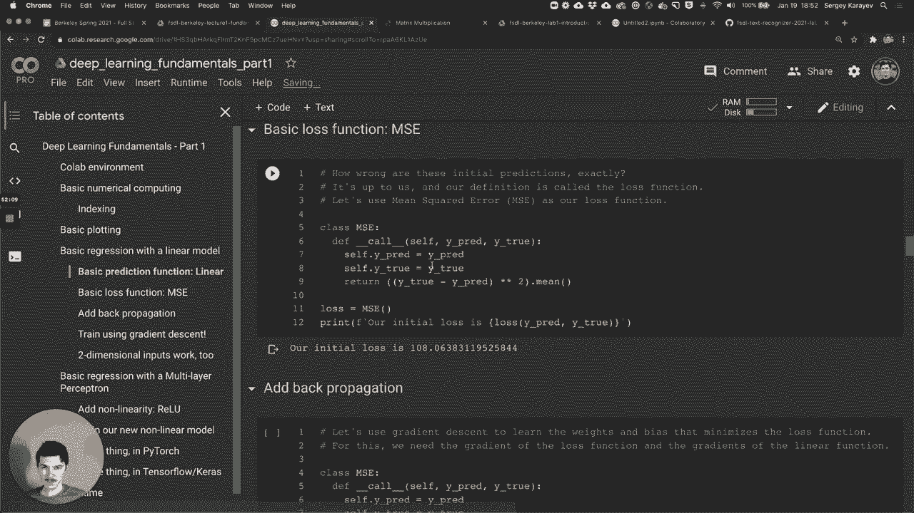

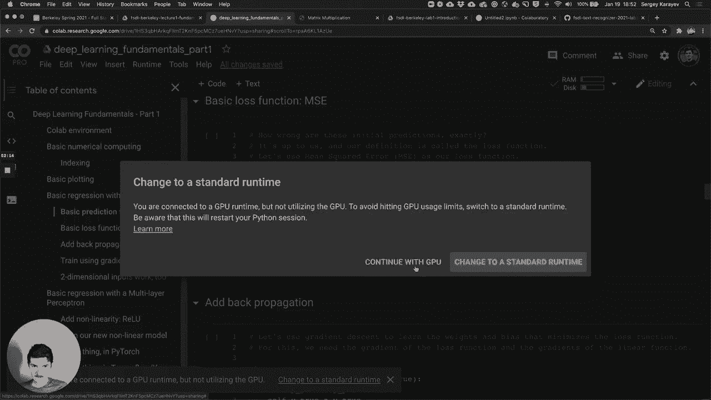

以下是`Linear`类的实现代码：
```python
class Linear:
    def __init__(self, num_input, num_output):
        self.weights = np.random.randn(num_input, num_output) * np.sqrt(2. / num_input)
        self.bias = np.zeros(num_output)

    def __call__(self, x):
        return x @ self.weights + self.bias
```
在初始化时，我们随机生成权重并将偏置设为零。`__call__`方法实现了`y = Wx + b`的计算。

使用随机初始化的线性函数进行预测，结果与真实函数相差甚远。

## ⚖️ 损失函数与梯度下降

为了衡量预测的好坏，我们需要一个损失函数。这里我们使用均方误差（MSE）作为损失函数。

均方误差的公式为：
`MSE = (1/n) * Σ(y_true - y_pred)²`

以下是`MSELoss`类的实现代码：
```python
class MSELoss:
    def __call__(self, y_pred, y_true):
        self.y_pred = y_pred
        self.y_true = y_true
        return np.mean((y_true - y_pred) ** 2)

    def backward(self):
        n = self.y_pred.shape[0]
        self.grad = 2 * (self.y_pred - self.y_true) / n
        return self.grad
```
`__call__`方法计算损失值，`backward`方法计算损失关于预测值的梯度。

现在，我们需要为`Linear`类添加反向传播功能，以计算权重和偏置的梯度。

以下是`Linear`类的`backward`方法实现代码：
```python
def backward(self, grad):
    self.weights_grad = self.x.T @ grad
    self.bias_grad = np.sum(grad, axis=0)
    self.x_grad = grad @ self.weights.T
    return self.x_grad
```
在`__call__`方法中，我们需要保存输入`x`。`backward`方法接收上游梯度，并根据链式法则计算权重梯度、偏置梯度和输入梯度。

最后，我们添加一个`update`方法来根据梯度更新参数。

以下是`update`方法的实现代码：
```python
def update(self, learning_rate):
    self.weights -= learning_rate * self.weights_grad
    self.bias -= learning_rate * self.bias_grad
```

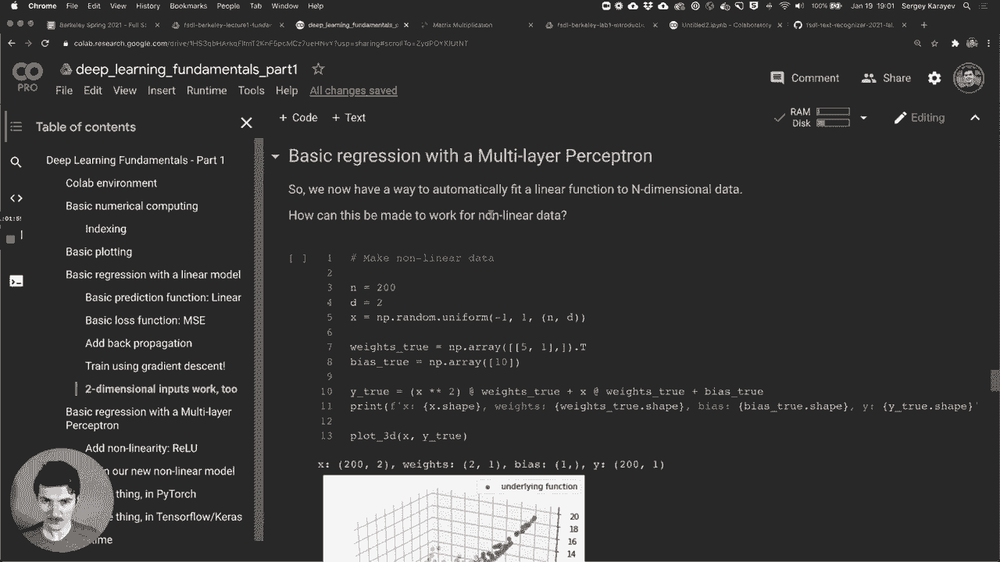

## 🔄 训练循环

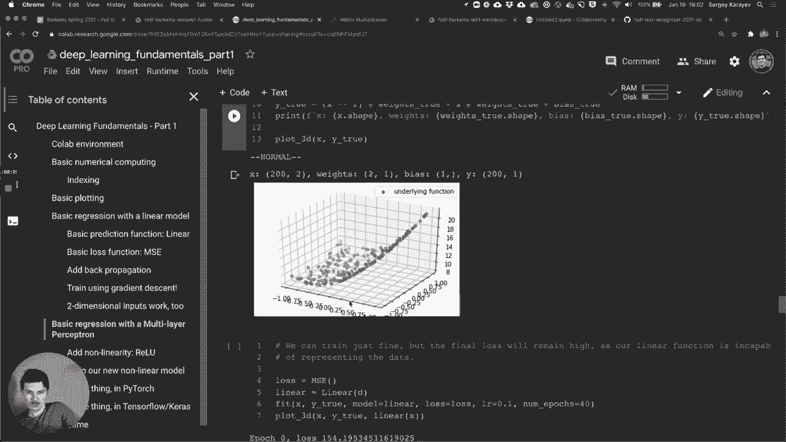

现在，我们将所有部分组合起来，形成一个完整的训练循环。

我们实例化损失函数和线性层，设置学习率，然后进行多轮（epoch）训练。在每一轮中，我们执行前向传播计算损失，执行反向传播计算梯度，然后更新模型参数。

经过60轮训练后，损失从110降到了0.01，我们的一维线性模型成功拟合了数据。这套代码同样适用于二维数据，无需任何修改。

## 🌊 引入非线性

到目前为止，我们处理的数据都是线性的。但对于非线性数据，单一的线性层无法很好地拟合。

我们生成一个二维的非线性数据集。如果尝试用之前的线性模型去拟合，最好的结果也只能是一个穿过曲线中间的平面，无法捕捉曲线的形状。

为了表示曲线，我们需要在模型中添加非线性激活函数。这里我们使用修正线性单元（ReLU）。

以下是`ReLU`类的实现代码：
```python
class ReLU:
    def __call__(self, x):
        self.x = x
        return np.maximum(x, 0)

    def backward(self, grad):
        return grad * (self.x > 0)
```
`__call__`方法返回输入和0之间的最大值。`backward`方法将梯度传递给那些输入大于0的位置。

现在，我们可以构建一个简单的两层神经网络。

以下是两层神经网络的`Model`类实现代码：
```python
class Model:
    def __init__(self, input_dim, hidden_dim):
        self.linear1 = Linear(input_dim, hidden_dim)
        self.relu = ReLU()
        self.linear2 = Linear(hidden_dim, 1)

    def __call__(self, x):
        l1 = self.linear1(x)
        r = self.relu(l1)
        l2 = self.linear2(r)
        return l2

    def backward(self, grad):
        grad = self.linear2.backward(grad)
        grad = self.relu.backward(grad)
        grad = self.linear1.backward(grad)
        return grad

    def update(self, learning_rate):
        self.linear2.update(learning_rate)
        self.linear1.update(learning_rate)
```
该模型包含一个线性层、一个ReLU激活函数和另一个线性层。前向传播依次通过这些层。反向传播则按相反顺序调用各层的`backward`方法。

使用这个模型训练非线性数据，损失稳步下降，模型能够较好地拟合曲线。

## ⚡ 使用PyTorch实现

最后，我们看看如何使用PyTorch框架来实现相同的功能。代码结构与我们手写的版本非常相似，但框架自动处理了梯度计算。

以下是使用PyTorch实现的模型代码：
```python
import torch
import torch.nn as nn

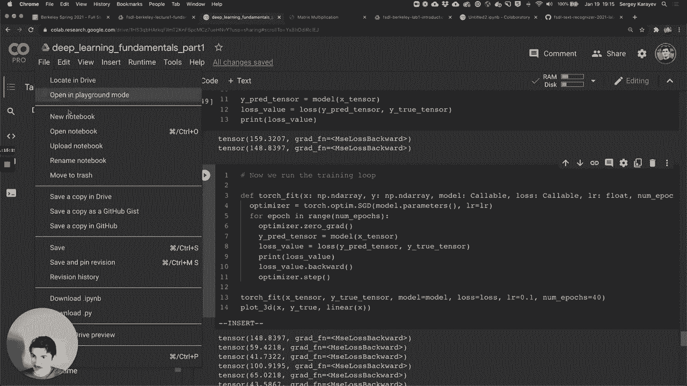

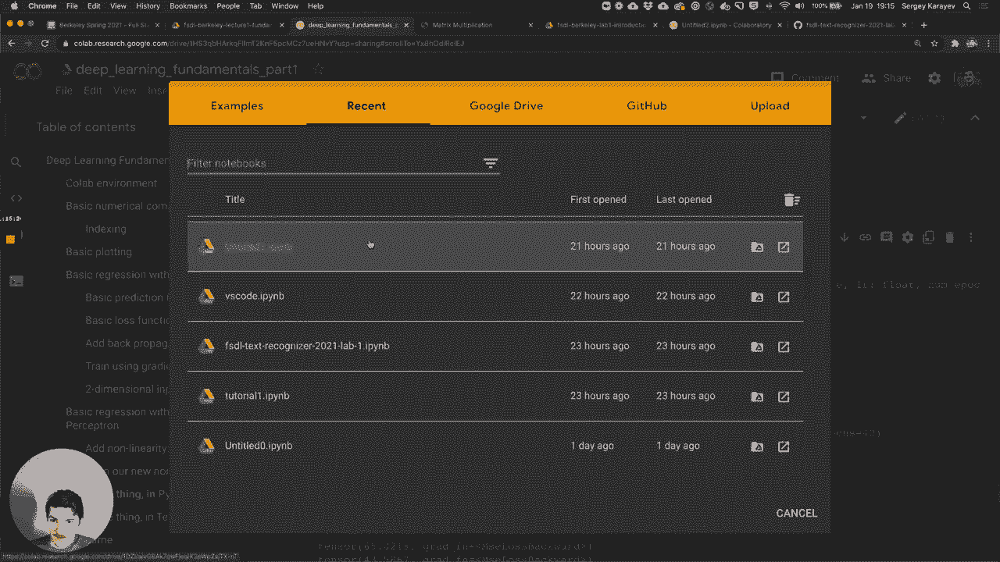


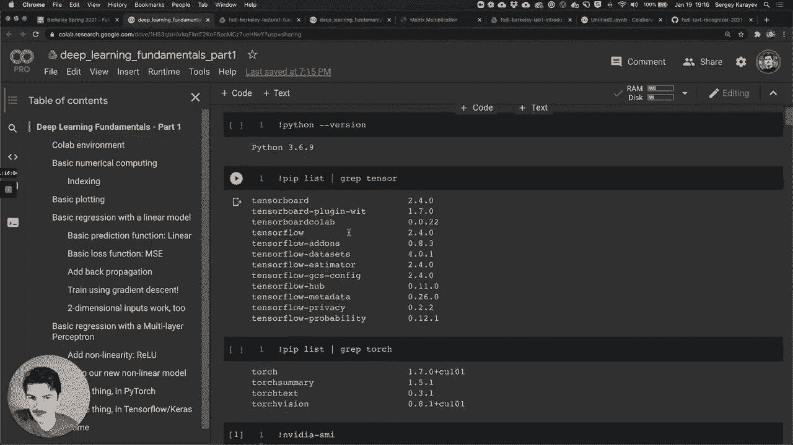

class TorchModel(nn.Module):
    def __init__(self, input_dim, hidden_dim):
        super().__init__()
        self.linear1 = nn.Linear(input_dim, hidden_dim)
        self.relu = nn.ReLU()
        self.linear2 = nn.Linear(hidden_dim, 1)

    def forward(self, x):
        x = self.linear1(x)
        x = self.relu(x)
        x = self.linear2(x)
        return x


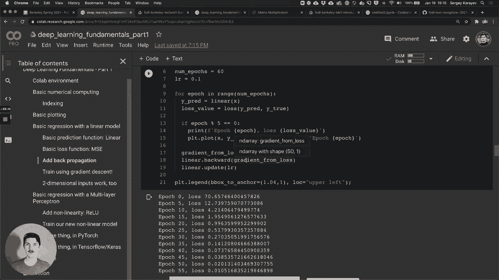


model = TorchModel(2, 10)
criterion = nn.MSELoss()
optimizer = torch.optim.SGD(model.parameters(), lr=0.01)

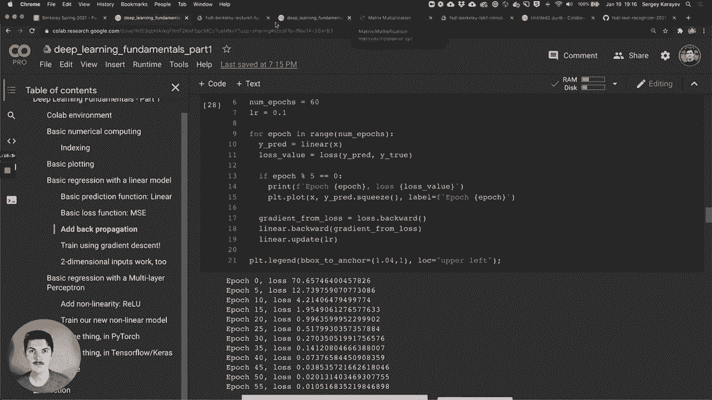


# 训练循环
for epoch in range(20):
    optimizer.zero_grad()
    y_pred = model(x_tensor)
    loss = criterion(y_pred, y_true_tensor)
    loss.backward()
    optimizer.step()
```
我们定义一个继承自`nn.Module`的类，在`forward`方法中定义网络结构。使用PyTorch内置的损失函数和优化器，训练循环变得更加简洁。

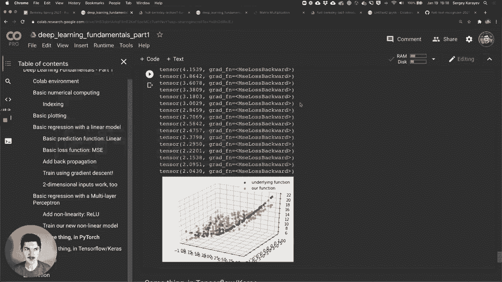

## 🎯 课程总结


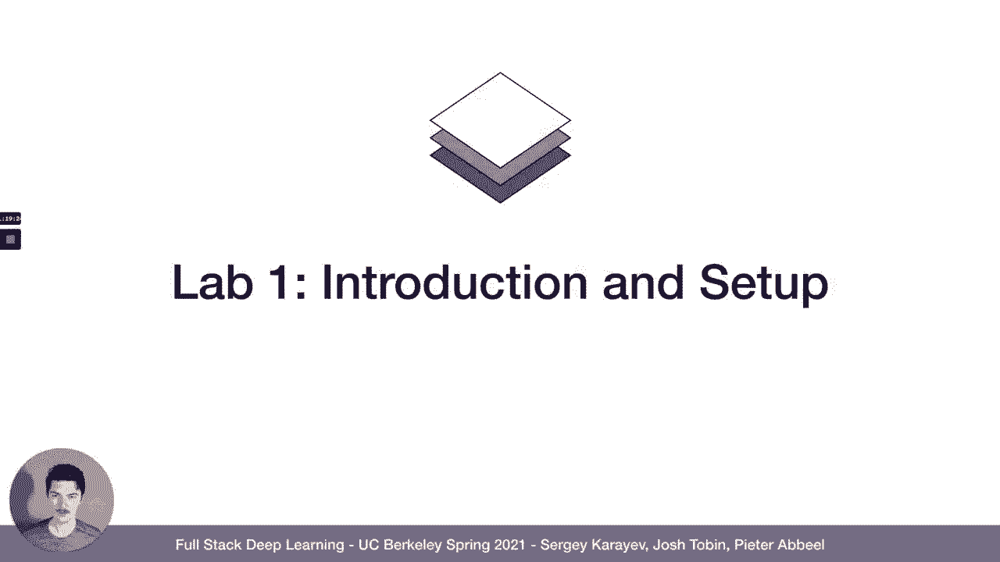

本节课中我们一起学习了如何从零开始编写神经网络代码。我们从配置Colab环境开始，回顾了NumPy数值计算基础。然后，我们逐步实现了线性回归模型、均方误差损失函数以及基于梯度下降的反向传播算法。为了处理非线性数据，我们引入了ReLU激活函数并构建了一个简单的两层神经网络。最后，我们还了解了如何使用PyTorch框架更高效地实现相同功能。通过本课，你掌握了神经网络核心组件的手动实现原理，这是理解深度学习框架内部工作机制的重要一步。