# 3：【Lab1】设置与介绍 📚

在本节课中，我们将学习如何设置深度学习开发环境，并介绍一个用于手写段落内容识别的完整代码库的渐进式开发计划。我们将从最基础的代码开始，逐步构建一个功能完整的系统。

## 🎯 问题定义与目标

我们的目标是构建一个名为 **Text Recognizer Pro** 的服务。该服务能够接收一张手写段落的图像，并自动输出其文本转录。

具体实现流程如下：
1.  用户通过手机或电脑发送包含图像的 POST 请求到 Web 后端。
2.  后端加载图像，并检测其中的文本行。
3.  将每个文本行图像输入预测模型，模型输出对应的文本。
4.  系统整合所有行的预测结果，并附带置信度信息，最终将响应返回给调用者。

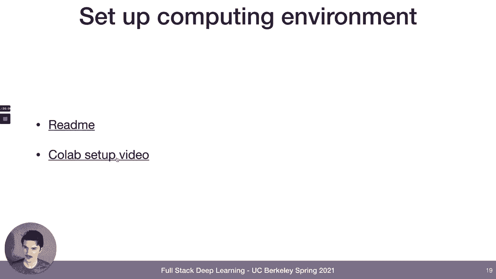

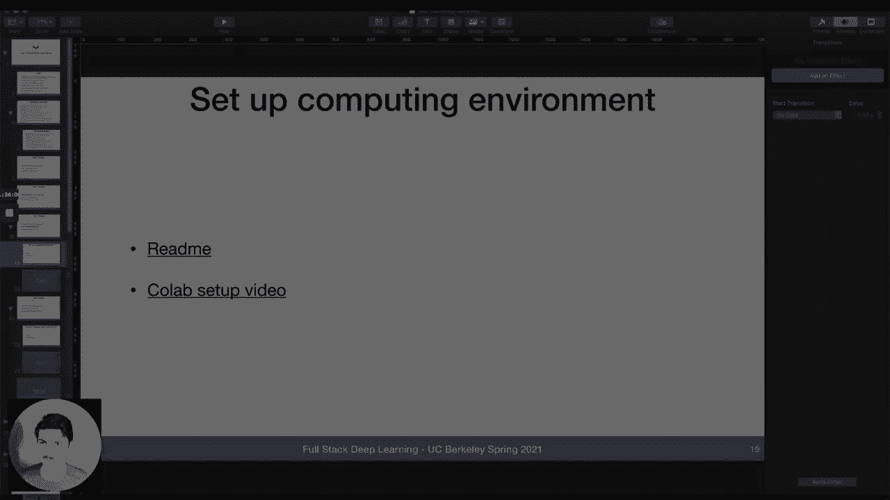

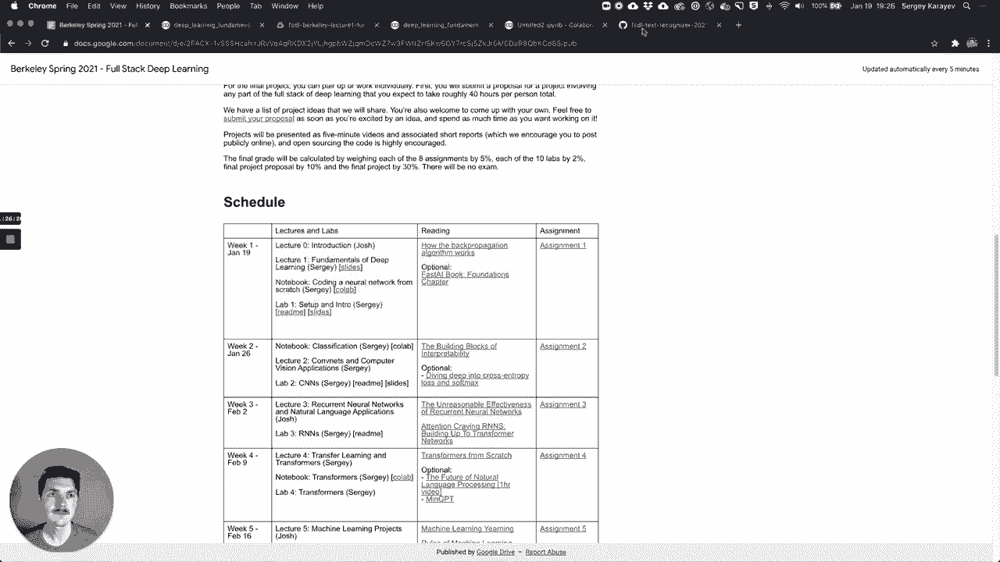

为了训练这个预测模型，我们需要以下核心组件：
*   **数据**：包含文本行图像及其对应转录标签的数据集。
*   **训练代码**：用于训练模型的程序。
*   **模型权重**：训练完成后保存的、能产生良好结果的参数。

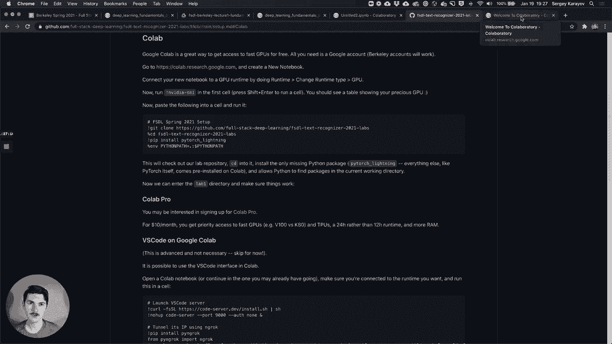

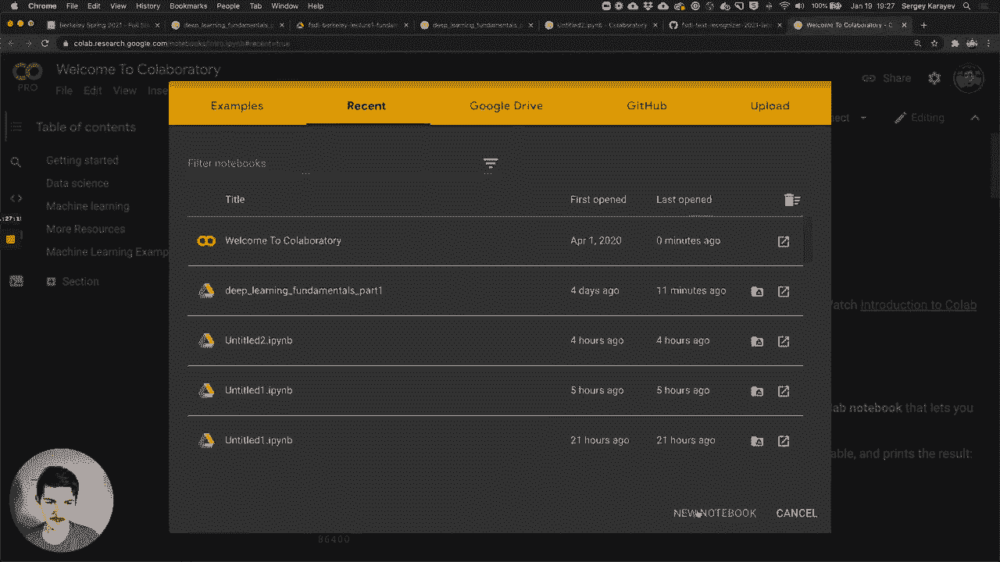

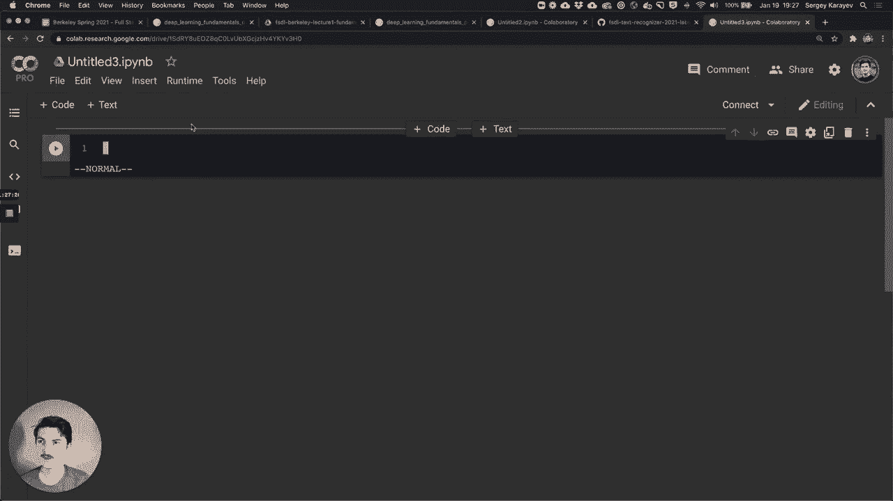

## ⚙️ 计算环境设置

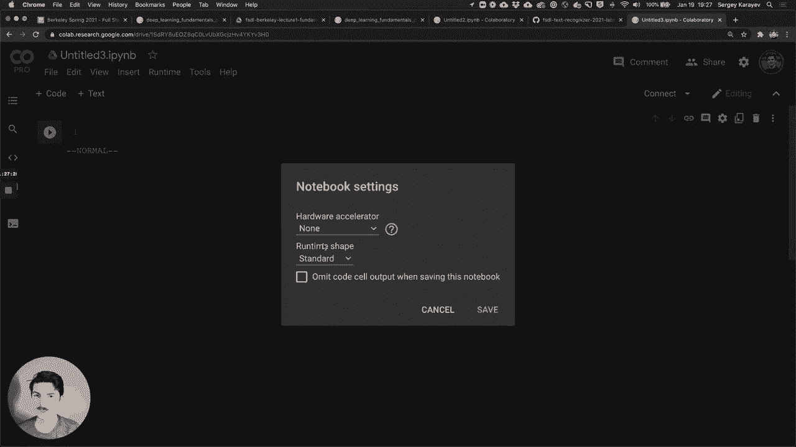

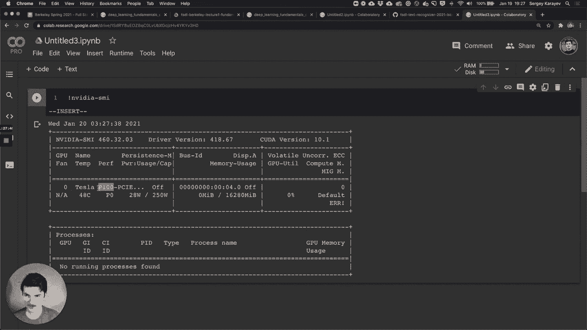

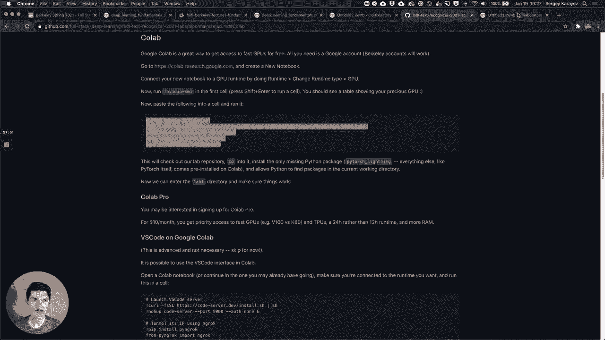

我们将使用 Google Colab 作为主要的实验环境，它提供了免费的 GPU 资源。以下是设置步骤：

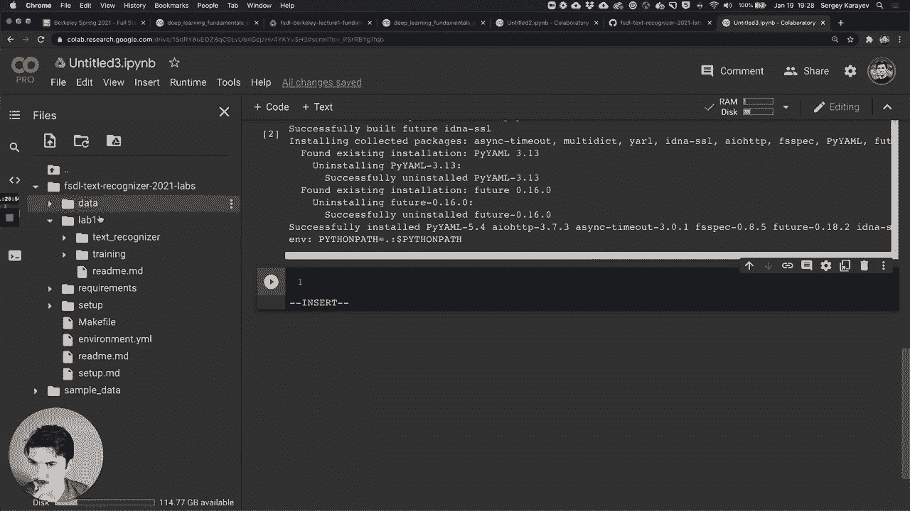

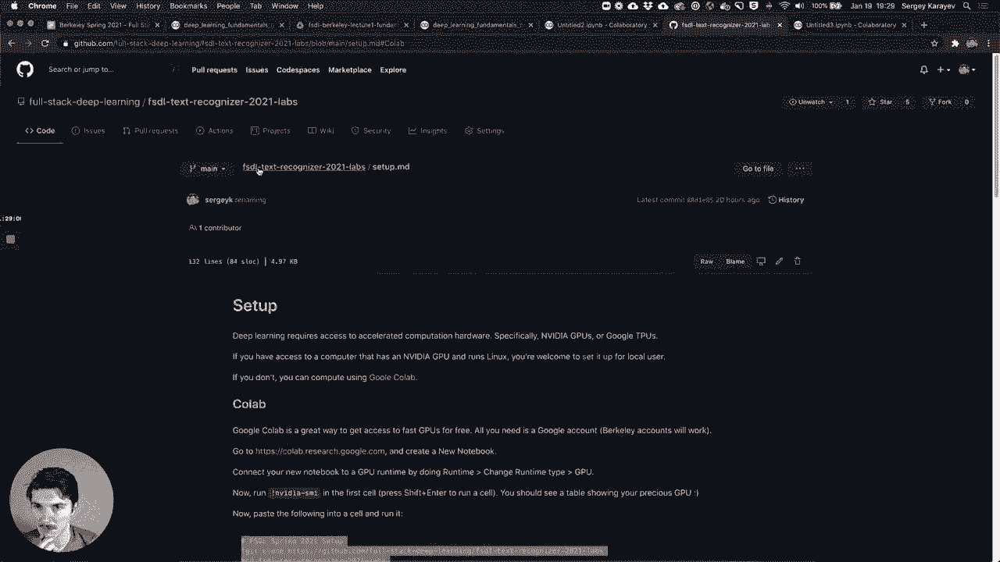

以下是具体操作步骤：
1.  访问 Google Colab 并登录您的 Google 账户。
2.  创建一个新的笔记本。
3.  在菜单栏选择 **运行时** -> **更改运行时类型**，将硬件加速器设置为 **GPU**，然后保存。
4.  在代码单元格中执行以下命令，以克隆代码库并安装依赖：

```bash
!git clone https://github.com/your-repo/text-recognizer.git
%cd text-recognizer
!pip install pytorch-lightning
import sys
sys.path.append('.')
```

5.  进入 Lab1 目录并运行一个简单的测试脚本，以验证环境是否正常工作：

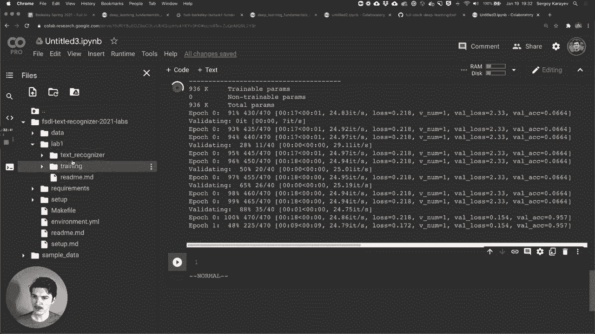

```bash
%cd lab1
!python -c "import torch; print(torch.cuda.is_available())"
```

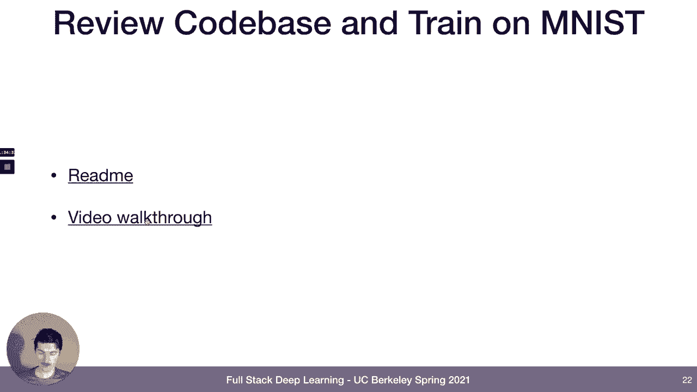

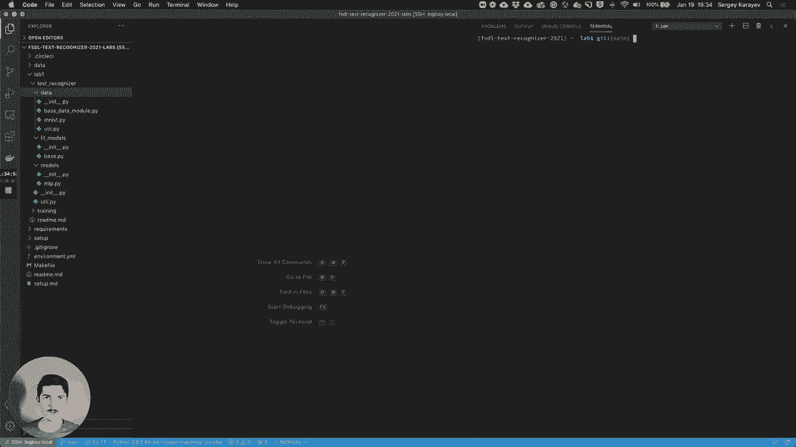

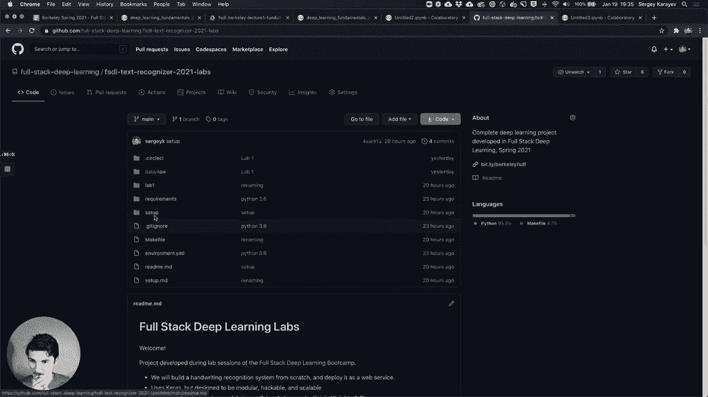

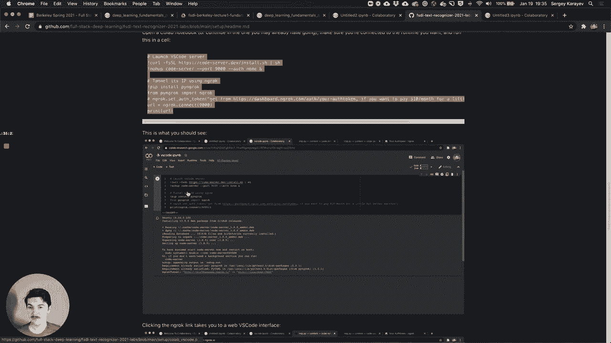

## 🏗️ 代码库结构概览

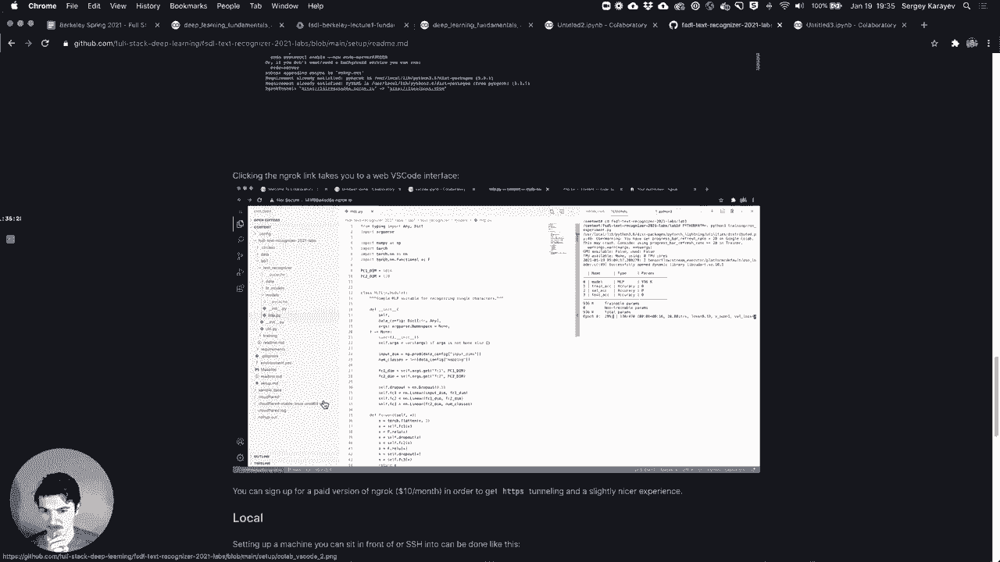

我们的项目采用渐进式开发，每个实验（Lab）都会在前一个的基础上增加新功能。Lab1 包含了最基础的代码结构，主要分为两大部分：`text_recognizer` 和 `training`。

### `text_recognizer` 包
这是我们开发的核心 Python 包，旨在实现从文本图像到转录文本的功能。它包含以下子模块：

*   **`data/`**：负责与数据交互的代码。例如，`MNISTDataModule` 类负责下载 MNIST 数据集、进行预处理（如转换为张量和归一化）、以及划分训练集、验证集和测试集。它继承自 `BaseDataModule`，后者又继承自 PyTorch Lightning 的 `LightningDataModule`，提供了标准的数据处理接口。
*   **`models/`**：包含神经网络模型的定义。例如，`MLP`（多层感知机）模型，其结构可以用以下伪代码表示：
    ```python
    class MLP(nn.Module):
        def __init__(self, input_dim, hidden_dim1, hidden_dim2, output_dim):
            self.fc1 = nn.Linear(input_dim, hidden_dim1)
            self.fc2 = nn.Linear(hidden_dim1, hidden_dim2)
            self.fc3 = nn.Linear(hidden_dim2, output_dim)
            self.relu = nn.ReLU()
            self.dropout = nn.Dropout()
        def forward(self, x):
            x = x.flatten()
            x = self.relu(self.fc1(x))
            x = self.dropout(x)
            x = self.relu(self.fc2(x))
            x = self.dropout(x)
            x = self.fc3(x)
            return x
    ```
*   **`lit_models/`**：包含 PyTorch Lightning 模块，用于封装训练循环。`BaseLitModel` 类接收一个模型（如 `MLP`），并自动设置优化器、损失函数和评估指标（如准确率）。我们只需实现 `training_step`、`validation_step` 等方法，PyTorch Lightning 便会自动处理设备放置（CPU/GPU）、多 GPU 训练等复杂细节。

### `training` 包
此部分包含用于驱动训练过程的代码。目前主要是一个 `run.py` 脚本，它允许我们通过命令行参数灵活指定：
*   使用的数据类（如 `mnist`）
*   使用的模型类（如 `mlp`）
*   PyTorch Lightning `Trainer` 的参数（如使用的 GPU 数量、训练轮数）
*   模型或数据特有的参数（如 MLP 的隐藏层维度）

## 🚀 运行训练示例

现在，让我们利用已设置的代码库在 MNIST 数据集上训练一个 MLP 模型。我们将演示如何在单 GPU 和双 GPU 环境下运行训练。

在终端中，进入 `lab1` 目录，并执行以下命令启动训练：

```bash
# 单 GPU 训练示例
python training/run.py \
    --data_class mnist \
    --model_class mlp \
    --max_epochs 5 \
    --fc1 128 \
    --fc2 256 \
    --batch_size 32 \
    --gpus 0

# 双 GPU 数据并行训练示例
python training/run.py \
    --data_class mnist \
    --model_class mlp \
    --max_epochs 5 \
    --fc1 128 \
    --fc2 256 \
    --batch_size 32 \
    --gpus 0,1 \
    --accelerator ddp
```

执行命令后，PyTorch Lightning 将开始训练过程，并在终端打印损失和准确率日志。同时，它会在后台启动 TensorBoard 来可视化训练过程。使用 `watch -n 1 nvidia-smi` 命令可以监控 GPU 的使用情况。

## 📝 总结

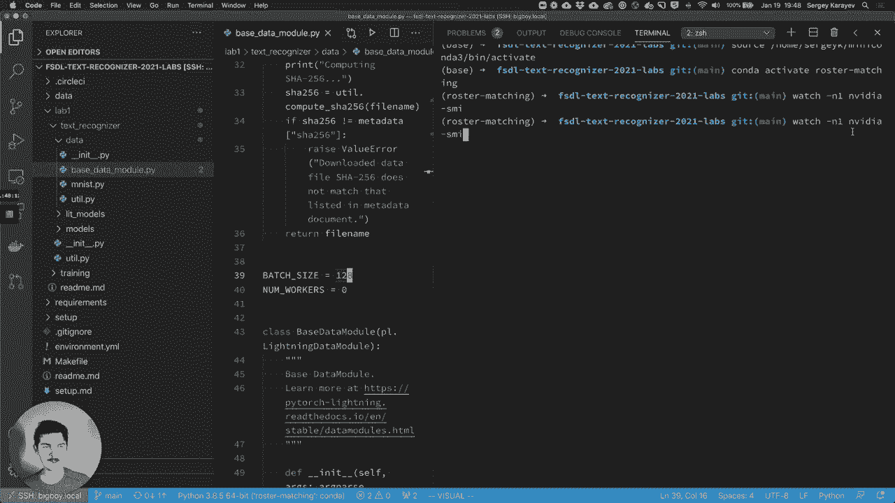

本节课中，我们一起学习了深度学习项目 **Text Recognizer Pro** 的初步设置与代码结构。我们明确了项目的最终目标是识别手写段落，并制定了通过 10 个实验逐步实现该目标的路线图。在 Lab1 中，我们成功设置了 Google Colab 开发环境，熟悉了项目代码库以数据、模型、训练模块为核心的组织方式，并实际运行了一个在 MNIST 数据集上训练 MLP 模型的例子，体验了 PyTorch Lightning 带来的便捷性，例如简单的多 GPU 训练支持。

建议课后尝试修改模型参数（如隐藏层大小、层数、是否使用 Dropout），观察其对训练结果的影响，以加深对代码模块的理解。