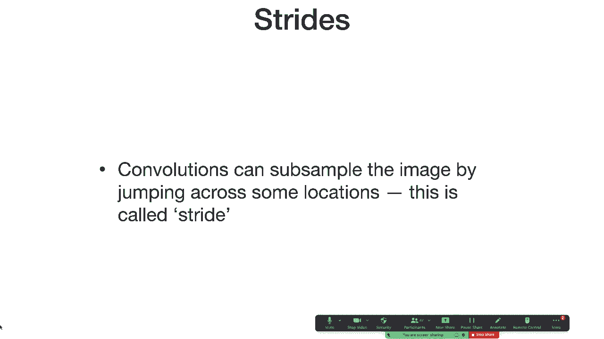
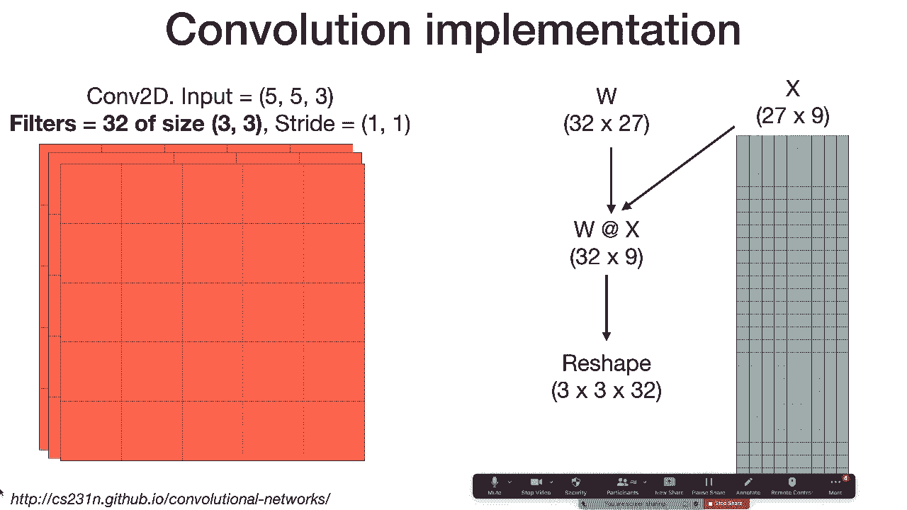
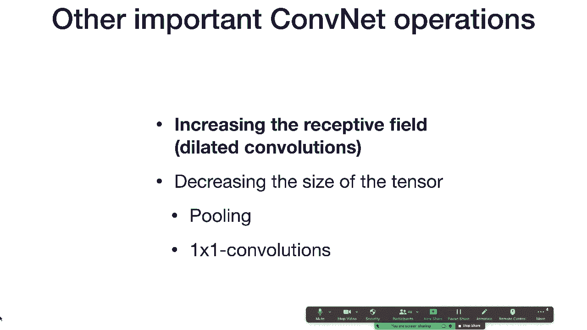
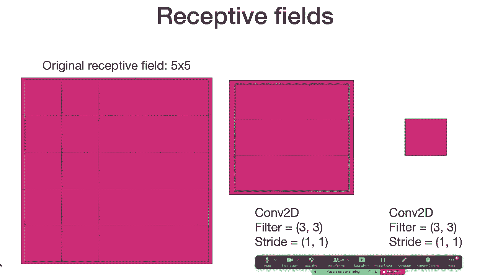
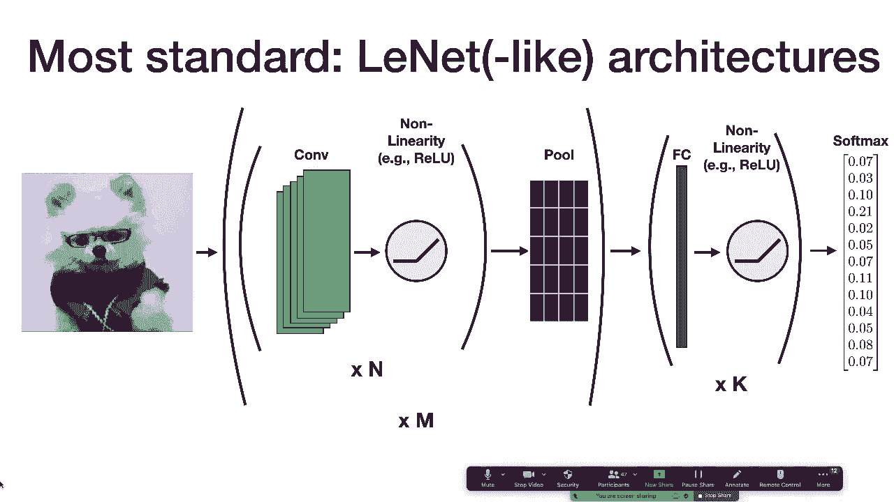
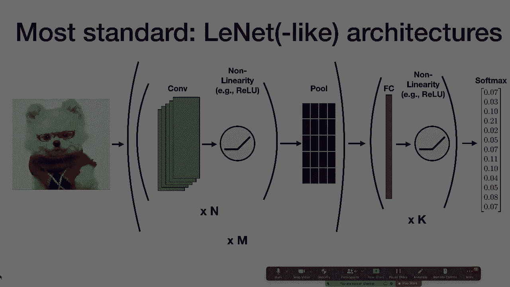

# 5：L2A-卷积神经网络 🧠

在本节课中，我们将要学习卷积神经网络（CNN）的核心概念。我们将从卷积运算这一基础数学操作开始，然后探讨构成CNN的其他重要操作，最后简要介绍一个经典的CNN架构。在下一部分课程中，Sergey将深入讲解计算机视觉应用。

## 📊 卷积运算

上一节我们介绍了CNN的动机，本节中我们来看看其核心操作——卷积。

卷积运算的灵感源于解决全连接神经网络在图像处理上的不足。将一张32x32像素的灰度图像展平，会得到一个1024维的向量。若使用一个全连接层进行分类，权重矩阵的大小将是1024x10。当图像尺寸增大时，例如变为64x64，权重数量将变为原来的4倍，这导致模型参数量随图像尺寸急剧增长，效率低下。

此外，全连接网络为每个输入像素学习独立的权重，这可能是一种过度参数化。更重要的是，这种结构不具备平移不变性：图像稍微平移后，网络看到的像素位置完全不同，难以识别为同一物体。

卷积滤波器通过另一种方式工作。它不处理整张图像，而是提取图像的一个小局部区域（例如一个5x5的像素块），将其展平为一个向量，并与另一个相同长度的滤波器向量进行点积运算，得到一个标量输出。

**公式**：对于一个图像块 `x`（展平后）和滤波器 `w`，卷积运算可表示为 `output = dot(x, w)`。

为了处理整张图像，这个5x5的窗口会在图像上滑动，遍历所有可能的位置（先从左到右，再从上到下）。在每个位置都执行相同的点积操作，最终将所有输出组合成一个二维的特征图。

## 🎨 卷积滤波器的作用

一个自然的问题是：这种操作能做什么？实际上，在深度学习流行之前，卷积就已广泛应用于计算机视觉。通过精心选择滤波器中的权重值，可以实现各种图像处理效果，例如模糊图像。

CNN的核心理念是：我们不手动设计这些滤波器的权重，而是让模型从数据中自动学习它们。这样，网络就能学会提取对任务（如分类）最有用的特征。

## 🌈 多通道输入与输出

之前的例子是单通道（灰度）图像。对于RGB彩色图像，输入是三维张量，尺寸为 `[高度, 宽度, 3]`（3代表红、绿、蓝三个通道）。

此时，提取的5x5图像块将包含所有三个通道的信息，因此展平后的向量长度是 `5 * 5 * 3 = 75`。滤波器也需要调整为75维的向量，点积运算保持不变。



输出的特征图也可以有多个通道。这可以通过使用多个独立的滤波器来实现。我们可以将75维的图像块向量与一个 `[75, 10]` 的权重矩阵相乘，而不是进行点积。这样，每个滤波器会产生一个输出通道，最终得到一个尺寸为 `[新高度, 新宽度, 10]` 的三维输出张量。

**公式**：多滤波器卷积可表示为 `Output = X_patches * W`，其中 `X_patches` 是所有图像块向量组成的矩阵，`W` 是滤波器权重矩阵。

## 🧱 堆叠卷积层

一个关键观察是：卷积层的输入和输出都是三维张量（高度、宽度、通道数）。因此，一个卷积层的输出可以直接作为另一个卷积层的输入。

我们可以像堆叠全连接层一样堆叠卷积层，构建深层网络。在实践中，我们不会连续使用多个线性卷积层，而是在每个卷积层之后立即应用一个非线性激活函数（如ReLU），这与全连接网络中的做法一致。

## 🚶‍♂️ 步长与填充

接下来我们讨论改变卷积操作方式的两种技术：步长和填充。

在之前的例子中，滤波器每次滑动1个像素。步长定义了滤波器每次滑动的距离。步长为1是默认情况。如果使用更大的步长（例如2），滤波器会跳过一些位置，这相当于对图像进行下采样，能减少输出特征图的空间尺寸。

**图示**：步长为2时，滤波器在水平和垂直方向上都每隔一个像素操作一次。

使用大步长时，滤波器可能会“滑出”图像边界。为了解决这个问题，我们可以使用填充。填充是在输入图像的边缘添加额外的像素（通常值为0），以确保滤波器能在所有位置有效操作。

一种常见的填充策略是“相同填充”，其目标是让输出特征图的空间尺寸与输入保持一致（在步长为1时）。另一种是“有效填充”，即不添加任何填充。

以下是计算卷积输出尺寸的公式：

**公式**：
`output_height = floor((input_height + 2*pad - filter_height) / stride) + 1`
`output_width = floor((input_width + 2*pad - filter_width) / stride) + 1`

其中 `floor` 表示向下取整。





关于滤波器大小、步长等超参数的选择，通常基于经验和实验。虽然可以通过神经架构搜索等技术学习这些参数，但由于计算成本高，在实践中更常见的是手动设置。滤波器通常是正方形（如3x3, 5x5），大小会影响模型的感受野。

## ⚙️ 实现方式



在深度学习库中，卷积运算通常通过一种称为“im2col”的技术高效实现。其思想是将输入图像中所有需要卷积的局部块提取出来，排列成一个巨大的二维矩阵的列。然后，将滤波器权重也排列成矩阵，进行一次大规模的矩阵乘法，即可得到所有位置的结果，最后再重塑为输出特征图的形状。

**代码概念**：
```python
# 伪代码示意
X_patches = im2col(input_image, filter_size, stride)  # 形状: (filter_h*filter_w*C_in, num_patches)
W = filter_weights  # 形状: (C_out, filter_h*filter_w*C_in)
Output_matrix = W @ X_patches  # 矩阵乘法，形状: (C_out, num_patches)
Output_feature_map = reshape(Output_matrix, (C_out, out_h, out_w))
```

## 🔍 扩展操作：扩大感受野与降维

除了基础卷积，CNN中还有其他重要操作。

**感受野** 是指输出特征图上的一个点，对应输入图像上的区域大小。堆叠多个小卷积核（如两个3x3）可以等效于一个更大卷积核（如5x5）的感受野，且参数更少、非线性更强，通常效果更好。

**空洞卷积** 是另一种扩大感受野而不增加参数的方法。它在卷积核元素之间插入“空洞”（跳过输入像素），使卷积核在覆盖更大区域的同时保持权重数量不变。

为了将大型输入图像最终转换为小的输出向量（如图像分类），我们需要在网络中逐步降低张量的空间尺寸。

**池化** 是一种下采样操作。最常见的是2x2最大池化：它将每个2x2区域替换为该区域的最大值。这能显著减小特征图尺寸并提供一定的平移不变性。不过，在现代架构中，池化的使用已减少。

**1x1卷积** 是一种用于改变通道数的操作。它本质上是对每个空间位置的所有通道应用一个全连接层。它可以用来减少或增加通道数，是构建复杂模块（如Inception）的关键组件。

## 🏗️ 经典架构：LeNet

在深入现代架构之前，我们先看一个经典且基础的CNN架构——LeNet。它提供了一个很好的基线模型结构。

一个标准的类LeNet架构遵循以下模式：
1.  输入图像。
2.  重复N次：卷积层 -> 激活函数（如ReLU）。
3.  池化层（如2x2最大池化）。
4.  将步骤2-3重复M次，逐步提取特征并降低分辨率。
5.  将最终的特征图展平。
6.  通过K个全连接层（每层后通常有激活函数）。
7.  输出层（如Softmax用于分类）。


原始的LeNet用于MNIST手写数字识别，使用了5x5卷积、Tanh激活和平均池化。你可以根据任务调整卷积层数、滤波器数量、是否使用池化等。

堆叠更多层（增加N或M）可以增加网络的感受野、非线性和表达能力，使其能够学习更复杂的特征。

---





本节课中我们一起学习了卷积神经网络的基础。我们从卷积运算的动机和定义开始，探讨了多通道处理、层堆叠、步长与填充等关键概念，并简要介绍了感受野、空洞卷积、池化等扩展操作，最后回顾了LeNet这一经典架构。理解这些基础知识是掌握更现代、更复杂CNN模型的前提。