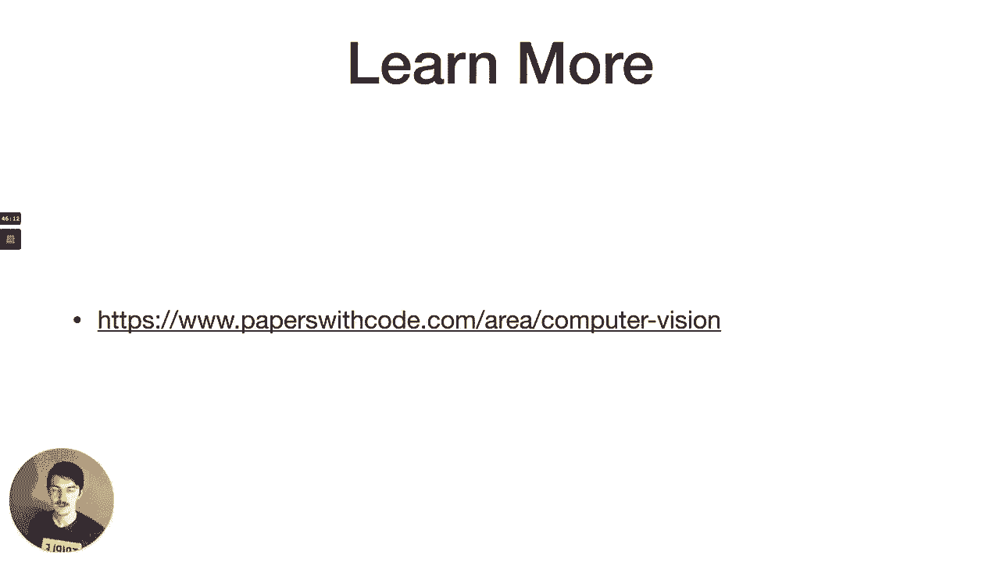
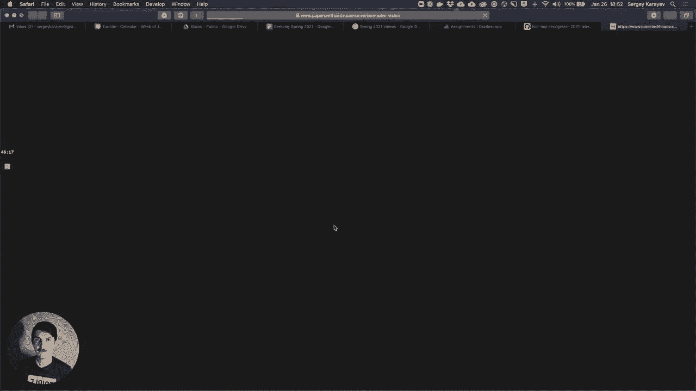
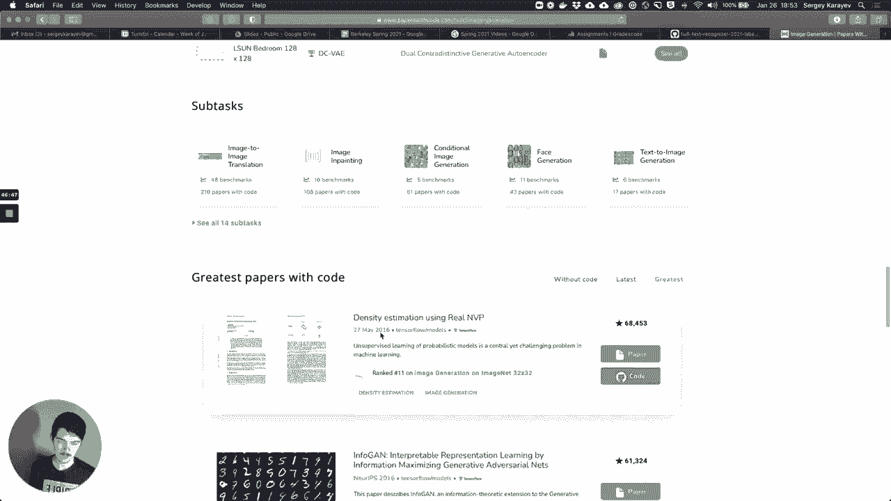
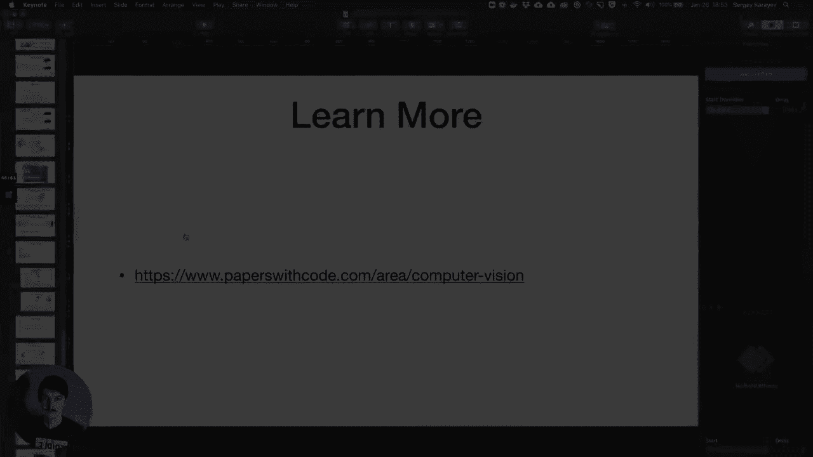

# 6：L2B 计算机视觉应用 🖼️

在本节课中，我们将学习深度学习与计算机视觉领域的一系列重要应用和核心架构。我们将回顾从经典网络到现代检测、分割任务的演进，并了解相关的技巧与工具，以便未来能将其应用于实际问题。

## 经典卷积神经网络架构巡礼 🏛️

上一节我们概述了课程目标，本节中我们将深入探讨计算机视觉发展历程中一些标志性的卷积神经网络架构。

这些架构的演进与ImageNet数据集紧密相关。ImageNet大规模视觉识别挑战赛始于2010年，包含1000个物体类别和超过一百万张训练图像。其核心任务是图像分类，即在给定图像中预测其中物体的类别。

在深度学习兴起之前（2010-2011年），主流方法是诸如SVM之类的浅层模型。2012年，AlexNet的发表开启了深度学习革命。它是一个8层网络，将错误率大幅降低至16%，相比之前的技术实现了巨大飞跃。

AlexNet与LeNet非常相似，但引入了ReLU激活函数、一种称为Dropout的新层（在训练中随机将一部分权重置零）以及大量的数据增强（如水平翻转、轻微旋转等）。其结构图显示为两部分，主要是因为当时的GPU内存有限（仅3GB），无法容纳整个网络，因此需要进行分布式训练。其架构可简述为：输入 → 11x11卷积 → 5x5卷积 → 最大池化 → 3x3卷积 → 最大池化 → 3x3卷积 → 3x3卷积 → 最大池化 → 全连接层。其参数量为数百万。

2013年，错误率进一步降低了约5%，这主要归功于对AlexNet超参数的优化调整。同年的一篇著名论文引入了反卷积可视化技术，展示了网络不同层学习到的特征：浅层学习边缘和纹理，深层则能检测物体的部件（如耳朵、眼睛、车轮）。

2014年，VGG网络将错误率再降低4%。其特点是网络更深，且只使用3x3的小卷积核和2x2的最大池化。随着层数加深，通道数逐渐增加（例如从64到512）。作者指出，堆叠多个3x3卷积可以获得与大卷积核相同的感受野，但总参数量更少。VGG拥有1.38亿参数，大部分内存消耗在早期的卷积层，而大部分参数则存在于末端的全连接层。

同年出现的GoogLeNet（或称Inception Net）与VGG精度相当，但参数量仅为500万（约为VGG的3%），且没有全连接层。其核心是堆叠“Inception模块”。该模块的假设是：特征的通道相关性和空间相关性是解耦的，可以分开处理。1x1卷积用于处理通道维度（如降维或升维），而不涉及空间相关性。GoogLeNet还引入了辅助分类器，在网络中间层也添加分类输出，以帮助梯度传播。

2015年，ResNet（残差网络）出现，其深度达到152层，将错误率再次提升3%。ResNet解决了极深网络训练中的梯度消失问题，其方法是引入“快捷连接”或“跳跃连接”，允许输入绕过某些层直接与输出相加。其核心公式可表示为：
`输出 = F(x) + x`
其中`F(x)`是残差映射。ResNet还使用带步长的卷积进行下采样，而非最大池化。此后出现了多种变体，如DenseNet增加了更多密集连接，ResNeXt结合了Inception的多路径思想。

近年来，Squeeze-and-Excitation网络通过全局池化和全连接层自适应地重新加权特征通道，类似于注意力机制。而SqueezeNet则专注于极致压缩，用比AlexNet少50倍的参数达到了相近的精度，大量使用1x1卷积来压缩通道数。

以下是这些网络在精度、计算量和参数量上的权衡概览：
*   **精度 vs 计算量 (GFLOPs)**：ResNet系列通常在精度和计算效率之间取得了较好的平衡。
*   **精度 vs 参数量**：GoogLeNet、SqueezeNet等展示了用更少参数获得高精度的方法。

除了追求精度，另一个研究方向是**训练速度**。关键之一是使用尽可能大的批次大小并进行分布式训练。例如，可以在数千个GPU上使用超大批次，在15分钟内完成ResNet50在ImageNet上的训练。DAWNBench等基准测试就专注于衡量训练到指定精度所需的时间或成本。

## 超越分类：定位、检测与分割 🎯

上一节我们回顾了用于图像分类的经典架构，本节中我们来看看计算机视觉中更复杂的任务：定位、检测和分割。

这些任务的定义如下：
*   **分类**：给定图像，输出其中主要物体的类别。
*   **定位**：在分类基础上，还需标出该物体在图像中的位置（通常用边界框表示）。
*   **检测**：图像中可能有多个物体，需要输出每个物体的类别和位置。
*   **分割**：为图像中的每一个像素分配一个标签，指明它属于哪个物体或背景。
*   **实例分割**：在分割的基础上，区分同一类别的不同个体（例如，区分图像中的多只狗）。

对于**定位**任务，一个直观的思路是扩展分类网络。在网络的末端，除了分类输出头，可以额外添加4个输出头来预测边界框的坐标`(x1, y1, x2, y2)`。但这仅适用于已知图像中只有一个物体的场景。

对于**检测**任务，由于物体数量未知，无法预先确定输出头的数量。一种早期方法是**滑动窗口**：使用训练好的分类器，在图像的不同区域（ patches ）上依次进行扫描和分类。但这非常耗时，因为重叠区域的计算被重复执行。

高效的实现利用了卷积网络的全卷积特性。全连接层可以等价地转换为1x1卷积层。因此，整个网络可以处理任意大小的输入图像，并输出一个空间网格，其中每个网格单元都对应原图的一个区域，并预测该区域是否存在物体及其类别和边界框偏移量。这样，单次前向传播就能得到大量候选检测框。

以下是处理这些候选框的关键后续步骤：
*   **非极大值抑制**：对于大量重叠的检测框，只保留置信度最高的那个，并抑制与其高度重叠的其他框。
*   **交并比**：用于评估检测框的质量。它是预测框与真实框的交集面积与并集面积的比值。通常设定一个阈值（如0.5），高于该阈值即认为检测正确。

YOLO（You Only Look Once）和SSD（Single Shot Detector）是这类“单次”检测方法的代表。它们在图像上放置固定网格，每个网格单元直接预测物体的存在、类别和边界框，然后应用非极大值抑制。YOLO v3/v4等版本在COCO数据集上实现了高精度和实时速度。

**COCO数据集**是当前物体检测、分割等任务的主流基准，包含33万张图像、150万个物体实例、80个类别，并提供实例分割标注。

除了“看遍全图”的方法，还有“先找感兴趣区域”的策略。R-CNN系列是代表：
*   **R-CNN**：使用传统方法（如选择性搜索）生成候选区域，然后将每个区域变形后送入CNN（如AlexNet）进行分类和边界框回归。
*   **Fast R-CNN**：改进为先将整个图像送入CNN提取特征图，然后对每个候选区域在特征图上进行“兴趣区域池化”，再统一分类。
*   **Faster R-CNN**：核心创新是引入了**区域提议网络**，该网络与主CNN共享特征，直接预测出候选区域，使流程完全端到端且更快速。

在Faster R-CNN基础上，可以进一步增加**分割**任务分支，这就是**Mask R-CNN**。它在每个兴趣区域上添加一个小的全卷积网络分支，输出该区域的二进制分割掩码，实现了出色的实例分割效果。

对于**全景分割**（为图像每个像素分类），需要使用编码器-解码器结构的全卷积网络，如U-Net。网络先通过卷积和池化“编码”降维，再通过上采样操作“解码”恢复至原图尺寸。上采样方法包括：
*   **反池化**：最大池化的逆操作，需记录池化时最大值的位置。
*   **转置卷积**：可学习的上采样操作。
*   **空洞卷积**：在卷积核元素间插入空格，以增大感受野而不丢失分辨率。

## 扩展应用与前沿话题 🚀

上一节我们探讨了目标检测与分割，本节中我们来看看计算机视觉如何扩展到其他具体任务，并了解一些有趣且重要的前沿话题。

基于相似的“添加任务分支”思想，可以解决多种视觉问题。例如：
*   **Mesh R-CNN**：在Mask R-CNN基础上增加一个分支，预测物体的3D网格模型。这需要像ShapeNet这样包含3D模型标注的数据集。
*   **人脸关键点检测**：检测人脸特征点（如鼻尖、嘴角、眼角）。需要AFW等标注了关键点的数据集。
*   **人体姿态估计**：检测人体关节位置。COCO数据集也提供了大量人体关键点标注。

**对抗性攻击**揭示了神经网络的脆弱性。通过对输入添加精心构造的微小扰动（人眼难以察觉），可以使网络以高置信度做出错误分类。这既包括数字图像上的“白盒”攻击（已知模型参数），也包括物理世界的“黑盒”攻击（如干扰自动驾驶汽车的标志识别）。防御方法包括在训练中加入对抗样本、或用“防御性蒸馏”等技术平滑决策边界。

**风格迁移**是一项有趣的应用，它将一幅图像的艺术风格迁移到另一幅图像的内容上。其原理是，利用预训练CNN提取内容图像的内容特征和风格图像的风格特征（通过计算特征的相关矩阵），然后优化一张新图像，使其特征同时接近内容特征和风格特征。

**生成对抗网络**能够生成极其逼真的图像，我们将在后续课程中详细讨论。

想要了解更多最新进展，可以访问“Papers With Code”网站，它汇总了各计算机视觉任务上的最新基准测试结果和对应论文。

## 总结 📝

本节课中我们一起学习了深度学习在计算机视觉中的应用全景。我们从ImageNet竞赛驱动的经典CNN架构演进讲起，了解了AlexNet、VGG、GoogLeNet、ResNet等网络的设计思想与贡献。接着，我们探讨了超越分类的视觉任务——定位、检测与分割，学习了滑动窗口、R-CNN系列、YOLO、Mask R-CNN等核心方法。最后，我们瞥见了3D重建、姿态估计等扩展应用，以及对抗攻击、风格迁移等前沿话题。这些知识和工具构成了现代计算机视觉应用的坚实基础。